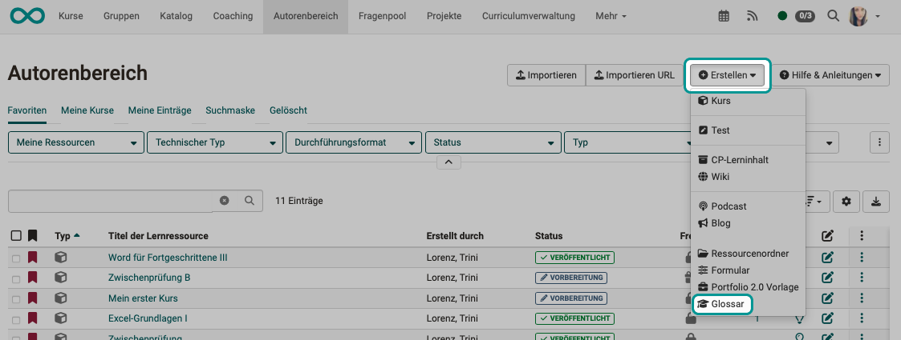
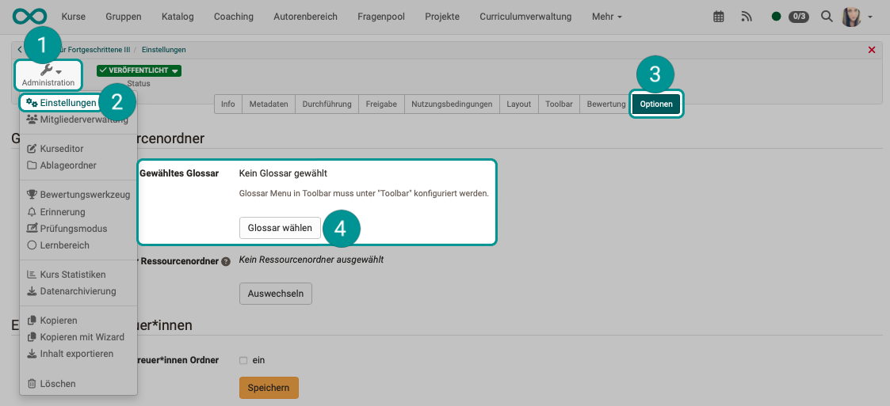
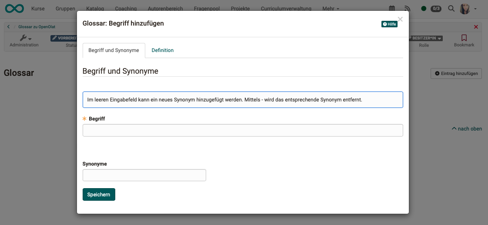
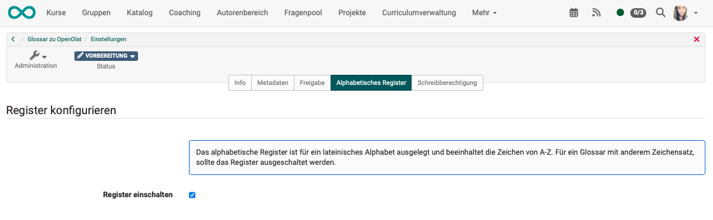

# Glossary - create

## Where is a new glossary created? {: #where}

Glossaries can be created like other learning resources in the **Author area**.

{ class="shadow lightbox" }

Alternatively, the creation can also be called up directly in the course under **Administration -> Settings -> "Options"** tab.
You will find the button (4) there, which opens a pop-up window in which an existing glossary can be selected or a new glossary learning resource can be created.

{ class="shadow lightbox" }

!!! note "Note"

    Several glossaries can be created in the author area. However, only on glossary can be included per course.

[To the top of the page ^](#glossary_create)

---

## Create glossary entries {: #create_entries}

``1.`` Go to the **Authoring area** and open the glossary.  
(Click on the name or click on the edit button or "edit" under the icon with the three points.)

{ class="shadow lightbox" }

``2.`` Click on one of the buttons **"Add entry"**.

{ class="shadow lightbox" }

``3.`` Enter the desired technical term. You can also add synonyms. For example, the term "information technology" can be supplemented with the synonym "IT".

``4.`` Save the term. This enables the tab for entering the definition.

{ class="shadow lightbox" }

``5.`` You can then add the specific definition of the term in the "Definition" tab. Terms entered can also be changed or deleted at a later date.

{ class="shadow lightbox" }

It can be made possible for learners to fill in the content of a glossary.

### Writing permission for all users

In the learning resource "Glossary" under Administration > Settings in the **Tab "Write authorization"** you can define whether only the owners of the learning resource are allowed to create and edit posts or whether users also have this right.

**Owners** of the respective learning resource "Glossary" can change and delete all created glossary entries. By default, new glossary entries can only be made by the course owner.

The selection "Write authorization for all users" allows **all system users** to create new glossary entries.
Anyone who has created a glossary entry can then edit and delete this self-created entry.
The owners of a glossary, on the other hand, can change or delete all contributions - including those created by other users - at any time.

If this function is activated, the respective author and the last person who made changes are displayed next to the glossary entry.

{ class="shadow lightbox" }

### Writing permission for selected users

If you only want to grant writing permission for a glossary to certain people (e.g. participants in a course), there is another way. The **Member administration** of a course is used for this. Create a new **group** there and add the desired persons as participants in this group. Then go to the **"Rights"** area in the course's member administration and check the **"Glossary tool"** right for the course participants in the group. The people in the group can now add and change glossary entries.

[To the top of the page ^](#glossary_create)

---

## Design glossary

The explanations (definitions) can be edited with a simple editor that allows additions to be made alongside text, such as

* Font selection
* Indentation
* Tables
* links
* etc.

The alphabetical register is designed for a Latin alphabet and contains the characters from A-Z. For a glossary with a different character set, the register should be switched off.

**Administration > Settings > "Alphabetical tab"**

{ class="shadow lightbox" }

!!! note "Attention"

    The owners of a course are not automatically the owners of the learning resource. If a "Glossary" learning resource was created by another person, the owners of the course in which the learning resource was integrated cannot automatically make entries in the glossary.

    In order for the other course owners to be able to make changes, one of the described authorizations must be set up or the desired course owners must also be entered as owners of the respective "Glossary" learning resource.

[To the top of the page ^](#glossary_create)

---

## Integrate glossary {: #integrate}

Glossaries are OpenOlat learning resources that are usually integrated into a course. They can also be used as stand-alone learning resources. In this case, the glossary can also be displayed as a stand-alone resource in the catalog, for example.

A general activation of the glossary function by administrators is not required.

``1.`` To include a glossary in a course, the first step is to select the learning resource in the **Settings** of the course in the **Options** tab.

{ class="shadow lightbox" }

``2.`` In order for the integrated glossary to be visible in the course toolbar, the display as a tool must be selected. Select the corresponding checkbox under 
**Administration > Settings > "Toolbar" tab**

{ class="shadow lightbox" }

!!! note "Note"

    Only one glossary can be integrated per course. However, several glossary learning resources can be available in the authoring area so that different glossaries can be used in different courses.

If you no longer use the glossary or would like to include a different glossary in your course, you can select a different glossary learning resource in the **Administration -> Settings** menu under the **Options** tab.

---

## Further information  {: #further_information}

[Create glossary >](../learningresources/Glossary_create.md)

[To the top of the page ^](#glossary_usage)

