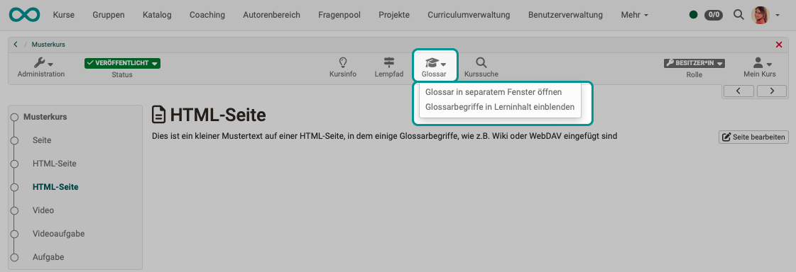
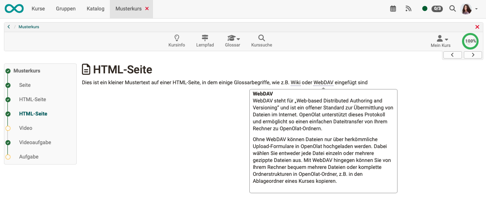
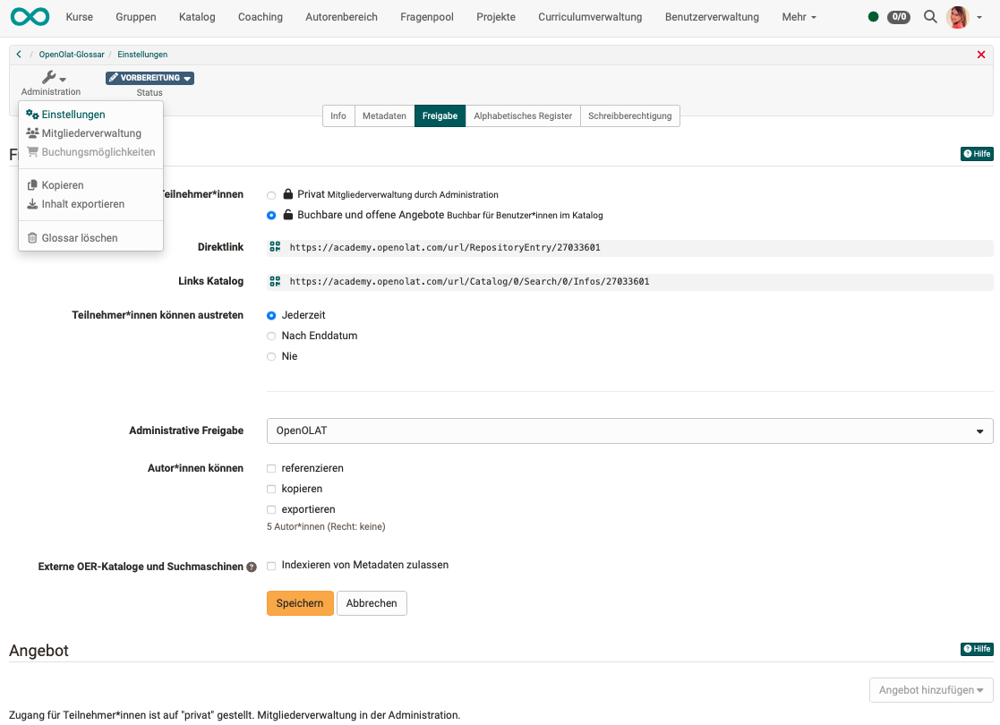
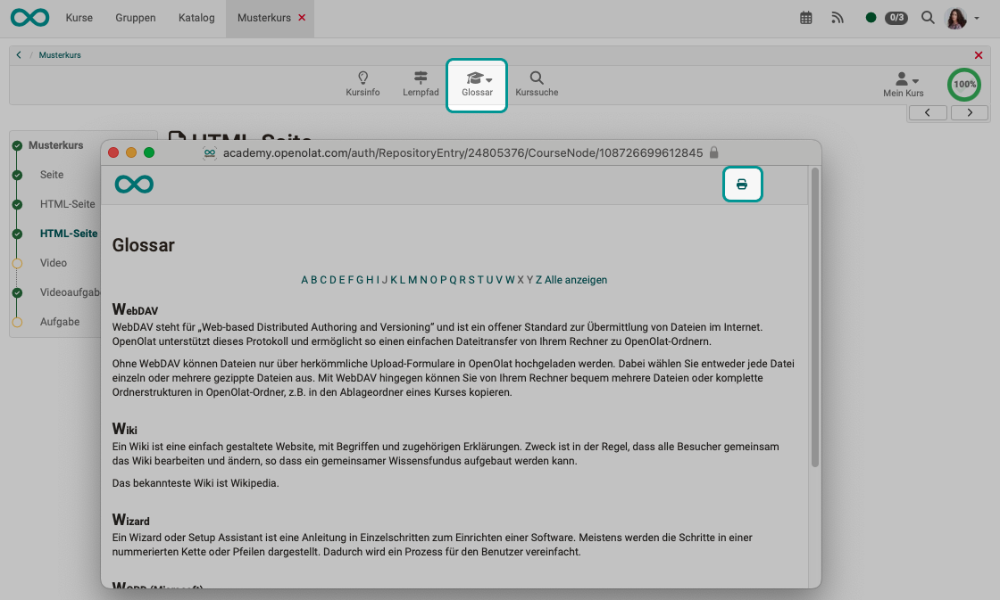

# Glossar - Verwendung {: #glossary_usage}

## Wo kann ein Glossar aufgerufen werden? {: #glossary_call}

### Aufruf in der Toolbar {: #glossary_call_in_toolbar}

Wenn die Kursbesitzer:innen ein Glossar zur Begriffsklärung in den Kurs eingebunden haben, erscheint der Link zum Glossar in der Kurstoolbar.

Sie können das Glossar in einem neuen Fenster öffnen, oder die Begriffserklärungen einblenden, wenn Sie im Lerninhalt des Kurses mit der Maus über einen Begriff fahren, der im Glossar enthalten ist.

{ class="shadow lightbox" }

[Zum Seitenanfang ^](#glossary_usage)

---

### Nutzung in HTML-Seiten {: #glossary_call_in_HTML}

Wenn im Kurs (beispielsweise im Wiki) ein Begriff erwähnt wird, der im Glossar steht, wird Ihnen die Definition angezeigt, wenn Sie mit der Maus über den Begriff fahren. Eine feine, automatisch eingefügte Punktlinie unter einem Wort zeigt an, dass eine Erklärung zu diesem Begriff im Glossar gefunden wurde. 

{ class="shadow lightbox" }

[Zum Seitenanfang ^](#glossary_usage)

---

### Separates Glossar (Lernressource "Eigenständig") {: #glossary_call_as_stand_alone}

Neben der Einbindung in einen Kurs kann eine Glossar-Lernressource auch "Eigenständig" genutzt werden. Sie kann dann z.B. im Katalog als eigenständiges Angebot erscheinen.

In den Einstellungen im Tab "Freigabe" finden Sie z.B. den Direktlink auf das Glossar, den Sie in Mails oder andere Stellen kopieren können.

{ class="shadow lightbox" }

[Zum Seitenanfang ^](#glossary_usage)

---

### Aufruf durch Gäste {: #glossary_call_by_guests}

Grundsätzlich können diverse Lernressourcen z.B. Wikis, Blogs, Tests, Videos oder auch Glossare für Gäste freigeschaltet werden.

Gäste sind anonyme, nicht registrierte Benutzer:innen, die in der [Benutzerverwaltung](../../manual_admin/usermanagement/index.de.md) nicht verwaltet werden können.

Damit Gäste Zugang zu einem Glossar erhalten, muss der Gastzugang von den Systemadministrator:innen der OpenOlat-Instanz aktiviert werden. Auch kann konfiguriert werden, auf welche OpenOlat-Bereiche Gäste Zugriff haben und auf welche nicht. Diese Basis-Einstellungen sind nur durch die Systemadministrator:innen möglich.

[Zum Seitenanfang ^](#glossary_usage)

---

### Ausdruck des Glossars {: #print}

Das Glossar kann auch ausgedruckt werden. Öffnen Sie dazu das Glossar in einem separaten Fenster (Dropdown im Kurstool "Glossar").
Sie finden den Button zum Drucken dann rechts oben.

{ class="shadow lightbox" }

[Zum Seitenanfang ^](#glossary_usage)

---

## Weiterführende Informationen {: #further_information}

[Glossar erstellen >](../learningresources/Glossary_create.de.md)

[Zum Seitenanfang ^](#glossary_usage)

