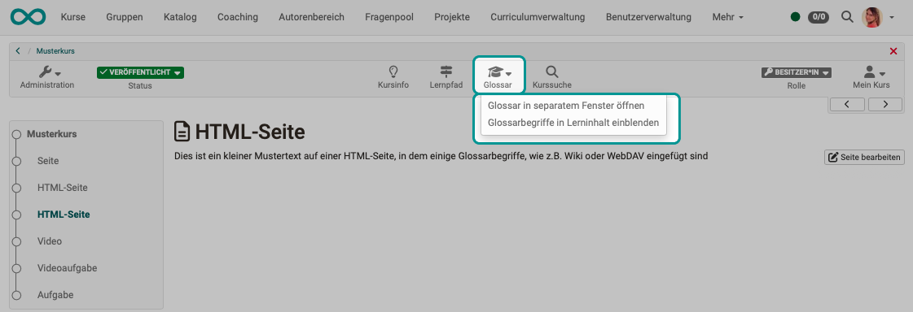
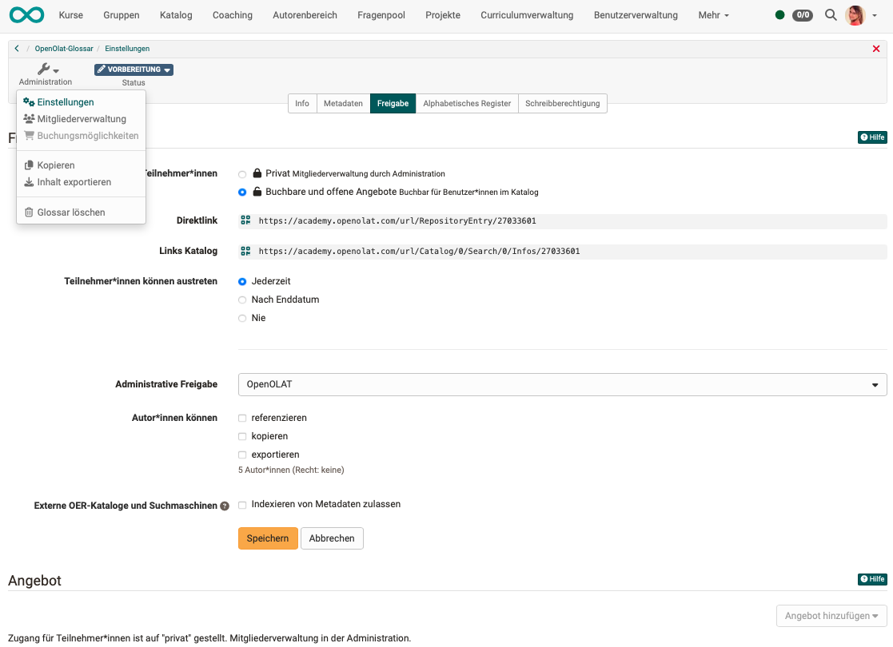
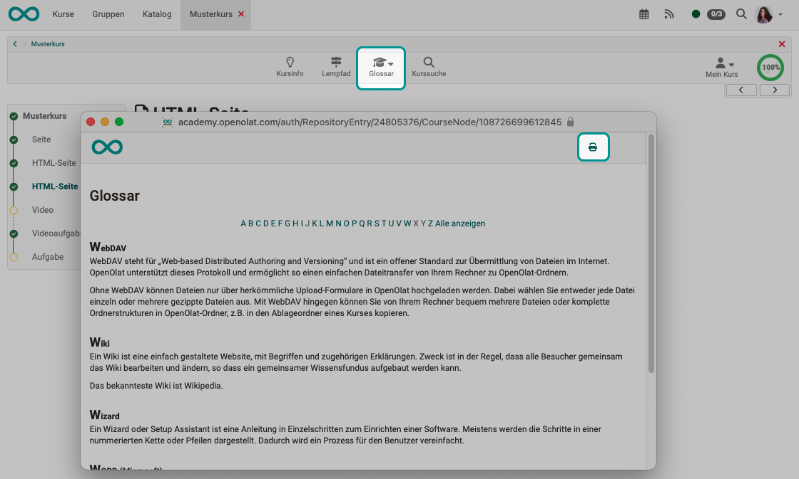

# Glossar - Usage

## Where can a glossary be called up?

### Course tool

If the course owner has included a glossary to clarify terms in the course, the link to the glossary will appear in the course toolbar.

You can open the glossary in a new window or show the terms in the course content.

{ class="shadow lightbox" }

### Use in HTML pages

If a term is mentioned in the course (e.g. in the wiki) that is in the glossary, the definition is displayed when you move the mouse over the term. A fine, automatically inserted dotted line under a word indicates that an explanation of this term has been found in the glossary.

{ class="shadow lightbox" }

### Separate glossary (stand-alone learning resource)

As well as being integrated into courses, a glossary learning resource can also be used "stand alone". The learning resource can then be offered in the catalog as an independent learning object, for example.

In the settings in the "Sharing" tab you will find, for example, the direct link to the glossary, which you can copy into emails or other places.

{ class="shadow lightbox" }

### Call by guests

In principle, various learning resources such as wikis, blogs, tests, videos or glossaries can be activated for guests.

Guests are anonymous, unregistered users who cannot be managed in the user administration.

To give guests access to a glossary, the guest login must be activated by the administrator of the OpenOlat instance. It is also possible to configure which OpenOlat areas guests have access to and which they do not. These basic settings can only be made by the system administrator.

### Printout of the glossary

The glossary can also be printed out. To do this, open the glossary in a separate window (dropdown in the "Glossary" course tool).
You will then find the print button at the top right.

{ class="shadow lightbox" }
