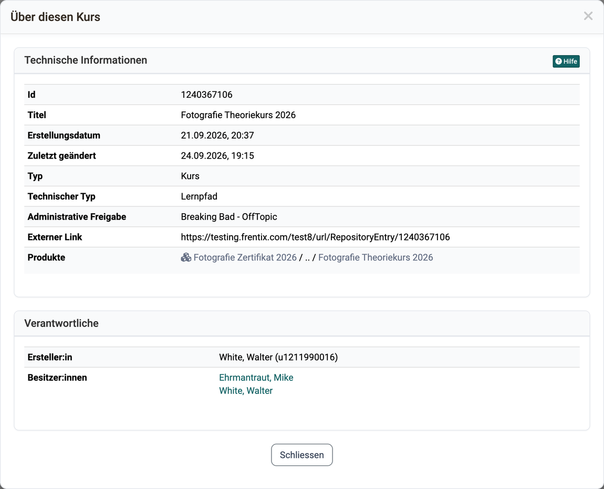

# Toolbar: Infoseite {: #toolbar_infopage}

{ class="shadow lightbox" title="Toolbar eines geöffneten Kurses · 2026.09.29" }

Wer in einem Kurs nachsehen möchte, worum es geht, wann die Termine sind oder wie weit man schon ist, öffnet die Infoseite über den Link **Infoseite** in der Toolbar. Jeder Kurs und jede andere Lernressource hat eine Infoseite. Sie zeigt dieselben Angaben, die Interessierte schon vor dem Buchen sehen: Beschreibung, Fakten, Lernziele, Dozent:innen und Termine. Wer bereits Mitglied ist, findet dort zusätzlich den Bereich "Mein Kurs" mit Fortschritt, Status, Punkten und Gruppen. Ist das Verlassen des Kurses erlaubt, steht dort auch die Aktion "Kurs verlassen".

Ist der Kurs die einzige Lernressource einer Durchführung im Course Planner, öffnet der Link die Infoseite dieser Durchführung. [:octicons-tag-16:{ title="ab Release 20.0 (OO-8511)" }](https://track.frentix.com/issue/OO-8511){:target="_blank"}

Welche Elemente die Infoseite zeigt und wo Sie sie einstellen, beschreibt [Allgemeine Funktionen: Infoseite](../learningresources/General_Functions_Infopage.de.md#content).

[Zum Seitenanfang ^](#toolbar_infopage)

---

## Infoseite drucken [:octicons-tag-16:{ title="ab Release 21.1 (OO-9299)" }](https://track.frentix.com/issue/OO-9299){:target="_blank"} {: #print}

Die Infoseite lässt sich drucken, etwa um eine Kursbuchung von der vorgesetzten Person bewilligen zu lassen. Klicken Sie im Kopf der Infoseite auf **Als PDF herunterladen**. OpenOlat erzeugt einen einspaltigen Flyer ohne Schaltflächen, mit einem QR-Code, der zum Angebot führt. Den gleichen Ausdruck erhalten Sie über den Befehl "Drucken" Ihres Browsers. Die Schaltfläche erscheint nur, wenn Administrator:innen einen PDF-Dienst eingerichtet haben; das Drucken über den Browser funktioniert immer.

Was der Ausdruck enthält und was er weglässt: [Infoseite drucken oder als PDF herunterladen](../learningresources/General_Functions_Infopage.de.md#print)

[Zum Seitenanfang ^](#toolbar_infopage)

---

## Über diesen Kurs [:octicons-tag-16:{ title="ab Release 21.1 (OO-9760)" }](https://track.frentix.com/issue/OO-9760){:target="_blank"} {: #about}

Wer einen Kurs verwaltet und die ID, den externen Link oder die Besitzer:innen nachschlagen möchte, findet diese Angaben nicht auf der Infoseite, sondern im Fenster "Über diesen Kurs". Sie öffnen es unter: 
`Kurs > Administration > Über diesen Kurs`

Dasselbe Fenster öffnet auch der Button neben dem Feld "Typ" unter `Kurs > Administration > Einstellungen > Tab "Metadaten"`.

Bei anderen Lernressourcen heisst der Menüpunkt nach deren Typ, zum Beispiel "Über diesen Test" oder "Über dieses Formular", sonst "Über diese Lernressource". Den Menüpunkt sehen Besitzer:innen der Lernressource, Lernressourcenverwalter:innen und Administrator:innen. Teilnehmende und Betreuer:innen sehen ihn nicht.

{ class="shadow lightbox" title="Fenster Über diesen Kurs · 2026.09.29" }

Was die einzelnen Angaben im Fenster bedeuten, beschreibt die Seite [Über diesen Kurs: Technische Informationen und Verwendung](../learningresources/Technical_Information_on_Resources_and_Usage.de.md).

[Zum Seitenanfang ^](#toolbar_infopage)

---

## Weiterführende Informationen {: #further_information}

**Auf dieser Seite erwähnt** 
[Allgemeine Funktionen: Infoseite >](../learningresources/General_Functions_Infopage.de.md) 
[Über diesen Kurs: Technische Informationen und Verwendung >](../learningresources/Technical_Information_on_Resources_and_Usage.de.md)

**Weiterführend** 
[Kurseinstellungen >](../learningresources/Course_Settings.de.md) 
[Course Planner: Durchführungen >](../area_modules/Course_Planner_Implementations.de.md) 
[Zugangskonfiguration / Freigabe >](../learningresources/Access_configuration.de.md)

[Zum Seitenanfang ^](#toolbar_infopage)
