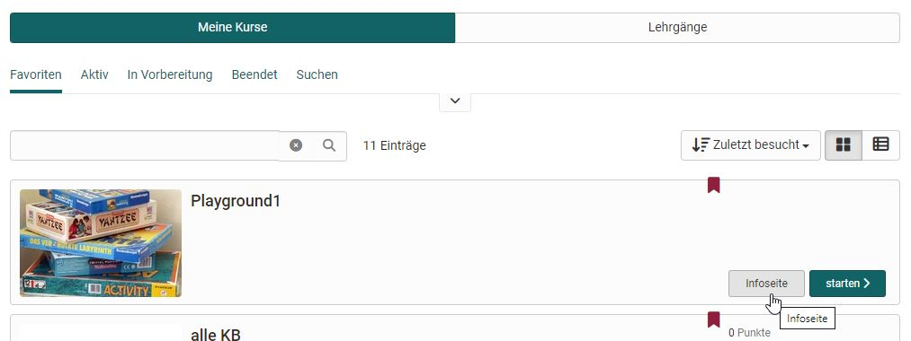
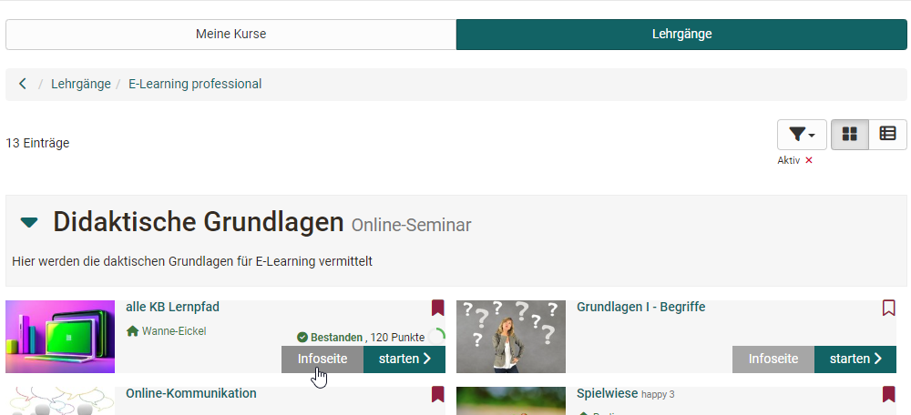

# Infoseite

Jeder Kurs und jede OpenOlat Lernressource verfügt über eine Infoseite. Bei
Kursen wird diese Seite als "Kursinfo" bezeichnet. Die hier eingestellten
Informationen sind bereits sichtbar bevor ein Kurs bzw. Lernressource
überhaupt von Lernenden gebucht oder betreten wird.  

Lehrende können auf diese Weise der Zielgruppe schon im Vorfeld zentrale
Informationen zur Verfügung stellen. Hierzu zählen z.B.

* Namen der beteiligten Lehrenden
* Beschreibung der Veranstaltung
* Sprache
* Durchführungszeitraum
* Zeitaufwand, Lernziele, Voraussetzungen, Bescheinigung
* Lizenzart der Lernressource

Die Infoseite enthält auch einen Link um den Kurs zu starten bzw. zu buchen. 

Viele Lehrende ergänzen ein Bild oder Video zur Veranstaltung. Dieses Bild
sowie ein erster Teil der Beschreibung erscheinen dann auch in der Übersicht
unter "Meine Kurse" bzw. "Favoriten" sofern nicht die Tabellenansicht gewählt wurde.

## Informationen und Bereiche

### Automatisch generierte Infos 

OpenOlat generiert automatisch weitere Informationen die für die Nutzer wichtig sind. Hierzu zählen:

* Der externe Link zum Kurs bzw. zur Lernressource für den direkten Zugang. 
* Technische Infos mit der Kurs ID, Datum der letzten Änderung u.ä. Die ID ist die automatisch generierte Identifikationsnummern der Lernressource. Mit dieser ID können Sie die Lernressource über die Suchmaske suchen.
* Meine Daten mit dem aktuellen Status, dem letzten Zugriff usw.

Ferner besteht die Möglichkeit den Kurs bzw. die Lernressource mit Sternen zu bewerten sofern diese Funktion vom OpenOlat Administrator aktiviert wurde.

### Meine Daten

Dieser Bereich ist besonders für die Teilnehmenden interessant. Unter "Meine Daten" finden sie ihre benutzerspezifischen Informationen zum Kurs, darunter den "Bestanden"-Status, wann Sie zum letzten Mal auf den Kurs zugegriffen haben, und mit welchen Gruppen Sie im Kurs eingetragen sind. Hier können sie auch einen Bookmark auf den Kurs/die Lernressource setzen. Falls ein Austragen aus dem Kurs/der Lernressource erlaubt ist, ist dies ebenfalls hier möglich. 

### Technische Informationen

Die technischen Informationen sind nur für die Besitzer der Lernressource sichtbar. Teilnehmende und generell Interessierte sehe diese nicht. 

### Informationen zur Verwendung (weitere Lernressourcen)

Die Infoseite von Lernressourcen jenseits eines Kurses enthält auch noch "Informationen zur Verwendung". Dazu gehören: 

 **Referenzen**: Hier sehen Sie, welche Kurse diese Lernressource verwenden. Solange die Lernressource in einem Kurs verwendet wird, kann sie nicht gelöscht werden.

Der **letzte Zugriff** gibt an, wann die Lernressource das letzte Mal gestartet wurde.

 **Momentane Benutzer**: Gibt an, wie viele Benutzer diese Lernressource zurzeit in OpenOlat gestartet haben.

 **Anzahl Aufrufe**: Zählt automatisch, wie viel Male die Lernressource insgesamt gestartet wurde. Wenn die Lernressource nicht in OpenOlat gestartet werden kann, erscheint der Eintrag _Ausführung nicht unterstützt_.

 **Anzahl Exporte:** Zählt automatisch, wie viel Male die Lernressource insgesamt heruntergeladen wurde.

## Wie findet man die Infoseite?

Zur Infoseite einer Lernressource gelangen Sie, wenn Sie im Bereich "Kurse", "Lehrgänge"
oder "Katalog" in der Liste auf den Link "Infoseite" klicken ...

Oder wählen Sie, wenn Sie sich im Kurs befinden, das entsprechende Icon in der Toolbar. 

!!! note "Hinweis"

    Wenn Sie als Teilnehmer kaum Informationen auf der Infoseite finden, dann liegt esdaran, dass Ihre Lehrperson diese Seite (noch) nicht weiter eingerichtet hat. Sprechen Sie ihn oder sie doch darauf an. 
