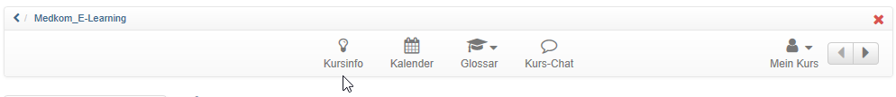
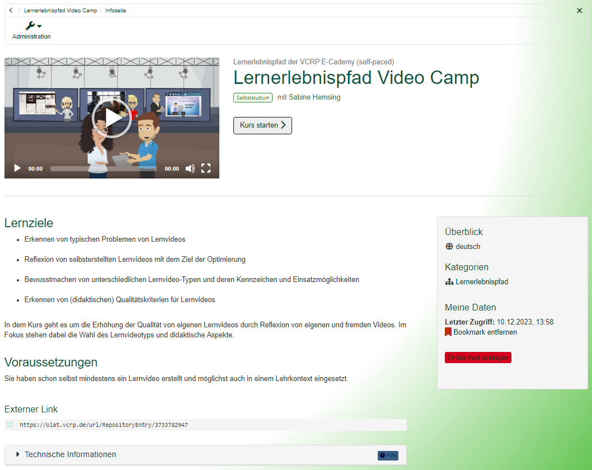
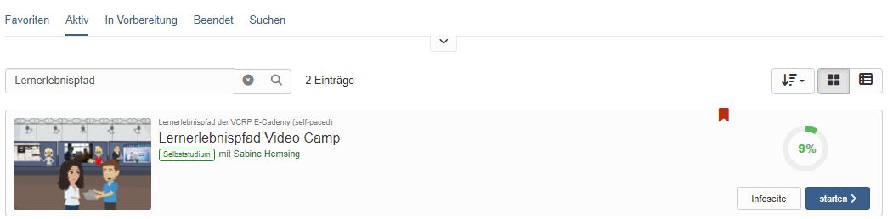
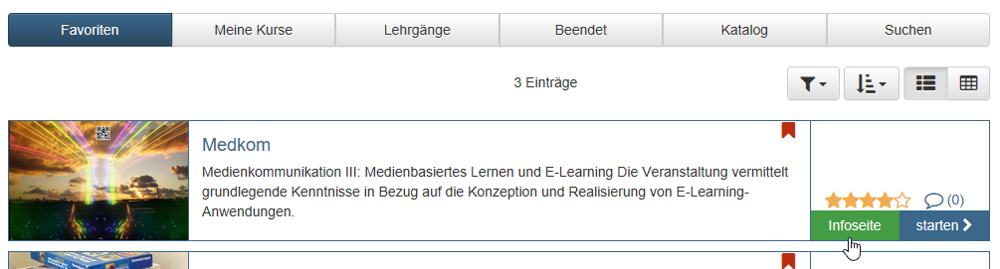
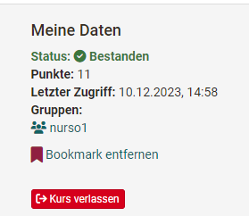
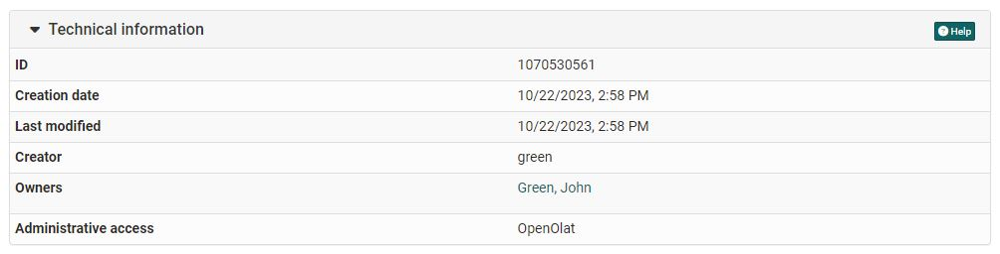

# Toolbar: Info page {: #toolbar_infopage}

{ class="shadow lightbox" }

Each course and each OpenOlat learning resource has an info page. For courses, this page is referred to as "Course info". The information entered here is already visible before a course or learning resource is booked or entered by learners.

In this way, teachers can make central information available to the target group in advance. This includes, for example:

* Names of the teachers involved
* Description of the event
* Language
* Execution period
* Time expenditure, learning objectives, requirements, certification
* License type of the learning resource

The info page also contains a link to start or book the course.

{ class="shadow lightbox" }

Many teachers add a picture or video to the event. This picture and a first part of the description then also appear in the overview under "My courses" or "Favorites", unless the table view has been selected.

{ class="shadow lightbox" }

## Information and sections

### Automatically generated information

OpenOlat automatically generates additional information that is important for users. This includes:

* The external link to the course or learning resource for direct access.
* Technical information with the course ID, the date of the last modification, etc. The ID is the automatically generated identification number of the learning resource. With this ID you can search for the learning resource via the search mask.
* My data with the current status, the last access, etc.

You can also rate the course or learning resource with stars, provided that this feature has been enabled by administrators.

{ class="shadow lightbox" }

### My data

This section is particularly interesting for participants. Under "My data" they find their user-specific information on the course, including the "Passed" status, when they last accessed the course and which groups they are registered in within the course. Here they can also set a bookmark on the course or learning resource. If leaving the course or learning resource is allowed, this is also possible here.

{ class="shadow lightbox" }

### Technical information

{ class="shadow lightbox" }

The technical information is only visible to the owners of the learning resource. Participants and generally interested persons do not see it.

### Information on usage (further learning resources)

The info page of learning resources other than a course also contains the section "Information on usage". This includes:

**References**: Here you can see which courses use this learning resource. As long as the learning resource is used in a course, it cannot be deleted.

**Last access**: Indicates when the learning resource was last started.

**Current users**: Indicates how many users have currently started this learning resource in OpenOlat.

**Number of launches**: Automatically counts how often the learning resource has been started in total. If the learning resource cannot be started in OpenOlat, the entry "Launch not supported" appears.

**Number of exports**: Automatically counts how often the learning resource has been downloaded in total.

## Further information {: #further_information}

[General Functions: Info Page >](../learningresources/General_Functions_Infopage.md) 
[Course Settings >](../learningresources/Course_Settings.md)

[To the top of the page ^](#toolbar_infopage)
