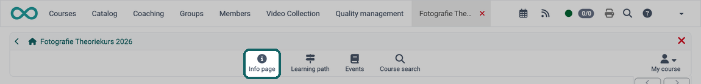

# Toolbar: Info page {: #toolbar_infopage}

{ class="shadow lightbox" title="Toolbar of an opened course · 2026.09.29" }

Anyone who wants to check in a course what it is about, when the events take place or how far they have got opens the info page via the link **Info page** in the toolbar. Every course and every other learning resource has an info page. It shows the same details that interested users see before booking: description, facts, objectives, teachers and events. Members also find the section "My course" there, with progress, status, score and groups. If leaving the course is allowed, the action "Leave Course" is available there as well.

If the course is the only learning resource of an implementation in the Course Planner, the link opens the info page of this implementation. [:octicons-tag-16:{ title="from Release 20.0 (OO-8511)" }](https://track.frentix.com/issue/OO-8511){:target="_blank"}

Which elements the info page shows and where you set them is described in [General Functions: Info Page](../learningresources/General_Functions_Infopage.md#content).

[To the top of the page ^](#toolbar_infopage)

---

## Print the info page [:octicons-tag-16:{ title="from Release 21.1 (OO-9299)" }](https://track.frentix.com/issue/OO-9299){:target="_blank"} {: #print}

The info page can be printed, for example to have a course booking approved by a supervisor. Click **Download as PDF** in the header of the info page. OpenOlat creates a flyer in one column without buttons, with a QR code that leads to the offer. You get the same printout with the "Print" command of your browser. The button only appears if administrators have set up a PDF service; printing via the browser always works.

What the printout contains and what it leaves out: [Print the info page or download it as PDF](../learningresources/General_Functions_Infopage.md#print)

[To the top of the page ^](#toolbar_infopage)

---

## About this course [:octicons-tag-16:{ title="from Release 21.1 (OO-9760)" }](https://track.frentix.com/issue/OO-9760){:target="_blank"} {: #about}

Anyone managing a course who wants to look up the ID, the external link or the owners does not find these details on the info page, but in the window "About this course". You open it under: 
`Course > Administration > About this course`

The button next to the field "Type" under `Course > Administration > Settings > Tab "Metadata"` opens the same window.

For other learning resources, the menu item is named after their type, for example "About this test" or "About this form", otherwise "About this learning resource". The menu item is visible to the owners of the learning resource, learning resource managers and administrators. Participants and coaches do not see it.

{ class="shadow lightbox" title="Window About this course · 2026.09.29" }

The page [About this course: Technical information and usage](../learningresources/Technical_Information_on_Resources_and_Usage.md) describes what the individual details in the window mean.

[To the top of the page ^](#toolbar_infopage)

---

## Further information {: #further_information}

**Mentioned on this page** 
[General Functions: Info Page >](../learningresources/General_Functions_Infopage.md) 
[About this course: Technical information and usage >](../learningresources/Technical_Information_on_Resources_and_Usage.md)

**Further reading** 
[Course Settings >](../learningresources/Course_Settings.md) 
[Course Planner: Implementations >](../area_modules/Course_Planner_Implementations.md) 
[Access configuration >](../learningresources/Access_configuration.md)

[To the top of the page ^](#toolbar_infopage)
