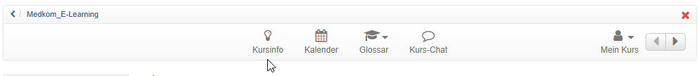

# Info page

Each course and each OpenOlat learning resource has an information page. For
courses, this page is referred to as the "Course Info" page. The information
entered here is already visible before a course or learning resource is even
booked or entered by the learner. 

In this way, teachers can make central
information available to the target group in advance. This includes, for example

  * Names of the teachers involved
  * Description of the course or event
  * Language
  * Execution period
  * Time expenditure, learning objectives, requirements, certification
  * License type of the learning resource

Many teachers also add a picture or video to the event. This picture and a
first part of the description will appear in the overview under "My Courses"
or "Favorites" if the table view has not been selected.

The info page also contains a link to start or book the course. OpenOlat also automatically generates additional information that is important for users. This includes:

  * The external link to the course or to the learning resource for direct access
  * Technical info with the course ID, date of last modification, etc. The ID is the automatically generated identification number of the learning resource. With this ID you can search for the learning resource via the search mask.
  * Info on use with license details for the learning resource or course
  * My data with the current status, last access, etc.

Furthermore it is possible to rate the course or learning resource with stars (if activated by the OLAT admin).

### Technical information

The information about access permissions, the creator and the current authors is only visible for OLAT owners.

### Informationen on use

Example of a user view

Example of an owner view

 **Licensing information**: Display of the license assigned to the learning resource, as well as - if provided - licensor and license text.

**References**: Here you can see which courses use this learning resource. As long as the learning resource is used in a course, it cannot be deleted.

The **last access** indicates when the learning resource was last started.

**Current Users**: Indicates how many users have currently launched this learning resource in OpenOlat.

**Number of hits**: Automatically counts how many times the learning resource has been started in total. If the learning resource cannot be started in OpenOlat, the entry _Execution not supported_ appears.

 **Number of exports:** Automatically counts how many times the learning resource has been downloaded in total.

### My data

Under "My data" you will find your user specific information on the course,
including the "passed" status, when you last accessed the course and the
groups you are registered with in the course. Here you can also bookmark the
course/learning resource. If the course author allows you to leave the course,
you can do so here as well.

## How to find the info page?

You can get to the info page of a learning resource by clicking on the link
"info page" in the section "Courses" or "Catalogue" in the list or if you
select the course info icon in the course toolbar during course operation.

If your chosen event does not contain much information, it is because your
teacher has not (yet) set up this page.

