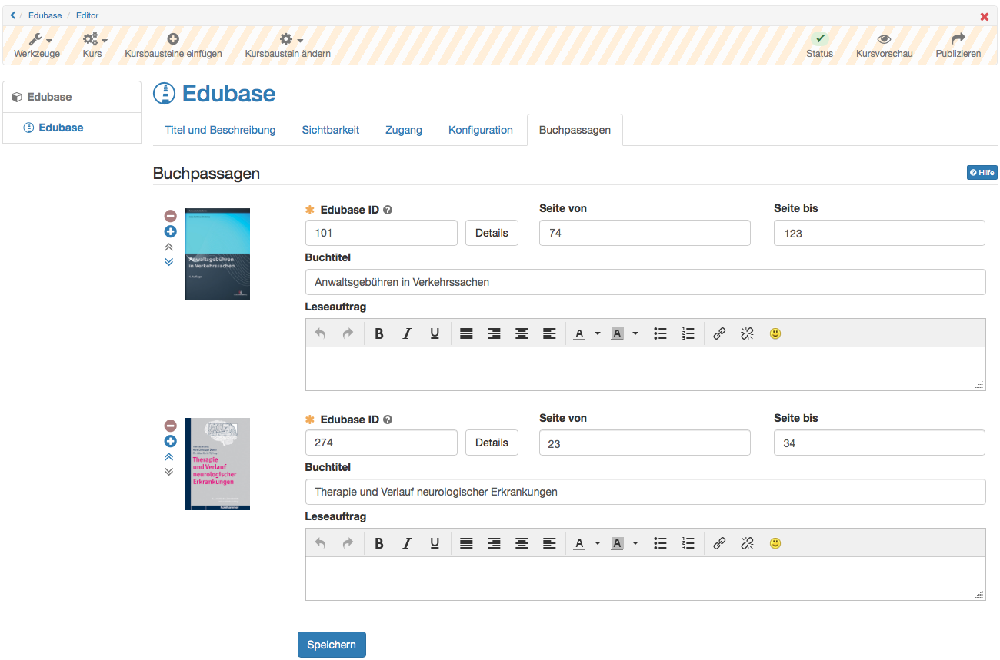

# Wissensvermittlung

##  Kursbaustein "Struktur" {: #structure}

Der Kursbaustein „Struktur“ dient der Gliederung des Kurses und bietet
standardmässig eine automatische Übersicht über alle ihm untergeordneten
Kursbausteine mit deren Kurztitel, Titel und Beschreibungen. Verwenden Sie
diesen Kursbaustein, um Ihre Kursinhalte zu gliedern und/oder Module klar zu
trennen. Weitere Informationen finden Sie
[hier](Course_Element_Structure.de.md).

##  Kursbaustein "HTML Seite" {: #single_page}

Im Kursbaustein "HTML Seite" können Sie verschiedene Dateien direkt in die
Kursstruktur eingebunden werden. Diese webspezifischen Dateien (pdf, html)
können bereits im Ablageordner des Kurses oder einem verknüpften
Ressourcenordner vorliegen oder direkt mit dem Kurseditor als HTML-Seite
erstellt werden. Die so verknüpften Web-Dateien werden im Gegensatz zu einer
Bereitstellung über den Kursbaustein "Ordner" direkt in der Kursstruktur
angezeigt. Der Kursbaustein "HTML Seite" eignet sich besonders für die
Bereitstellung von schnell sichtbaren Informationen und hypertextbasierten
Inhalten. Weitere Informationen zu den Kursbausteinen "HTML Seite" und
"Mehrere Einzelseiten" finden Sie
[hier](Course_Element_HTML_Page.de.md).

##  Kursbaustein "Externe Seite" {: #external_page}

Mit Hilfe des Kursbausteins "Externe Seite" können Sie eine externe
Internetseite aufrufen. Geben Sie einfach die gewünschte URL in der
Konfiguration im Tab "Seiteninhalt" ein um die externe Seite in Ihre
Kursnavigation zu integrieren.  Für die Anzeige der verlinkten Seite werden
Ihnen die Varianten

  * "Eingebettet (Quelle verborgen)",
  * "Eingebettet (Quelle sichtbar)",
  * "Neues Browserfenster" (Quelle sichtbar) und
  * "Vollständig integriert" (Quelle verborgen)

angeboten. Für Seiten, die eine Authentifizierung erfordern und deren Quelle
verborgen ist, können Sie "Seite Passwort geschützt" aktivieren und die
notwendigen Zugangsdaten eintragen.

Der Einsatz dieses Kursbausteins empfiehlt sich, wenn Sie beispielsweise
Seiten mit Datenbankabfragen (Literaturrecherche-Tool, Online-Übungen aus dem
Web, etc.) einbinden möchten. Es lassen sich nur externe Seiten über die Protokolle HTTP und HTTPS verlinken.

  

### Tab "Seiteninhalt" konfigurieren

**URL:** Dieses Eingabefeld müssen Sie ausfüllen. Hier geben Sie die Webseite an, auf der die gewünschten externen Inhalte liegen (im Format:_http://www.musterseite.com_)

**Darstellung konfigurieren:** Sie können zwischen vier Optionen wählen:

*  _Vollständig integriert (Quelle verborgen):_ Dies bedeutet, dass die externe HTML-Seite geparst und vollständig in die OpenOlat-Seite eingebaut wird. Die HTML-Seiten dürfen ausschliesslich Ressourcen wie Bilder, Flash, Videos oder Links mit **relativen Pfaden** enthalten. Absolute Pfade wie "http://..." sowie relativ absolute Pfade wie "/public" (relativ zu einem Basis URI) sind nicht erlaubt.
*  _Eingebettet (Quelle verborgen):_ Hier wird die externe HTML-Seite in ein sog. «iframe» eingebaut. Die Internet-Adresse der externen Seite ist für den Benutzer nicht sichtbar. Die HTML-Seiten dürfen ausschliesslich Ressourcen wie Bilder, Flash, Videos oder Links mit **relativen Pfaden** enthalten. Absolute Pfade wie "http://..." sowie relativ absolute Pfade wie "/public" (relativ zu einem Basis URI) sind nicht erlaubt.
*  _Eingebettet (Quelle sichtbar):_ Hier wird die externe HTML-Seite ebenfalls in ein «iframe» eingebaut. Im Quellcode der OLAT-Seite kann die Internet-Adresse der externen Seite eingesehen werden.
*  _Neues Browser-Fenster (Quelle sichtbar):_ Als weitere Option können Sie die externe Seite auch in einem eigenen Browserfenster anzeigen lassen.

Eingebettete Frames («iframe») verhalten sich wie eigene Browser-Fenster, die jedoch Bestandteil der HTML-Seite des Ursprungsfensters sind.  

Vorteil von «iframe»: Sie können beliebige Inhalte (komplexe Webseiten in verschachtelten Frames, mathML etc.) in OLAT anzeigen lassen.  

Nachteil von «iframe»: Die Inhalte erscheinen unter Umständen mit eigenen Scroll-Balken.

!!! info "Info"

    Sollten Sie sich nicht sicher sein, welche Variante in Ihrem Fall die Richtige ist, dann beginnen Sie mit der Option „Vollständig integriert“ und testen die anderen Darstellungsmöglichkeiten, bis die verlinkte Seite wie gewünscht angezeigt wird.

  

## Kursbaustein "CP-Lerninhalt" {: #CP_learning_content}

Nutzen Sie den Kursbaustein "CP-Lerninhalt", um einen Lerninhalt im IMS-CP-
Format (IMS-CP Version 1.1.2) in Ihren Kurs einzubinden. Das CP können Sie
entweder direkt in OpenOlat erstellen, was im Kapitel ["Fünf Schritte zu Ihrem Content-Packaging"](../resource_cp/In_Five_Steps_to_Your_Content_Package.de.md)
erklärt wird. Oder Sie erstellen das CP extern, beispielsweise mit
[eLML](http://www.elml.org "eLML ").

Weitere Infos zum CP finden Sie [hier](../learningresources/CP_Editor.de.md).  

##  Kursbaustein "SCORM-Lerninhalt" {: #SCORM_learning_content}

Über den Kursbaustein "SCORM Lerninhalt" können extern erstellte SCORM-Pakete in OpenOlat Kurse eingebunden werden. SCORM ist ein Standard mit dem Inhalte aber auch interaktive E-Learning Module gekapselt und in unterschiedlichen Systemen eingebunden werden können. Weitere Informationen zur Konfiguration des Kursbausteins SCORM finden Sie im Kapitel "Kursbaustein "[SCORM-Lerninhalt"](Course_Element_SCORM_Learning_Content.de.md).

## Kursbaustein "Dokument" {: #document}

Mit dem Kursbaustein "Dokument" können verschieden Dokumentformate direkt
sichtbar in den Kurs eingebunden werden. Der Kursbaustein ist besonders für
Office-Dokumente, PDF oder auch die Anzeige von Grafik-Dateien geeignet. Dabei
kann sowohl auf bereits vorliegende Dateien zurückgegriffen oder Dateien neu
hochgeladen oder erstellt werden. Textverarbeitungsdokumente und PDF werden
über den integrierten Dokument Viewer direkt angezeigt.

Verwendet werden können Dateien, die sich im Ablageordner des Kurses befinden
oder als separate Lernressource hochgeladen wurden. Welche Dateiformate neu
erstellt werden können ist abhängig von den Einstellungen in der
Administration der jeweiligen OpenOlat Instanz.

Die eingebundenen Dokumente können bei Bedarf später auch bearbeitet,
ausgetauscht oder als separate Lernressource gespeichert werden. Je nach
Dateityp sind noch weitere Optionen wie die Bearbeitung von Metadaten möglich.
Eine Bearbeitung der Textdokumente ist bei Aktivierung entsprechender Lizenzen
in der OpenOlat Administration ebenfalls möglich, der Editor öffnet sich dann
in einem separaten Fenster.

Ferner können im Kurseditor die Benutzerberechtigungen für den Kursbaustein
eingestellt werden und so z.B. definiert werden welche Rollen das jeweilige
Dokument (sofern möglich) bearbeiten und herunterladen dürfen. Auch die Höhe
der Anzeigefläche kann definiert werden.

Nach dem Download eines entsprechenden Dokuments wird in den Metadaten
angezeigt, wer das Dokument als letztes bearbeitet hat.

!!! warning "Hinweis"

    Für Video-Dateien sollte der Kursbaustein "Video" und für HTML-Seiten der Kursbaustein "Einzelseite" anstatt des Kursbaustein "Dokument" verwendet werden.

  

##  Kursbaustein "Ordner" {: #folder}

Im Kursbaustein "Ordner" können Sie Dateien zum Download anbieten. Vielfach
wird der Kursbaustein Ordner dazu verwendet, Kursmaterialien wie Folien oder
Skripte zur Verfügung zu stellen. Darüber hinaus kann der Kursbaustein
"Ordner" auch als kollaboratives Werkzeug für den Dateiupload der Lernenden
konfiguriert werden.

Weitere Informationen zur Konfiguration und Verwendung des Kursbausteins
"Ordner" finden Sie
[hier](Course_Element_Folder.de.md).

  

## Kursbaustein "Podcast" {: #podcast}

Den Kursbaustein "Podcast" können Sie entweder dazu benutzen, Ihre eigenen
Audio- und Videodateien oder externe Podcast-Episoden einfach in OpenOlat
bereitzustellen. Kursteilnehmer können sich Episoden direkt in OpenOlat
anzeigen lassen oder den Podcast abonnieren, die Episoden in Portale wie
iTunes laden und auf ihre mobilen Endgeräte kopieren.

Wie Sie einen Podcast [erstellen ](../resource_podcast/Four_Steps_to_Your_Podcast.de.md)und
[konfigurieren ](../learningresources/Podcast_Further_Configurations.de.md)erfahren Sie in
separaten Kapiteln.

## Kursbaustein "Blog" {: #blog}

Über den "Blog" können Sie die Teilnehmer des Kurses über aktuelle Themen in
Form von Text, Bild oder Video informieren. Sie können sowohl externe Blogs
einbinden als auch einen neue OLAT Lernressource "Blog" erstellen und
verwenden. Kursbesitzer können in einem Blog beispielsweise mehr oder weniger
regelmäßig einen inhaltlichen Blog führen und so die Kursteilnehmenden über
neue aktuelle Inhalte zum Veranstaltungsthema informieren. Die Teilnehmenden
können diese Beiträge dann kommentieren und auch mit 1-5 Sternen bewerten.
Ferner ist es möglich, den Kursteilnehmenden das Schreibrecht für einen Blog
zu geben, so dass sie gemeinsam einen Kursblog führen können.

Wie Sie einen Blog [erstellen ](../resource_blog/Four_Steps_to_Your_Blog.de.md)und
[konfigurieren ](../learningresources/Blog_Further_Configurations.de.md)erfahren Sie auf
separaten Seiten.

## Kursbaustein "Video" {: #video}

Mit dem Kursbaustein "Video" können Sie selbst erstellte Videos oder über eine
URL importierte Videos, die als Lernressource Video in OLAT vorliegen, Ihrem
Kurs hinzufügen. Es wird jeweils ein Video pro Kursbaustein verlinkt. Das
Video kann mit einer Kommentierung und Bewertung versehen und so optimal in
das Lehr-Lerngeschehen eines Kurses eingebunden werden.

Weitere Informationen zum Kursbaustein Video finden Sie
[hier](../learningresources/Course_Element_Video.de.md).
Informationen zur Nachbearbeitung des Videos mit OLAT Quiz und Sprungmarken
finden Sie im Kapitel "[Lernressource: Video](../learningresources/Learning_resource_Video.de.md)".

##  Kursbaustein "Video Livestream"  {: #livestream}

  

##  Kursbaustein "Opencast"  {: #opencast}

Mit dem Kursbaustein Opencast können Aufzeichnungen von Meetings und
Lehrveranstaltungen, die auf einem Opencast-Server abgelegt sind, in OpenOlat-
Kurse eingebunden werden. Die Konfiguration und Anbindung des Opencast-Servers
erfolgt in der Administration. Im Kursbaustein können entweder einzelne Videos
oder ganze Serien eingebunden werden.

##  Kursbaustein "edu-sharing" {: #edusharing}

  

##  Kursbaustein "card2brain" {: #card2brain}

Der Baustein card2brain ermöglicht das Lernen mit Lernkarten. Um diesen
Baustein zu nutzen, müssen Sie zwingend ein Entreprise-Account von card2brain
besitzen. Kunden von frentix wenden Sie dafür bitte an
[card2brain@frentix.com](mailto:card2brain@frentix.com), Nichtkunden
kontaktieren direkt [card2brain](http://card2brain.ch/info/contact).

Weitere Informationen zum Kursbaustein finden Sie
[hier](Course_Element_card2brain_Flashcards.de.md).

##  Kursbaustein "Edubase" {: #edubase}

Mit diesem Kursbaustein können e-Books von Edubase verlinkt und direkt in
OpenOlat aufgerufen werden.

Um diesen Baustein zu nutzen, ist zwingend ein Account bei Edubase sowie
entsprechende Berechtigungen zur Nutzung der jeweiligen eBooks notwendig.
Kunden von frentix wenden Sie dafür bitte an
[edubase@frentix.com](mailto:edubase@frentix.com), Nichtkunden kontaktieren
direkt [Edubase](https://www.edubase.ch/).

!!! info "Info"

    Der Baustein muss zunächst in der Administration freigeschalten und konfiguriert werden, ebenso werden Berechtigungsschlüssel für die eBooks benötigt. Sind die Voreinstellungen abgeschlossen, kann der Baustein zu einem Kurs hinzugefügt werden. Für die eingebundenen eBooks ist es im Editor möglich, Leseaufträge zu bestimmten Buchpassagen für Kursteilnehmer zu erstellen.

