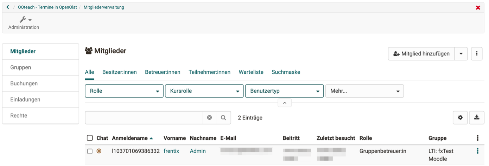

# LTI Zugang zu einem Kurs konfigurieren

:octicons-tag-24: Release 15.5 

OpenOlat ermöglicht es anderen LMS, via LTI auf einzelne OpenOlat-Kurse zuzugreifen. Ihre OpenOlat-Kurse können so auch von Personen besucht werden, die auf einem anderen LMS arbeiten.

**Beispiel:** 
Ein OpenOlat-Kurs wird von Moodle aus via LTI 1.3 gestartet. Dabei werden die Benutzer beim Aufruf in OpenOlat als LTI-Benutzer:innen angelegt und erhalten Zugriff auf den OpenOlat-Kurs (in der Rolle Teilnehmer:in oder Betreuer:in).

## Voraussetzungen

Für die Konfiguration muss ein Administrator-Zugang in beiden Systemen gewährleistet sein.
(In OpenOlat kann dies auch die Rolle Systemadministrator:in sein.) 
Vorzugsweise erfolgt die Konfiguration auf beiden Systemen gleichzeitig, da bestimmte Dialoge in beiden Systemen direkt aufeinanderfolgend zu konfigurieren sind.

## Ablauf der Konfiguration

1. Setup "External Tool" in Moodle
2. Setup "externe Plattform" in OpenOlat
3. LTI-Freigabe des Kurses in OpenOlat
4. Einbinden des externen Tools (=OpenOlat) im Moodle-Kurs
5. Verbindungstest

## 1. Setup "External Tool" in Moodle 

Die Administration der externen Tools in Moodle befinden sich unter folgendem Pfad: 
**Site administration > Plugins > External Tool > Manage Tools**

    
Screen

	

Für die Konfiguration mit OpenOlat ist die Option "**configure a tool manually**" zu wählen.

    
Screen

	

Folgende Parameter sind als Mindestanforderung im Dialog zu definieren:

| Feld					| Bemerkung |
| --------------------- | ---------------------------------------------- |
| Tool name				| Frei definierbar |
| Tool URL				| Direkt-Link zu OpenOlat-Kurs.   Die URL hat folgendes Format: https:// < OpenOlat-URL > /auth/RepositoryEntry/ < KursID >  (Achten Sie darauf, dass kein / am Ende der URL eingefügt wird.) |
| LTI Version			| LTI 1.3 |
| Client ID				| Wird erst nach dem Speichern in dieser Maske ersichtlich |
| Public key type		| RSA key |
| Public key			| Wird in OpenOlat generiert – kann erst nachträglich eingetragen werden |
| Initiate Login URL	| Anmelde-URL (Form: hdps://<OpenOlat- URL/lT/login_iniTaTon) |
| Redirection URL(s)	| Umleitungs-URL (Form: hdps://<OpenOlat-URL/lT/login) |
| Tool Configuration Usage| Show in acTvity chooser and as a preconfigured tool |
| Default Launch Container	| New window (OpenOlat unterstützt die Ausführung der Kurse nur in einem neuen Fenster.) |

    
Screen

	

Nach dem Speichern können Sie weitere Details in der Übersicht über den Detail-Link im LTI-Tool abrufen. Die Details werden beim Setup der externen Plattform in OpenOlat benötigt:

    
Screen

	

 

## 2. Setup "externe Plattform" in OpenOlat

Die AdministraTon von LTI 1.3 befindet sich in OpenOlat unter folgendem Pfad: 
**Administration > Externe Werkzeuge > LTI 1.3**

    
Screen

	

Unter “Externe Plattorm” kann die Moodle-Instanz erfasst werden:

| Feld					| Bemerkung |
| --------------------- | ---------------------------------------------- |
| Tool name				| Frei definierbar |
| Plattform-ID / Issuer	| URL zur Moodle-Instanz |
| Client-ID				| Client ID aus dem Dialog «Tool configuration details» in Moodle |
| Öffentlicher Schlüsseltyp | RSA-Schlüssel -> dieser Schlüssel wird anschliessend in der Tool-Konfiguration auf Moodle ergänzt |
| Authorization	 		| Aus Moodle: Authentication request URL |
| URL für Zugriffstoken	| Aus Moodle: Access token URL |
| URL des öffentlichen Schlüsselbundes | Aus Moodle: Public Keyset URL |

Tragen Sie nach Abschluss des Formulars den Öffentlichen Schlüssel auf Moodle in der Tool- Konfiguration ein.

    
Screen

	

 

## 3. LTI-Freigabe des Kurses in OpenOlat

Die Freigabe eines OpenOlat-Kurses (oder einer OpenOlat-Gruppe) erfolgt in den Einstellungen unter folgendem Pfad: 
**OpenOlat-Kurs > Einstellungen > Tab Freigabe > LTI 1.3 Zugangskonfiguration**

    
Screen

	

Ergänzen Sie ein Deployment für den Kurs (oder die Gruppe):

| Feld					| Bemerkung |
| --------------------- | ---------------------------------------------- |
| Plattform				| Auswahl der konfigurierten Moodle-Instanz |
| Deployment-ID 		| Aus Moodle: Deployment ID aus dem Dialog "Tool configuration details" |

    
Screen

	

 

## 4. Einbinden des externen Tools (=OpenOlat) im Moodle-Kurs

Im Moodle-Kurs kann nun das externe Tool (OpenOlat) eingefügt werden.

    
Screen

	

Der konfigurierte OpenOlat-Kurs lässt sich hier im externen Tool auf Moodle als "preconfigured tool" auswählen.

    
Screen

	

 

## 5. Verbindungstest

Ob die Konfiguration geklappt hat, ist mit einem einfachen Test-Aufruf möglich.

    
Screen

	

Der Link in Moodle sollte den gewünschten OpenOlat-Kurs in einem neuen Fenster öffnen. 

!!! warning "Achtung"

	Wenn Sie schon in einem anderen Tab in OpenOlat eingeloggt sind, werden Sie dort ausgeloggt.  

Im OpenOlat-Kurs können Sie den Test-Aufruf in der Mitgliederverwaltung verifizieren – der LTI-Aufruf hat einen neuen LTI-Benutzer angelegt und einer LTI-Gruppe hinzugefügt:

{ class="shadow lightbox" }

## Externe Kurse im Bewertungswerkzeug

Auch für den Kursbaustein LTI kann das Bewertungsformular ausgefüllt und angepasst werden. 
Wählen Sie im Kurseditor den Kursbaustein. Unter dem Tab "Seiteninhalt" muss zwingend "Punkte übertragen" ausgewählt sein. Je nachdem muss auch ein Skalierungsfaktor eingetragen und die Punktzahl für das Bestehen definiert werden. Weitere Informationen zur Konfiguration von LTI-Seiten finden Sie [hier](https://docs.openolat.org/de/manual_user/learningresources/Course_Element_LTI_Page/).

##  Links

Benutzerhandbuch: [LTI-Zugang zu einer Gruppe konfigurieren](https://docs.openolat.org/de/manual_user/groups/LTI_Share_groups/)

Benutzerhandbuch: [Kursbaustein "LTI-Seite“](http://docs.openolat.org/de/manual_user/learningresources/Course_Element_LTI_Page/)

Administrationshandbuch: [LTI 1.3 Integrationen im Überblick](http://docs.openolat.org/de/manual_admin/administration/LTI_Integrations/)

Administrationshandbuch: [LTI - Externe Werkzeuge](http://docs.openolat.org/de/manual_admin/administration/LTI_External_tools/)

Administrationshandbuch: [LTI - Externe Plattformen](http://docs.openolat.org/de/manual_admin/administration/LTI_External_platforms/)

