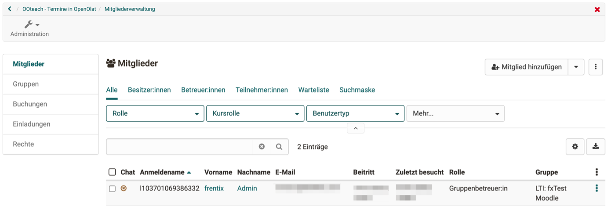

# Course Settings - Tab Share: Configure LTI access to a course {: #LTI_share_course}

OpenOlat allows other LMSs to access individual OpenOlat courses via LTI. Your OpenOlat courses can thus also be attended by people working on another LMS.

**Example:** 
An OpenOlat course is launched from Moodle via LTI 1.3. Users are created as LTI users when they call up OpenOlat and are given access to the OpenOlat course (in the role of participant or coach).

## Requirements

Administrator access must be ensured in both systems for configuration. (In OpenOlat, this can also be the System Administrator role). Preferably, the configuration is done on both systems at the same time, since certain dialogs have to be configured in both systems in direct succession.

## Configuration procedure

1. Setup "External tool" in Moodle
2. Setup "External platform" in OpenOlat
3. LTI release of the course in OpenOlat
4. Embedding the external tool (=OpenOlat) in the Moodle course.
5. Connection test

## 1. Set up "External Tool" in Moodle 

The administration of the external tools in Moodle are located under the following path: 
`Site administration > Plugins > External Tool > Manage Tools`

    
Screen

	

For configuration with OpenOlat, the option "**configure a tool manually**" must be selected.

    
Screen

	

The following parameters must be defined as minimum requirements in the dialog:

| Field					| Comment |
| --------------------- | ---------------------------------------------- |
| Tool name				| Freely definable |
| Tool URL				| Direct link to OpenOlat course.   The URL has the following format: https:// < OpenOlat-URL > /auth/RepositoryEntry/ < KursID >  (Make sure that no / is inserted at the end of the URL.) |
| LTI Version			| LTI 1.3 |
| Client ID				| Will only be visible after saving in this mask |
| Public key type		| RSA key |
| Public key			| Is generated in OpenOlat, can only be entered subsequently |
| Initiate Login URL	| Login-URL (Form: hdps://<OpenOlat- URL/lT/login_initiation) |
| Redirection URL(s)	| Redirection-URL (Form: hdps://<OpenOlat-URL/lT/login) |
| Tool Configuration Usage| Show in actvity chooser and as a preconfigured tool |
| Default Launch Container	| New window (OpenOlat supports the execution of the courses only in a new window.) |

    
Screen

	

After saving, you can get more details in the overview via the detail link in the LTI tool. The details are needed when setting up the external platform in OpenOlat:

    
Screen

	

 

## 2. Setup "external platform" in OpenOlat

The administration of LTI 1.3 is located in OpenOlat under the following path: 
`Administration > External tools > LTI`

    
Screen

	 LTI of the system administration" />

Under "External platform" the Moodle instance can be recorded:

| Field					| Comment |
| --------------------- | ---------------------------------------------- |
| Tool name				| Freely definable |
| Plattform-ID / Issuer	| URL to the Moodle instance |
| Client-ID				| Client ID from the "Tool configuration details" dialog in Moodle |
| Public key type | RSA-Key -> this key is then added to the tool configuration on Moodle |
| Authorization	 		| From Moodle: Authentication request URL |
| URL for access token	| From Moodle: Access token URL |
| URL of the public keychain | From Moodle: Public Keyset URL |

After completing the form, enter the public key on Moodle in the tool configuration.

    
Screen

	

 

## 3. LTI release of the course in OpenOlat

The release of an OpenOlat course (or an OpenOlat group) is done in the settings under the following path: 
`OpenOlat course > Settings > Tab "Share" > LTI 1.3 access configuration`

    
Screen

	

Add a deployment for the course (or group):

| Field					| Comment |
| --------------------- | ---------------------------------------------- |
| Platform				| Selection of the configured Moodle instance |
| Deployment-ID 		| From Moodle: Deployment ID from the dialog "Tool configuration details" |

    
Screen

	

 

## 4. Embedding the external tool (=OpenOlat) in the Moodle course.

The external tool (OpenOlat) can now be inserted in the Moodle course.

    
Screen

	

The configured OpenOlat course can be selected here in the external tool on Moodle as a "preconfigured tool".

    
Screen

	

 

## 5. Connection test

Whether the configuration has worked is possible with a simple test call.

    
Screen

	

The link in Moodle should open the desired OpenOlat course in a new window. 

!!! warning "Attention"

	If you are already logged into OpenOlat in another tab, you will be logged out there. 

In the OpenOlat course, you can verify the test call in Members management: The LTI call created a new LTI user and added it to an LTI group:

{ class="shadow lightbox" }

## External courses in the assessment tool

The evaluation form can also be filled in and customized for the course element LTI. Select the course element in the course editor. Under the "Page content" tab, "Transfer points" must be selected. Depending on this, a scaling factor must also be entered and the passing score defined. For more information on configuring LTI pages, see [here](../../manual_user/learningresources/Course_Element_LTI_Page.md).

## Further information {: #further_information}

User manual: [Configure LTI access to a group >](../../manual_user/groups/LTI_Share_groups.md) 
User manual: [Course element "LTI page" >](../../manual_user/learningresources/Course_Element_LTI_Page.md) 
User manual: [LTI 1.3 Integrations at a glance >](../../manual_admin/administration/LTI_Integrations.md) 
Admin manual: [LTI - External tools >](../../manual_admin/administration/LTI_External_tools.md) 
Admin manual: [LTI - External platforms >](../../manual_admin/administration/LTI_External_platforms.md) 
Admin manual: [LTI - Deep Linking](../../manual_admin/administration/LTI_Deeplinking.md) 
Admin manual: [LTI - Role mapping](../../manual_admin/administration/LTI_Role_Mapping.md)

[To the top of the page ^](#LTI_share_course)
