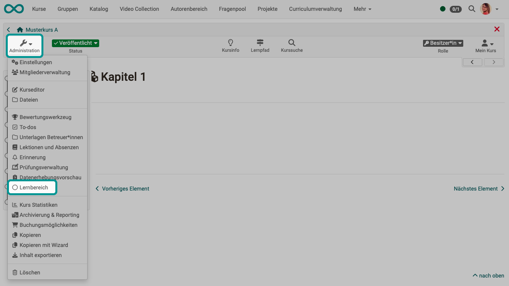

# Lernbereiche {: #learning_areas}

Hier können die Lernbereiche des Kurses erstellt, angezeigt und editiert werden.

{ class="shadow lightbox" }

Mit Hilfe eines Lernbereichs können mehrere Gruppen eines Kurses gebündelt werden. Dies ist besonders bei vielen Gruppen innerhalb eines Kurses sinnvoll. Über die Schaltfläche "Lernbereich erstellen" weisen Sie dem Kurs einen neuen Lernbereich zu. Ordnen Sie anschliessend diesem Lernbereich die gewünschten im Kurs existierenden Gruppen zu.

Lernbereiche können z.B. im Kurseditor beim Kursbaustein "Einschreibung" ausgewählt werden. Somit werden alle Gruppen eines Lernbereichs zur Einschreibung angeboten. Weiter stehen Lernbereiche in herkömmlichen Kursen jeweils in den Tabs "Sichtbarkeit" oder "Zugang" zur Auswahl, wenn die Option "gruppenabhängig" aktiviert ist.

Der Vorteil gegenüber der expliziten Auflistung aller relevanten Gruppen in den Zugangs- und Sichtbarkeitsbeschränkungen ist die grössere Flexibilität und die einfachere Handhabung im Kurseditor. Werden neue Gruppenregeln im Kurs definiert, so muss dieser neu publiziert werden. Ist stattdessen eine Lernbereichsregel definiert, so kann die Teilnahme einer Gruppe in der Lernbereichsverwaltung definiert werden. Der Kurs muss hierfür nicht neu publiziert werden.

!!! tip "Tipp"

    Lernbereiche können z.B. eingesetzt werden, 
    
    * wenn Sie denselben Kursbaustein mehreren Gruppen innerhalb eines Kurses verfügbar machen möchten, 
    * oder wenn bei einem Einschreibebaustein viele Gruppen zur Auswahl stehen, 
    * oder wenn Sie mehrere Gruppen für einen Betreuer bündeln möchten. 
    
    Mit einem Lernbereich sparen Sie sich die wiederholte Auswahl jeder einzelnen Gruppe.

[Zum Seitenanfang ^](#learning_areas)
