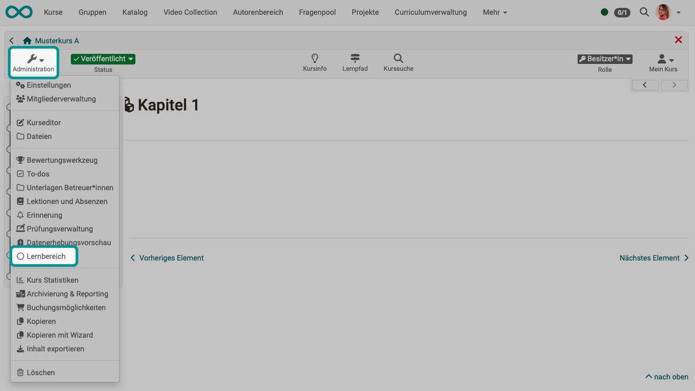

# Learning areas {: #learning_areas}

The learning areas of the course can be created, displayed and edited here.

{ class="shadow lightbox" }

With the help of a learning area several groups of a course can be bundled. This is especially useful when there are many groups within a course. Use the "Create learning area" button to assign a new learning area to the course. Then assign the desired groups existing in the course to this learning area.

Learning areas can be selected e.g. in the course editor at the course element "Enrolment". Thus, all groups in a learning area are offered for enrolment. Furthermore, learning areas in conventional courses are available for selection in the tabs "Visibility" or "Access" respectively, if the option "group-dependent" is activated.

The advantage over explicitly listing all relevant groups in the access and visibility restrictions is the greater flexibility and easier handling in the course editor. If new group rules are defined in the course, it must be republished. If a learning area rule is defined instead, the participation of a group can be defined in the learning area administration. The course does not need to be republished for this purpose.

!!! tip "Hint"

    Learning areas can be used, for example,
    * if you want to make the same course element available to several groups within a course,
    * or if there are many groups to choose from for an enrolment element,
    * or if you want to bundle several groups for one coach.

    With a learning area you save the repetitive selection of each group.

[To the top of the page ^](#learning_areas)