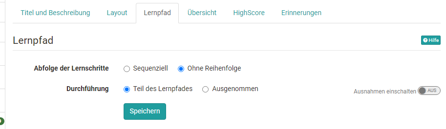
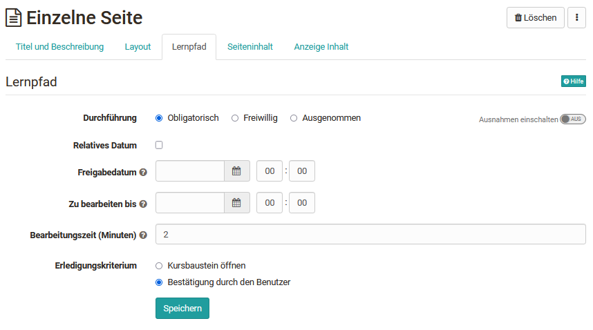
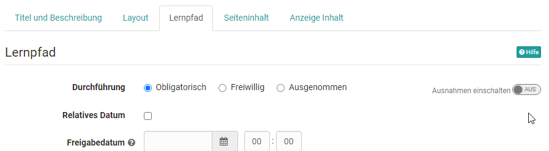
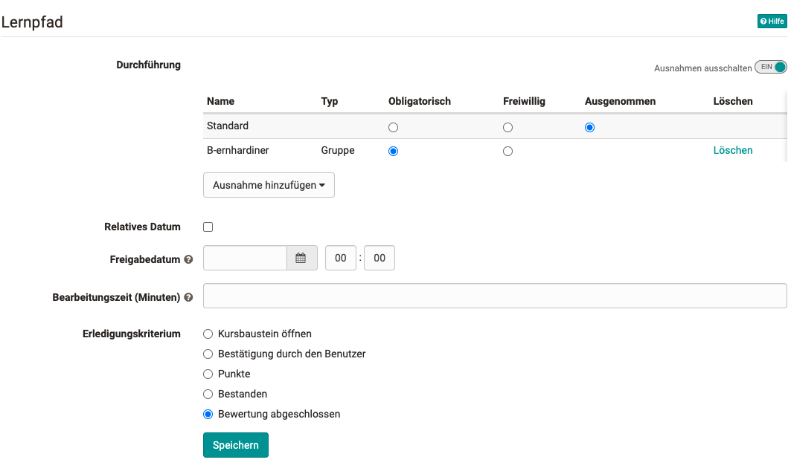
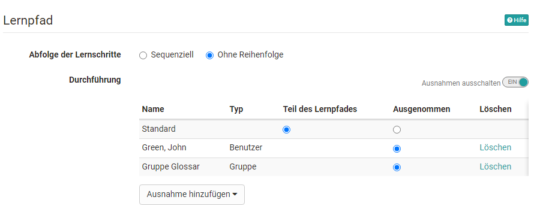

# Lernpfad Kurs - Kurseditor

## Abfolge der Lernschritte

### Sequenziell oder ohne Reihenfolge

Lernpfad Kurse können grundsätzlich so konfiguriert werden, dass sie sequenziell oder in beliebiger Reihenfolge von den Lernenden durchlaufen werden. Die Grundeinstellung wird auf dem obersten Kursbaustein, der beim Erstellen eines Kurses automatisch erstellt wird, eingestellt. Diese Einstellung gilt dann zunächst für den gesamten Kurs.

Beispiele und eine weitere Einführung findet man auch in unserem [Whitepaper für Lernpfadkurse (hier herunterladen)](assets/Whitepaper_Lernpfadkurse_final.pdf).

Sollen bestimmte Bereiche des Kurses eine andere Einstellung erhalten, kann
dies über das Hinzufügen und Konfigurieren des Kursbausteins "Struktur"
erfolgen. Die gewählte Einstellung gilt dann für alle diesem [Kursbaustein "Struktur"](../learningresources/Course_Element_Structure.de.md)
untergeordneten Kursbausteine. So kann beispielsweise ein Kurs standardmässig als sequenziell konfiguriert sein, aber ein bestimmter Bereich im Kurs kann permanent in beliebiger Reihenfolge aufgerufen werden.

## Der Tab Lernpfad

Lernpfad Kurse haben im Gegensatz zu herkömmlichen Kursen nicht die Tabs "Sichtbarkeit" und "Zugang", sondern den Tab "Lernpfad". Hier können folgende Dinge konfiguriert werden:

  * **Durchführung**
    *  **Obligatorisch**: Die Erledigung des Kursbausteins ist verbindlich und wird bei der prozentualen Auswertung des Lernfortschritts berücksichtigt.
    *  **Freiwillig**: Die Erledigung wird nicht bei der prozentualen Anzeige berücksichtigt.
    * **Ausgenommen**: Die Erledigung ist nicht Teil des Lernpfades und nur durch Ausnahmen steuerbar. Der Kursbaustein ist für die Teilnehmenden nicht sichtbar.
  *  **Freigabedatum**: Der Kursbaustein ist vor dem Freigabedatum zwar sichtbar, aber nicht zugänglich. Ab dem angegebenen Zeitpunkt ist das Öffnen und Arbeiten darin möglich. Wird keine Angabe gemacht, bleibt der Kursbaustein ab dem Freigabdatum dauerhaft verfügbar, sofern man Zutritt zum Kurs hat.
  *  **Zu bearbeiten bis**: Der Baustein kann bis zum angegeben Zeitpunkt geöffnet und bearbeitet werden. Wird keine Angabe gemacht, bleibt der Kursbaustein ab dem Freigabdatum dauerhaft verfügbar, sofern man Zutritt zum Kurs hat.
  *  **Bearbeitungszeit**: Hier kann eingetragen werden, wie lang der Ersteller die Bearbeitungszeit für den jeweiligen Baustein einschätzt. Die Bearbeitungszeit ist unabhängig davon, wieviel Zeit der/die Teilnehmer:in wirklich für den Baustein benötigt. Die geschätzte Zeitangabe kann jedoch für die Berechnung des Lernfortschritts verwendet werden.

Diese Einstellungen stehen für fast alle Kursbausteine zur Verfügung. Eine Ausnahme bildet jedoch der [Kursbaustein "Struktur"](../learningresources/Course_Element_Structure.de.md), der für die Bündelung von Kursbausteinen gedacht ist. Im Strukturbaustein kann die Abfolge der Lernschritte die für alle untergeordneten Kurselemente gilt, mit sequenziell oder spezifischer Reihenfolge definiert werden.

### Ausnahmen

:octicons-device-camera-video-24: **Video-Einführung**: [Ausnahmen im Lernpfad](<https://www.youtube.com/embed/MWWUmma2Cr0>){:target="_blank”}

Mit Einschalten der "Ausnahmen" kann differenzierter eingestellt werden wer den jeweiligen Kursbaustein sehen und bearbeiten darf und wer nicht. Es wird zunächst eine Grundeinstellung vorgenommen und anschliessend können Ausnahmen von dieser Grundeinstellung definiert werden. Auch mehrere Ausnahmen (Oder-Verknüpfung) sind möglich. So kann ein Kursbaustein z.B. grundsätzlich obligatorisch sein aber so konfiguriert werden, dass die Bearbeitung für bestimmte Personen oder Gruppen freiwillig ist oder der Kursbaustein gar nicht sichtbar ist (ausgenommen). Mithilfe dieser Ausnahmen können individuelle Lernpfade für verschiedene Lernende umgesetzt werden.

Die Ausnahmen können sich auf folgende Aspekte beziehen:

  * Gruppen
  * Organisationen
  * Benutzer  
  * Benutzer-Attribut
  * Kursbaustein bestanden: Der konfigurierte Kursbaustein wird in Abhängigkeit eines anderen bewertbaren Kursbausteins bereitgestellt. Zum Beispiel ist der Kursbaustein nicht sichtbar (= ausgenommen), wenn ein bestimmter Test nicht bestanden wurde.

 **Weitere Konfigurationsbeispiele für Ausnahmen:**

a) Der Kursbaustein ist grundsätzlich nicht sichtbar, ausser man ist Mitglied in der Gruppe "B-ernhardiner". Dann ist die Bearbeitung obligatorisch.  

b) Der Kursbaustein Struktur und alle untergeordneten Kursbausteine sind grundsätzlich sichtbar ausser für die Mitglieder der Gruppe Glossar oder die Einzelperson "John Green".

c) Der Kursbaustein ist grundsätzlich obligatorisch. Für diejenigen die eine bestimmte Checkliste bestanden haben ist die Bearbeitung freiwillig und für die Personen, die einen bestimmten Test erledigt haben ist der Kursbaustein gar nicht sichtbar (ausgenommen).

### Bearbeitungszeit

Die Bearbeitungszeit ist besonders relevant, wenn in den Kurseinstellungen für die Durchführung der Lernfortschritt anhand der Bearbeitungszeit ermittelt wird (siehe [Lernpfad Kurse](../learningresources/Creating_learning_path_courses.de.md) erstellen). In diesem Fall werden alle Zeitangaben der einzelnen Kursbausteine summiert und die Gesamtsumme als Basis für 100 % genommen.

Sofern eine Zeitangabe für einen Kursbaustein hinterlegt wurde, wird diese
Bearbeitungszeit den Teilnehmenden angezeigt solange der Kursbaustein
noch nicht erledigt wurde. Sind Kursbausteine mit einem Strukturbaustein
gebündelt wird den Teilnehmenden ferner aufaddiert die gesamte
Bearbeitungszeit der untergeordneten Kursbausteine angezeigt. Voraussetzung
ist, dass im Tab "Layout" des Strukturbausteins die Anzeige des Titels
aktiviert ist. Durch die Anzeige der Bearbeitungszeit haben die Lernenden
schnell einen Überblick über den Zeitaufwand eines Bereichs oder Kapitels des Kurses.

Die Zeitanzeige ist unabhängig davon, welche Art der Lernfortschrittsberechnung in den Kurs Einstellungen gewählt wurde. Also auch wenn der Fortschritt basierend auf der Anzahl der Kursbausteine erfolgt, wird die Bearbeitungszeit beim Strukturbaustein und bei den untergeordneten Kursbausteinen angezeigt.

### Erledigungskriterien

Bis auf den Kursbaustein "Struktur" bieten alle Kursbausteine die Möglichkeit, dass der Baustein als "erledigt" gilt, wenn er geöffnet wird oder wenn der User explizit die Bearbeitung bestätigt. Je nach Kursbaustein stehen auch noch weitere interessante Erledigungskriterien zur Verfügung:

 * **Kursbaustein öffnen**: alle Kursbausteine ausser Struktur

 * **Bestätigung durch den Benutzer**: alle Kursbausteine ausser Struktur  
  
 * **Punkte**: Erledigt, wenn der User eine gewisse Mindestpunktzahl erreicht hat. Verfügbar für die Kursbausteine Aufgabe, SCORM, Bewertung, Gruppenaufgabe, Checkliste, Test, LTI,
Portfolioaufgabe  
  
 * **Bestanden**: Erledigt, wenn die für den Kurbaustein definierten Bestehenskriterien erfüllt sind. Verfügbar für die Kursbausteine Aufgabe, SCORM, Bewertung, Gruppenaufgabe, Checkliste, Test, LTI, Portfolioaufgabe  
  
 * **Durchführung erledigt:** Erledigt, wenn alle Schritte durchlaufen wurden. In den Zwischenstadien wird beim Fortschritt eine teilweise Bearbeitung prozentual berücksichtigt. Verfügbar für die Kursbausteine Aufgabe, Gruppenaufgabe, Portfolioaufgabe, Video-Aufgabe

 * **Test beendet**: Nur für Kursbaustein Test  

 * **Umfrage teilgenommen:** Erledigt, wenn der User die Umfrage abgegeben hat. Nur für den Kursbaustein Umfrage

 * **Einschreibung erfolgt:** Erledigt, wenn sich der User in mindestens eine Gruppe eingeschrieben hat. Nur für den Kursbaustein Einschreibung

 * **Formular ausgefüllt**: Nur für den Kursbaustein Formular

 * **Challenges abgeschlossen**: Nur für den Kursbaustein Übung

 * **Bewertung abgeschlossen**: Nur für den Kursbaustein Checkliste

 * **Alle Checkboxen als erledigt markiert**: Nur für den Kursbaustein Checkliste

 * **Video bis zum Ende geschaut (95%)**: Nur für den Kursbaustein Video

 * **E-Mail versendet**: Nur für den Kursbaustein E-Mail

#### Spezifische Standardwerte für Erledigungskriterien

Für jeden Baustein wird bei der Erstellung ein spezifisches Erledigungskriterium gesetzt, welches den Standard-Anwendungsfall des Bausteins unterstützt.

Baustein | Default-Erledigungskriterium
---------|----------
Adobe Connect | Kursbaustein öffnen
Aufgabe und Gruppenaufgabe | Durchführung erledigt
Bewertung | Bewertung abgeschlossen
BigBlueButton | Kursbaustein öffnen
Blog | Bestätigung durch den Benutzer
Card2Brain | Bestätigung durch den Benutzer
Checkliste | Bestanden
ContentPackage | Bestätigung durch den Benutzer
Dateidiskussion | Bestätigung durch den Benutzer
Dokument | Bestätigung durch den Benutzer
Edubase | Bestätigung durch den Benutzer
Edusharing | Bestätigung durch den Benutzer
Einschreibung | Einschreibung erfolgt
Einzelne Seite | Kursbaustein öffnen
E-Mail | Kursbaustein öffnen
Externe Seite | Kursbaustein öffnen
Formular | Formular ausgefüllt
Forum | Kursbaustein öffnen
GoToMeeting | Kursbaustein öffnen
Kalender | Kursbaustein öffnen
Linkliste | Kursbaustein öffnen
Livestream | Kursbaustein öffnen
LTI | Bestätigung durch den Benutzer
Mitteilungen | Kursbaustein öffnen
MS Teams | Kursbaustein öffnen
Ordner | Kursbaustein öffnen
Opencast | Kursbaustein öffnen
OpenMeeting | Kursbaustein öffnen
Podcast | Bestätigung durch den Benutzer
Portfolio-Aufgabe | Durchführung erledigt
Scorm | Bestätigung durch den Benutzer
Selbsttest | Bestätigung durch den Benutzer
Struktur | Kursbaustein öffnen
Teilnehmerliste | Kursbaustein öffnen
Teilnehmer-Ordner | Bestätigung durch den Benutzer
Terminplanung | Bestätigung durch den Benutzer
Test | Test beendet
Themenvergabe | Bestätigung durch den Benutzer
Übung | Challenges abgeschlossen
Umfrage | Umfrage beendet
Video | Video bis zum Ende angesehen (95%)
Video-Aufgabe | Durchführung erledigt
Vitero | Kursbaustein öffnen
Wiki | Kursbaustein öffnen
