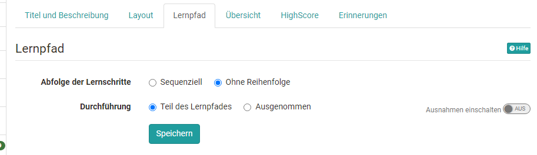
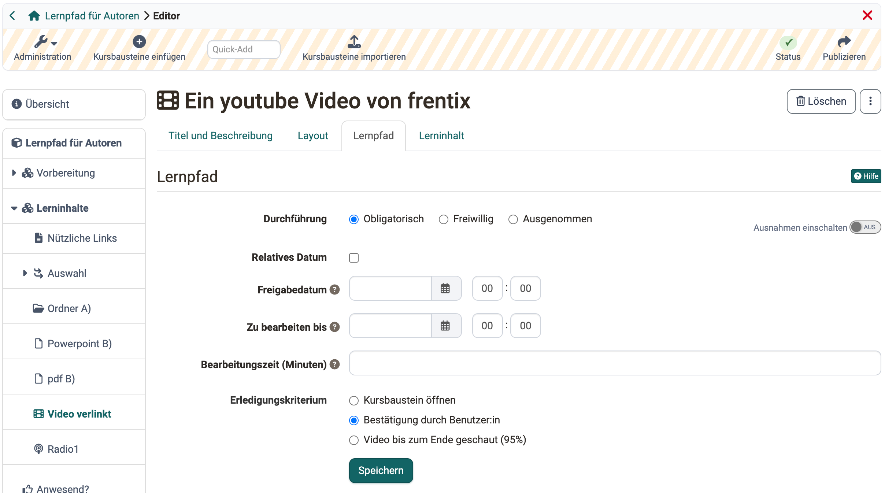
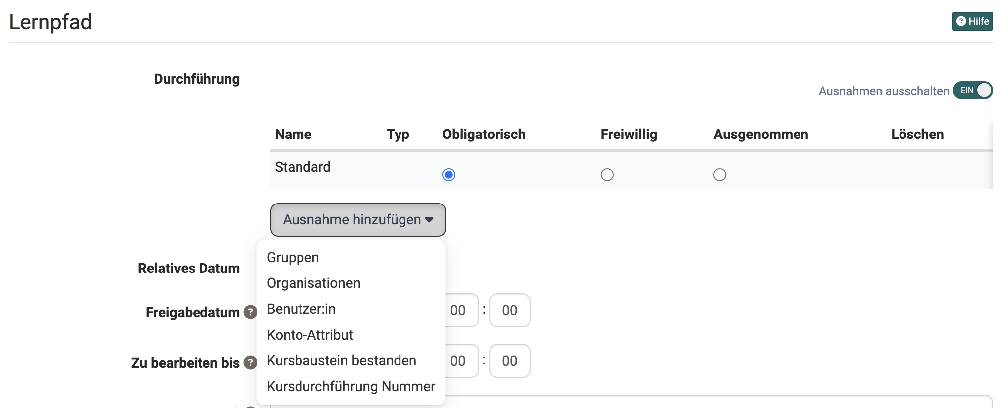
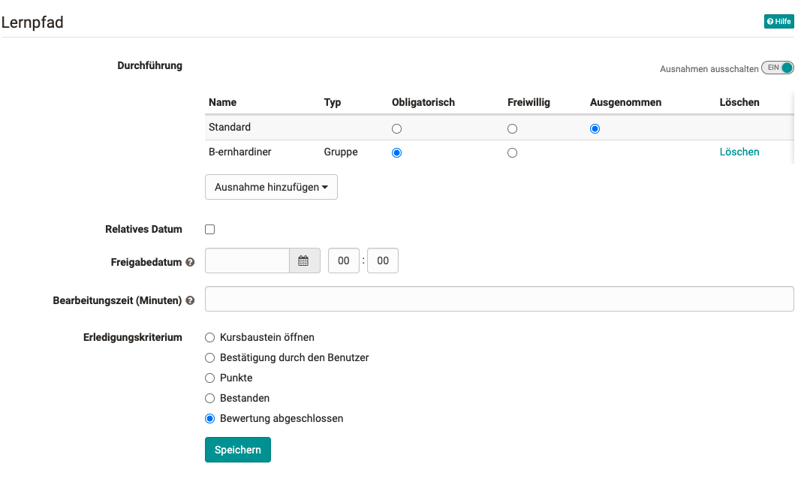
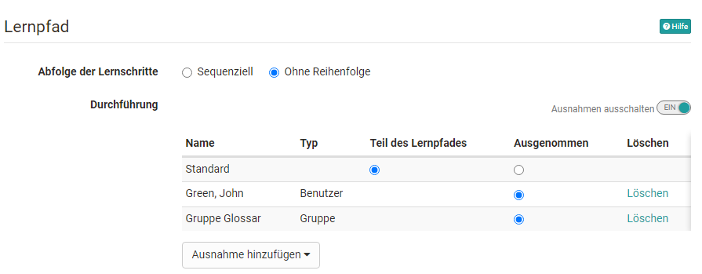
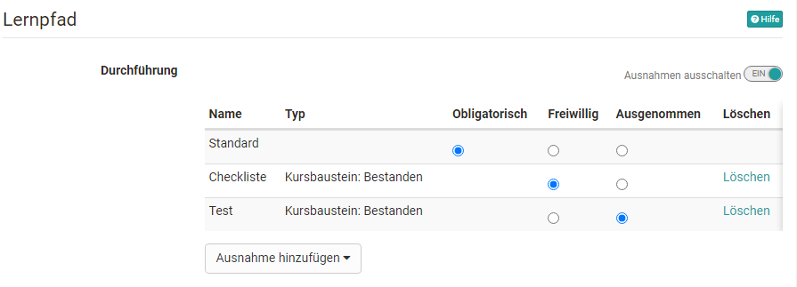

# Lernpfadkurs - Kurseditor {: #course_editor}

## Abfolge der Lernschritte {: #learning_steps_order}

### Sequenziell oder ohne Reihenfolge {: #sequential_or_not}

Lernpfadkurse lassen sich so konfigurieren, dass die Lernenden die Kursbausteine sequenziell oder in beliebiger Reihenfolge durchlaufen. Die Grundeinstellung "Abfolge der Lernschritte" nehmen Sie auf dem obersten Kursbaustein vor, den OpenOlat beim Erstellen eines Kurses automatisch anlegt. Sie gilt zunächst für den gesamten Kurs.

Beispiele und eine weitere Einführung finden Sie im [Whitepaper Lernpfadkurse (PDF)](assets/Whitepaper_Lernpfadkurse_final.pdf).

{ class="shadow lightbox" }

Sollen bestimmte Bereiche des Kurses eine andere Einstellung erhalten, fügen Sie einen [Kursbaustein "Struktur"](../learningresources/Course_Element_Structure.de.md) hinzu und konfigurieren dort die Abfolge der Lernschritte. Die Einstellung gilt für alle untergeordneten Kursbausteine. So kann ein Kurs standardmässig sequenziell sein, während die Lernenden einen bestimmten Bereich in beliebiger Reihenfolge aufrufen.

## Der Tab Lernpfad {: #tab_learning_path}

Lernpfadkurse haben im Kurseditor anstelle der Tabs "Sichtbarkeit" und "Zugang" den Tab "Lernpfad". Hier konfigurieren Sie:

{ class="shadow lightbox" }

* **Durchführung**
    * **Obligatorisch**: Die Erledigung des Kursbausteins ist verbindlich und zählt bei der prozentualen Berechnung des Lernfortschritts.
    * **Freiwillig**: Die Erledigung zählt bei der prozentualen Anzeige nicht.
    * **Ausgenommen**: Der Kursbaustein ist nicht Teil des Lernpfades und nur über Ausnahmen steuerbar. Er ist für die Teilnehmenden nicht sichtbar.
* **Freigabedatum**: Vor dem Freigabedatum ist der Kursbaustein sichtbar, aber nicht zugänglich. Ab dem angegebenen Zeitpunkt können die Teilnehmenden ihn öffnen und bearbeiten. Ohne Angabe ist der Kursbaustein dauerhaft verfügbar, sofern die Person Zugang zum Kurs hat. Ein zeitlich begrenzter Zugang mit der Option "Relatives Datum" ist nur auf Ebene der einzelnen Kursbausteine möglich, nicht auf Strukturbausteinen und nicht auf dem obersten Kursbaustein.
* **Zu bearbeiten bis**: Die Teilnehmenden können den Kursbaustein bis zum angegebenen Zeitpunkt öffnen und bearbeiten. Läuft die Frist ab, während der Kursbaustein geöffnet ist, bleibt er weiter bearbeitbar; der Zugriff endet nicht automatisch.
* **Bearbeitungszeit (Minuten)**: Geplanter oder geschätzter Aufwand für die Bearbeitung des Kursbausteins. Die Angabe ist unabhängig davon, wie viel Zeit die Teilnehmenden tatsächlich benötigen. Sie kann für die Berechnung des Lernfortschritts herangezogen werden, siehe [Bearbeitungszeit](#learning_time).
* **Erledigungskriterium**: legt fest, wann der Kursbaustein als erledigt gilt, siehe [Erledigungskriterien](#completion_criterion).

Diese Einstellungen stehen für fast alle Kursbausteine zur Verfügung. Eine Ausnahme ist der [Kursbaustein "Struktur"](../learningresources/Course_Element_Structure.de.md), der Kursbausteine bündelt. Im Strukturbaustein legen Sie die Abfolge der Lernschritte für alle untergeordneten Kursbausteine fest: "Sequenziell" oder "Ohne Reihenfolge".

### Ausnahmen {: #exceptions}

:octicons-device-camera-video-24: **Video-Einführung**: [Ausnahmen im Lernpfad](<https://www.youtube.com/embed/MWWUmma2Cr0>){:target="_blank"}

Mit "Ausnahmen einschalten" legen Sie differenziert fest, wer den jeweiligen Kursbaustein sehen und bearbeiten darf und wer nicht. Zunächst nehmen Sie eine Grundeinstellung vor, anschliessend definieren Sie Ausnahmen von dieser Grundeinstellung. Mehrere Ausnahmen sind möglich (Oder-Verknüpfung). So kann ein Kursbaustein grundsätzlich obligatorisch sein, aber für bestimmte Personen oder Gruppen freiwillig oder gar nicht sichtbar (ausgenommen). Mit Ausnahmen setzen Sie individuelle Lernpfade für verschiedene Lernende um.

{ class="shadow lightbox" }

Die Ausnahmen können sich auf folgende Aspekte beziehen:

* Gruppen
* Organisationen
* Benutzer:in
* Konto-Attribut: Der Wert kann den Platzhalter `*` enthalten, zum Beispiel `*@example.org` für alle Konten mit dieser E-Mail-Domain. [:octicons-tag-16:{ title="ab Release 18.1.1 (OO-7337)" }](https://track.frentix.com/issue/OO-7337)
* Kursbaustein bestanden: Der konfigurierte Kursbaustein wird in Abhängigkeit eines anderen bewertbaren Kursbausteins bereitgestellt. Zum Beispiel ist der Kursbaustein nicht sichtbar (ausgenommen), wenn ein bestimmter Test nicht bestanden wurde.
* Kursdurchführung Nummer: Wird der Kurs mehrfach besucht, zum Beispiel bei einer Rezertifizierung, kann der konfigurierte Kursbaustein nur in einer oder einigen der Durchführungen angezeigt werden. So erhalten die Teilnehmenden für eine Rezertifizierung oder einen Wiederholungskurs andere Kursbausteine.

**Weitere Konfigurationsbeispiele für Ausnahmen:**

a) Der Kursbaustein ist grundsätzlich nicht sichtbar, ausser man ist Mitglied der Gruppe "B-ernhardiner". Dann ist die Bearbeitung obligatorisch.

{ class="shadow lightbox" }

b) Der Kursbaustein "Struktur" und alle untergeordneten Kursbausteine sind grundsätzlich sichtbar, ausser für die Mitglieder der Gruppe "Glossar" und die Einzelperson "John Green".

{ class="shadow lightbox" }

c) Der Kursbaustein ist grundsätzlich obligatorisch. Für Personen, die eine bestimmte Checkliste bestanden haben, ist die Bearbeitung freiwillig. Für Personen, die einen bestimmten Test bestanden haben, ist der Kursbaustein nicht sichtbar (ausgenommen).

{ class="shadow lightbox" }

### Bearbeitungszeit {: #learning_time}

Die Bearbeitungszeit ist besonders relevant, wenn der Lernfortschritt unter `Kurs > Administration > Einstellungen`, Tab "Durchführung", anhand der Bearbeitungszeit berechnet wird (siehe [Lernpfadkurse erstellen](../learningresources/Creating_learning_path_courses.de.md)). In diesem Fall summiert OpenOlat die Zeitangaben der obligatorischen Kursbausteine; die Gesamtsumme entspricht 100 %.

Ist für einen Kursbaustein eine Zeitangabe hinterlegt, sehen die Teilnehmenden diese Bearbeitungszeit, solange der Kursbaustein noch nicht erledigt ist. Sind Kursbausteine mit einem Strukturbaustein gebündelt, sehen die Teilnehmenden zusätzlich die aufaddierte Bearbeitungszeit aller untergeordneten Kursbausteine. Voraussetzung ist, dass im Tab "Layout" des Strukturbausteins die Anzeige des Titels aktiviert ist. So erhalten die Lernenden schnell einen Überblick über den Zeitaufwand eines Bereichs oder Kapitels.

Die Zeitanzeige ist unabhängig davon, welche Art der Lernfortschrittsberechnung in den Kurseinstellungen gewählt ist. Auch wenn der Fortschritt anhand der Anzahl der Kursbausteine berechnet wird, zeigt OpenOlat die Bearbeitungszeit beim Strukturbaustein und bei den untergeordneten Kursbausteinen an.

### Erledigungskriterien {: #completion_criterion}

Bis auf den Kursbaustein "Struktur" gilt jeder Kursbaustein als erledigt, wenn die Teilnehmenden ihn öffnen oder die Bearbeitung explizit bestätigen. Je nach Kursbaustein stehen weitere Erledigungskriterien zur Verfügung:

* **Kursbaustein öffnen**: alle Kursbausteine ausser Struktur
* **Bestätigung durch Benutzer:in**: alle Kursbausteine ausser Struktur
* **Punkte**: Erledigt, wenn die Teilnehmenden das Punkteminimum erreicht haben. Verfügbar für die Kursbausteine Aufgabe, SCORM, Bewertung, Gruppenaufgabe, Checkliste, Test, LTI, Portfolioaufgabe
* **Bestanden**: Erledigt, wenn die für den Kursbaustein definierten Bestehenskriterien erfüllt sind. Verfügbar für die Kursbausteine Aufgabe, SCORM, Bewertung, Gruppenaufgabe, Checkliste, Test, LTI, Portfolioaufgabe
* **Durchführung erledigt**: Erledigt, wenn alle Schritte durchlaufen sind. In den Zwischenstadien zählt eine teilweise Bearbeitung prozentual zum Fortschritt. Verfügbar für die Kursbausteine Aufgabe, Gruppenaufgabe, Portfolioaufgabe, Videoaufgabe
* **Test beendet**: Nur für den Kursbaustein Test
* **Umfrage teilgenommen**: Erledigt, wenn die Teilnehmenden die Umfrage abgegeben haben. Nur für den Kursbaustein Umfrage
* **Einschreibung erfolgt**: Erledigt, wenn sich die Teilnehmenden in mindestens eine Gruppe eingeschrieben haben. Nur für den Kursbaustein Einschreibung
* **Formular ausgefüllt**: Nur für den Kursbaustein Formular
* **Challenges abgeschlossen**: Nur für den Kursbaustein Übung
* **Bewertung abgeschlossen**: Nur für die Kursbausteine Bewertung und Checkliste
* **Alle Checkboxen als erledigt markiert**: Nur für den Kursbaustein Checkliste
* **Video bis zum Ende geschaut (95%)**: Nur für den Kursbaustein Video
* **E-Mail versendet**: Nur für den Kursbaustein E-Mail
* **Kursbausteine sind ausgewählt und erledigt**: Nur für den Kursbaustein [Auswahl](../learningresources/Course_Element_Selection.de.md) [:octicons-tag-16:{ title="ab Release 19.1 (OO-7276)" }](https://track.frentix.com/issue/OO-7276)

#### Standardwerte für Erledigungskriterien {: #completion_criterion_defaults}

Beim Einfügen eines Kursbausteins setzt OpenOlat ein Erledigungskriterium, das den typischen Anwendungsfall des Kursbausteins unterstützt.

Kursbaustein | Standard-Erledigungskriterium
---------|----------
Adobe Connect | Kursbaustein öffnen
Aufgabe und Gruppenaufgabe | Durchführung erledigt
Auswahl | Kursbausteine sind ausgewählt und erledigt
Bewertung | Bewertung abgeschlossen
BigBlueButton | Kursbaustein öffnen
Blog | Bestätigung durch Benutzer:in
card2brain Lernkarten | Bestätigung durch Benutzer:in
Checkliste | Bestanden
CP-Lerninhalt | Bestätigung durch Benutzer:in
Dateidiskussion | Bestätigung durch Benutzer:in
Dokument | Bestätigung durch Benutzer:in
Edubase | Bestätigung durch Benutzer:in
edu-sharing | Bestätigung durch Benutzer:in
Einschreibung | Einschreibung erfolgt
E-Mail | Kursbaustein öffnen
Externe Seite | Kursbaustein öffnen
Formular | Formular ausgefüllt
Forum | Kursbaustein öffnen
GoToMeeting | Kursbaustein öffnen
HTML-Seite | Kursbaustein öffnen
JupyterHub | Kursbaustein öffnen
Kalender | Kursbaustein öffnen
Linkliste | Kursbaustein öffnen
Livestream | Kursbaustein öffnen
LTI-Seite | Bestätigung durch Benutzer:in
MediaSite | Bestätigung durch Benutzer:in
Microsoft Teams | Kursbaustein öffnen
Mitteilungen | Kursbaustein öffnen
Opencast | Kursbaustein öffnen
OpenMeetings | Kursbaustein öffnen
Ordner | Kursbaustein öffnen
Podcast | Bestätigung durch Benutzer:in
Portfolioaufgabe | Durchführung erledigt
SCORM 1.2 | Bestätigung durch Benutzer:in
Seite | Kursbaustein öffnen
Selbsttest | Bestätigung durch Benutzer:in
Teilnehmer:innen Liste | Kursbaustein öffnen
Teilnehmer:innen Ordner | Bestätigung durch Benutzer:in
Terminplanung | Bestätigung durch Benutzer:in
Terminvergabe | Bestätigung durch Benutzer:in
Test | Test beendet
Themenbörse | Bestätigung durch Benutzer:in
Themenvergabe | Bestätigung durch Benutzer:in
Übung | Challenges abgeschlossen
Umfrage | Umfrage teilgenommen
Video | Video bis zum Ende geschaut (95%)
Videoaufgabe | Durchführung erledigt
Vitero | Kursbaustein öffnen
Wiki | Kursbaustein öffnen
Zoom | Kursbaustein öffnen

## Weiterführende Informationen {: #further_information}

**Auf dieser Seite erwähnt** 
[Whitepaper Lernpfadkurse (PDF) >](assets/Whitepaper_Lernpfadkurse_final.pdf) 
[Kursbaustein "Struktur" >](../learningresources/Course_Element_Structure.de.md) 
[Lernpfadkurse erstellen >](../learningresources/Creating_learning_path_courses.de.md) 
[Kursbaustein "Auswahl" >](../learningresources/Course_Element_Selection.de.md)

**Weiterführend** 
[Lernpfadkurs - Überblick >](../learningresources/Learning_path_course.de.md) 
[Lernpfadkurs - Teilnehmeransicht >](../learningresources/Learning_path_course_Participant_view.de.md) 
[Kurseinstellungen >](../learningresources/Course_Settings.de.md)

**youtube** 
[Ausnahmen im Lernpfad](<https://www.youtube.com/embed/MWWUmma2Cr0>)

[Zum Seitenanfang ^](#course_editor)
