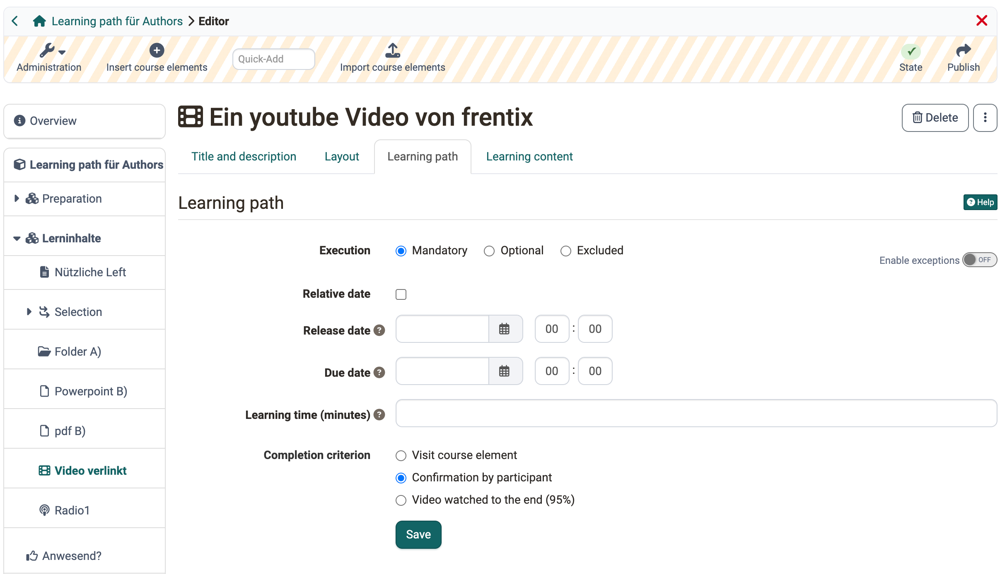
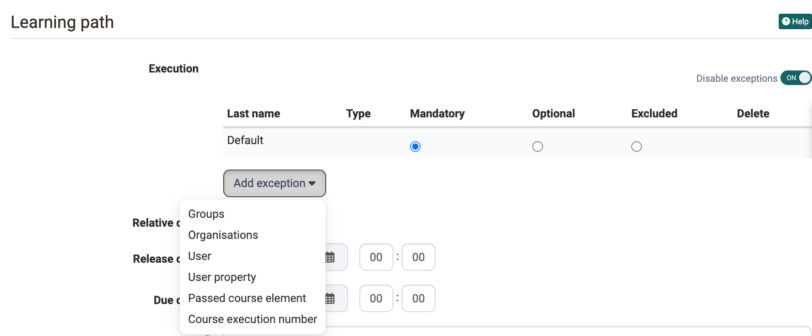

# Learning path course - Course editor {: #course_editor}

## Sequence of learning steps {: #learning_steps_order}

### Sequential or no sequence {: #sequential_or_not}

Learning path courses can be configured so that learners go through the course elements sequentially or in any order. You make the basic setting "Sequence of steps" on the top course element, which OpenOlat creates automatically when a course is created. It initially applies to the entire course.

Examples and a further introduction can be found in our [Whitepaper on learning path courses (PDF, German)](assets/Whitepaper_Lernpfadkurse_final.pdf).

{ class="shadow lightbox" }

If certain areas of the course are to have a different setting, add a [course element "Structure"](../learningresources/Course_Element_Structure.md) and configure the sequence of steps there. The setting applies to all subordinate course elements. For example, a course can be sequential by default while learners access a certain area in any order.

## Tab "Learning path" {: #tab_learning_path}

In the course editor, learning path courses have the tab "Learning path" instead of the tabs "Visibility" and "Access". Here you configure:

{ class="shadow lightbox" }

* **Execution**
    * **Mandatory**: The completion of the course element is binding and counts in the percentage calculation of the learning progress.
    * **Optional**: The completion does not count in the percentage display.
    * **Excluded**: The course element is not part of the learning path and can only be controlled via exceptions. It is not visible to the participants.
* **Release date**: Before the release date the course element is visible but not accessible. From the specified date participants can open and work on it. Without an entry the course element is permanently available, provided the person has access to the course. Time-limited access with the option "Relative dates" is only possible at the level of individual course elements, not on structure elements and not on the top course element.
* **Due date**: Participants can open and work on the course element up to the specified date. If the deadline expires while the course element is open, it remains editable; access does not end automatically.
* **Learning time (minutes)**: Planned or estimated effort for working on the course element. The value is independent of how much time participants actually need. It can be used for calculating the learning progress, see [Learning time](#learning_time).
* **Completion criterion**: defines when the course element counts as done, see [Completion criteria](#completion_criterion).

These settings are available for almost all course elements. An exception is the [course element "Structure"](../learningresources/Course_Element_Structure.md), which bundles course elements. In the structure element you define the sequence of steps for all subordinate course elements: "Sequential" or "No sequence".

### Exceptions {: #exceptions}

:octicons-device-camera-video-24: **Video Introduction (German)**: [Ausnahmen im Lernpfad](<https://www.youtube.com/embed/MWWUmma2Cr0>){:target="_blank"}

With "Enable exceptions" you define in a differentiated way who may see and work on the respective course element and who may not. First you make a basic setting, then you define exceptions to this basic setting. Several exceptions are possible (or-link). For example, a course element can be mandatory in general but optional or not visible at all (excluded) for certain persons or groups. With exceptions you implement individual learning paths for different learners.

{ class="shadow lightbox" }

The exceptions can refer to the following aspects:

* Groups
* Organisations
* Users
* User property: The value can contain the wildcard `*`, for example `*@example.org` for all accounts with this e-mail domain. [:octicons-tag-16:{ title="from Release 18.1.1 (OO-7337)" }](https://track.frentix.com/issue/OO-7337)
* Course element passed: The configured course element is provided depending on another assessable course element. For example, the course element is not visible (excluded) if a certain test has not been passed.
* Course execution number: If the course is attended several times, for example for a recertification, the configured course element can be displayed in only one or some of the executions. This way participants get different course elements for a recertification or a repeat course.

**Further configuration examples for exceptions:**

a) The course element is generally not visible unless you are a member of the group "B-ernhardiner". Then the processing is mandatory.

{ class="shadow lightbox" }

b) The course element "Structure" and all subordinate course elements are generally visible, except for the members of the group "Glossar" and the individual "John Green".

{ class="shadow lightbox" }

c) The course element is mandatory in general. For persons who have passed a certain check list, the processing is optional. For persons who have passed a certain test, the course element is not visible (excluded).

{ class="shadow lightbox" }

### Learning time {: #learning_time}

The learning time is particularly relevant if the learning progress is calculated according to the learning time under `Course > Administration > Settings`, tab "Execution" (see [Creating learning path courses](../learningresources/Creating_learning_path_courses.md)). In this case OpenOlat sums up the time entries of the mandatory course elements; the total corresponds to 100 %.

If a time is entered for a course element, participants see this learning time as long as the course element is not yet done. If course elements are bundled with a structure element, participants additionally see the added-up learning time of all subordinate course elements. The prerequisite is that the display of the title is activated in the tab "Layout" of the structure element. This way learners quickly get an overview of the time required for a section or chapter.

The time display is independent of the type of learning progress calculation selected in the course settings. Even if the progress is calculated according to the number of course elements, OpenOlat displays the learning time for the structure element and for the subordinate course elements.

### Completion criteria {: #completion_criterion}

Except for the course element "Structure", every course element counts as done when participants open it or explicitly confirm the processing. Depending on the course element, further completion criteria are available:

* **Visit course element**: all course elements except Structure
* **Confirmation by participant**: all course elements except Structure
* **Score**: Done when participants have reached the minimal score. Available for the course elements Task, SCORM, Assessment, Grouptask, Check list, Test, LTI, Portfolio task
* **Passed**: Done when the pass criteria defined for the course element are met. Available for the course elements Task, SCORM, Assessment, Grouptask, Check list, Test, LTI, Portfolio task
* **Execution done**: Done when all steps have been completed. In the intermediate stages, partial completion counts as a percentage of the progress. Available for the course elements Task, Grouptask, Portfolio task, Video task
* **Test finished**: Only for the course element Test
* **Survey finished**: Done when participants have submitted the survey. Only for the course element Survey
* **Enrollment done**: Done when participants have enrolled in at least one group. Only for the course element Enrolment
* **Form filled in**: Only for the course element Form
* **Challenges completed**: Only for the course element Practice
* **Assessment finalized**: Only for the course elements Assessment and Check list
* **All checkboxes marked as completed**: Only for the course element Check list
* **Video watched to the end (95%)**: Only for the course element Video
* **E-mail sent**: Only for the course element E-mail
* **Course elements are selected and done**: Only for the course element [Selection](../learningresources/Course_Element_Selection.md) [:octicons-tag-16:{ title="from Release 19.1 (OO-7276)" }](https://track.frentix.com/issue/OO-7276)

#### Default values for completion criteria {: #completion_criterion_defaults}

When a course element is inserted, OpenOlat sets a completion criterion that supports the typical use case of the course element.

Course element | Default completion criterion
---------|----------
Adobe Connect | Visit course element
Task and Grouptask | Execution done
Selection | Course elements are selected and done
Assessment | Assessment finalized
BigBlueButton | Visit course element
Blog | Confirmation by participant
card2brain flashcards | Confirmation by participant
Check list | Passed
CP learning content | Confirmation by participant
File dialog | Confirmation by participant
Document | Confirmation by participant
Edubase | Confirmation by participant
edu-sharing | Confirmation by participant
Enrolment | Enrollment done
E-mail | Visit course element
External page | Visit course element
Form | Form filled in
Forum | Visit course element
GoToMeeting | Visit course element
HTML page | Visit course element
JupyterHub | Visit course element
Calendar | Visit course element
Link list | Visit course element
Livestream | Visit course element
LTI page | Confirmation by participant
MediaSite | Confirmation by participant
Microsoft Teams | Visit course element
Notifications | Visit course element
Opencast | Visit course element
OpenMeetings | Visit course element
Folder | Visit course element
Podcast | Confirmation by participant
Portfolio task | Execution done
SCORM 1.2 | Confirmation by participant
Page | Visit course element
Self-test | Confirmation by participant
Participant list | Visit course element
Participant folder | Confirmation by participant
Appointment scheduling | Confirmation by participant
Assignment of dates | Confirmation by participant
Test | Test finished
Topic broker | Confirmation by participant
Topic assignment | Confirmation by participant
Practice | Challenges completed
Survey | Survey finished
Video | Video watched to the end (95%)
Video task | Execution done
vitero | Visit course element
Wiki | Visit course element
Zoom | Visit course element

## Further information {: #further_information}

**Mentioned on this page** 
[Whitepaper on learning path courses (PDF, German) >](assets/Whitepaper_Lernpfadkurse_final.pdf) 
[Course Element "Structure" >](../learningresources/Course_Element_Structure.md) 
[Creating learning path courses >](../learningresources/Creating_learning_path_courses.md) 
[Course Element "Selection" >](../learningresources/Course_Element_Selection.md)

**Further reading** 
[Learning path course - Overview >](../learningresources/Learning_path_course.md) 
[Learning path course - Participant view >](../learningresources/Learning_path_course_Participant_view.md) 
[Course Settings >](../learningresources/Course_Settings.md)

**youtube** 
[Ausnahmen im Lernpfad](<https://www.youtube.com/embed/MWWUmma2Cr0>)

[To the top of the page ^](#course_editor)
