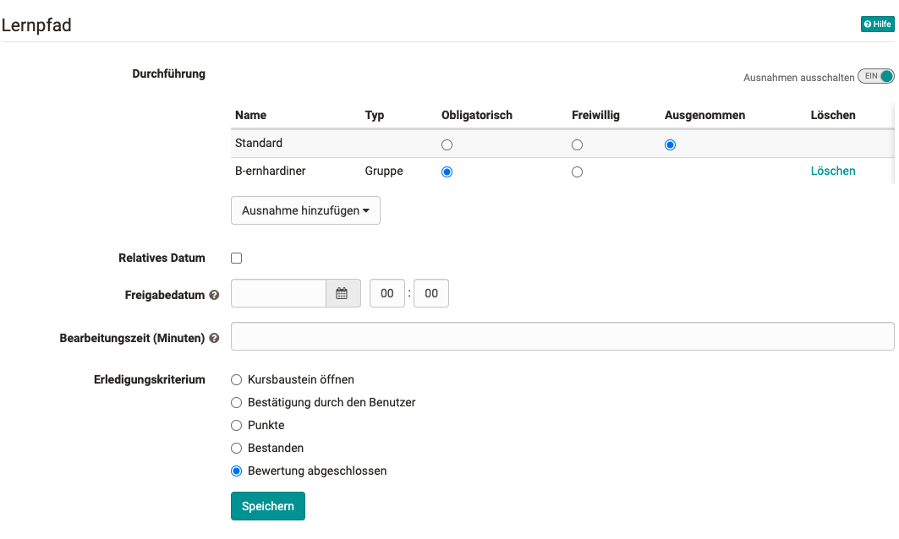
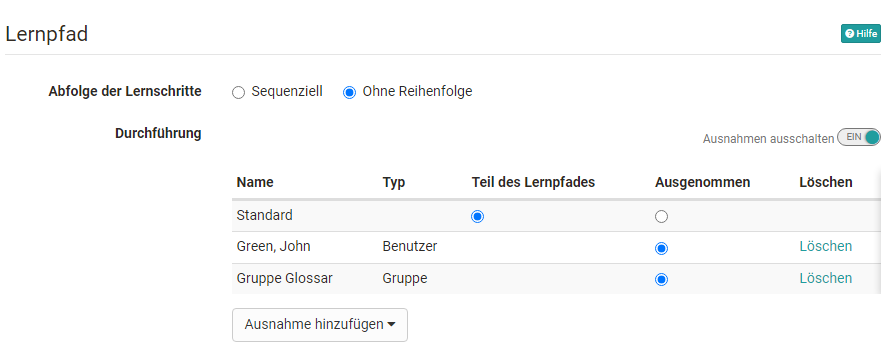
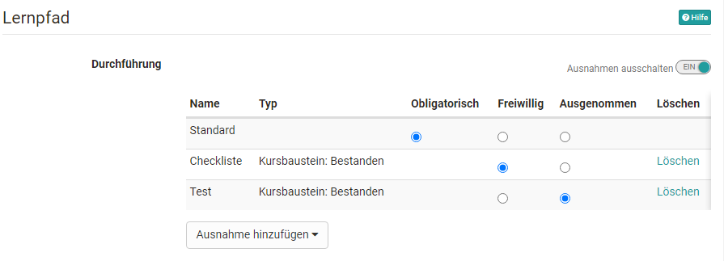

# Learning path cours - Course editor

## Sequence of learning steps

### Sequential or no sequence

Learning path courses can be configured to be followed sequentially or in any order by learners. The basic setting is set on the top course element, which is automatically created when a course is created. This setting then initially applies to the entire course.

If certain areas of the course are to be given a different setting, this can be done by adding and configuring the course element "Structure". The selected setting will then apply to all course elements subordinate to this [course element "Structure"](../learningresources/Course_Element_Structure.md). For example, a course can be configured as sequential by default, but a certain area in the course can be permanently accessed in any order.

## Tab "Learning path"

Learning paths, unlike conventional courses, do not have the tabs "Visibility" and "Access", but the tab "Learning path". The following things can be configured here:

  *  **Mandatory:** The completion of the course element is binding and will be considered in the percentage evaluation.
  *  **Optional:** Completion will not be taken into account when displaying percentages.
  * **Ausgenommen**: Die Erledigung ist nicht Teil des Lernpfades und nur durch Ausnahmen steuerbar. Der Kursbaustein ist für die Teilnehmenden nicht sichtbar.
  *  **Release date:** (Date as of which the element can be edited by the user.) Regelt den Zugang zum jeweiligen Kursbausein. Der Baustein ist vor dem Freigabedatum zwar sichtbar aber nicht zugänglich. Auch ein relatives Freigabedatum ist möglich.
  *  **Due date:** If a course element is mandatory you can also enter a date by which the element must be completed.
  *  **Learning time (minutes):** Here you can enter how long the creator estimates the processing time for a given element. It does not depend on how much time the user really needs for that element.

These settings are available for almost all course elements. An exception is the [course element "Structure"](../learningresources/Course_Element_Structure.md) that is meant for bundling course elements. In the structure element you can only define a sequence of learning steps that applies to all subordinate course elements, either sequentially or in specific order.

### Exceptions

Switching on the "Exceptions" allows you to differentiate who is allowed to see and edit the respective course element and who is not. First a basic setting is made and then exceptions to this basic setting can be defined. It is also possible to define several exceptions (or-link). For example, a course element can be basically obligatory but configured in such a way that editing is voluntary for certain persons or groups or the course element is not visible at all (excluded). With the help of these exceptions individual learning paths for different learners can be implemented.

The exceptions can refer to the following aspects:

  * Groups
  * Organizations
  * User
  * User attribute
  * Course element passed: The configured course element is provided depending on another assessable course element. For example, the course element is not visible (= excluded) if a certain test has not been passed.

**Further configuration examples for exceptions:**

a) The course element is basically not visible unless you are a member of the group "B-ernhardiner. Then the processing is obligatory.

b) The course element structure and all subordinated course elements are basically visible except for the members of the group Glossary or the individual "John Green".

c) The course element is basically mandatory. For those who have passed a certain checklist the course element is optional and for those who have passed a certain test the course element is not visible at all (exceptions).

### Learning time

The learning time is particularly relevant if the learning progress is determined on the basis of the learning time in the course settings for the execution (see [Create learning path courses](../learningresources/Creating_learning_path_courses.md)). In this case, all time entries of the individual course elements are summed up and the total sum is taken as the basis for 100%.

If a time has been entered for a course element, this learning time will also be displayed to the participants as long as they have not yet completed the course element. If a course element is bundled with a structure element, the total learning time of the subordinate course elements will be displayed to the participants. The prerequisite is that the display of the title is activated in the tab "Layout" of the structure element. By displaying the learning time learners can quickly get an overview of the time spent on a section or chapter of the course.

The time display is independent of the type of learning progress calculation selected in the course settings. So even if progress is based on the number of course elements, the learning time will be displayed for the structure element and for the subordinate course elements.

### Completion criterion

Most course elements offer the possibility that the element is considered
"done" when it is opened or when the user explicitly confirms the processing. Depending on your course element there are also other criteria for completion.

 * **Visit course element**: all course elements except structure  

 * **Confirmation by the participant**: all course elements except structure  
  
 * **Score:** Done when the user has reached a certain minimum score. Available for the course elements Task, SCORM, Assessment, Grouptask, Check list, Test, LTI, portfolio task  
  
 * **Passed:** Completed when the pass criteria defined for the course component are met. Available for the course elements Task, SCORM, Assessment, Grouptask, Check list, Test, LTI, portfolio task

 * **Execution done:** Completely done when all steps of the task have been completed. In the intermediate stages, partial completion is taken into account as a percentage of progress. Available for the course elements Task, Grouptask, portfolio task, video task
  
 * **Test finished**: Only for the course element Test
  
 * **Survey finished:** Done when the user has submitted the survey. Only for the course element Survey  
  
 * **Enrollment done:** Done if the user has enrolled in one or more group(s). Only for the course element Enrollment  
  
 * **Form filled in**: Only for the course element Form  

 * **Challenges abgeschlossen**: Only for the course element Practice

 * **Bewertung abgeschlossen**: Only for the course element Checklist

 * **All checkboxes marked as completed**: Only for the course element Checklist

 * **Video watched to the end (95%)**: Only for the course element Video  

 * **E-Mail sent**: Only for the course element E-Mail

#### Specific default values for completion criteria

For each course element, a specific completion criterion is set during creation, which supports the standard use case of the element.

Module | Default completion criterion
---------|----------
Adobe Connect | Visit course element
Appointment scheduling | Confirmation by participant
Assessment | Assessment finalized
BigBlueButton | Visit course element
Blog | Confirmation by participant
Calendar | Visit course element
Card2Brain | Confirmation by participant
Checklist | Passed
ContentPackage | Confirmation by participant
Document | Confirmation by participant
Edubase | Confirmation by participant
Edusharing | Confirmation by participant
Enrollment | Enrollment done
E-mail | Visit course element
External page | Visit course element
File discussion | Confirmation by participant
Folder | Visit course element
Form | Form filled in
Forum | Visit course element
GoToMeeting | Visit course element
Linklist | Visit course element
Livestream | Visit course element
LTI | Confirmation by participant
Messages | Visit course element
MS Teams | Visit course element
Opencast | Visit course element
OpenMeeting | Visit course element
Podcast | Confirmation by participant
Portfolio Task | Completion
Scorm | Confirmation by participant
Self-Test | Confirmation by participant
Structure | Visit Course Element
Participant List | Visit Course Element
Participant Folder | Confirmation by User
Practice | Challenges completed
Single page | Visit course element
Survey | Survey finished
Task and Group Task | Execution done
Test | Test finished
Topic Assignment | Confirmation by participant
Video | Video watched to the end (95%)
Video Task | Execution done
Vitero | Visit course element
Wiki | Visit course element
