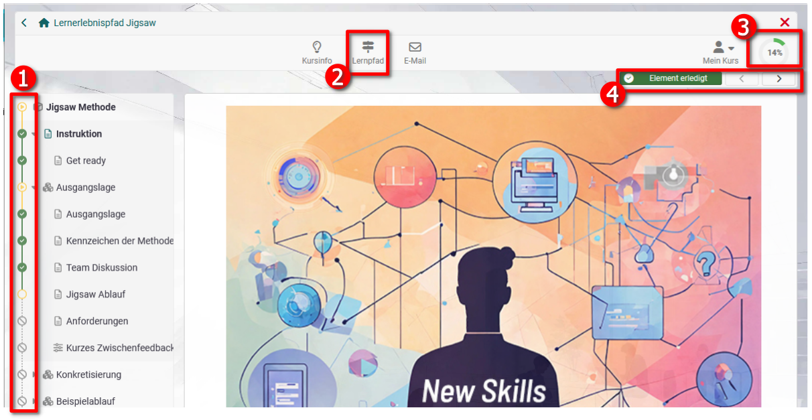
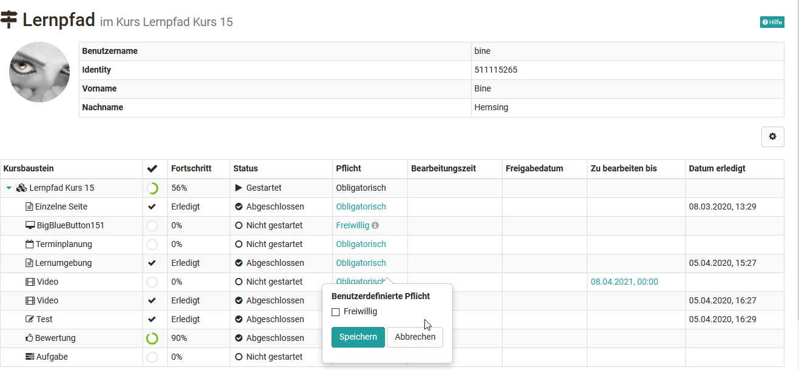
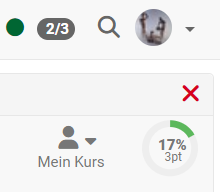

# Lernpfadkurs - Teilnehmeransicht {: #participant_view}

Ein Lernpfadkurs unterscheidet sich auch für die Lernenden von einem herkömmlichen Kurs. Die grössten Unterschiede liegen in der Fortschrittsanzeige und im Bereich "Lernpfad". Im Folgenden werden die zentralen Bereiche kurz erläutert.

Durch die visualisierte Anzeige und die bereitgestellten Informationen erhalten die Lernenden rasch und kontinuierlich einen Überblick über ihren Kursfortschritt und den aktuellen Bearbeitungsstand.

## Typische Elemente eines Lernpfadkurses aus Sicht der Lernenden {: #typical_elements}

{ class="shadow lightbox" }

1. **Fortschrittsleiste** im Kursmenü

    Hier sehen die Lernenden, welche Kursbausteine sie bereits aufgerufen oder erledigt haben und welche Kursbereiche noch nicht zugänglich sind. Grün bedeutet erledigt, gelb teilweise erledigt und grau nicht zugänglich.

    Ob die Fortschrittsleiste im Kursmenü sichtbar ist, legen Kursbesitzer:innen unter `Kurs > Administration > Einstellungen`, Tab "Layout", mit der Option "Pfad im Menu anzeigen" fest.

2. Link **"Lernpfad"** in der Toolbar

    Hier gelangen die Lernenden zum Gesamtüberblick über ihren Bearbeitungsstand aller Kursbausteine mit den Spalten Fortschritt, Status, Durchführung, Bearbeitungszeit, Freigabedatum, Zu bearbeiten bis und Datum erledigt.

    Kursbesitzer:innen und Betreuer:innen sehen hier den Bearbeitungsstand *aller* Teilnehmenden und können Anpassungen vornehmen, zum Beispiel für einzelne Teilnehmende die Durchführung eines Kursbausteins von obligatorisch auf freiwillig umstellen.

    { class="shadow lightbox" }

3. Visualisierte Anzeige des **prozentualen Fortschritts**

    Hier erkennen die Lernenden, wie viel Prozent der obligatorischen Kursbausteine sie bereits erledigt haben. Grundlage ist entweder die Anzahl der erledigten Kursbausteine oder die aufaddierte Bearbeitungszeit der obligatorischen Kursbausteine, siehe [Lernpfadkurse erstellen](../learningresources/Creating_learning_path_courses.de.md).

    Sofern unter `Kurs > Administration > Einstellungen`, Tab "Bewertung", aktiviert, zeigt die Grafik auch die erreichten Gesamtpunkte an.

    { class="shadow lightbox" }

    Werden im laufenden Kurs Kursbausteine hinzugefügt oder gelöscht, berücksichtigt OpenOlat dies in der Gesamtsumme und berechnet den bisherigen Prozentwert der Lernenden neu.

4. **Pfeilbuttons**

    Mit den Pfeilen navigieren die Lernenden zum jeweils nächsten zugänglichen Kursbaustein und so durch den gesamten Kurs.

    Sind die Anforderungen **des vorherigen** Kursbausteins noch nicht erfüllt, zum Beispiel eine fehlende Bestätigung oder ein noch nicht absolvierter Test, haben die Lernenden keinen Zugriff auf den folgenden Kursbaustein. **OpenOlat zeigt eine entsprechende Meldung**.

    Ist als Erledigungskriterium "Bestätigung durch Benutzer:in" gewählt, erscheint neben der Pfeilnavigation der Toggle-Button "Als erledigt markieren". Damit bestätigen die Lernenden, dass sie den Kursbaustein bearbeitet haben.

    { class="shadow lightbox" }

!!! note "Hinweis"

    Einen Überblick über die möglichen Erledigungskriterien finden Sie auf der Seite [Lernpfadkurs - Kurseditor](../learningresources/Learning_path_course_Course_editor.de.md#completion_criterion).

!!! tip "Tipp"

    Kursbesitzer:innen können [Erinnerungen](../learningresources/Course_Reminders.de.md) so konfigurieren, dass OpenOlat sie bei einem bestimmten prozentualen Bearbeitungsstand verschickt, zum Beispiel an alle, die weniger als 60 % bearbeitet haben.

## Weiterführende Informationen {: #further_information}

**Auf dieser Seite erwähnt** 
[Lernpfadkurse erstellen >](../learningresources/Creating_learning_path_courses.de.md) 
[Lernpfadkurs - Kurseditor >](../learningresources/Learning_path_course_Course_editor.de.md) 
[Erinnerungen >](../learningresources/Course_Reminders.de.md)

**Weiterführend** 
[Lernpfadkurs - Überblick >](../learningresources/Learning_path_course.de.md) 
[Kurseinstellungen >](../learningresources/Course_Settings.de.md)

[Zum Seitenanfang ^](#participant_view)
