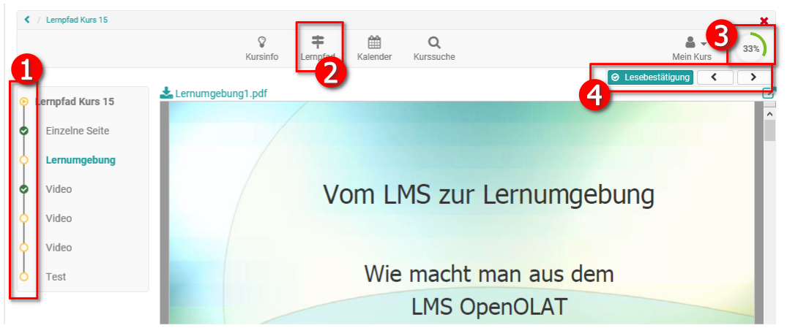
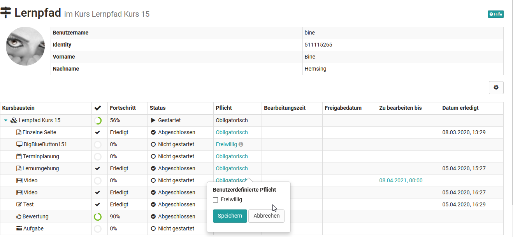

## Lernpfad Kurs - Teilnehmeransicht

Ein Lernpfad Kurs unterscheidet sich auch für die Lernenden von einem
herkömmlichen Kurs. Die größten Unterschiede liegen in der Fortschrittsanzeige
und dem Bereich Lernpfad. Im Folgenden werden die zentralen
Bereiche kurz hervorgehoben.

## Typische Elemente eines Lernpfad Kurses aus Sicht der Lernenden:

  1.  **Fortschrittsleiste** im Kursmenü:   
Hier sehen die Lernenden welche Elemente sie schon aufgerufen bzw. erledigt
haben und auch welche Kursbereiche noch nicht zugänglich sind. Ob die Anzeige sichtbar ist kann vom Kursbesitzer in der Kursadministration im Tab "Layout" eingestellt werden. 

  2. Link "Lernpfad" in der Toolbar:   
Hier gelangen die Lernenden zum **Gesamtüberblick** über ihren
Bearbeitungsstand aller Kursbausteine mit weiteren Feedback Informationen wie
Fortschritt, Status, Verbindlichkeit, angesetzte Bearbeitungszeit sowie
eventuelle Datumsangaben. Kursbesitzer oder Betreuer sehen hier den
Bearbeitungsstand aller Kursteilnehmenden.  

  3. Visualisierte Anzeige des **prozentualen Fortschritts**. Hier erkennen die Lernenden wieviel Prozent der obligatorischen Kursbausteine sie bereits erledigt haben. Sofern aktiviert werden hier auch die Gesamtpunkte des Users angezeigt.
  4. Pfeilbuttons für die Navigation durch den gesamten Kurs. Mit den Pfeilen kann der User zum nächsten Kursbaustein navigieren. Müssen bestimmte Anforderungen für den folgenden Baustein erfüllt sein, die noch nicht erfüllt wurden, z.B. fehlt eine Bestätigung durch den User oder ein Test wurde noch nicht absolviert, erscheint die Meldung "Dieses Kurselement ist nicht zugänglich.". Ferner erscheint beispielsweise " **Ich habe den Inhalt gelesen**", wenn der User bestätigen muss, dass er den entsprechenden Baustein bearbeitet hat. Einen Überblick über mögliche Erledigungskrterien findet man [hier](../learningresources/Learning_path_course_Course_editor.de.md).

Durch die visualisierte Anzeige und die bereitgestellten Infos erhalten die
Lernenden rasch und kontinuierlich einen Überblick über ihren Kursfortschritt
und den aktuellen Bearbeitungsstand.

Die Grundlage der Prozentanzeige (3) kann entweder die Anzahl der bearbeiteten obligatorischen Kursbausteine oder aufaddierte Zeit die für die Bearbeitung aller obligatorischen Kursbausteine angesetzt ist, verwendet werden. Sollen bei der gesamten Kursbewertung auch Punkte
angezeigt werden (siehe Konfiguration im Menü "Einstellungen" → Tab
"Bewertung"), erscheint unter der Prozentanzeige auch noch der entsprechende
bereits erreichte Punktwert für den gesamten Kurs.

Hat der User alle vom Lehrenden definierten obligatorischen Kursbausteine absolviert wird ihm
100 % angezeigt. Werden im laufenden Kurs neue Bausteine hinzugefügt oder
gelöscht, wird dies bei der Gesamtsumme berücksichtigt und der bisherige
Prozentwert der Lernenden wird entsprechend neu berechnet.

Der Lehrende kann auch [Erinnerungsmails ](../learningresources/Course_Reminders.de.md)so konfigurieren,
dass sie bei einem bestimmten prozentualen Bearbeitungswert verschickt werden,
z.B. wer weniger als 60 % bearbeitet hat wird noch einmal motiviert die
restlichen Bearbeitungen im Kurs vorzunehmen.

