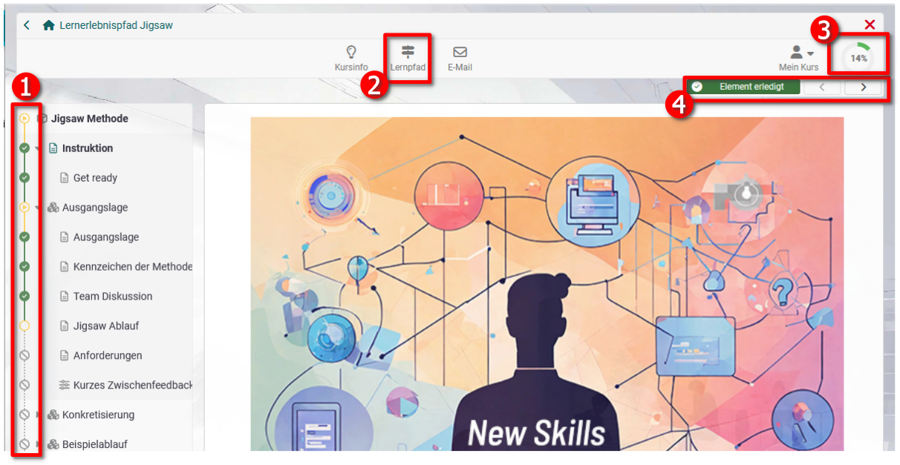
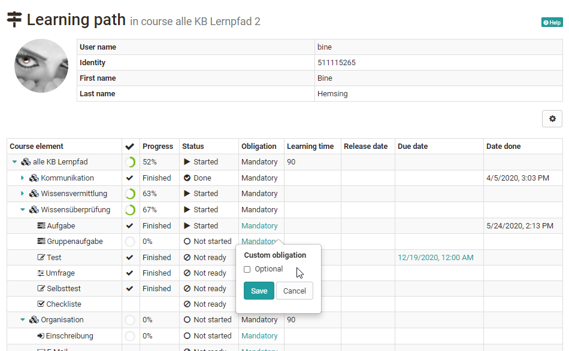
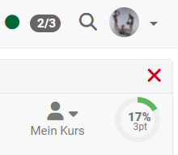
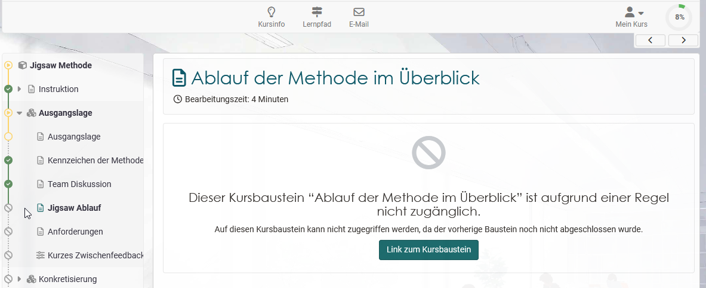

## Learning path course - Participant view

A learning path course also differs from a traditional course for learners.
The biggest differences are in the progress indicator and the learning path
area. Also, learning path courses do not display tool icons to students for orientation. The key areas are briefly highlighted below.

The visualized display and infos provide learners
with a quick and continuous overview of their course progress and current
completion status.

## Typical elements of a learning path course from the participants' point of view:

1.  **Progress bar** (learning path) in the course:  

Here the learners can see which elements they have already accessed or completed and also which course areas are not yet accessible. Whether the display is visible can be set by the course owner in the course administration in the tab "Layout". Green means completed, yellow means partially completed and gray means not accessible.

Ob die Anzeige in der Kursnavigation sichtbar ist kann vom Kursbesitzer in den Einstellungen der Kursadministration im Tab "Layout"  mit "Pfad im Menü anzeigen eingestellt werden. 

2. "Learning path" link in the toolbar:  

Here, learners can access the **general overview** of their completion status of all course elements with additional feedback information such as progress, status, commitment, scheduled completion time, and any date information. 

Course owners or coaches can see the progress of *all* course participant und sie können auch bestimmte Anpassungen vornehmen z.B. einzelne Kursbausteine für einen User von verbindlich auf freiwillig umstellen.  
 

3. Visualized display of the **progress in percent**. 

Here, learners can see what percentage of the mandatory course elements they have already completed. Als Grundlage für die Prozentanzeige wird entweder die Anzahl der bearbeiteten Kursbausteine oder die aufaddierte Zeitspanne der obligatorischen Kursbausteine verwendet. 

Sofern in der Kursadministration aktiviert (siehe Konfiguration im Menü "Einstellungen" → Tab
"Bewertung"), werden hier auch die erreichten Gesamtpunkte des Users angezeigt.

Werden im laufenden Kurs neue Bausteine hinzugefügt oder gelöscht, wird dies bei der Gesamtsumme berücksichtigt und der bisherige Prozentwert der Lernenden wird entsprechend neu berechnet.

4. **Arrow buttons** 

Mit den Pfeilen kann der User zum nächsten Kursbaustein navigieren und sich so durch den gesamten Kurs bzw. zum jeweils nächsten zugänglichen Kursabaustein bewegen. 

If certain requirements have to be met for the following course element that have not yet been met, e.g. confirmation by the user is missing or a test has not yet been completed und es erscheint eine entsprechende Meldung.   

Ist als Erledigungskriterium "Bestätigung durch Benutzer:in" gewählt, erscheint neben der Pfeilnavigation "**Als erledigt markieren**" und der User kann markieren, dass er den entsprechenden Kursbaustein bearbeitet hat. 

!!! note

    An overview of possible confirmation criteria can be found [here](../learningresources/Learning_path_course_Course_editor.md).

!!! tip 

    The coach can also configure [reminder e-mails](../learningresources/Course_Reminders.md) to be sent when a certain percentage has been completed, e.g. anyone who has completed less than 60% will be otivated once again to complete the remaining work in the course.

