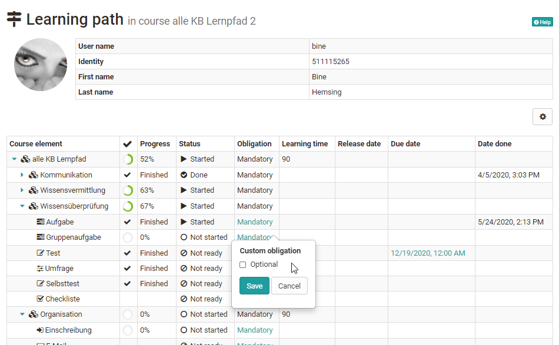
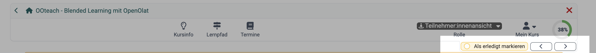

# Learning path course - Participant view {: #participant_view}

A learning path course also differs from a conventional course for learners. The biggest differences are the progress display and the "Learning path" area. The key areas are briefly explained below.

The visualized display and the information provided give learners a quick and continuous overview of their course progress and current completion status.

## Typical elements of a learning path course from the learners' point of view {: #typical_elements}

{ class="shadow lightbox" }

1. **Progress bar** in the course menu

    Here learners see which course elements they have already accessed or completed and which course areas are not yet accessible. Green means done, yellow partially done and grey not accessible.

    Whether the progress bar is visible in the course menu is defined by course owners under `Course > Administration > Settings`, tab "Layout", with the option "Display path in menu".

2. Link **"Learning path"** in the toolbar

    Here learners reach the overall overview of their completion status of all course elements with the columns Progress, Status, Execution, Learning time, Release date, Due date and Date done.

    Course owners and coaches see the completion status of *all* participants here and can make adjustments, for example switch the execution of a course element from mandatory to optional for individual participants.

    { class="shadow lightbox" }

3. Visualized display of the **progress in percent**

    Here learners see what percentage of the mandatory course elements they have already completed. The basis is either the number of completed course elements or the added-up learning time of the mandatory course elements, see [Creating learning path courses](../learningresources/Creating_learning_path_courses.md).

    If activated under `Course > Administration > Settings`, tab "Assessment", the graphic also displays the total score achieved.

    { class="shadow lightbox" }

    If course elements are added or deleted in a running course, OpenOlat takes this into account in the total and recalculates the learners' previous percentage.

4. **Arrow buttons**

    With the arrows, learners navigate to the next accessible course element and thus through the entire course.

    If the requirements of **the previous** course element are not yet met, for example a missing confirmation or a test not yet taken, learners have no access to the following course element. **OpenOlat displays a corresponding message**.

    If "Confirmation by participant" is selected as the completion criterion, the toggle button "Mark as done" appears next to the arrow navigation. With it learners confirm that they have worked on the course element.

    { class="shadow lightbox" }

!!! note "Note"

    An overview of the possible completion criteria can be found on the page [Learning path course - Course editor](../learningresources/Learning_path_course_Course_editor.md#completion_criterion).

!!! tip "Tip"

    Course owners can configure [reminders](../learningresources/Course_Reminders.md) so that OpenOlat sends them at a certain percentage of completion, for example to everyone who has completed less than 60 %.

## Further information {: #further_information}

**Mentioned on this page** 
[Creating learning path courses >](../learningresources/Creating_learning_path_courses.md) 
[Learning path course - Course editor >](../learningresources/Learning_path_course_Course_editor.md) 
[Course Reminders >](../learningresources/Course_Reminders.md)

**Further reading** 
[Learning path course - Overview >](../learningresources/Learning_path_course.md) 
[Course Settings >](../learningresources/Course_Settings.md)

[To the top of the page ^](#participant_view)
