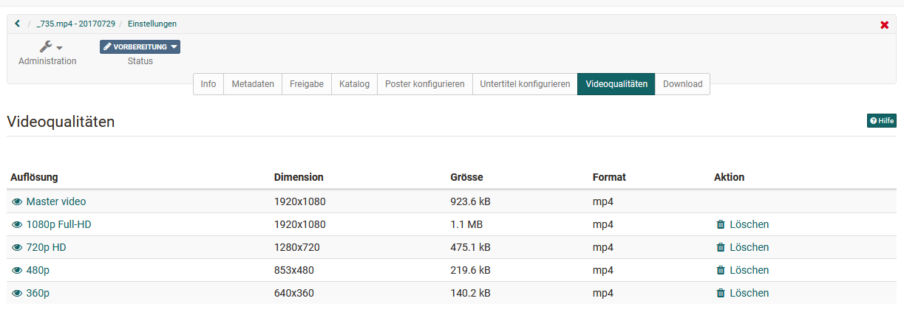
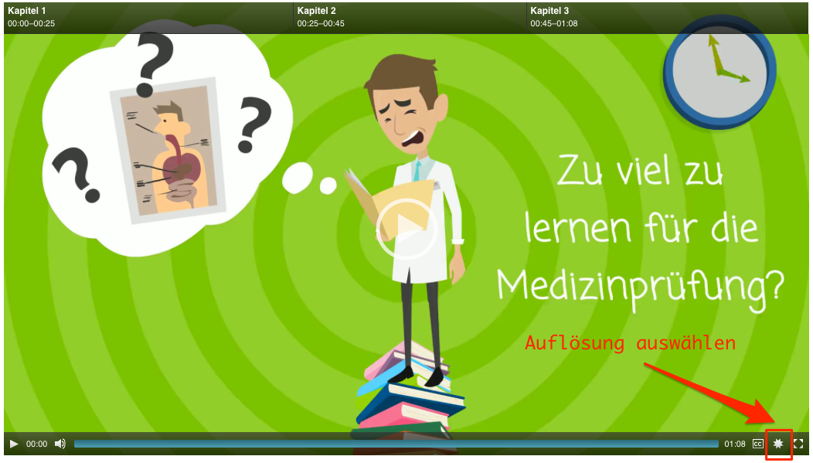

# Lernressource: Video

Eine Video-Lernressource wird im Autorenbereich über die Funktion "[Importieren](../area_modules/authoring_new_course.de.md#lernressourcen-importieren)" oder "Importieren URL" erstellt. Dazu im Upload-Fenster die gewünschte Video-Datei auswählen, einen Titel vergeben und auf "Importieren" klicken. 

Es öffnet sich im nächsten Schritt die Eingabeseite der ["Einstellungen"](../learningresources/Course_Settings.de.md). 

  

Im Tab "Info" haben Sie Möglichkeit eine Beschreibung einzutragen, die auch angezeigt werden kann, wenn die Lernressource Video in einen Kurs eingebaut wird. Wie man Videos der Lernressource Video generell in einen Kurs einbindet erfahren Sie im Kapitel ["Kursbaustein Video"](Course_Element_Video.de.md).

!!! info "Info"

    Wird eine Datei importiert muss diese im .mp4 Format vorliegen. Weitere technische Infos finden Sie [hier](Video_Upload.de.md).

!!! note "Hinweis für YouTube Videos"

    Werden über "Importieren URL" YouTube Videos importiert, werden dabei auch Metadaten der YouTube Datei, wie der Titel oder ein Startbild übernommen.

    

##  Video Editor

In der Administration der Lernressource findet man den Link zum "Video-Editor". Hier kann das Video mit (interaktiven) Elementen ausgestaltet und weiter konfiguriert werden. 

Der Video Editor umfasst drei Bearbeitungsbereiche:

* Konfigurationsbereich (rechts oben)
* Timeline (unten)
* Vorschaubereich (links oben)

Konfiguriert werden können: Kapitel, Annotationen, Segmente, Kommentare und Quiz. 

### Kapitel {: #video_chapter}

Jedem Video können "Kapitel" als Sprungmarken hinzugefügt werden. Dies erleichtert die Navigation im Video und sollte bei längeren Videos auf jeden Fall vorgenommen werden. Ein Kapitel wird mit der Schaltfläche **"Kapitel hinzufügen"** hinzugefügt. Anschliessend kann ein Kapitelname eingetragen werden. Zudem muss die Anfangszeit des Videos definiert werden.

Alternativ kann im Video an der Stelle gestoppt werden, wo das neue Kapitel beginnen soll. Anschliessend klicken Sie wiederum auf die Schaltfläche "Kapitel hinzufügen". Die Anfangszeit wird nun automatisch übernommen und es muss nur noch ein Kapitelname eingetragen werden.

Kapitel können anschliessend sowohl bearbeitet, als auch wieder gelöscht werden. Ferner sind die Kapitel in der Timeline sichtbar. 

### Annotationen

Neben den Kapitelmerkmalen können auch an beliebigen Stellen im Video Anmerkungen hinterlegt werden, z.B. um besonders wichtige Stellen hervorzuheben oder bestimmte Aspekte zu ergänzen. Neben Text können auch Links gesetzt werden, die z.B. zu weiteren Informationen oder weiteren Videos führen. 

  

Wählen Sie die Stelle an der die Anmerkung ergänzt werden soll und definieren Sie die weiteren Einstellungen, wie die Dauer, die Position an der die Anmerkung erscheinen soll und natürlich den anzuzeigenden Text. Die Annotationsblöcke können per drag&drop flexibel verschoben werden. 

### Segmente

Segmente werden im Kursbaustein Videoaufgabe benötigt. Es sind Videoabschnitte, denen die Teilnehmenden vorgegebene Begriffe oder Situationen (= Kategorien) zuordnen müssen.

{ class="shadow lightbox" }

**Segmente erstellen**

1. Wählen Sie im Autorenbereich das gewünschte Video aus.
2. Öffnen Sie dann unter "Administration" den Videoeditor.
3. Im Videoeditor wählen Sie den Tab "Segmente".
4. Eingefügte Segmente werden in der Timeline in einer separaten Spur angezeigt. (Sie können sich nie überlappen.)

!!! hint "Tipps"

    * Benutzen Sie den Abspielknopf des Videos um Ihre Arbeit zu kontrollieren.
    * Sie können ein Segment in der Timeline anklicken und gelangen dadurch direkt zur Bearbeitung dieses Segments.

**Segmente im Kursbaustein aktivieren**

1. Wählen Sie im Autorenbereich den Kurs aus, in den die Video-Lernressource eingefügt werden soll.
2. Öffnen Sie unter "Administration" den Kurseditor.
3. Wählen Sie den Kursbaustein aus oder fügen Sie einen neuen Kursbaustein ein (Video oder Videoaufgabe).
4. **a) Kursbaustein "Videoaufgabe"**:  Im Tab "Konfiguration" finden Sie den Abschnitt "Videoelemente anzeigen". Dort müssen Sie die Segmente aktiviert finden, denn eine Videoaufgabe braucht zwingend Segmente. 
**b) Kursbaustein "Video"**:  Im Tab „Lerninhalt“ finden Sie den Abschnitt "Videoelemente anzeigen". Dort können Sie die Anzeige der Segmente ein- oder ausblenden.

### Kommentare

Kommentare können gezielt an einem bestimmten Punkt im Video gesetzt werden und zum Beispiel wichtige Kernaussagen des Videos hervorheben, ergänzende Informationen zum Thema oder Hinweise zum folgenden Videoabschnitt bereitstellen. Der Kommentar wird mit dem Namen der erstellenden Person gekennzeichnet. 

Sieht sich der User das Video an stoppt es an der mit dem Kommentar versehenen Stelle. Um fortzufahren, muss entweder der Kommentar aktiv geschlossen oder der Play-Button des Videos manuell angeklickt werden.

Neben einfachen Text-Kommentaren und der Einbindung bestehender Videos (Import als Datei oder per URL, z.B. von YouTube) können Video-Kommentare auch direkt im Editor über die Recording-Funktion aufgenommen und integriert werden.

  

### Quiz

An dieser Stelle können Sie dem Video einzelne Quizfragen hinzufügen. Aktuell stehen 12 verschiedene Fragetypen zur Auswahl. Anschliessend kann die Frage weiter konfiguriert werden. 

Zur Konfiguration der Quizfrage kann

* der Zeitpunkt definiert werden zu dem die Frage erscheinen soll
* eine Zeitbeschränkung für die Bearbeitung definiert werden
* und definiert werden, ob es mehrere Lösungsversuche für eine Frage geben soll, oder diese übersprungen werden dürfen

Die konkret angezeigten Tabs für die Quizfrage sind abhängig vom gewählten Fragetyp. Im ersten Tab wird die konkrete Fragestellung sowie die Antworten hinterlegt. Im Tab **"Punkte"** wird die Art der
Punktevergabe definiert. Im Tab **"Feedback"** können Feedbacks basierend auf unterschiedlichen Kriterien hinzugefügt werden. Im Tab **"Vorschau"** bzw. **"Vorschau Lösung"** kann man sich die Darstellung der Frage anschauen. 

!!! note "Hinweis"

    Weitere Informationen zu den generellen Einstellungen von Quiz und Tests finden Sie im Kapitel "[Testfragen konfigurieren](../learningresources/Configure_test_questions.de.md)". Weitere Informationen zu den unterschiedlichen Fragetypen im Kapitel "[Test Fragetypen](../learningresources/Test_question_types.de.md)".

## Videokonfiguration in den "Einstellungen" der Lernressource

Weitere Konfigurationen können in den "Einstellungen" im Bereich Administration vorgenommen werden.

Die Tabs "Info", "Freigabe" und "Katalog" sind analog zu anderen Lernressourcen. Der Tab "Katalog" erscheint hier nur wenn der Katalog 1.0 in der OpenOlat Instanz aktiviert ist. Generelle Informationen zum Menü "Einstellungen"
finden Sie [hier](../learningresources/Course_Settings.de.md).

### Metadaten

Im Tab "Metadaten" finden Sie generelle Angaben zum Video wie Erstelldatum und Dateigrösse. Ferner haben Sie die Möglichkeit wie in anderen Lernressourcen auch, Informationen zu Autoren, Fachbereichen, Hauptsprache, Zeitaufwand und Lizenz zu hinterlegen.

### Poster konfigurieren

Im Tab "Poster konfigurieren" legen Sie fest, mit welchem Vorschaubild das Video im Kursbereich, im Katalog, auf der Video Collection-Seite, auf der Infoseite, im Autorenbereich sowie im Kurs angezeigt werden soll. Mit Hilfe der Schaltfläche "Poster ersetzen" können Sie zwischen verschiedenen Standbildern des Videos wählen oder alternativ über die Schaltfläche "Poster hochladen" ein eigenes Bild als Startbild (Poster) hochladen. Falls kein Poster ausgewählt wurde, erscheint das Standbild vom Beginn des Videos.

!!! info "Achtung"

    Bitte beachten Sie, dass ein hochgeladenes Bild dieselben Abmessungen in Pixel haben sollte wie das Originalvideo. Die entsprechenden Daten dazu finden Sie im Tab "Metadaten".

###  Untertitel konfigurieren  {: #video_subtitles}

Einem Video können Untertitel in beliebig vielen Sprachen zugewiesen werden. Untertitel werden in OpenOlat im [WebVTT Format](https://w3c.github.io/webvtt/) hochgeladen ([Wikipedia- Artikel](https://en.wikipedia.org/wiki/WebVTT)). Die hochgeladene Datei muss .vtt abgespeichert sein. Untertitel können relativ einfach selbst erstellt werden. Dieses Format wird von der meisten Video-Player-Software unterstützt.

!!! note "Hinweis"

    In der ersten Zeile des VTT-Dokuments muss das Schlüsselwort WEBVTT stehen, gefolgt von einer leeren Zeile.

Vor jeder Untertitelzeile wird eine Zeitangabe benötigt, die im folgenden Format vorliegen muss:

!!! note "Hinweis"

    hh\:mm\:ss.msec 

    Beispiel: 00:00:20.396 (Zeitangabe 0 Stunden, 0 Minuten, 20.396 Sekunden)

    Millisekunden müssen bis auf die 3. Nachkomma-Stelle genau angegeben werden.

!!! warning "Achtung"

    Die Trennzeichen der Zeitangaben sind Doppelpunkt und Punkt (siehe Beispiel oben). 
    Es dürfen keine Kommata verwendet werden.

Das folgende Beispiel zeigt den Anfang einer typischen VTT-Datei:

!!! note "Hinweis"

    WEBVTT

    00:00:00.000 --> 00:00:04.000 
    Where did he go?

    00:00:03.000 --> 00:00:06.500 
    I think he went down this lane.

    00:00:04.000 --> 00:00:06.500 
    What are you waiting for?

 **Untertitel hinzufügen**

Um einem Video einen Untertitel hinzuzufügen,

  1. Öffnen Sie "Administration &rarr; Einstellungen",
  2. Navigieren Sie zum Tab "Untertitel konfigurieren" und
  3. Klicken die Schaltfläche "Untertitel hinzufügen".
  4. Wählen Sie im neuen Fenster die Sprache deren Untertitel Sie hochladen möchten, und
  5. Selektieren dann die entsprechende Datei.
  6. Klicken Sie "Hochladen". 

Bereits erstellte Untertitel werden in einer Tabelle aufgelistet und können dort auch gelöscht werden.

 **Untertitel anzeigen**

Standardmässig werden Videos in OpenOlat ohne Untertitel abgespielt. 

Sobald Untertitel vorhanden sind, wird folgendes Icon im Video-Player angezeigt:
{ class=size16 }.

CC steht für den amerikanischen Ausdruck "[Closed captions](https://de.wikipedia.org/wiki/Untertitel#Technische_Ausf.C3.BChrungen)" (Wikipedia), und bedeutet dass Untertitel unsichtbar sind bis diese vom Benutzer aktiviert werden. In OpenOlat sieht das dann folgendermassen aus:

Sobald Sie mit dem Mauszeiger über das Icon fahren, klappt sich die Liste der bestehenden Untertitel aus. Die aktuelle Auswahl ist dabei eingefärbt.

###  Videoqualitäten {: #video_quality}

Im Tab "Videoqualität"sehen Sie in welchen Auflösungen das Video vorliegt. Sobald ein Video hochgeladen wird, werden Videos in den verschiedenen Auflösungen erstellt. Dieser Prozess kann eine Weile dauern. Welche Auflösungen im Anschluss zur Verfügung stehen ist abhängig von den Einstellungen im Administrationsbereich. Ausstehende Videos können transkodiert und nicht verwendete Auflösungen gelöscht werden. Im Videoplayer können Sie die gewünschte Auflösung über den "Source Chooser" auswählen.

!!! info "Info"

    Für Videos, die über "Importieren URL" hinzugefügt wurden, können die Einstellungen nicht vorgenommen werden.

### Download

Im Tab Download kann eingestellt werden, ob die User das Video herunterladen dürfen oder nicht.

##  Menü Video Collection

Nutzen Sie die "Video Collection"-Seite um durch alle Video Lernressourcen zu browsen, die in Ihrer Instanz vorhanden sind. Damit ein Video in der "Video Collection" angezeigt werden kann, muss der Publikationsstatus "Veröffentlicht" eingestellt sein. In Kombination mit der Freigabeeinstellung "Offen" wird es automatisch für alle registrierten Benutzer zugänglich. Die Beschreibung der Infoseite wird automatisch in der Einzelansicht eines Videos angezeigt, ebenso die Bewertungs- und Kommentarfunktion. 

!!! info "Info"

    Sollten Sie ein Video vermissen, überprüfen Sie die Einstellungen in den Videoeinstellungen unter **"Zugangskonfiguration"**.

!!! info "Info"

    Wenn  in Ihrer OpenOlat Instanz der "Video Collection" Eintrag in der Hauptnavigation nicht erscheint, wurde dieser entweder vom Administrator ausgeblendet, oder Sie besitzen nicht die benötigten Rechte.

