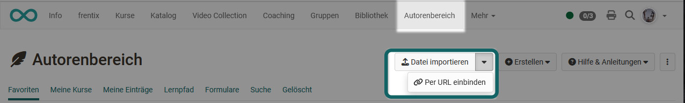
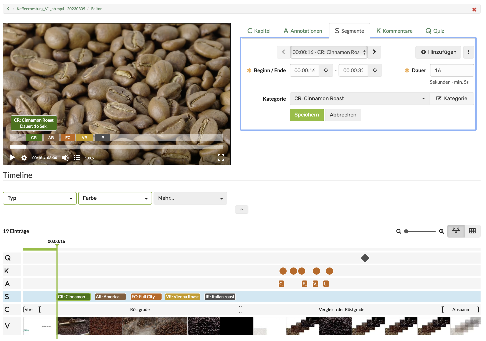

# Lernressource: Video

Eine Video-Lernressource wird im Autorenbereich über die Funktion "Datei importieren" bzw. "Per URL importieren" [erstellt](../area_modules/authoring_new_course.de.md#lernressourcen-importieren). 

Importierte Video-Dateien müssen im mp4 Format vorliegen. Weitere technische Infos finden Sie [hier](../basic_concepts/Video_Upload.de.md).

Im nächsten Schritt öffnet sich das Menü ["Einstellungen"](../learningresources/Course_Settings.de.md) der Administration der Lernressource Video.  

!!! info "Hinweis"

    Der Weg der Erstellung unterscheidet sie von den meisten anderen OpenOlat Lernressourcen die über den "Erstellen" Button angelegt werden. Dieser Weg ist sinnvoll, da das Video der Lernressource selbst nicht in OpenOlat erstellt, sondern nur über einen Lernressourcen-Container bereitgestellt wird. 

## Menü "Einstellungen" der Lernressource Video - Überblick der Tabs

  

### Tab Info

Im Tab "Info" haben Sie Möglichkeit eine Beschreibung, einen Teaser und ein Kennzeichen einzutragen, die auf der Info-Seite des Videos angezeigt werden. Wird die Lernressource im Kurs für den Kursbaustein Video eingebunden, können Beschreibung und Titel zusätzlich direkt bei dem Video im Kurs eingeblendet werden. Wie man Videos die Lernressource Video generell in einen Kurs einbindet erfahren Sie im Kapitel ["Kursbaustein Video"](Course_Element_Video.de.md).

Weitere Infos zur Einrichtung der Infoseite finden Sie im Kapitel ["Infoseite einrichten"](../learningresources/Set_up_info_page.de.md).

!!! Tip 

    Da es sich bei der Lernressource bereits um eine Video handelt ist es in den meisten Fällen nicht sinnvoll oder notwendig noch ein Teaser-Film zu hinterlegen. Eine Ausnahme wäre eine kurze Zusammenfassung eines längeren Videos, das im Vorfeld schon auf den Inhalt hinweisen soll. Dieses Video wäre aber nur sichtbar, wenn die Lernressource Video eigenständig und nicht integriert in einen Kurs angeboten wird. Weitere Infos dazu findet man im Tab "Freigabe". 

### Metadaten

Im Tab "Metadaten" finden Sie generelle Angaben zum Video wie Erstelldatum und Dateigrösse. Ferner haben Sie die Möglichkeit, wie in anderen Lernressourcen auch, Informationen zu Autor*innen, Fachbereichen, Hauptsprache, Zeitaufwand und Lizenz zu hinterlegen.

!!! note "Hinweis für YouTube Videos"

    Werden über "Importieren URL" YouTube Videos importiert, werden dabei auch Metadaten der YouTube Datei, wie der Titel oder ein Startbild übernommen.

### Tab Freigabe
Im Tab Freigabe legen Sie fest, ob die Lernressource Video in einem Kurs eingebunden oder eigentständig verwendet werden soll. Wählen Sie beim Verwendungszweck "Eigenständig" muss die Buchungsmethode noch zusätzlich definiert werden. Weitere Infos finden Sie [hier](../learningresources/Course_Settings_Share.de.md).

Sofern die [Video Collection](../area_modules/Video_Collection.de.md) in Ihrer Instanz aktiviert ist können Sie auch entscheiden ob Ihre Video Lernressource dort angezeigt werden soll. 

### Poster konfigurieren

Im Tab "Poster konfigurieren" legen Sie fest, mit welchem Vorschaubild das Video im Kursbereich, im Katalog, auf der Video Collection-Seite, auf der Infoseite, im Autorenbereich sowie im Kurs angezeigt werden soll. 

Mit Hilfe der Schaltfläche "Poster ersetzen" können Sie zwischen verschiedenen Standbildern des Videos wählen oder alternativ über die Schaltfläche "Poster hochladen" ein eigenes Bild als Startbild (Poster) hochladen. Falls kein Poster ausgewählt wurde, erscheint das Standbild vom Beginn des Videos.

!!! info "Achtung"

    Bitte beachten Sie, dass ein hochgeladenes Bild dieselben Abmessungen in Pixel haben sollte wie das Originalvideo. Die entsprechenden Daten dazu finden Sie im Tab "Metadaten".

###  Tab "Untertitel konfigurieren"  {: #video_subtitles}

Erstellen Sie bei Bedarf außerhalb von OpenOlat eine Untertiteldatei für Ihr Video und binden Sie diese im Tab „Untertitel konfigurieren“ ein. Laden Sie dazu die extern erstellte VTT-Datei hoch und wählen Sie die entsprechende Sprache aus.

Einem Video können Untertitel in beliebig vielen Sprachen zugewiesen werden. OpenOlat unterstützt das [WebVTT Format](https://w3c.github.io/webvtt/) vergl. auch  [Wikipedia](https://en.wikipedia.org/wiki/WebVTT). Die Untertiteldatei muss daher im Format .vtt gespeichert sein. Dieses Format ist mit den meisten gängigen Video-Playern kompatibel.

#### Darauf sollten Sie achten:

!!! note "Hinweis"

    In der ersten Zeile des VTT-Dokuments muss das Schlüsselwort WEBVTT stehen, gefolgt von einer leeren Zeile.

Vor jeder Untertitelzeile wird eine Zeitangabe benötigt, die im folgenden Format vorliegen muss:

!!! note "Hinweis"

    hh\:mm\:ss.msec 

    Beispiel: 00:00:20.396 (Zeitangabe 0 Stunden, 0 Minuten, 20.396 Sekunden)

    Millisekunden müssen bis auf die 3. Nachkomma-Stelle genau angegeben werden.

!!! warning "Achtung"

    Die Trennzeichen der Zeitangaben sind Doppelpunkt und Punkt (siehe Beispiel oben). 
    Es dürfen keine Kommata verwendet werden.

Das folgende Beispiel zeigt den Anfang einer typischen VTT-Datei:

!!! note "Hinweis"

    WEBVTT

    00:00:00.000 --> 00:00:04.000 
    Where did he go?

    00:00:03.000 --> 00:00:06.500 
    I think he went down this lane.

    00:00:04.000 --> 00:00:06.500 
    What are you waiting for?

 
Bereits erstellte Untertitel werden in einer Tabelle aufgelistet und können dort auch gelöscht werden.

#### Untertitel im Video anzeigen

Standardmässig werden Videos in OpenOlat ohne Untertitel abgespielt. 

Sobald Untertitel vorhanden sind, wird folgendes Icon im Video-Player angezeigt:
{ class=size16 }.

CC steht für den amerikanischen Ausdruck "[Closed captions](https://de.wikipedia.org/wiki/Untertitel#Technische_Ausf.C3.BChrungen)" (Wikipedia), und bedeutet dass Untertitel unsichtbar sind bis diese vom Benutzer aktiviert werden. In OpenOlat sieht das dann folgendermassen aus:

Sobald Sie mit dem Mauszeiger über das Icon fahren, klappt sich die Liste der bestehenden Untertitel aus. Die aktuelle Auswahl ist dabei eingefärbt.

###  Videoqualitäten {: #video_quality}

Im Tab "Videoqualitäten" sehen Sie in welchen Auflösungen das Video vorliegt. Sobald ein Video hochgeladen wird, werden Videos in den verschiedenen Auflösungen erstellt. Dieser Prozess kann eine Weile dauern. Welche Auflösungen im Anschluss zur Verfügung stehen ist abhängig von den Einstellungen im Administrationsbereich. Ausstehende Videos können transkodiert und nicht verwendete Auflösungen gelöscht werden. 

Im Videoplayer lässt sich bei Bedarf die gewünschte Auflösung über den „Source Chooser“ auswählen.

!!! info "Info"

    Für Videos, die über "Importieren URL" hinzugefügt wurden, können die Einstellungen nicht vorgenommen werden.

### Download

Im Tab Download kann eingestellt werden, ob  User das Video herunterladen dürfen oder nicht.

!!! info "Info"

    Für Videos, die über "Importieren URL" hinzugefügt wurden, können die Einstellungen nicht vorgenommen werden.    

### Tab Katalog

Der Tab "Katalog" erscheint nur wenn der [Katalog 1.0](../area_modules/catalog1.0.de.md) in der OpenOlat Instanz aktiviert ist. Es besteht dann die MÖglichkeit die Lernressource entsprechend in den Katalog einzutrageben. 

##  Video Editor

In der Administration der Lernressource findet man den Link zum "Video-Editor". 

Hier kann das Video mit (interaktiven) Elementen ausgestaltet und weiter konfiguriert werden. 

Der Video Editor umfasst drei Bearbeitungsbereiche:

* Konfigurationsbereich (rechts oben)
* Timeline (unten)
* Vorschaubereich (links oben)

Konfiguriert werden können: Kapitel, Annotationen, Segmente, Kommentare und Quiz. 

### Tab Kapitel {: #video_chapter}

Jedem Video können "Kapitel" als Sprungmarken hinzugefügt werden. Dies erleichtert die Navigation im Video und sollte bei längeren Videos auf jeden Fall angelegt werden. Ein Kapitel wird im Tab Kapitel mit der Schaltfläche **" hinzufügen"** angelegt. 

Wählen Sie den Zeitpunkt für den Start des Kapitels und vergeben Sie einen Namen. OpenOlat setzt dann an der Stelle eine Kapitelmarke.

Sie können auch über die Timline zu einer bestimmten Stelle im Video navigieren und dann auf "Hinzufügen" klicken um ein Kapitel genau ab dieser Stelle anzulegen. 
Die Anfangszeit wird dann automatisch übernommen. 

Kapitel können anschliessend sowohl bearbeitet, als auch wieder gelöscht werden. Ferner sind die Kapitel in der Timeline sichtbar. 

### Annotationen

Neben den Kapitelmerkmalen können auch an beliebigen Stellen im Video Anmerkungen hinterlegt werden, z.B. um besonders wichtige Stellen hervorzuheben oder bestimmte Aspekte zu ergänzen. Neben Text können auch Links gesetzt werden, die z.B. zu weiteren Informationen oder weiteren Videos führen. 

Wählen Sie in der Timeline die Stelle im Video an der die Annotation hinzugefügt werden soll und klicken Sie auf "hinzufügen". Es erscheint die Konfiguration für die Annotation. 

Geben Sie den gewünschten Text ein, legen Sie die Dauer der Anzeige fest und wählen Sie eine Farbe für die Kennzeichnung im linken Bereich. Klicken Sie auf das Stift-Symbol um die Position und die Grösse des Annotationsfelds anzupassen. Sie können auch per Drag & drop das Annotationsfeld verschieben. Speichern Sie die Einstellungen.

Sie können beliebig viele Annotationen hinzufügen und über die Pfeile zwischen ihnen wechseln. Über das 3-Punkte Menü können Annotationen auch wieder gelöscht werden. 

### Segmente

Segemente sind spezifsche Bereiche im Video, die z.B. einem übergeordneten Ansatz oder einer Strukturierung zugeordnet werden können. Die Segmente sind besonders in Kursen für die Kursbausteine "Video" und "Videoaufgabe" relevant und können hier eingeblendet und verwendet werden. 

**Segmente erstellen**
Im Video-Editor wählen Sie den Tab "Segmente" und klicken auf "Hinzufügen". Es erscheint das Konfigurationsmenü. 

{ class="shadow lightbox" }

Für jedes Segment muss mit "Hinzufügen" ein Element angelegt und mit passendem Zeitslot und Begriff versehen werden.  Die Segmente dürfen sich dabei zeitlich nicht überschneiden. Also einem zeitlichen  Segment wird genau ein Begriff zugeordnet.  

Sie können entweder direkt alle relevanten Video-Segementbegriffe eingeben und diese dann im zweiten Schritt den konkreten zeitlichen Positionen zuordnen. Gehen Sie dafür wie folgt vor:

Vorgehen:
* "Hinzufügen" anklicken um das Konfigurationsmenü zu erreichen
* Button "Begriffe" anklicken und über das Plus-Zeichen alle relevanten Begriffe einfügen. Möglichst schon passend in der Reihenfolge in der sie im Video auftauchen. Dann können sie später leichter zugeordnet werden

Alternative: Sie springen jeweils zum gewünschten Zeitpunkt in der Timeline des Videos und fügen dann denn passenden Begriff für das Segement hinzu:

Vorgehen:
* über die Timeline zur gewünschten Stelle navigieren und "hinzufügen" anklicken"
* Begriff für diesen Startpunkt hinzufügen oder aus der Liste wählen. Dauer festlegen und speichern.
* zur nächsten Stelle Springen und wieder hinzufügen anklicken usw.

Eingefügte Segmente werden in der Timeline in einer separaten Spur angezeigt und können so auch rasch aufgerufen und dann bearbeitet werden. 

Wie und wofür könnte man die Segmente verwenden? Die Segemente werden vor allem im Kursbaustein Video-Aufgabe verwendet. Sie können beispielsweise einen zentralen Begriff bestimmten Stellen im Video zuordnen und die Lernenden müssen später im Kurs die konkreten Stellen finden, an denen dieser Aspekt auftaucht. Oder man legt verschiedene Begriffe für das Video an und die Lernenden müssen die Stellen finden an denen der jeweilige Begriff z.B. eine bestimmte Theorie oder ein Konzept deutlich wird. Oder im Kursbaustein Video könnten bei einem Beobachtungsvideo einer Kindergarten-Szene das Realvideo bestimmten theoretischen Lern- oder Interaktionsphasen zugeordnet werden. 

!!! hint "Tipps"

    * Benutzen Sie den Abspielknopf des Videos um Ihre Arbeit zu kontrollieren.
    * Sie können ein Segment in der Timeline anklicken und gelangen dadurch direkt zur Bearbeitung dieses Segments.

### Kommentare

Kommentare können gezielt an einem bestimmten Punkt im Video gesetzt werden und zum Beispiel wichtige Kernaussagen des Videos hervorheben, ergänzende Informationen zum Thema oder Hinweise zum folgenden Videoabschnitt bereitstellen. Der Kommentar wird mit dem Namen der erstellenden Person gekennzeichnet. 

Sieht sich der User das Video an stoppt es an der mit dem Kommentar versehenen Stelle. Um fortzufahren, muss entweder der Kommentar aktiv geschlossen oder der Play-Button des Videos manuell angeklickt werden. Das ist ein wesentlicher Unterschied zu den Annotationen.

Neben einfachen Text-Kommentaren und der Einbindung bestehender Videos (Import als Datei oder per URL, z.B. von YouTube) können Video-Kommentare auch direkt im Editor über die Recording-Funktion aufgenommen und integriert werden.

  

### Quiz

An dieser Stelle können Sie dem Video einzelne Quizfragen hinzufügen. Aktuell stehen 12 verschiedene Fragetypen zur Auswahl. Anschliessend kann die Frage weiter konfiguriert werden. 

Zur Konfiguration der Quizfrage kann

* der Zeitpunkt definiert werden zu dem die Frage erscheinen soll
* eine Zeitbeschränkung für die Bearbeitung definiert werden
* und definiert werden, ob es mehrere Lösungsversuche für eine Frage geben soll, oder diese übersprungen werden dürfen

Die konkret angezeigten Tabs für die Quizfrage sind abhängig vom gewählten Fragetyp. Im ersten Tab wird die konkrete Fragestellung sowie die Antworten hinterlegt. Im Tab **"Punkte"** wird die Art der
Punktevergabe definiert. Im Tab **"Feedback"** können Feedbacks basierend auf unterschiedlichen Kriterien hinzugefügt werden. Im Tab **"Vorschau"** bzw. **"Vorschau Lösung"** kann man sich die Darstellung der Frage anschauen. 

Die Quizfragen dienen in erster Linie zur Aktivierung der Lernenden. Um das eben Gesehene zu reflektieren, soll eine Frage dazu beantwortet werden. Bei korrekter Beantwortung läuft das Video weiter (sofern man nicht überspringen darf).

Die Quiz-Fragen im Video werden direkt bei der Beantwortung der Frage "ausgewertet" - aber nur, ob sie richtig oder falsch beantwortet wurden. Die zu einer Frage hinterlegten Punkte spielen bei der Verwendung im Video keine Rolle. Es gibt daher auch keine Gesamtauswertung am Ende des Videos. (Bei Verwendung der gleichen Frage z.B. in einem Test, werden die Punkte dagegen verwendet.)

!!! note "Hinweis"

    Weitere Informationen zu den generellen Einstellungen von Quiz und Tests finden Sie im Kapitel "[Testfragen konfigurieren](../learningresources/Configure_test_questions.de.md)". Weitere Informationen zu den unterschiedlichen Fragetypen im Kapitel "[Test Fragetypen](../learningresources/Test_question_types.de.md)".

##  Menü Video Collection

Nutzen Sie die "Video Collection"-Seite um durch alle Video Lernressourcen zu browsen, die in Ihrer Instanz vorhanden sind. Damit ein Video in der "Video Collection" angezeigt werden kann, muss der Publikationsstatus "Veröffentlicht" eingestellt sein. In Kombination mit der Freigabeeinstellung "Offen" wird es automatisch für alle registrierten Benutzer zugänglich. Die Beschreibung der Infoseite wird automatisch in der Einzelansicht eines Videos angezeigt, ebenso die Bewertungs- und Kommentarfunktion. 

!!! info "Info"

    Sollten Sie ein Video vermissen, überprüfen Sie die Einstellungen in den Videoeinstellungen unter **"Zugangskonfiguration"**.

!!! info "Info"

    Wenn  in Ihrer OpenOlat Instanz der "Video Collection" Eintrag in der Hauptnavigation nicht erscheint, wurde dieser entweder vom Administrator ausgeblendet, oder Sie besitzen nicht die benötigten Rechte.

