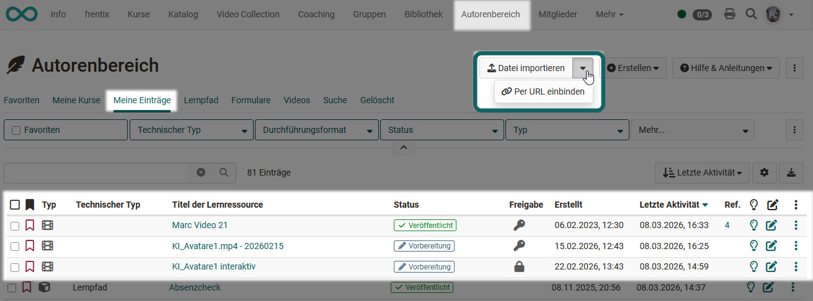
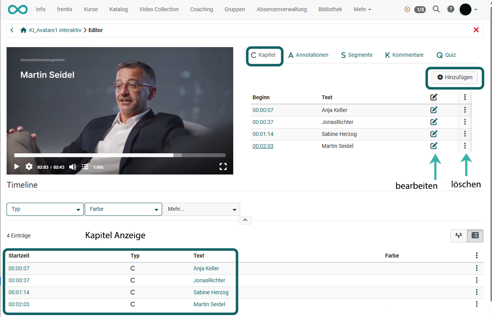
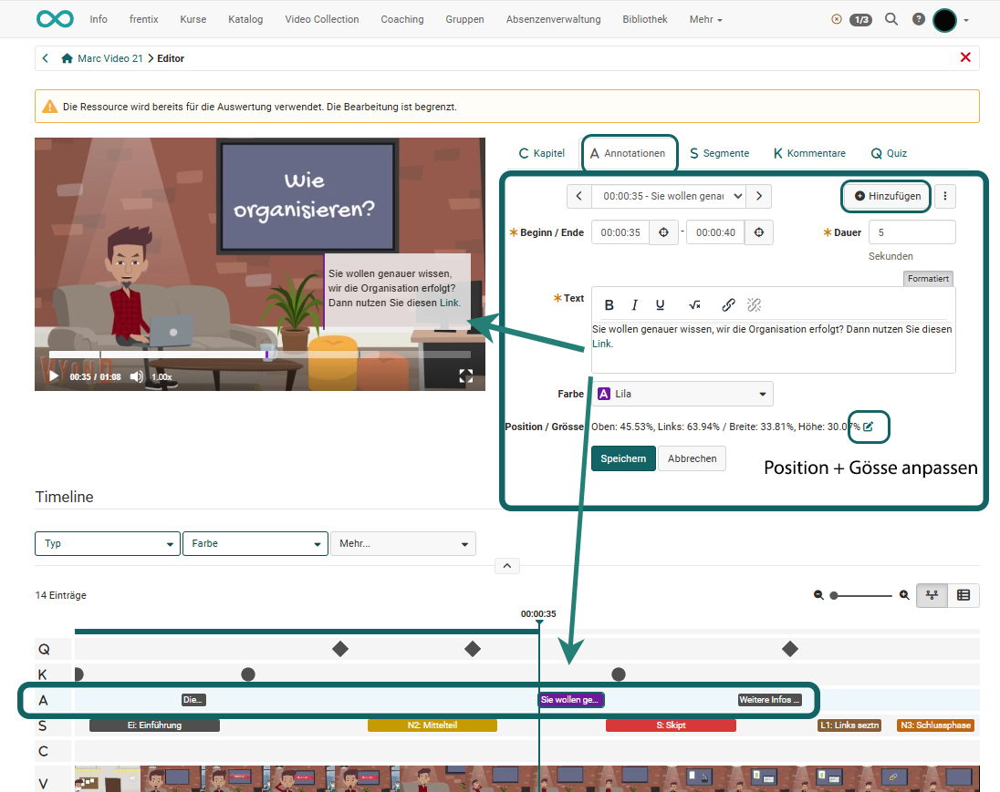
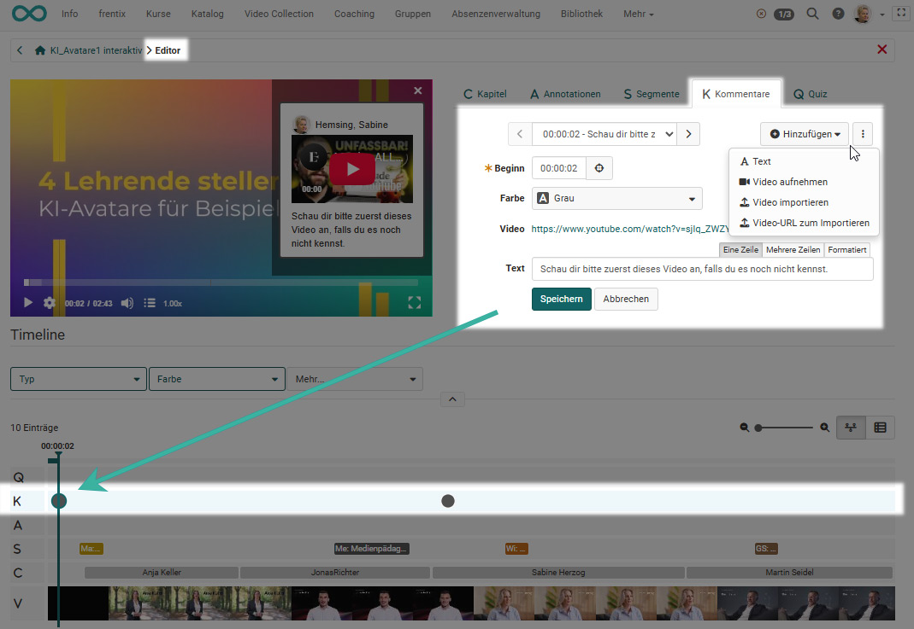

# Lernressource: Video {: #learning_resource_video}

Die Lernressource Video ist das zentrale Element für Videos in OpenOlat. Sie wird im Autorenbereich über „Datei importieren“ (für den Upload einer MP4-Datei) oder „Per URL importieren“ (für die Einbindung eines externen Videos, z. B. YouTube oder Vimeo) [erstellt](../area_modules/authoring_new_course.de.md#lernressourcen-importieren) und ist anschliessend im Bereich „Meine Einträge“ im Autorenbereich zu finden.

Eine Video-Lernressource besteht nicht nur aus der Videodatei selbst, sondern ist ein eigenständiges Objekt mit eigener Infoseite, Administrationsmenü und Freigabeeinstellungen. Sie steht kursübergreifend zur Verfügung und kann in mehreren Kursen eingebunden oder auch unabhängig von Kursen bereitgestellt werden.

Darüber hinaus können Video Lernressourcen auch mit dem OpenOlat Video-Editor der Lernressource interaktiv weiter ausgestaltet werden z.B. mit Annotationen oder Quizfragen.

Weitere technische Hinweise zum Upload und Organisation von Videos finden Sie [hier](../basic_concepts/Video_Upload.de.md).

[Zum Seitenanfang ^](#learning_resource_video)

---

## Administrations Menüs der Lernressource Video im Überblick {: #video_administration}

Die Lernressource Video verfügt über folgende Administrations-Menüs:
* **Einstellungen** (siehe unten)
* [Mitgliederverwaltung](../learningresources/Members_management.de.md): In erster Linie relevant bei eigenständiger Verwendung der Video Lernressource. Wird das Video in einem Kurs verwendet brauchen die Mitglieder nicht separat organisiert werden. Lediglich weitere Besitzer*innen der Lernressource werden in diesem Menü hinzugefügt und verwaltet.
* **Video-Editor** (siehe unten)
* [Angebotsarten ](../learningresources/Offer_Types.de.md): Führt zu den Buchungsaufträgen
* **Video ersetzen**: Möglichkeit eine andere/neue Video Datei in der Lernressource zu hinterlegen. Das bietet sich z.B. für Aktualisierungen eines Videos an. Der Link zur Lernressource sowie eventuelle Einbindungen bleibt dabei erhalten, während das neue Video angezeigt wird. 
* **Kopieren:** Erstellt eine Kopie der Lernressource inklusive aller ergänzten interaktiven Elemente des Video-Editors.
* **Inhalt exportieren**: Erstellt eine zip Datei der Lernressource, die lokal gespeichert werden und in andere OpenOlat Systeme importiert oder als Back up verwendet werden kann. 
* **Video löschen**

[Zum Seitenanfang ^](#learning_resource_video)

---

## Menü "Einstellungen" der Lernressource Video {: #video_settings}

  

### Tab "Info"

Im Tab "Info" haben Sie Möglichkeit eine Beschreibung, einen Teaser und ein Kennzeichen einzutragen, die auf der Info-Seite des Videos angezeigt werden. Wird die Lernressource im Kurs für den Kursbaustein Video eingebunden, können Beschreibung und Titel zusätzlich direkt bei dem Video im Kurs eingeblendet werden. Wie man Videos die Lernressource Video generell in einen Kurs einbindet erfahren Sie im Kapitel ["Kursbaustein Video"](Course_Element_Video.de.md).

Weitere Infos zur Einrichtung der Infoseite finden Sie im Kapitel ["Infoseite einrichten"](../learningresources/Set_up_info_page.de.md).

!!! Tip 

    Da es sich bei der Lernressource bereits um ein Video handelt ist es in den meisten Fällen nicht sinnvoll oder notwendig noch ein Teaser-Film zu hinterlegen. Eine Ausnahme wäre eine kurze Zusammenfassung eines längeren Videos, das im Vorfeld schon auf den Inhalt hinweisen soll. Dieses Video wäre aber nur sichtbar, wenn die Lernressource Video eigenständig und nicht integriert in einen Kurs angeboten wird. Weitere Infos dazu findet man im Tab "Freigabe". 

### Tab "Metadaten"

Im Tab "Metadaten" finden Sie generelle Angaben zum Video wie Erstelldatum und Dateigrösse. Ferner haben Sie die Möglichkeit, wie in anderen Lernressourcen auch, Informationen zu Autor*innen, Fachbereichen, Hauptsprache, Zeitaufwand und Lizenz zu hinterlegen.

!!! note "Hinweis für YouTube Videos"

    Werden über "Importieren URL" YouTube Videos importiert, werden dabei auch Metadaten der YouTube Datei, wie der Titel oder ein Startbild übernommen.

### Tab "Freigabe"
Im Tab Freigabe legen Sie fest, ob die Lernressource Video in einem Kurs eingebunden oder eigenständig verwendet werden soll. Wählen Sie beim Verwendungszweck "Eigenständig" muss die Buchungsmethode noch zusätzlich definiert werden. Weitere Infos finden Sie [hier](../learningresources/Course_Settings_Share.de.md).

Sofern die [Video Collection](../area_modules/Video_Collection.de.md) in Ihrer Instanz aktiviert ist können Sie auch entscheiden ob Ihre Video Lernressource dort angezeigt werden soll. 

### Tab "Poster konfigurieren"

Im Tab "Poster konfigurieren" legen Sie fest, mit welchem Vorschaubild das Video im Kursbereich, im Katalog, auf der Video Collection-Seite, auf der Infoseite, im Autorenbereich sowie im Kurs angezeigt werden soll. 

Mit Hilfe der Schaltfläche "Poster ersetzen" können Sie zwischen verschiedenen Standbildern des Videos wählen oder alternativ über die Schaltfläche "Poster hochladen" ein eigenes Bild als Startbild (Poster) hochladen. Falls kein Poster ausgewählt wurde, erscheint das Standbild vom Beginn des Videos.

!!! info "Achtung"

    Bitte beachten Sie, dass ein hochgeladenes Bild dieselben Abmessungen in Pixel haben sollte wie das Originalvideo. Die entsprechenden Daten dazu finden Sie im Tab "Metadaten".

###  Tab "Untertitel konfigurieren"  {: #video_subtitles}

Erstellen Sie bei Bedarf außerhalb von OpenOlat eine Untertiteldatei für Ihr Video und binden Sie diese im Tab „Untertitel konfigurieren“ ein, indem Sie die VTT-Datei hochladen und die passende Sprache auswählen.

Einem Video können Untertitel in mehreren Sprachen zugewiesen werden. OpenOlat unterstützt das [WebVTT-Format](https://w3c.github.io/webvtt/) (siehe auch [Wikipedia](https://en.wikipedia.org/wiki/WebVTT)), daher muss die Datei mit der Endung .vtt gespeichert sein. Dieses Format ist mit den meisten gängigen Video-Playern kompatibel.

#### Darauf sollten Sie achten:

!!! note "Hinweis"

    In der ersten Zeile des VTT-Dokuments muss das Schlüsselwort WEBVTT stehen, gefolgt von einer leeren Zeile.

Vor jeder Untertitelzeile wird eine Zeitangabe benötigt, die im folgenden Format vorliegen muss:

!!! note "Hinweis"

    hh\:mm\:ss.msec 

    Beispiel: 00:00:20.396 (Zeitangabe 0 Stunden, 0 Minuten, 20.396 Sekunden)

    Millisekunden müssen bis auf die 3. Nachkomma-Stelle genau angegeben werden.

!!! warning "Achtung"

    Die Trennzeichen der Zeitangaben sind Doppelpunkt und Punkt (siehe Beispiel oben). 
    Es dürfen keine Kommata verwendet werden.

Das folgende Beispiel zeigt den Anfang einer typischen VTT-Datei:

!!! note "Hinweis"

    WEBVTT

    00:00:00.000 --> 00:00:04.000 
    Where did he go?

    00:00:03.000 --> 00:00:06.500 
    I think he went down this lane.

    00:00:04.000 --> 00:00:06.500 
    What are you waiting for?

 
Bereits erstellte Untertitel werden in einer Tabelle aufgelistet und können dort auch gelöscht werden.

#### Untertitel im Video anzeigen

Standardmässig werden Videos in OpenOlat ohne Untertitel abgespielt. 

Sobald Untertitel vorhanden sind, wird folgendes Icon im Video-Player angezeigt:
{ class=size16 }.

CC steht für den amerikanischen Ausdruck "[Closed captions](https://de.wikipedia.org/wiki/Untertitel#Technische_Ausf.C3.BChrungen)" (Wikipedia), und bedeutet dass Untertitel unsichtbar sind bis diese vom Benutzer aktiviert werden. In OpenOlat sieht das dann folgendermassen aus:

Sobald Sie mit dem Mauszeiger über das Icon fahren, klappt sich die Liste der bestehenden Untertitel aus. Die aktuelle Auswahl ist dabei eingefärbt.

###  Tab "Videoqualitäten" {: #video_quality}

Im Tab "Videoqualitäten" sehen Sie in welchen Auflösungen das Video vorliegt. Sobald ein Video hochgeladen wird, werden Videos in den verschiedenen Auflösungen erstellt. Dieser Prozess kann eine Weile dauern. Welche Auflösungen im Anschluss zur Verfügung stehen ist abhängig von den Einstellungen im Administrationsbereich. Ausstehende Videos können transkodiert und nicht verwendete Auflösungen gelöscht werden. 

Im Videoplayer lässt sich bei Bedarf die gewünschte Auflösung über den „Source Chooser“ auswählen.

!!! info "Info"

    Für Videos, die über "Importieren URL" hinzugefügt wurden, können die Einstellungen nicht vorgenommen werden.

### Tab "Download"

Im Tab Download kann eingestellt werden, ob  User das Video herunterladen dürfen oder nicht.

!!! info "Info"

    Für Videos, die über "Importieren URL" hinzugefügt wurden, können die Einstellungen nicht vorgenommen werden.    

### Tab "Katalog"

Der Tab "Katalog" erscheint nur wenn der [Katalog 1.0](../area_modules/catalog1.0.de.md) in der OpenOlat Instanz aktiviert ist. Es besteht dann die Möglichkeit die Lernressource entsprechend in den Katalog einzutragen. 

[Zum Seitenanfang ^](#learning_resource_video)

---

##  Menü "Video-Editor" {: #video_editor}

In der Administration der Lernressource findet man den Link zum "Video-Editor". 

Hier kann das Video mit (interaktiven) Elementen ausgestaltet und weiter konfiguriert werden. 

Der Video Editor umfasst drei Bearbeitungsbereiche:

* Konfigurationsbereich (rechts oben)
* Timeline (unten)
* Vorschaubereich (links oben)

Konfiguriert werden können: Kapitel, Annotationen, Segmente, Kommentare und Quiz. 

### Video-Editor: Kapitel {: #video_chapter}

Jedem Video können "Kapitel" als Sprungmarken hinzugefügt werden. Dies erleichtert die Navigation im Video und sollte bei längeren Videos möglichst ergänzt werden. Ein Kapitel wird im Tab Kapitel mit der Schaltfläche " hinzufügen" angelegt. 

Wählen Sie den Zeitpunkt für den Start des Kapitels und vergeben Sie einen Namen. OpenOlat setzt dann an der Stelle eine Kapitelmarke.

Sie können auch über die Timeline zu einer bestimmten Stelle im Video navigieren und dann auf "Hinzufügen" klicken um ein Kapitel genau ab dieser Stelle anzulegen. 
Die Anfangszeit wird dann automatisch übernommen. 

Kapitel können anschliessend sowohl bearbeitet, als auch wieder gelöscht werden. Ferner sind die Kapitel in der Timeline sichtbar. 

### Video-Editor: Annotationen {: #video_annotation}

Anmerkungen bzw. Annotationen können an beliebigen Stellen im Video ebenfalls hinterlegt werden, z.B. um besonders wichtige Stellen hervorzuheben oder bestimmte Aspekte zu ergänzen z.B. Literaturangaben. Neben Text können auch Links gesetzt werden, die z.B. zu weiteren Informationen führen. 

Wählen Sie in der Timeline die Stelle im Video an der die Annotation hinzugefügt werden soll und klicken Sie auf "hinzufügen". Es erscheint die Konfiguration für die Annotation. 

Geben Sie den gewünschten Text ein, legen Sie die Dauer der Anzeige fest und wählen Sie eine Farbe für die Kennzeichnung im linken Bereich. Klicken Sie auf das Stift-Symbol um die Position und die Grösse des Annotationsfelds anzupassen. Sie können auch per Drag & drop das Annotationsfeld verschieben. Speichern Sie die Einstellungen.

Sie können beliebig viele Annotationen hinzufügen und über die Pfeile zwischen ihnen wechseln. Über das 3-Punkte Menü können Annotationen auch wieder gelöscht werden. 

### Video-Editor: Segmente {: #video_segments}

Segmente sind spezifische Bereiche im Video, die z.B. einem übergeordneten Ansatz oder einer Strukturierung zugeordnet werden. Die Segmente sind besonders in Kursen für die Kursbausteine "Video" und "Videoaufgabe" relevant und können hier eingeblendet und verwendet werden. 

#### Segmente erstellen

Im Video-Editor wählen Sie den Tab "Segmente" und klicken auf "Hinzufügen". Es erscheint das Konfigurationsmenü. 

{ class="shadow lightbox" }

Für jedes Segment muss mit "Hinzufügen" ein Element angelegt und mit passendem Zeitslot und **Begriff** versehen werden.  Die Segmente dürfen sich dabei zeitlich nicht überschneiden. Also einem zeitlichen  Segment wird genau ein Begriff zugeordnet.  

Sie können direkt alle relevanten Video-Segmentbegriffe eingeben und diese dann im zweiten Schritt den konkreten zeitlichen Positionen zuordnen. Gehen Sie dafür wie folgt vor:

* Button "Begriffe" anklicken. 

{ class="shadow lightbox" }

* Über das Plus-Zeichen alle relevanten Begriffe einfügen. Möglichst schon passend in der Reihenfolge in der sie im Video auftauchen. Dann können sie später leichter zugeordnet werden.

{ class="shadow lightbox" }

Alternative: Sie springen jeweils zum gewünschten Zeitpunkt in der Timeline des Videos und fügen dann denn passenden Begriff für das Segement hinzu. So geht´s: 

* Über die Timeline zur gewünschten Stelle navigieren und "hinzufügen" anklicken"
* Begriff für diesen Startpunkt hinzufügen oder aus der Liste wählen. Dauer festlegen und speichern.
* Zur nächsten Stelle springen und wieder hinzufügen anklicken usw.

Eingefügte Segmente werden in der Timeline in einer separaten Spur angezeigt und können so auch rasch aufgerufen und dann bearbeitet werden. 

{ class="shadow lightbox" }

!!! hint "Tipps"

    * Benutzen Sie den Abspielknopf des Videos um Ihre Arbeit zu kontrollieren.
    * Sie können ein Segment in der Timeline anklicken und gelangen dadurch direkt zur Bearbeitung dieses Segments.

Die Segmente werden vor allem im Kursbaustein Video-Aufgabe verwendet. Wofür könnte man die Segmente hier verwenden? Hier ein paar Ideen:

a) Lehrende könnten beispielsweise einen zentralen Begriff einem bestimmten Zeitslot im Video zuordnen. Die Lernenden müssen später im Kurs die konkrete Stelle finden, an denen dieser Aspekt auftaucht.  
b) Lehrende definieren verschiedene Phasen eines Prozesses und kennzeichnen diese als Segmente. Die Lernenden müssen dann die passenden Bereiche im Video identifizieren. Das funktioniert ähnlich mit der Zuordnung von Theorien. 
c) Bei einem Beobachtungsvideo einer Kindergarten-Szene, eines Bewerbungsgesprächs oder sonstigen Realvideos sollen bestimmte typische Aspekte oder Fehler identifiziert werden.  

### Video-Editor: Kommentare {: #video_comments}

Kommentare lassen sich gezielt an einer bestimmten Stelle im Video platzieren. Sie können zentrale Kernaussagen hervorheben, zusätzliche Informationen ergänzen oder auf den folgenden Videoabschnitt vorbereiten. Jeder Kommentar wird mit dem Namen der erstellenden Person gekennzeichnet.

Beim Abspielen stoppt das Video automatisch an der kommentierten Stelle. Um fortzufahren, muss der Kommentar aktiv geschlossen oder der Play-Button erneut angeklickt werden. Darin liegt der wesentliche Unterschied zu Annotationen.

Kommentare können als Text oder als Video-Kommentar angelegt werden. Video-Kommentare lassen sich direkt per Webcam in OpenOlat aufnehmen, als Datei importieren oder per Link einbinden – so entsteht ein „Video im Video“ an der entsprechenden Stelle.

  

### Video-Editor: Quiz {: #video_quiz}

Fügen Sie Ihrem Video einzelne Quizfragen hinzu. Aktuell stehen 12 verschiedene Fragetypen zur Auswahl. Wählen Sie   einfach einen Frage-Typ aus der Liste aus und Sie gelangen zum Quiz-Editor für die konkrete Quizfrage. Geben Sie hier die Frage und Antwortoptionen ein und speichern Sie alles.

Die konkreten Tabs für die Quizfrage entsprechen dem gewählten Frage-Typ. 

!!! note "Hinweis"

    Weitere Informationen zu den unterschiedlichen Fragetypen im Kapitel "[Test Fragetypen](../learningresources/Test_question_types.de.md)".

Nach der Eingabe gelangen Sie wieder in den Video-Editor und können die Quizfrage weiter für das Video konfigurieren. Definieren Sie hier:

* den Startpunkt der Quizfrage im Video -> "Beginn"
* wie lange der User Zeit für die Beantwortung der Quizfrage hat. 
* ob die Frage übersprungen werden darf
* ob mehrere Versuche erlaubt sind
* mit welcher Farbe die Frage gekennzeichnet und angezeigt wird

Die Quiz-Fragen im Video werden direkt bei der Beantwortung der Frage "ausgewertet" - aber nur, ob sie richtig oder falsch beantwortet wurden. Die zu einer Frage hinterlegten Punkte spielen bei der Verwendung im Video keine Rolle. Es gibt daher auch keine Gesamtauswertung am Ende des Videos. (Bei Verwendung der gleichen Frage z.B. in einem Test, werden die Punkte dagegen verwendet.)

Wenn eine Frage falsch beantwortet wird, es für die Frage nur einen Versuch gibt und sie auch nicht übersprungen werden darf, dann springt das Video wieder zum Anfang und der User kommt nicht weiter. 

!!! note "Hinweis"

    Die Quizfragen dienen in erster Linie zur Aktivierung und kurzen Reflexion. sie eignen sich nicht für komplexe Prüfverfahren. 

[Zum Seitenanfang ^](#learning_resource_video)

---

## Weiterführende Informationen {: #further_information}

[Kursbaustein Video >](../../manual_user/learningresources/Course_Element_Video.de.md) 
[Kursbaustein Videoaufgabe >](../../manual_user/learningresources/Course_Element_Video_Task.de.md) 

[Zum Seitenanfang ^](#learning_resource_video))