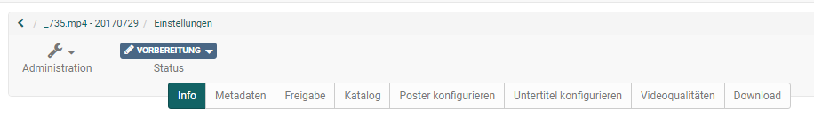
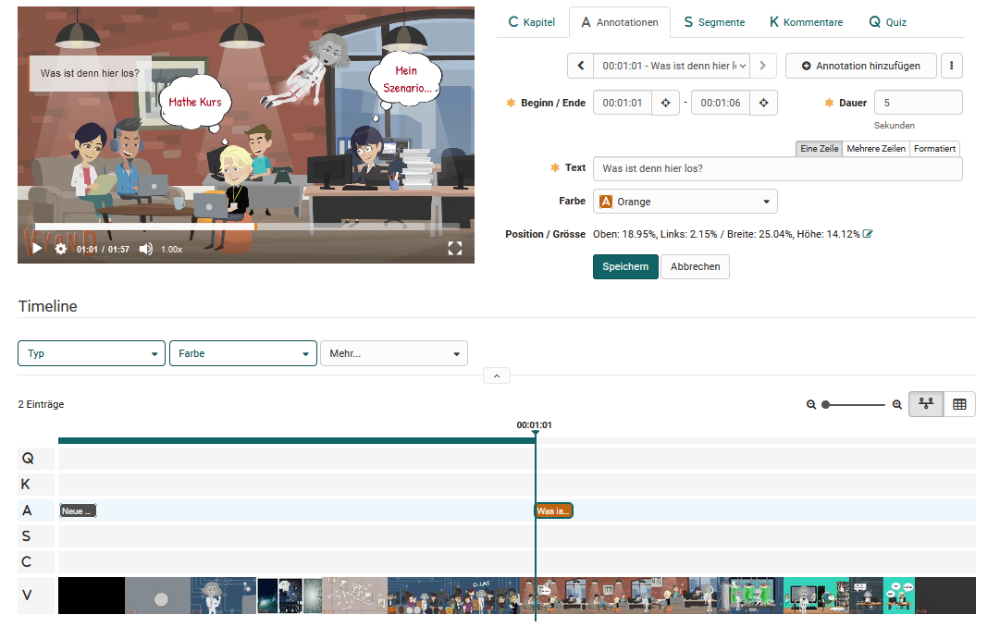
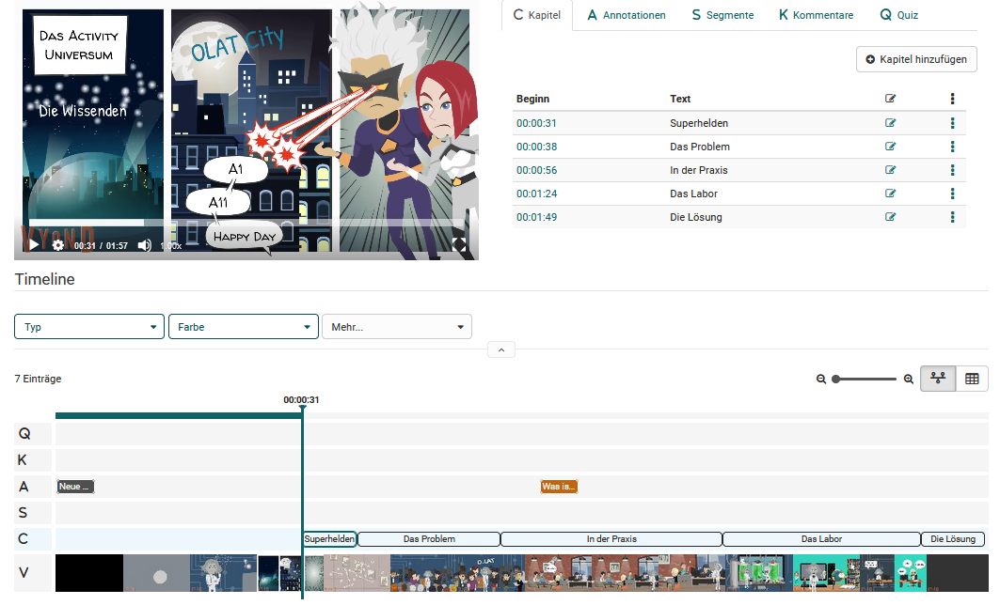
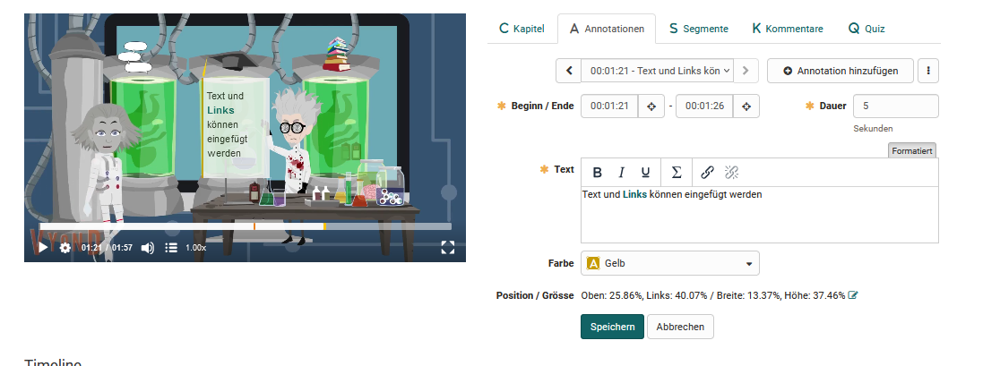
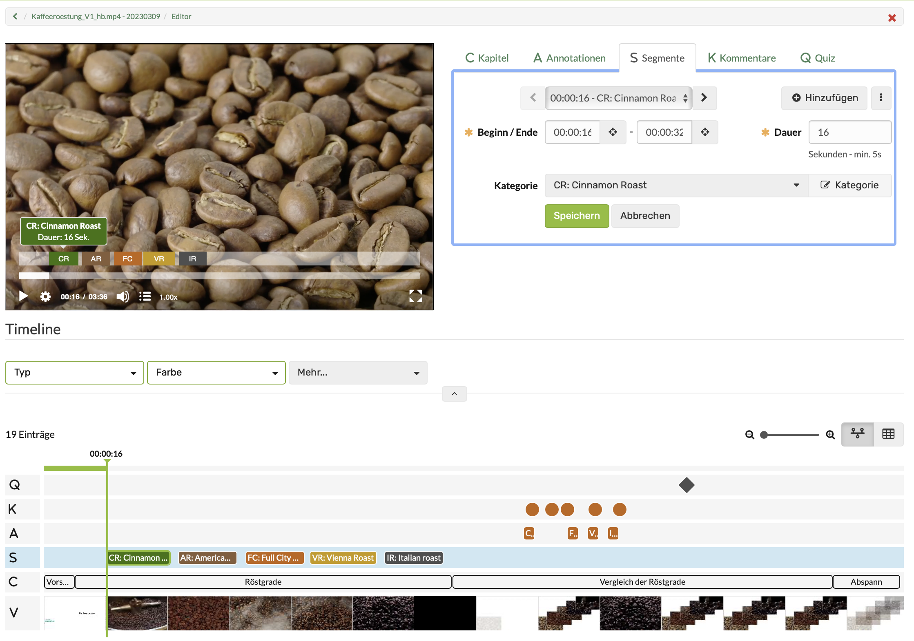
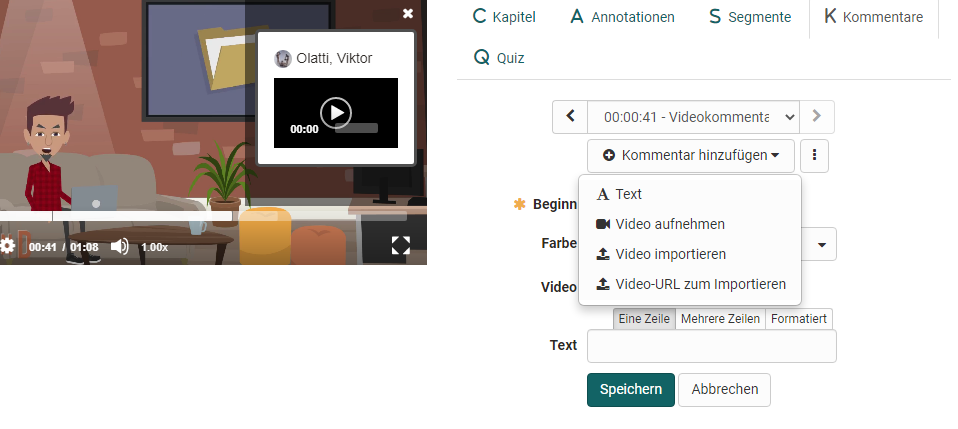
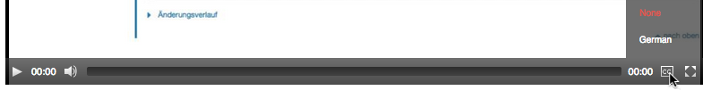
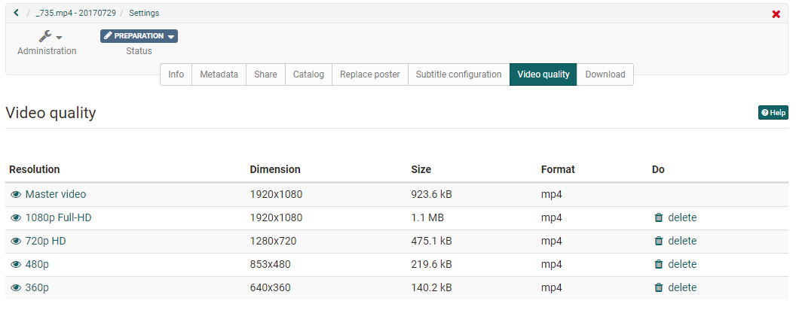
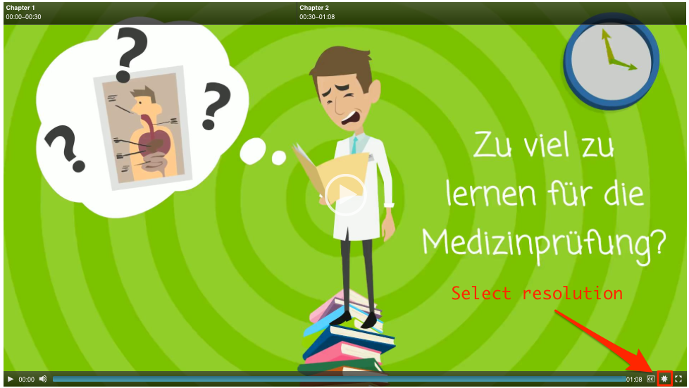

# Learning resource: Video

A video learning resource is created in authoring with the feature "[Import](../area_modules/Authoring_BulkActions.md)" or "Import URL". Therefore you select the desired video-file in the upload window and click on "Import". 

In the following step the form opens on [info page](../learningresources/Course_Settings.de.md). 

  
 
If a description is indicated on the info page after the import, it can be shown as course description when embedding into the course.Y ou can find out how to integrate videos from the video learning resource into a course in general in the chapter ["Course element video"](Course_Element_Video.md).

!!! info

    If a file is imported, it must be in .mp4 format. Further technical information can be found [here](Video_Upload.md).

!!! info "Note for YouTub videos"

    If YouTube videos are imported via "Import URL" YouTube, metadata of the YouTube file, such as the title or a start image, are also imported.

##  Video Editor

In the administration of the learning resource, you will find a link to the "Video Editor". Here you can add (interactive) elements to the video and further configure it. 

The Video Editor includes three editing areas:
 
* Configuration area
* Timeline
* Preview area

The following can be configured: Chapters, annotations, segments, comments and quizzes. 

!!! info "Hint"

    It is helpful to mark the different elements with different colours. 

### Chapters {: #video_chapter}

"Chapters" can be added to each video as jump labels. This simplifies especially the navigation in the video and should be used for longer videos. A chapter is added with the button **"Add chapter"**. The name of the chapter can be inserted. Additionally the begin of the chapter needs to be defined.

Alternatively the video can be stopped at the place, where the new chapter should start. Click the button "Add chapter". The starting time is taken over automatically and only the name of the chapter needs to inserted.

Chapters can then be edited and deleted. Furthermore, the chapters are visible in the timeline.

### Annotations

In addition to the chapter markers, further annotations and comments can also be stored at any point in the video, e.g. to highlight particularly important points or to supplement certain aspects. In addition to text, links can also be set that lead, for example, to further information or additional videos.

 

Select the place where the annotation should be added and define the further settings, such as the duration, the position where the annotation should appear and of course the text to be displayed. The annotation blocks can be flexibly moved by drag&drop.

### Segments

Segments are needed in the course element video task. These are video segments to which the participants have to assign given terms or situations (= categories).

{ class="shadow lightbox" }

**Create segments**

1. Select the desired video in the Authoring area.
2. Then open the video editor under "Administration".
3. In the video editor, select the "Segments" tab.
4. Inserted segments are displayed in the timeline in a separate track. (They can never overlap).

!!! hint "Hint"

    * Use the play button on the video to check your work.
    * You can click on a segment in the timeline and this will take you directly to the editing of that segment.

**Activate segments in the course element**

1. In the Authoring area, select the course into which the video learning resource is to be inserted.
2. Open the course editor under "Administration".
3. Select the course element or insert a new course element (video or video task).
4. **a) Course element Video task**:  In the "Configuration" tab you will find the section "Show video elements". There you have to find the segments activated, because a video task necessarily needs segments. 
**b) Course element „Video“**:  In the tab "Learning content" you will find the section "Show video elements". There you can show or hide the display of the segments.

### Comments

Comments can be placed specifically at a certain point in the video and, for example, highlight important key statements of the video, provide supplementary information on the topic or notes on the following video section. The comment is marked with the name of the person who created it.

If the user watches the video, it stops at the point marked with the comment. To continue, either the comment must be actively closed or the play button of the video must be clicked manually.

In addition to simple text comments and the integration of existing videos (import as a file or via URL, e.g. from YouTube), video comments can also be recorded and integrated directly in the editor via the recording function.

  

### Quiz

Here you can add individual quiz questions to the video. There are currently 12 different question types to choose from. The question can then be further configured. 

To configure the quiz question, you can
* define the time at which the question should appear
* define a time limit for processing
* and define whether there should be several solution attempts for a question, or whether these may be skipped

The actual tabs displayed for the quiz question depend on the question type selected. The first tab contains the specific question and the answers. The tab **"Score"** defines the type of points to be awarded. 
In the tab **"Feedback"** feedbacks based on different criteria can be added. In the tab **"Preview "** or **"Preview solution "** you can see how the question is displayed.

!!! note "Note"

    Further information on the general settings of quiz and tests can be found in the chapter "Configuring test questions". For more information on the different question types, see the "[Test Question Types](../learningresources/Test_question_types.md)" chapter.

## Videokonfiguration in den "Einstellungen" der Lernressource

You can now further configure your video in the tabs of the "Settings" of the administration menu.

The "Info", "Share" and "Catalog" tabs are analogous to other learning resources. 
The tab "Catalog" only appears if the catalog 1.0 is activated. For general information about the Settings menu, click 
[here](../learningresources/Course_Settings.md).

### Metadata

In the tab "Metadata" you find general information like creation date and size of video file. Furthermore, as in other learning resources, you have the option to store information on authors, subject areas, main language, time required and license.

### Replace poster

In the tab "Replace poster" you determine the picture which should indicate the video in the course area, in the catalog, on the Video Collection page, in the Authoring area as well as in the course. With the help of "Replace poster" button you can choose between 8 freeze frames of the videos. If you prefer your own picture, choose the button "Upload poster". If no poster is added, the freeze frame from the beginning of the video appears.

!!! warning "Attention"

    Please consider that your own pictures needs the same pixel size as the original video. The corresponding data can be found in the tab "Metadata".
 
###  Subtitle configuration {: #video_subtitles}

A video can be subtitled in any number of languages. In OpenOlat, subtitles are uploaded in the [WebVTT format](https://w3c.github.io/webvtt/) ([Wikipedia article](https://en.wikipedia.org/wiki/WebVTT)). The uploaded files need the ending .vtt. You can create subtitles easily on your own. The format presented below is supported by most video players. 

!!! note "Note"

    The first line of the VTT document must be the keyword WEBVTT, followed by an empty line.

Before every subtitle line, a time specification is needed in the following format:

!!! note "Note"

    hh\:mm\:ss.msec 

    Example: 00:00:20.396 (time specification 0 hours, 0 minutes, 20.396 seconds)

    Milliseconds must be specified to the 3rd digit after the decimal point.

!!! warning "Attention"

    The separators of the time specification must be colon and period 
    (as in the example above). Commas are not allowed.

The following example shows the beginning of a typical VTT file:  

!!! note "Note"

    WEBVTT

    00:00:00.000 --> 00:00:04.000 
    Where did he go?

    00:00:03.000 --> 00:00:06.500 
    I think he went down this lane.

    00:00:04.000 --> 00:00:06.500 
    What are you waiting for?

**Adding subtitles**

To add subtitles to a video

  1. Open "Administration &rarr; Settings",
  2. navigate to the tab "Subtitle configuration", 
  3. click the button "Add subtitle".
  4. In the new window choose the language in which you want upload the subtitles and 
  5. select the corresponding file.
  6. Click "Upload".

Already created subtitles are listed in the table and can be deleted there as well.

**Displaying subtitles**

By default the videos in OpenOlat are played without subtitles. 

As soon as subtitles are available, the following icon will be shown in the video player:
{ class=size16 }.

CC stands for the american expression "[Closed captions](https://en.wikipedia.org/wiki/Closed_captioning)" (Wikipedia), and means that subtitles are invisible until they get activated by the user. In OpenOlat it looks like the following:

As soon as you move the cursor over the icon the list with the existing subtitles expands. The current selection is colored in.

###  Video quality {: #video_quality}

In the tab "Video quality" the resolution of the video is shown. As soon as a video is uploaded, videos in different resolutions will be created. This process can take a while. The available resolutions are dependent on the settings in the Administration area. Pending videos can be transcoded and not used resolutions can be deleted. In the video player the desired resolution can be chosen by the "Source Chooser".

!!! info "Info"

    For videos added via "Import URL", the settings cannot be made.

### Download

In the Download tab you can edetermine whether the users are allowed to download the video or not.

##  Video Collection

Use the "Video Collection" page to browse through all videos that are available in your instance. In order for a video to be displayed in the "Video Collection", the publication status "Published" must be set. In combination with the access setting "Open" it will automatically be accessible to all registered users. The description of the info page is automatically displayed in the individual view of a video, as well as the rating and comment function.

!!! info "Info"

    If you miss a video, check the settings in the video settings under **"Access configuration"**.

!!! info "Info"

    If you cannot find the "Video Collection" entry in the main navigation of your OpenOlat instance, either the administrator has hidden it or you do not have the required rights.

