# Learning resource: Video

:fontawesome-solid-film:

The "Video" learning resource is the central element for videos in OpenOlat. It is (created)[../ area_modules/authoring_new_course.de.md#import-learning-resources] in the authoring area via "Import File" (to upload an MP4 file) or "Import via URL" (to embed an external video, e.g., from YouTube or Vimeo) and can then be found in the "My Entries" section of the authoring area.

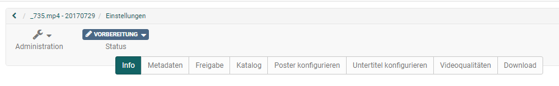  
 
A video learning resource consists not only of the video file itself, but is a standalone object with its own information page, administration menu, and sharing settings. It is available across courses and can be embedded in multiple courses or made available independently of courses.

In addition, video learning resources can be further enhanced with interactive features using the OpenOlat video editor, such as annotations or quiz questions.

For more technical information on uploading and organizing videos, click [here](../basic_concepts/Video_Upload.md).

[To the top of the page ^](#learning_resource_video)

---

## Overview of the Video Learning Resource Administration Menus {: #video_administration}

The "Video" learning resource has the following administration menus:
* **Settings** (see below)
* [Member Management](../learningresources/Members_management.md): Primarily relevant when using the video learning resource on its own. If the video is used within a course, members do not need to be managed separately. Only additional owners of the learning resource are added and managed in this menu.
* **Video Editor** (see below)
* [Offer Types](../learningresources/Offer_Types.md): Links to the booking orders
* **Replace Video**: Allows you to upload a different or new video file to the learning resource. This is useful, for example, when updating a video. The link to the learning resource and any embedded content remain intact while the new video is displayed. If subtitles already exist for the video and the frentix cloud transcoding service is active, OpenOlat asks when replacing the video whether new subtitles should be generated (see [Tab "Configure subtitles"](#video_subtitles)).
* **Copy:** Creates a copy of the learning resource, including all interactive elements added using the video editor.
* **Export content**: Creates a ZIP file of the learning resource, which can be saved locally and imported into other OpenOlat systems or used as a backup. 
* **Delete video**

[To the top of the page ^](#learning_resource_video)

---

## "Settings" menu for the Video learning resource {: #video_settings}

  

### Tab "Info"

On the "Info" tab, you can enter a description, a teaser, and a tag, which will be displayed on the video's info page. If the learning resource is embedded in the course using the Video course block, the description and title can also be displayed directly next to the video in the course. You can learn how to integrate videos—specifically, the “Video” learning resource—into a course in the chapter [“Course Element: Video”](Course_Element_Video.md).

For more information on setting up the info page, see the section ["Set up info page"](../learningresources/Set_up_info_page.md).

!!! tip "Tip"

    Since the learning resource is already a video, it is usually neither practical nor necessary to include a teaser video as well. One exception would be a short summary of a longer video intended to provide a preview of its content. However, this video would only be visible if the video learning resource is offered on its own and not as part of a course. For more information, see the "Sharing" tab. 

### Tab "Meta data"

In the "Metadata" tab, you will find general information about the video, such as the creation date and file size. As with other learning resources, you can also enter information about the authors, departments, primary language, duration, and license.

!!! note "Note for YouTube videos"

    When YouTube videos are imported via "Import URL," the metadata from the YouTube file—such as the title or thumbnail—is also imported.

### Tab "Share"

On the "Sharing" tab, you can specify whether the video learning resource should be embedded in a course or used as a standalone resource. If you select "Standalone" as the usage type, you must also define the booking method. For more information, click [here](../learningresources/Course_Settings_Share.md).

If the [Video Collection](../area_modules/Video_Collection.md) is enabled in your instance, you can also choose whether your video learning resource should be displayed there. 

### Tab "Configure poster"

On the "Configure Poster" tab, you can specify which thumbnail image should be used to display the video in the course area, in the catalog, on the Video Collection page, on the information page, in the authoring area, and within the course. 

Using the "Replace Poster" button, you can choose between different still images from the video, or alternatively, use the "Upload Poster" button to upload your own image as the thumbnail (poster). If no poster is selected, the still image from the beginning of the video will appear.

!!! tip "Tip"

    Please note that an uploaded image should have the same pixel dimensions as the original video. You can find the relevant information in the "Meta data" tab.

###  Tab "Configure subtitles"  {: #video_subtitles}

Subtitles can be uploaded manually or, if the frentix cloud transcoding service is active, generated automatically (see [Automatic subtitle generation](#video_subtitles_auto)).

If necessary, create a subtitle file for your video outside of OpenOlat and integrate it in the "Configure Subtitles" tab by uploading the VTT file and selecting the appropriate language.

A video can have subtitles in multiple languages. OpenOlat supports the [WebVTT format](https://w3c.github.io/webvtt/) (see also [Wikipedia](https://en.wikipedia.org/wiki/WebVTT)), so the file must be saved with the .vtt extension. This format is compatible with most common video players.

#### Here's what you should look out for:

!!! note "Note"

    The first line of the VTT document must contain the keyword WEBVTT, followed by a blank line.

A timestamp is required before each subtitle line, and it must be in the following format:

!!! note "Note"

    hh\:mm\:ss.msec 

    Example: 00:00:20.396 (Time: 0 hours, 0 minutes, 20,396 seconds)

    Milliseconds must be specified to the third decimal place.

!!! warning "Attention"

    The separators for time entries are a colon and a period (see the example above). 
    Commas must not be used.

The following example shows the beginning of a typical VTT file:

!!! Note "Note"

    WEBVTT

    00:00:00.000 --> 00:00:04.000 
    Where did he go?

    00:00:03.000 --> 00:00:06.500 
    I think he went down this lane.

    00:00:04.000 --> 00:00:06.500 
    What are you waiting for?

Subtitles that have already been created are listed in a table and can also be deleted there.

#### Automatic subtitle generation [:octicons-tag-16:{ title="from Release 20.2.6 (OO-9347)" }](https://track.frentix.com/issue/OO-9347){:target="_blank"} {: #video_subtitles_auto}

If the frentix cloud transcoding service is activated for the OpenOlat instance, the service automatically creates a subtitle file (transcript) in WebVTT format when transcoding an uploaded video. The following applies:

* The language of the video is detected automatically and assigned to the subtitle.
* If a subtitle file already exists for the detected language, it remains unchanged. Automatically generated subtitles do not overwrite any existing files.
* Automatically generated subtitles appear in the subtitles table just like manually uploaded ones and can also be deleted there.

!!! info "Important"

    Automatic subtitle generation is part of the frentix cloud transcoding service and is not included in the standard distribution of OpenOlat. If you are interested, please contact the frentix support: [contact@frentix.com](mailto:contact@frentix.com)

#### Subtitles when replacing a video [:octicons-tag-16:{ title="from Release 20.2.6 (OO-9347)" }](https://track.frentix.com/issue/OO-9347){:target="_blank"}

If a new video file is uploaded via the "Replace Video" administration menu and subtitles already exist, OpenOlat asks in the dialog "Generate subtitle?" whether a new subtitle should be generated for the replaced video, provided the cloud transcoding service is active.

* **Yes**: The existing subtitle files are deleted and new subtitles are automatically generated for the new video.
* **No**: The existing subtitle files are kept.

#### Show subtitles in the video

By default, videos in OpenOlat play without subtitles. 

When subtitles are available, the following icon appears in the video player:
{ class=size16 }.

CC stands for the American term "[Closed captions](https://de.wikipedia.org/wiki/Untertitel#Technische_Ausf.C3.BChrungen)" (Wikipedia), and means that subtitles are hidden until the user turns them on. In OpenOlat, this function is located at the bottom right of the player. When you hover your mouse pointer over the icon, the list of available subtitles unfolds. The currently selected option is highlighted.

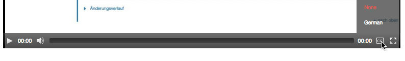

###  "Video Quality" tab {: #video_quality}

In the "Video Quality" tab, you can see the resolutions in which the video is available. As soon as a video is uploaded, versions in various resolutions are created. This process may take a while. The resolutions available for download depend on the settings in the administration area. Pending videos can be transcoded, and unused resolutions can be deleted.

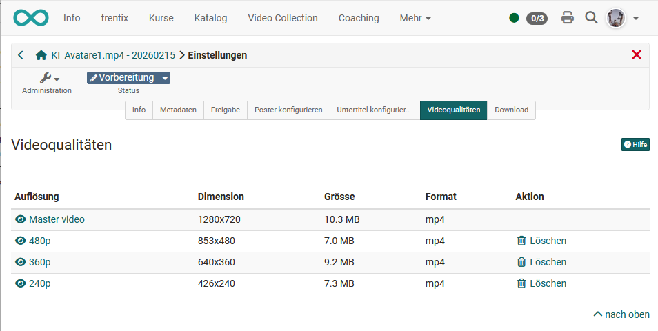

In the video player, you can select the desired resolution using the "Source Chooser" if needed.

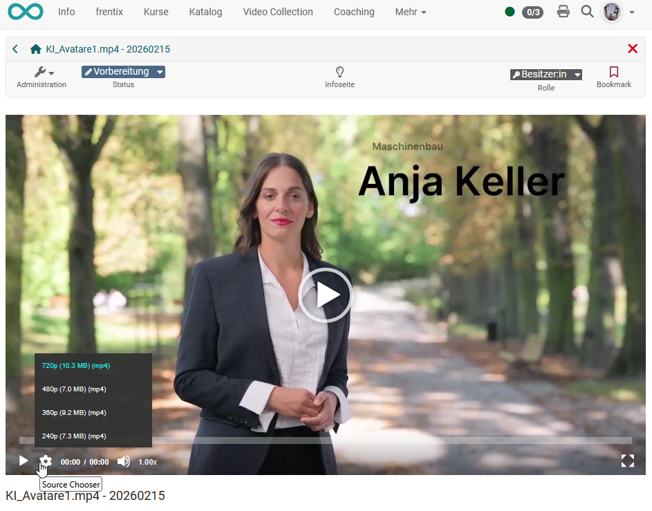

!!! info "Important"

    You cannot configure settings for videos added via "Import URL".

### Tab "Download"

In the Download tab, you can specify whether users are allowed to download the video or not.

!!! info "Important"

    You cannot configure settings for videos added via "Import URL".    

### Tab "Catalog"

The "Catalog" tab appears only if [Catalog 1.0](../area_modules/catalog1.0.md) is enabled in the OpenOlat instance. You can then add the learning resource to the catalog. 

[To the top of the page ^](#learning_resource_video)

---

##  Menu "Video Editor"  {: #video_editor}

In the learning resource administration, you will find the link to the "Video Editor".

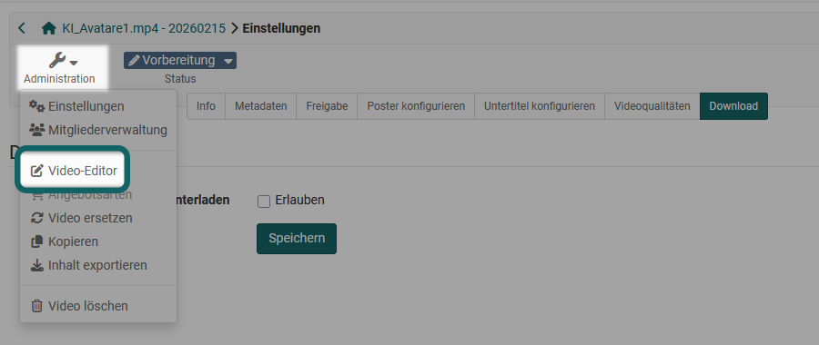

Here, you can enhance the video with (interactive) elements and further customize it. 

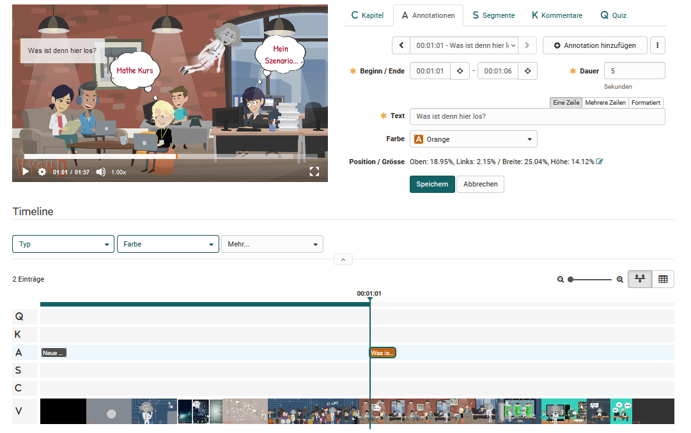

The Video Editor includes three editing areas:
 
* Configuration area (top right)
* Timeline (bottom)
* Preview area (top left)

The following can be configured: Chapters, annotations, segments, comments and quizzes. 

### Video editor: Chapters [:octicons-tag-16:{ title="from Release 11.1 (OO-2246)" }](https://track.frentix.com/issue/OO-2246){:target="_blank"} {: #video_chapter}

"Chapters" can be added to each video as jump labels. This simplifies especially the navigation in the video and should be used for longer videos. A chapter is added with the button **"Add chapter"**. The name of the chapter can be inserted. Additionally the begin of the chapter needs to be defined.

Alternatively the video can be stopped at the place, where the new chapter should start. Click the button "Add chapter". The starting time is taken over automatically and only the name of the chapter needs to inserted.

Chapters can then be edited and deleted. Furthermore, the chapters are visible in the timeline.

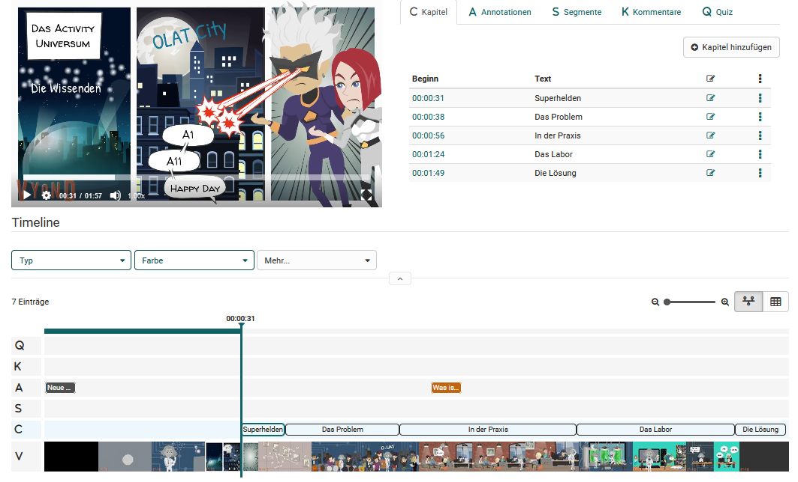

### Annotations

In addition to the chapter markers, further annotations and comments can also be stored at any point in the video, e.g. to highlight particularly important points or to supplement certain aspects. In addition to text, links can also be set that lead, for example, to further information or additional videos.

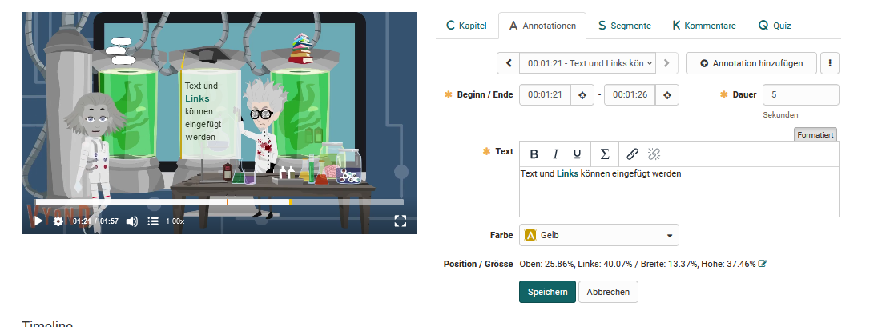 

Select the place where the annotation should be added and define the further settings, such as the duration, the position where the annotation should appear and of course the text to be displayed. The annotation blocks can be flexibly moved by drag&drop.

### Video editor: Segments  {: #video_segments}

Segments are specific sections of a video that are assigned to, for example, an overarching theme or structure. Segments are particularly relevant in courses for the "Video" and "Video Assignment" course blocks, where they can be displayed and used.

#### Create segments

In the video editor, select the "Segments" tab and click "Add". The configuration menu will appear. 

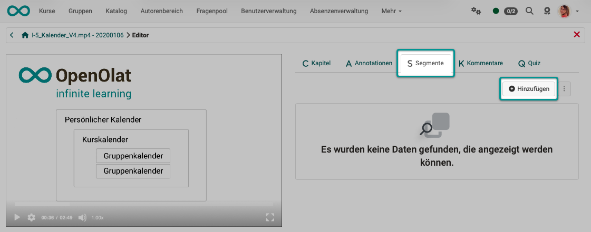{ class="shadow lightbox" }

For each segment, you must create an element by clicking "Add" and assign it an appropriate time slot and **term**.  The segments must not overlap in time. In other words, exactly one term is assigned to each time segment.

You can enter all relevant video segment terms directly and then assign them to specific time points in the second step. To do this, follow these steps:

* Click the "Terms" button. 

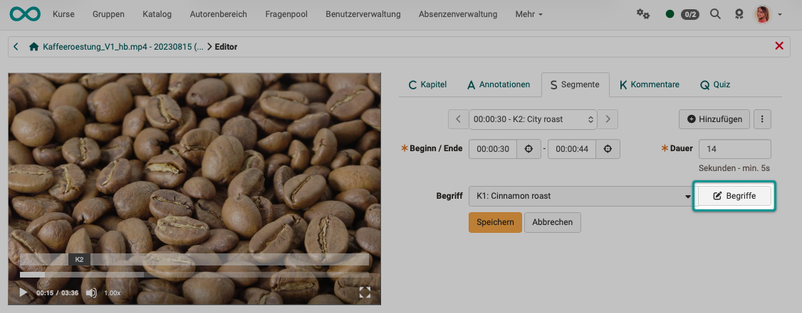{ class="shadow lightbox" }

* Use the plus sign to add all relevant terms. If possible, list them in the order they appear in the video. This will make it easier to match them up later.

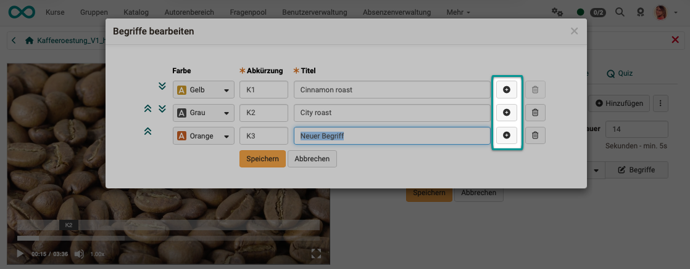{ class="shadow lightbox" }

Alternatively, you can jump to the desired point in the video timeline and then add the appropriate term for that segment. Here’s how: 

* Navigate to the desired location on the timeline and click "Add"
* Add a name for this starting point or select one from the list. Set the duration and save.
* Skip to the next item and click "Add" again, and so on.

Inserted segments are displayed in a separate track on the timeline, allowing you to quickly access and edit them. 

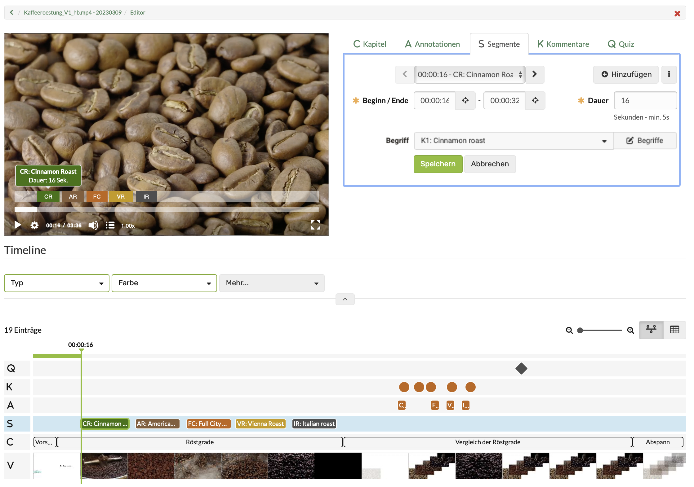{ class="shadow lightbox" }

!!! tip "Hints"

    * Use the play button on the video to check your work.
    * You can click on a segment in the timeline to go directly to the editing screen for that segment.

The segments are primarily used in the "Video Assignment" course module. How could you use the segments here? Here are a few ideas:

a) For example, instructors could assign a key concept to a specific time slot in the video. Later in the course, students must locate the exact point where this aspect appears. 
b) Instructors define different phases of a process and label them as segments. Students must then identify the corresponding sections in the video. This works similarly when matching theories. 
c) When watching a video recording of a kindergarten scene, a job interview, or other real-life footage, the goal is to identify specific typical aspects or mistakes.  

### Video editor: Comments {: #video_comments}

Comments can be placed specifically at a certain point in the video and, for example, highlight important key statements of the video, provide supplementary information on the topic or notes on the following video section. The comment is marked with the name of the person who created it.

If the user watches the video, it stops at the point marked with the comment. To continue, either the comment must be actively closed or the play button of the video must be clicked manually.

In addition to simple text comments and the integration of existing videos (import as a file or via URL, e.g. from YouTube), video comments can also be recorded and integrated directly in the editor via the recording function.

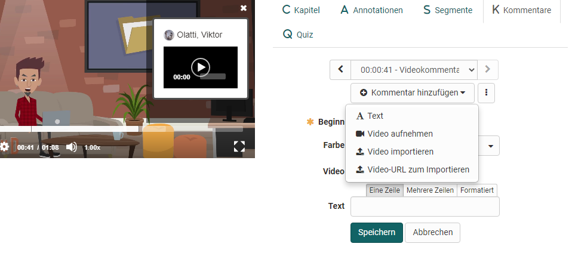  

### Video editor: Quiz {: #video_quiz}

Add individual quiz questions to your video. There are currently 12 different question types to choose from. Simply select a question type from the list, and you’ll be taken to the quiz editor for that specific question. Enter the question and answer options here, then save your changes.

The specific tabs for the quiz question correspond to the selected question type. 

!!! note "Note"

    For more information on the different question types, see the chapter "[Test Question Types](../learningresources/Test_question_types.md)".

After entering the information, you will return to the video editor, where you can continue configuring the quiz question for the video. Here, define:

* the starting point of the quiz question in the video -> "Start"
* how much time the user has to answer the quiz question. 
* whether the question may be skipped
* whether multiple attempts are allowed
* the color used to highlight and display the question

The quiz questions in the video are "assessed" immediately as they are answered—but only to determine whether the answer is correct or incorrect. The points assigned to a question do not factor into the video's functionality. There is therefore no overall score at the end of the video. (However, if the same question is used in a test, for example, the points will be counted.)

If a question is answered incorrectly, and there is only one attempt allowed for that question and it cannot be skipped, the video will return to the beginning and the user will not be able to proceed. 

!!! note "Note"

    The quiz questions are primarily intended to engage students and encourage brief reflection. They are not suitable for complex assessment procedures. 

[To the top of the page ^](#learning_resource_video)

---

## Further information {: #further_information}

[Course element Video >](../../manual_user/learningresources/Course_Element_Video.md) 
[Course element Video task >](../../manual_user/learningresources/Course_Element_Video_Task.md) 

[To the top of the page ^](#learning_resource_video))
