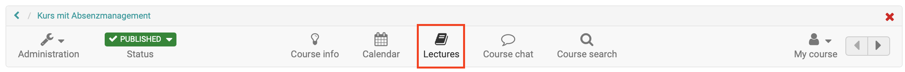
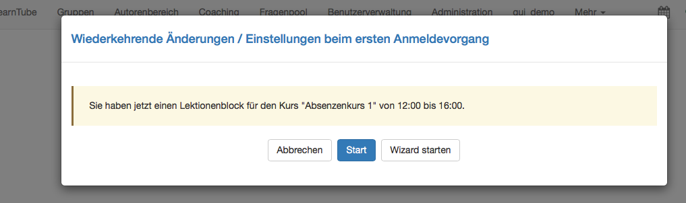
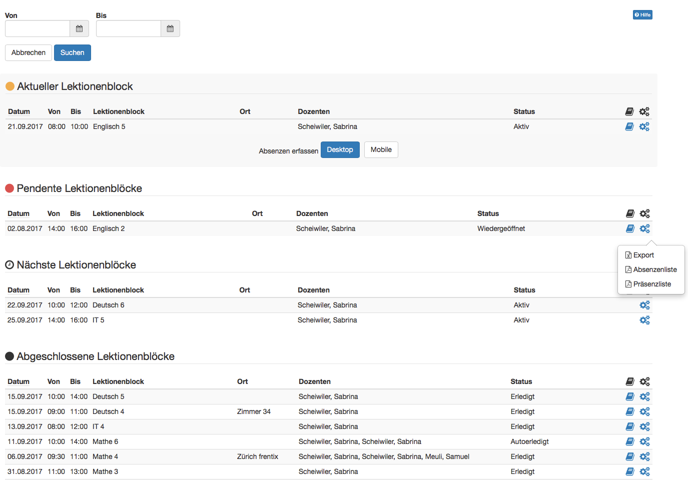
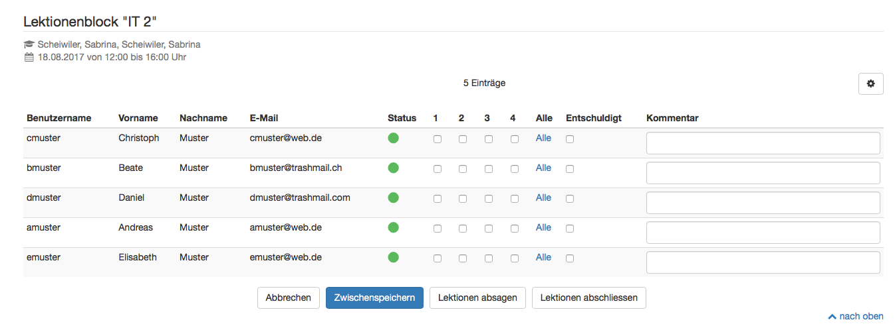
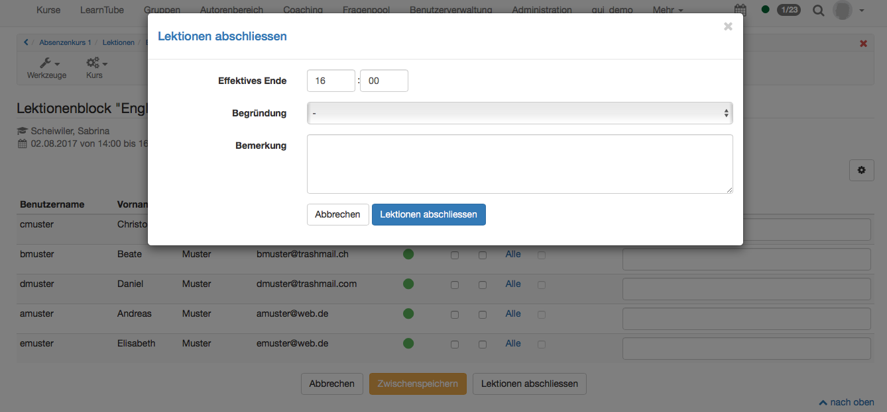
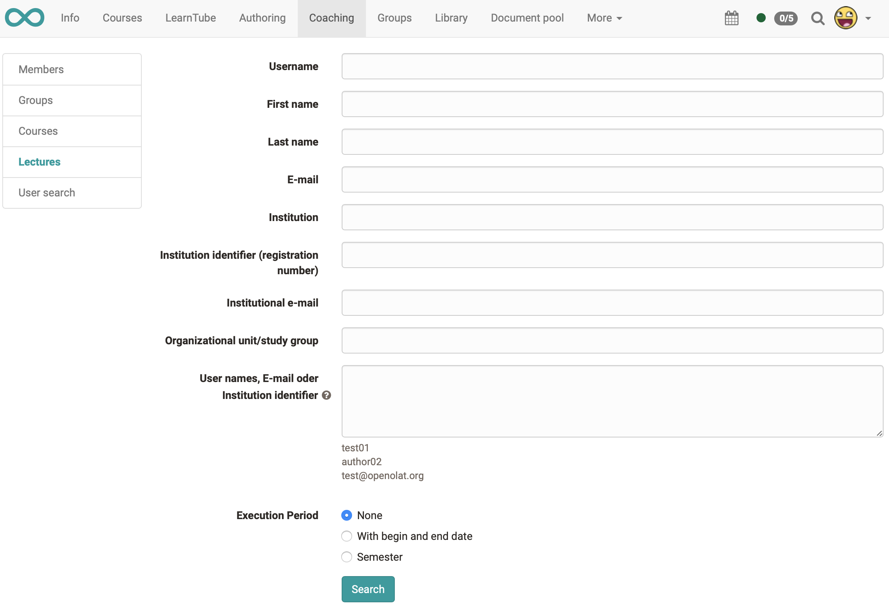

# Lectures - Teacher view

Lecturers can open the absence check in the toolbar of the corresponding course.

If a course has an active lecture block during login, the absence control can be opened directly. "Start" opens the absences control for the desktop view, "Start Wizard" opens the mobile view.

## Overview lecture blocks

Click on the book symbol  in the toolbar to open an overview of the current, pending, next and completed lecture blocks.

 **Current lecture block**: The absences check can also be started from here. Again either the desktop or the mobile view can be opened.

 **Pending lecture blocks**: Here you will find the lecture blocks for which the absence control is to be recorded. They are either in status "Active" or "Reopened".

 **Next lecture blocks**: Lecture blocks whose start date is in the future cannot be edited. Planned absences, such as a sports dispensary due to an injury, cannot be recorded in advance.

 **Completed lecture blocks**: Here all lecture blocks are listed which have been completed either manually (status "Completed") or automatically (status "Auto Completed"). A lecture block is automatically completed when the lock period has been reached. A reminder will be sent to the lecturer before reaching the end of the block to inform him of the pending absence check. The blocking period is stored system-wide in the administration.

You can use

to create various documents. Export creates an Excel list. In this Excel list all participants are listed including absences, reasons and comments. The list of absences (sorted alphabetically by surname) is generated as a PDF file and displays content similar to that of the Export Excel. The entered absences are also displayed here, but the reason is not. Finally, a presence list (sorted alphabetically by surname) can also be created as a PDF file. This presence list can be printed out and signed by the participants.

## Capture Lectures - Perform Absence Checks

Here you can set the status for the individual lectures of a block as well as for all lectures of the block. By default, it is assumed that the listed people were present. Absences are set by activating the corresponding checkbox or by selecting "All" if the absence applies to all lectures. Afterwards you can define whether the absence was excused or not, if this option was activated in the administration. A reason must be added for the excused absence. A comment can also be added to each person-related absence. This comment is visible in the absence check for the instructor (course coach) and in the evaluation for the course owner. Course participants do not see this comment.

Lectures can be cached, cancelled or completed. The current status of the absence check is saved with "Intermediate storage" and the recording can be continued at a later point in time.

If an appointment is cancelled, e.g. because the lecturer was ill, the option "Cancel lectures" should be selected. A reason must be selected here. The reasons are recorded system-wide in the administration and cannot be added by the lecturer.

As soon as the absence check is completed, you can "complete the lecture". The "Effective end" must be entered here. The planned end is displayed by default. The evaluation gives course owners an overview of whether the lecture blocks were completed as planned or why they were completed at a different time. This is because a reason must also be selected here. For example, the earlier termination of the lecture block can be justified by working through pauses. If desired, a comment can be added to the entire lecture block. This remark is only visible for the course owner.

As soon as the lecture block is completed, the recurrence period begins for the course participants. If, for example, an appeal is successfully submitted (e.g. a medical certificate in case of illness), the lecture block can be reopened afterwards and the absence check adjusted. The lecture block must then be reopened.

## Coaching Tool

The [Coaching Tool](../area_modules/Coaching.md) can be used to obtain an overview of absences over several courses or over an entire semester. In the menu on the left "Lectures" is selected. Now you can search for a user, for example. All courses with absence management by this user will then be displayed.

In the Coaching Tool, however, specific persons, groups or courses can be displayed or the user search can be used. Then all courses with absence management from the selected user(s) will be displayed.

A class can also be displayed. For example, the column with the usernames or the e-mail is copied from a class list and inserted into the field "Username, e-mail or institution number".

You can also select a semester under execution period. Semesters can only be selected if they have been entered in the administration. Otherwise, a start and end date is selected manually. For example, you can read out the data required for the creation of certificates.

  

