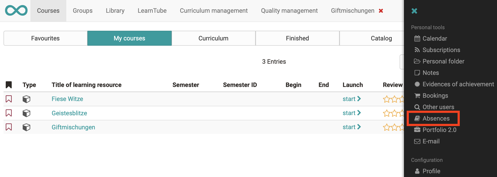
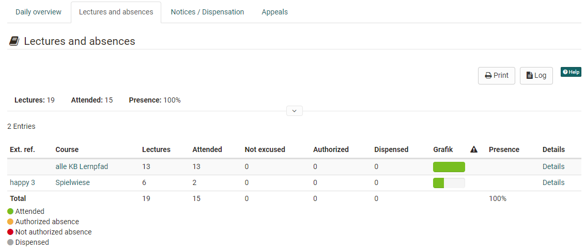

# Lectures - User view

A user can open his absences in the personal menu.

## Overview of courses

Here the user (course participant) can see the courses in which absence management is used. The overview includes the tabs daily overview, lessons and absences with all courses, the user's cancellations and absences as well as any appeals.

He or she can see how many lectures are recorded per course and how his or her attendance or absence is distributed per course. The progress to date is also displayed. Green stands for present lectures, orange for excused lectures and red for absent lectures. Further details can also be displayed via the "Details" option. A red exclamation mark appears in the column

if the attendance rate falls below the required minimum.

  

## Detailed view of a course

If the user displays the details of a course, the individual sessions, lecture blocks, lecturers (coaches) and the details of attendance are displayed. In the following columns the number of lectures for Present, Absent and Excused is displayed. The legend at the bottom left explains the colored meanings of each status.

  *  **Cancelled**: If a lecture block has been canceled, it will not be included in the attendance rate.
  *  **In process**: Means that a lecture block has reached the end date, but the absence check has not yet been completed.
  *  **Voluntary event**: Lectures are recorded as a lecture block, but are not calculated for the attendance rate. Voluntary lessons are not checked for absences.

If a participant does not agree with the registered absence, an appeal can be submitted. After the block of lectures has ended, a date will appear from which the appeal can be submitted. This will be calculated from the end time of the lecture block plus the days of the blocking period. As soon as a lecture block has been set to "Done" automatically (after the end of the blocking period) or manually by the instructor (course coach), a new date appears until which the appeal can be submitted. Closed" is then displayed. The deadlines are stored system-wide in the administration. The appeal request is sent to the lecturers of the corresponding lecture block.

  

