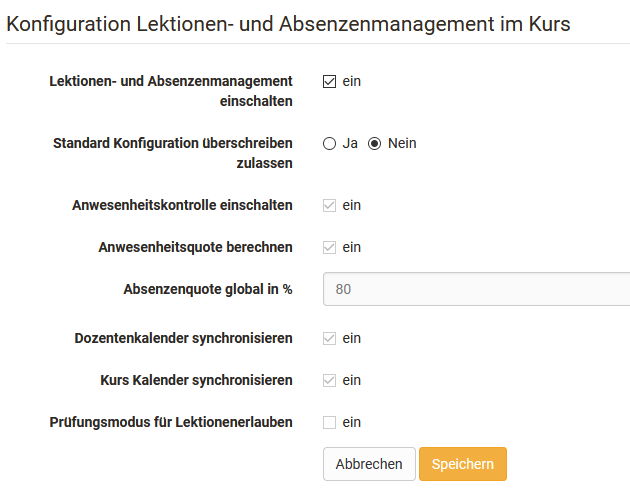
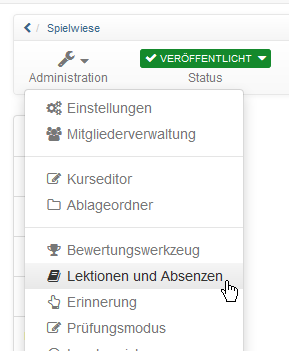
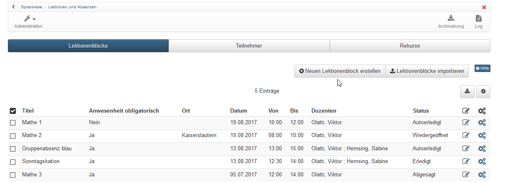
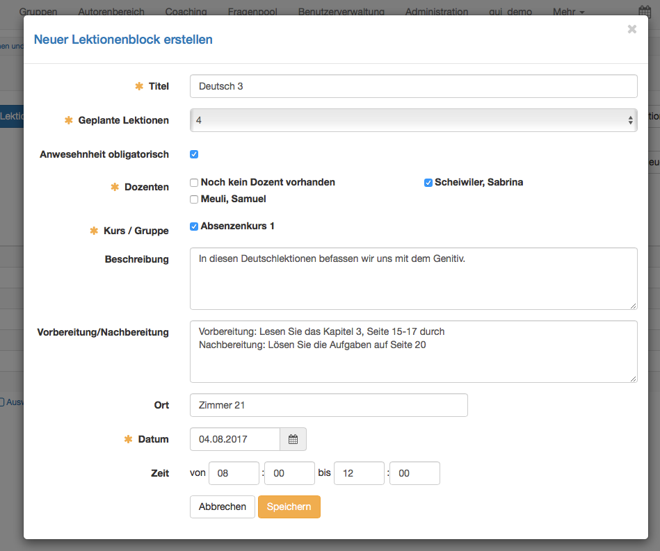
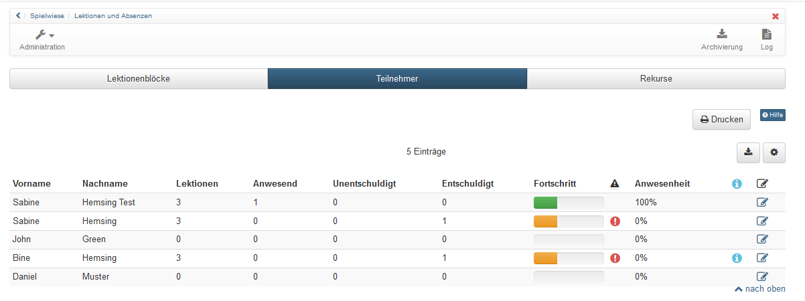

# Lektionen und Absenzen

Das Absenzmanagement bietet die Möglichkeit, online Anwesenheitslisten zu führen und Fehlzeiten zu dokumentieren. Die Anwesenheitskontrolle wird pro Kurs geführt. Dafür können im Kurs Lektionenblöcke mit 1-12 Lektionen erstellt werden. Die einzelnen Lektionen ermöglichen es, dass Teilnehmende einzelne Lektionen aus einem Lektionenblock fehlen können und nicht gleich den gesamten Lektionenblock als abwesend eingetragen bekommen.

Die allgemeinen Einstellungen werden systemweit in der
[Administration](../../manual_admin/administration/Lecture_and_roll_call_management.de.md) vorgenommen. Ferner kann das Absenzmanagement generell vom OpenOlat Administrator ein- oder ausgeschaltet werden.

Auf dieser Seite finden Sie die Ansicht des Kursbesitzers. Informationen zur Handhabung für den [Dozenten](../learningresources/Lectures_Teacher_view.de.md) und die [Kursteilnehmenden](../learningresources/Lectures_User_view.de.md) finden Sie in den entsprechenden Kapiteln. Die Anwesenheitskontrolle wird anschliessend durch einzelne Dozenten (Kursbetreuer) durchgeführt. Enthält ein Kurs keine Kursbetreuer kann das Werkzeug nicht sinnvoll genutzt werden.  

# Kursbesitzerperspektive

## Absenzmanagement als Kursbesitzer aktivieren

Aktivieren und konfigurieren Sie das Lektionen und Absenzmanagement des Kurses im Menü "Administration" -> "Einstellungen" -> "Durchführung".

Anschliessend erscheint das Menü "Lektionen und Absenzen" unter Kurs Administration.  

Hier können Sie Lektionenblöcke erstellen, löschen und sich einen Überblick über den Stand der Anwesenheit der Teilnehmenden verschaffen und Einträge bearbeiten. Die Erstellung dieser Lektionenblöcke erfolgt im Kurs durch den Kursbesitzer (oder wird von einem externen Verwaltungssystem ins OpenOlat synchronisiert).  

## Tab Lektionenblöcke

Im ersten Tab "Lektionenblöcke" können neue Lektionenblöcke erstellt oder importiert sowie existierende Lektionsblöcke überarbeitet und über Einstellungen gelöscht werden. Auch ein logfile kann angezeigt werden.

Mit der Schaltfläche "Neuer Lektionenblock erstellen" wird ein neuer Block erstellt.

### Lektionenblock erstellen

 **Titel**: Vergeben Sie einen sinnvollen Namen.

 **Geplante Lektionen**: Hier wird angegeben, wieviele Lektionen dieser Lektionenblock umfasst. Ein Lektionenblock kann 1 - 12 Lektionen umfassen.

 **Anwesenheit obligatorisch**: Wenn die Anwesenheit obligatorisch ist, muss eine Anwesenheitskontrolle durchgeführt werden. Der Lektionenblock zählt dann auch zur Anwesenheitsquote. Wenn der Block freiwillig ist, wird er nicht in die Berechnung der Anwesenheitsquote einbezogen.  

**Dozenten**: Für jeden Lektionenblock muss ein Kursbetreuer ausgewählt werden. Nur die ausgewählten Kursbetreuer können die Anwesenheitskontrolle durchführen. Möchte ein Kursbesitzer ebenfalls diese Funktion übernehmen, muss er sich zusätzlich als Kursbetreuer in den Kurs eintragen.

 **Kurs / Gruppe**: Hier wird definiert, für wen dieser Lektionenblock gedacht ist. Entweder für den gesamten Kurs oder für die entsprechenden Gruppen. So kann das Absenzmanagement beispielsweise nur für einen Teil der Kursmitglieder eingesetzt werden.

 **Beschreibung**: Hier können Sie optional eine Beschreibung für den Lektionenblock hinzufügen.

 **Vorbereitung/Nachbereitung**: Falls Sie den Teilnehmenden einen Vor- bzw. Nachbereitungsauftrag zum jeweiligen Termin geben möchten, kann dieser hier hinzugefügt werden. Er wird im Kalender angezeigt, sofern die Lektionen mit dem Kurskalender synchronisiert werden (Einstellung in der Administration).

 **Ort**: Hier wird angegeben, wo dieser Lektionenblock stattfindet. Das kann z.B. ein Präsenzort oder die genaue Zimmerbezeichnung sein.

 **Datum**: Ein Datum muss zwingend angegeben werden.

 **Zeit**: Die Zeit kann optional hinzugefügt werden. Die Kalendereinträge können jedoch nur mit einer Zeitangabe korrekt angezeigt werden.

## Tab Teilnehmer

Im Tab "Teilnehmer" erhalten Sie eine Übersicht über alle Teilnehmenden des Kurses oder der ausgewählten Gruppen. Es wird angezeigt, wie viele Lektionen insgesamt erfasst sind, und anschliessend bei wie vielen Lektionen der Teilnehmende anwesend, abwesend und allenfalls entschuldigt war. Im Fortschritt wird die Anwesenheit grafisch dargestellt. Grün symbolisiert die Anwesenheit, orange entschuldigte und rot abwesende bzw. unentschuldigte Lektionen. In der Spalte Anwesenheit wird die Anwesenheitsquote für die bereits stattgefundenen Lektionen berechnet. Wenn beispielsweise erst eine Lektion stattgefunden hat und der Teilnehmende anwesend war, wird in der Spalte "Anwesenheit" 100% angezeigt.

{class="size24"} In der Achtungsspalte mit dem Symbol wird angezeigt, ob die definierte Anwesenheitsquote erreicht worden ist. Wird ein rotes Ausrufezeichen angezeigt, wurde das erforderliche Limit nicht erreicht.

{class="size24"} In der Infospalte werden Informationen angezeigt, welche von der Standardeinstellung abweichen. Dies ist beispielsweise ein persönlicher Schwellwert oder ein späterer Kursstart. Diese beiden Optionen können in den Einstellungen (Stift) definiert werden. Der persönliche Schwellwert definiert die zu erreichende Anwesenheitsquote für den entsprechenden Teilnehmenden. Mit der Erstzulassung wird definiert, wann der Teilnehmende mit dem Kurs begonnen hat. Die Anwesenheitsquote wird basierend auf der Erstzulassung berechnet. Die Lektionen, welche vor dem Datum der Erstzulassung stattgefunden haben, werden nicht mitgerechnet.
