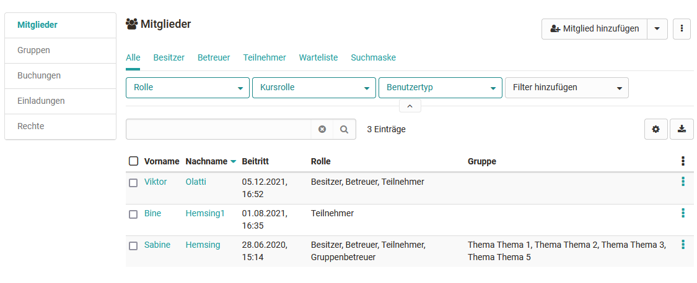
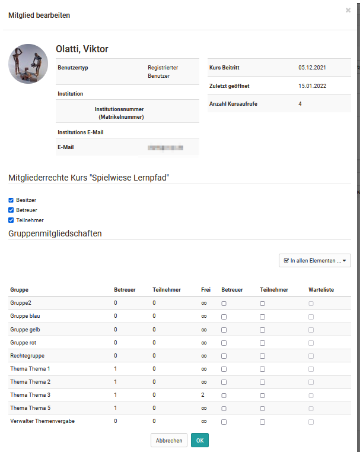
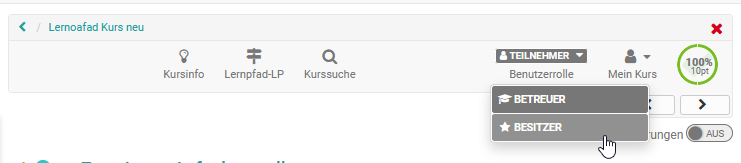
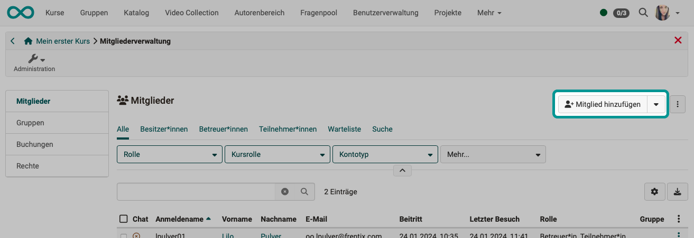

# Mitgliederverwaltung {: #members_management}

In der Mitgliederverwaltung sehen Kursbesitzer:innen alle Benutzer:innen und Gruppen eines Kurses und können diese umfassend organisieren z.B. bestimmte kursbezogene Rechte vergeben, Teilnehmer kontaktieren und Kurs-Gruppen organisieren. Das Rechtemanagement und die Verwaltung der Einwilligungen zu kursbezogenen Nutzungsbedingungen bzw. Datenschutzerklärung erfolgt ebenfalls hier.  

{ class="shadow lightbox" }

## Bereich "Mitglieder" {: #section_members}

Wenn Sie die Mitgliederverwaltung öffnen, befinden Sie sich im Bereich "Mitglieder" und sehen eine tabellarische Auflistung aller Personen die Zugriff auf den Kurs bzw. die Lernressource haben. Über verschiedene Tabs können Sie sich alle oder bestimmte Kursmitglieder z.B. alle Betreuer oder ausschließlich die Teilnehmenden anzeigen lassen. Sie können die Rollenzuordnung der Personen bearbeiten, sie aus dem Kurs entfernen oder ihnen eine E-Mail schicken. Des Weiteren können Sie die jeweiligen Mitglieder als Excel Tabelle exportieren.

Über das Suchfeld kann nach Mitgliedern eines Kurses gesucht werden, was bei vielen Teilnehmenden hilfreich ist.

Wählen Sie die für Sie relevanten Spalten über das Zahnrad Menü aus und sortieren Sie die Liste nach Ihren Wünschen.
  

### Benutzerinformationen bearbeiten

Wenn Sie eine Person aus der Liste auswählen, erhalten Sie weitere Informationen zu dieser Person z.B. sehen Sie die Anzahl der Kursaufrufe und können der Person weitere Rollen zuordnen.

Es gibt drei spezifische Kurs-Rollen:  

  * **Besitzer**   
Besitzer haben alle Rechte innerhalb eines Kurses und können auf alle Menüs der [Kurs-Administration](Using_Course_Tools.de.md) zugreifen. Sie legen die Kursstruktur an und erstellen in der Regel den OpenOlat Kurs. Die Person, die einen Kurs anlegt ist automatisch Kurs-Besitzer. Kurs-Besitzer können auch weitere Besitzer des Kurses hinzufügen.

  *  **[Betreuer](../basic_concepts/coach.de.md)**  
Betreuer spielen in der Regel bei der _Kursdurchführung_ eine Rolle, sind jedoch bei der Erstellung nicht involviert. Kurs-Betreuer haben Zugriff auf das Bewertungswerkzeug und die Statistiken sowie die Bewertungen im Kursrun. Je nach Konfiguration im Kurseditor haben sie auch Zugriff auf weitere Optionen und Funktionen bestimmter Kursbausteine.

  *  **Teilnehmer**  
Die Teilnehmer sind in der Regel die Lernenden bzw. Personen, die an einem Online-Kurs teilnehmen. Teilnehmende können nur im Rahmen der vom Besitzer bereitgestellten Möglichkeiten agieren. Teilnehmende haben standardmässig keinen Zugriff auf die Kurs Administration und die darin enthaltenen Menüs. In einem [Lernpfad Kurs](../learningresources/Learning_path_course.de.md) sehen nur die Teilnehmer die visualisierte Prozentanzeige rechts oben in der Toolbar.

Ein Kursmitglied kann im Kurs gleichzeitig über mehrere Rollen verfügen. In diesem Fall erscheint bei den Personen in der Toolbar des Kurses die Möglichkeit, einen Rollenwechsel vorzunehmen und sich so den Kurs aus verschiedenen Kursrollen anzuschauen.  

  
Häufig ist es sogar sinnvoll, sich als Kursbesitzer zusätzlich noch als Kursteilnehmer einzutragen, um sich den Kurs aus der entsprechenden Perspektive anzusehen.

Besitzt der User noch darüberhinausgehende bestimmte [System-Rollen](../basic_concepts/Roles_Rights.de.md),  wie Lernressoucrenverwalter oder Administrator, werden diese ebenfalls als Auswahlelement für die entsprechende Perspektive angezeigt.
  

### Mitglieder hinzufügen

Benutzer können auf verschiedene Arten einem Kurs hinzugefügt werden:

a) durch das direkte Eintragen in die Mitgliederliste durch den Kursbesitzer über die Links "Mitglied hinzufügen", "Mitglieder importieren" oder "Externe Mitglieder einladen". In den ersten beiden Fällen werden existierende OpenOlat Benutzer hinzugefügt. Mit der dritten Option können auch Personen ohne OpenOlat Account für eine Dauer von maximal 180 Tagen der Lernressource hinzugefügt werden.

b) durch Buchung des Kurses durch den Lernenden (siehe [Zugangskonfiguration](../learningresources/Access_configuration.de.md))

c) durch Hinzufügen einer OpenOlat Gruppe. Alle Gruppenmitglieder werden dann dem Kurs hinzugefügt.

d) durch ein übergeordnetes OpenOlat [Curriculum](../area_modules/Curriculum_Management.de.md)

Für die meisten Kurse sind die Varianten a) und b) zu empfehlen.

 

**Manuelles Hinzufügen** (wie unter a) beschrieben)

Öffnen Sie unter **Administration** die **Mitgliederverwaltung**. Dort finden Sie den **Button "Mitglied hinzufügen"**. Ein Wizard führt Sie dann durch die Schritte zum Hinzufügen neuer Kursmitglieder.

{ class="shadow lightbox" }

!!! hint "Tipp"

    Im letzten Schritt des Wizards können Sie eine eine E-Mail formulieren. Dort können Sie auch Variablen im E-Mail-Text verwenden. 
    ($courseDescription, $courseName, $courseRef, $courseUrl, $courseLocation, $email, $firstName, $lastName, $userName)

## Bereich "Gruppen" {: #section_groups}

Hier sehen Sie die Gruppen des Kurses. Sie können  dem Kurs bereits existierende OpenOlat Gruppen hinzufügen oder neue Gruppen erstellen sowie Gruppen aus dem Kurs entfernen.

Klickt man auf einen Gruppennamen oder auf "Ändern" öffnet sich die Gruppe selbst in einem neuen OpenOlat-Tab und man gelangt als Gruppen-Betreuer in die Gruppenadministration. Wie Gruppen erstellt und konfiguriert werden, und man Gruppenmitglieder verwaltet, wird im Kapitel "[Gruppen](../groups/index.de.md)" behandelt.

Gruppen können in einem OpenOlat Kurs unterschiedliche Funktionen besitzen.
Typische Beispiele sind:

  * Bündelung von Einzelpersonen für selektive Freigaben
  * Gruppen für Gruppenarbeiten (kooperative Aktionen)
  * Gruppen für die Organisation des kursbezogenen Rechtemanagements

## Bereich "Buchungen" {: #section_bookings}

Sofern für einen Kurs eine [Buchungsmethode](../learningresources/Access_configuration.de.md)  eingerichtet wurde werden unter "Buchungen" alle Buchungen für diesen Kurs angezeigt, sortiert nach Status.

## Bereich "Einladungen" {: #section_invitations}
Ab :octicons-tag-24: 17.0 verfügbar.

Hier werden alle Personen angezeigt, die über die Option "Externe Mitglieder einladen" (siehe oben) dem Kurs hinzugefügt wurden. 

##  Bereich "Rechte"   {: #section_rights}

Häufig kommt es vor, dass man Benutzern weitere Rechte übergeben möchte ohne ihnen aber volle Besitzerrechte zu übertragen oder eine weitere kursspezifische Rolle zu vergeben. Dies können Sie hier im Bereich **Rechte** der Mitgliederverwaltung erledigen. 

Im Bereich "Rechte" erscheinen alle kursspezifischen Gruppen, unterteilt nach Gruppen-Betreuer und Gruppen Teilnehmer und die der jeweiligen Gruppe zugeordneten Rechtegruppen.

Zu beachten ist dabei, dass hier keine
Einzelrechte, sondern Rechte für bestimmte _Kurswerkzeuggruppen_ vergeben werden wie z.B. Zugriff auf den Kurseditor mit allen integrierten Möglichkeiten oder das komplette Bewertungswerkzeug. 

Alle Personen, die in die jeweilige Gruppe in der entsprechenden Rolle eingetragen sind, erhalten dann automatisch die Berechtigung das jeweilige Werkzeug mit allen Optionen im gesamten Kurs zu verwenden. Die Kursrechte einer Gruppe sind immer an einen einzelnen Kurs gebunden und gelten nicht pauschal.

Häufig ist die gezielte Vergabe bestimmter Rechte, anstatt des Eintrags als Besitzer schon aus Datenschutzgründen sinnvoll oder notwendig. 
Vergeben Sie diese erweiterten Rechte aber am besten an die _Teilnehmenden_ einer Gruppe nicht an die Betreuer, da damit weitere Berechtigungen verbunden sind. 

!!! Warning "Achtung"

    Gruppenbetreuer erhalten grundsätzlich auch Zugang zum [Bewertungswerkzeug](Assessment_tool_overview.de.md) und können alle Mitglieder der Gruppe auch bewerten. Ferner dürfen sie Änderungen an den betreuten Gruppen vornehmen und haben Zugriff auf alle für Betreuer im Kursrun freigegebenen Dinge!
    

### Vergabe zusätzlicher Rechte 

Folgende Kursrechte können an einzelne Benutzergruppen vergeben werden:

  
**Gruppen-Verwaltung**

Für die aktivierte Personengruppe erscheint zusätzlich das Menü der Kurs "Administration" und es stehen zusätzlich alle Aktionen aus dem Bereich "Gruppen" der Mitgliederverwaltung also z.B. Gruppen erstellen, zum Kurs hinzufügen oder entfernen, Mails an Gruppen verschicken sowie die Aktionen aus dem Bereich "Einwilligungen" zur Verfügung.  
  
**Mitglieder-Verwaltung**

Für die aktivierte Personengruppe erscheint zusätzlich das Menü der Kurs "Administration". Es stehen alle Aktionen der Bereiche "Mitglieder", Gruppen" und "Buchungen" und "Einwilligungen" der Mitgliederverwaltung zur Verfügung aber kein Rechtemanagement.  
  
**Kurseditor**

Für die aktivierte Personengruppe erscheint zusätzlich das Menü der Kurs "Administration".

Bei Aktivierung dieser Rechte-Gruppe können auch Nicht-Autoren den Kurseditor mit allen dazu gehörenden Funktionalitäten verwenden. Darüber hinaus werden noch weitere Menüs wie der Ablageordner, Lektionen und Absenzen, Lernbereich u.a.  bereitgestellt.  
  
**Datenarchivierung**

Für die aktivierte Personengruppe erscheint zusätzlich das Menü der Kurs "Administration".

Mitglieder haben Zugriff auf alle Bereiche der [Datenarchivierung](Data_archiving.de.md) und damit auf alle Daten des Kurses. Sie dürfen Kursdaten wie z.B. Foren oder Testresultate von allen Teilnehmenden archivieren.  
  
**Bewertungs-Werkzeug**

Es erscheint zusätzlich das Menü "Administration" mit dem [Bewertungswerkzeug](Assessment_tool_overview.de.md).

Auch ohne Betreuerrechte können so Mitglieder mit diesem Recht sämtliche Leistungen der Kursteilnehmenden bewerten und kommentieren. 

!!! info "Info"

    Ein Zugriff auf die Bewertung im Kursrun besteht dabei aber nicht.  
  
**Glossar-Werkzeug** 

Dieses Recht erlaubt es den Mitgliedern das Glossar
des Kurses zu bearbeiten, was natürlich nur Sinn macht, wem dem Kurs auch ein [Glossar](Using_Additional_Course_Features.de.md)zugeordnet ist. Der Zugriff erfolgt direkt über das Werkzeug "Glossar" in der Toolbar.  

 **Statistiken**

Für die aktivierte Personengruppe erscheint zusätzlich das Menü der Kurs "Administration". 

Mitglieder mit diesem Recht erhalten Zugriff auf alle für diesen Kurs zur Verfügung stehenden Statistikbereiche, also Kurs-Statistiken, Fragebogen
Statistiken und Test Statistiken. Die Daten können angezeigt und heruntergeladen werden.  
  
**Prüfungsmodus**

Für die aktivierte Personengruppe erscheint zusätzlich das Menü der Kurs "Administration".

Mitglieder dürfen neue [Prüfungskonfigurationen](../learningresources/Assessment_mode.de.md) einrichten, bearbeiten und löschen.  
  
**Kurs Datenbank**

Für die aktivierte Personengruppe erscheint zusätzlich das Menü der Kurs "Administration".

Mitglieder können hier Kursdatenbanken erstellen, zurücksetzen, löschen und exportieren.  

##  Bereich "Einwilligungen"  {: #section_consent}

Sofern kursbezogene Nutzungsbedingungen bzw. die kursbezogene Datenschutzerklärung [aktiviert](../learningresources/Course_Settings.de.md) sind, werden die gespeicherten Einwilligungen der einzelnen Benutzer hier aufgelistet. Ausgewählte Einwilligungen können an dieser Stelle widerrufen oder auch gelöscht werden. Beim Widerruf wird die Einwilligung zurückgesetzt, der Eintrag bleibt aber erhalten. Wird ein Benutzer in OpenOlat gelöscht, so werden auch alle kursbezogenen Einwilligungen des Benutzers entfernt.

  

