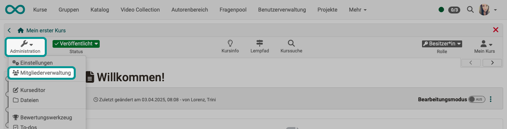

# Mitgliederverwaltung {: #members_management}

In der Mitgliederverwaltung sehen Kursbesitzer:innen alle Benutzer:innen und Gruppen eines Kurses und können diese umfassend organisieren z.B. bestimmte kursbezogene Rechte vergeben, Teilnehmende kontaktieren und Kurs-Gruppen organisieren. Das Rechtemanagement und die Verwaltung der Einwilligungen zu kursbezogenen Nutzungsbedingungen bzw. Datenschutzerklärung erfolgt ebenfalls hier.  

{ class="shadow lightbox" }

## Bereich "Mitglieder" {: #section_members}

Wenn Sie die Mitgliederverwaltung öffnen, befinden Sie sich im Bereich „Mitglieder“. Dort sehen Sie eine tabellarische Übersicht aller Personen, die Zugriff auf den Kurs oder die Lernressource haben. Über verschiedene Tabs können Sie alle oder ausgewählte Kursmitglieder anzeigen lassen, zum Beispiel nur Betreuer:innen oder ausschließlich Teilnehmende. Zudem ist eine Filterung nach Kursrolle oder Kontotyp möglich.

Sie können die Rollenzuordnung der Personen bearbeiten, sie aus dem Kurs entfernen oder ihnen eine E-Mail senden. Außerdem können Sie die Mitgliederdaten als Excel-Tabelle exportieren.

{ class="shadow lightbox" }

Über das Suchfeld kann nach Mitgliedern eines Kurses gesucht werden, was bei vielen Teilnehmenden hilfreich ist.

Wählen Sie die für Sie relevanten Spalten über das Zahnrad Menü aus und sortieren Sie die Liste nach Ihren Wünschen.
  

### Benutzerinformationen bearbeiten

Wenn Sie eine Person aus der Liste auswählen, erhalten Sie weitere Informationen zu dieser Person z.B. sehen Sie die Anzahl der Kursaufrufe und können der Person weitere Rollen zuordnen.

{ class="shadow lightbox" }

Es gibt drei spezifische Kurs-Rollen:  

  * **Besitzer:in**   
Besitzer:innen haben alle Rechte innerhalb eines Kurses und können auf alle Menüs der [Kurs-Administration](../learningresources/Administration.de.md) zugreifen. Sie legen die Kursstruktur an und erstellen in der Regel den OpenOlat Kurs. Die Person, die einen Kurs anlegt ist automatisch Kurs-Besitzer:in. Kurs-Besitzer:innen können auch weitere Besitzer:innen dem Kurs hinzufügen.

  *  **Betreuer:in**  
Betreuende spielen in der Regel bei der _Kursdurchführung_ eine Rolle, sind jedoch bei der Erstellung nicht involviert. Kurs-Betreuer:innen haben Zugriff auf das Bewertungswerkzeug, die To-dos, die Datenerhebungsvorschau und die Statistiken. Sofern ein Unterlagenordner für Betreuende aktiviert wurde sehen sie diesen ebenfalls in der Administration. Betreuende können auch Bewertungen im Kursrun vornehmen. Je nach Konfiguration im Kurseditor haben sie eventuell auch Zugriff auf weitere Optionen und Funktionen bestimmter Kursbausteine.

  *  **Teilnehmer:in**  
Teilnehmer:innen sind in der Regel die Lernenden bzw. Personen, die an einem Online-Kurs teilnehmen. Teilnehmende können nur im Rahmen der von den Besitzer:innen bereitgestellten Möglichkeiten agieren. Teilnehmende haben standardmässig keinen Zugriff auf die Kurs Administration und die darin enthaltenen Menüs. 
In [Lernpfad Kursen](../learningresources/Learning_path_course.de.md) sehen nur die Teilnehmenden die visualisierte Prozentanzeige rechts oben in der [Toolbar](../learningresources/Toolbar.de.md).

Ein Kursmitglied kann in einem Kurs mehrere Rollen gleichzeitig besitzen. In diesem Fall erscheint in der Toolbar des Kurses bei der betreffenden Person die Option, die Rolle zu wechseln und den Kurs aus der Perspektive der jeweiligen Kursrolle zu betrachten.

{ class="shadow lightbox" }

Besitzt der User noch darüberhinausgehende  [System-Rollen](../basic_concepts/Roles_Rights.de.md),  wie Lernressoucrenverwalter:in oder Administrator:in, werden diese ebenfalls als Auswahlelement für die entsprechende Perspektive angezeigt.
  

### Mitglieder hinzufügen

Personen können auf verschiedene Arten einem Kurs hinzugefügt werden:

* durch manuelles Eintragen durch die Kursbesitzer:innen  
* durch Buchungsaufträge von Lernenden (siehe [Zugangskonfiguration](../learningresources/Access_configuration.de.md))  
* durch das Hinzufügen einer OpenOlat-Gruppe. Alle Gruppenmitglieder werden dabei automatisch dem Kurs hinzugefügt.  
* über den Course Planer im Rahmen eines übergeordneten Curriculums (CPL-Mitgliedschaft)

#### Manuelles Eintragen durch Kurs-Besitzer:innen 

Über den Link "Mitglied hinzufügen" kann nach bestimmten Personen mit OpenOlat Account gesucht werden oder die Massensuche verwendet werden. Ein Wizard führt Sie durch die Schritte zum Hinzufügen neuer Kursmitglieder.

Die Massensuche bietet sich a,n wenn der Anmeldename, die vom User verwendete E-Mail-Adresse oder die Institutionsnummer bekannt ist. Auf diesen Weg können auch viele Personen auf einmal dem Kurs hinzugefügt werden. 

Alternativ kann die Option "Externe Mitglieder einladen" verwendet werden. Auf diesem Weg können auch Personen ohne OpenOlat Account für eine Dauer von maximal 180 Tagen der Lernressource hinzugefügt werden.

{ class="shadow lightbox" }

!!! hint "Tipp"

    Im letzten Schritt des Wizards können Sie eine E-Mail formulieren. Dort können Sie auch Variablen im E-Mail-Text verwenden. 
    ($courseDescription, $courseName, $courseRef, $courseUrl, $courseLocation, $email, $firstName, $lastName, $userName)

[Zum Seitenanfang ^](#members_management)

---

## Bereich "Gruppen" {: #section_groups}

Hier sehen Sie die Gruppen des Kurses und können sich schnell einen Überblick über bestimmte Aspekte wie Teilnehmerzahl, Warteliste oder Zugang machen. Sie können dem Kurs bereits bestehende OpenOlat-Gruppen hinzufügen oder neue Gruppen erstellen. Vorhandene Gruppen können auch wieder aus dem Kurs entfernt werden.

Wenn Sie auf einen Gruppennamen oder auf „Ändern“ klicken, öffnet sich die jeweilige Gruppe. Sie gelangen damit als Gruppenbetreuer:in direkt in die Gruppenadministration und können dort Änderungen vornehmen. 

Gruppen können in einem OpenOlat Kurs unterschiedliche Funktionen besitzen.
Typische Beispiele sind:

  * Bündelung von Einzelpersonen für selektive Freigaben
  * Gruppen für Gruppenarbeiten (kooperative Aktionen)
  * Gruppen für die Organisation des kursbezogenen Rechtemanagements

Ferner können bestimmte Kursbausteine automatisch Gruppen erstellen z.B. die [Themenvergabe](../learningresources/Course_Element_Topic_Assignment.de.md).  

Wie Gruppen generell erstellt und konfiguriert werden, und wie man Gruppenmitglieder verwaltet, wird im Kapitel "[Gruppen](../groups/index.de.md)" behandelt.

[Zum Seitenanfang ^](#members_management)

---

## Bereich Course Planner {: #section_course_planner}

Sofern ein Kurs mit dem [Course Planner](../area_modules/Course_Planner.de.md) verbunden ist erscheinen die entsprechenden Informationen ebenfalls in der Mitgliederverwaltung. 

[Zum Seitenanfang ^](#members_management)

---

## Bereich "Buchungsaufträge" {: #section_booking_orders}

Sofern für einen Kurs [Angebote](../learningresources/Access_configuration.de.md) eingerichtet wurden, werden unter „Buchungsaufträge“ alle Buchungsaufträge für diesen Kurs nach Status sortiert angezeigt.  

Ein hier angezeigter Buchungsauftrag bedeutet, dass der Kurs eigenständig und buchbar ist und somit ein Angebot – zum Beispiel über einen Zugangscode – enthält.

{ class="shadow lightbox" }

[Zum Seitenanfang ^](#members_management)

---

## Bereich "Einladungen" {: #section_invitations}
Ab :octicons-tag-24: 17.0 verfügbar.

Hier werden alle Personen angezeigt, die über die Option "Externe Mitglieder einladen" (siehe oben) dem Kurs hinzugefügt wurden. 

[Zum Seitenanfang ^](#members_management)

---

##  Bereich "Rechte"   {: #section_rights}

Häufig besteht der Wunsch, einzelnen Benutzer:innen zusätzliche Rechte zu vergeben, ohne ihnen dabei volle Besitzrechte zu übertragen oder eine weitere kursspezifische Rolle zuzuweisen. Dies können Sie im Bereich **Rechte** der Mitgliederverwaltung vornehmen.

Dort werden alle kursspezifischen Gruppen angezeigt – unterteilt in Gruppen-Betreuer:innen und Gruppen-Teilnehmer:innen – zusammen mit den jeweils zugeordneten Rechtegruppen.

Zu beachten ist dabei, dass hier keine
Einzelrechte, sondern Rechte für bestimmte _Kurswerkzeuggruppen_ vergeben werden wie z.B. Zugriff auf den Kurseditor mit allen integrierten Möglichkeiten oder das komplette Bewertungswerkzeug. 

Alle Personen, die in die jeweilige Gruppe in der entsprechenden Rolle eingetragen sind, erhalten dann automatisch die Berechtigung das jeweilige Werkzeug mit allen Optionen im gesamten Kurs zu verwenden. Die Kursrechte einer Gruppe sind immer an einen einzelnen Kurs gebunden und gelten nicht pauschal.

Häufig ist die gezielte Vergabe bestimmter Rechte, anstatt des Eintrags als Besitzer:in schon aus Datenschutzgründen sinnvoll oder notwendig. 
Vergeben Sie diese erweiterten Rechte aber am besten an die _Teilnehmenden_ einer Gruppe nicht an die Betreuer:innen, da damit weitere Berechtigungen verbunden sind. 

!!! Warning "Achtung"

    Gruppenbetreuer:innen erhalten grundsätzlich auch Zugang zum [Bewertungswerkzeug](Assessment_tool_overview.de.md) und können alle Mitglieder der Gruppe auch bewerten. Ferner dürfen sie Änderungen an den betreuten Gruppen vornehmen und haben Zugriff auf alle für Betreuende im Kursrun freigegebenen Dinge!
    

### Vergabe zusätzlicher Rechte 

Folgende Kursrechte können an Gruppen vergeben werden:

  
**Gruppen-Verwaltung**

Für die aktivierte Personengruppe erscheint zusätzlich das Menü der Kurs "Administration" und es stehen zusätzlich alle Aktionen aus dem Bereich "Gruppen" der Mitgliederverwaltung also z.B. Gruppen erstellen, zum Kurs hinzufügen oder entfernen, Mails an Gruppen verschicken sowie die Aktionen aus dem Bereich "Einwilligungen" zur Verfügung.  
  
**Mitglieder-Verwaltung**

Für die aktivierte Personengruppe erscheint zusätzlich das Menü der Kurs "Administration". 
Es stehen alle Aktionen der Bereiche Mitglieder, Gruppen, Buchungsaufträge und Einwilligungen der Mitgliederverwaltung zur Verfügung, jedoch kein Rechtemanagement und kein Course-Planner-Bereich.
  
**Kurseditor**

Für die aktivierte Personengruppe erscheint zusätzlich das Menü der Kurs "Administration".

Bei Aktivierung dieser Rechte-Gruppe können auch Nicht-Autoren den Kurseditor mit allen dazu gehörenden Funktionalitäten verwenden. Darüber stehen der Gruppe noch weitere Menüs wie "Dateien", "Erinnerung", "Prüfungsverwaltung",  "Lernbereich" u.a. zur Verfügung.
  
**Datenarchivierung**

Für die aktivierte Gruppe erscheint zusätzlich das Menü Kurs-Administration mit dem Untermenü Archivierung & Reporting. Mitglieder haben Zugriff auf alle Bereiche der [Archivierung](../learningresources/Course_Archiving.de.md) und damit auf sämtliche Kursdaten. Sie können Kursinhalte wie Forenbeiträge oder Testergebnisse aller Teilnehmenden archivieren.  

Die Vergabe dieser Berechtigung sollte aus Datenschutzgründen sorgfältig abgewogen werden.  

  
**Bewertungs-Werkzeug**

Es erscheint zusätzlich das Menü "Administration" mit dem [Bewertungswerkzeug](Assessment_tool_overview.de.md).

Auch ohne als Betreuer:in im Kurs eingetragen zu sein können so Mitglieder sämtliche Leistungen der Kursteilnehmenden bewerten und kommentieren. 

!!! info "Info"

    Ein Zugriff auf die Bewertung im Kursrun besteht dabei aber nicht.  
  
**Glossar-Werkzeug** 

Dieses Recht erlaubt es den Mitgliedern das Glossar
des Kurses zu bearbeiten, was natürlich nur Sinn macht, wem dem Kurs auch ein [Glossar](../learningresources/Glossary.de.md) zugeordnet ist. Der Zugriff erfolgt direkt über das Werkzeug "Glossar" in der Toolbar.  

 **Statistiken**

Für die aktivierte Personengruppe erscheint zusätzlich das Menü der Kurs "Administration". 

Mitglieder mit diesem Recht erhalten Zugriff auf alle für diesen Kurs zur Verfügung stehenden Statistikbereiche, also Kurs-Statistiken, Fragebogen
Statistiken und Test Statistiken. Die Daten können angezeigt und heruntergeladen werden.  
  
**Prüfungsmodus**

Für die aktivierte Personengruppe erscheint zusätzlich das Menü der Kurs "Administration" mit der Prüfungsverwaltung.

Mitglieder dürfen neue [Prüfungskonfigurationen](../learningresources/Assessment_mode.de.md) einrichten, bearbeiten und löschen.  
  
**Kurs Datenbank**

Für die aktivierte Personengruppe erscheint zusätzlich das Menü der Kurs "Administration".

Mitglieder können hier Kursdatenbanken erstellen, zurücksetzen, löschen und exportieren.  

[Zum Seitenanfang ^](#members_management)

---

##  Bereich "Einwilligungen"  {: #section_consent}

Sofern kursbezogene Nutzungsbedingungen bzw. die kursbezogene Datenschutzerklärung [aktiviert](../learningresources/Course_Settings.de.md) sind, werden die gespeicherten Einwilligungen der einzelnen Benutzer hier aufgelistet. Ausgewählte Einwilligungen können an dieser Stelle widerrufen oder auch gelöscht werden. Beim Widerruf wird die Einwilligung zurückgesetzt, der Eintrag bleibt aber erhalten. Wird ein User in OpenOlat gelöscht, so werden auch alle kursbezogenen Einwilligungen entfernt.
 
[Zum Seitenanfang ^](#members_management)
