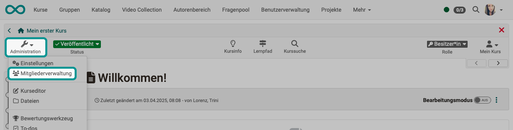
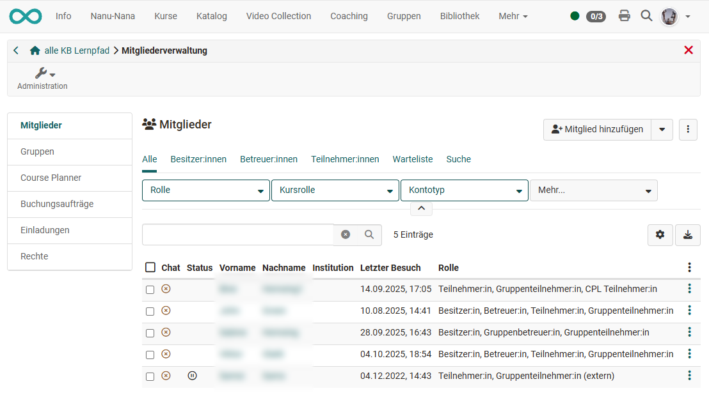
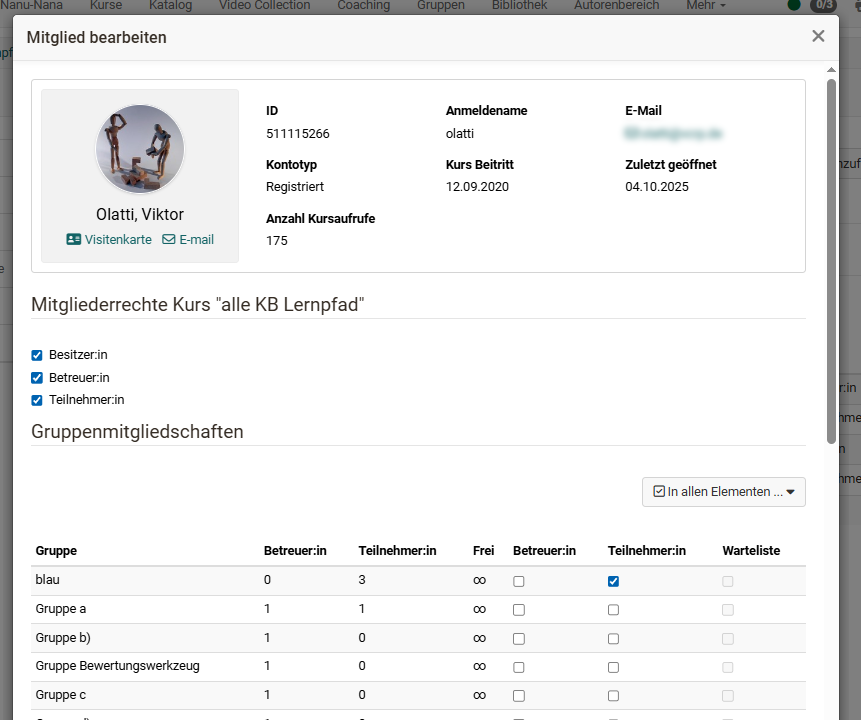
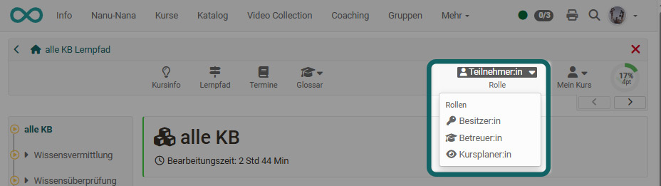
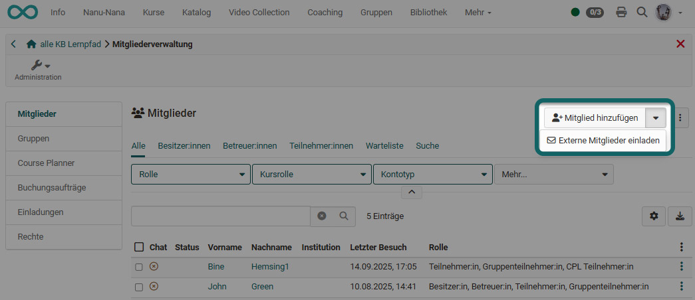
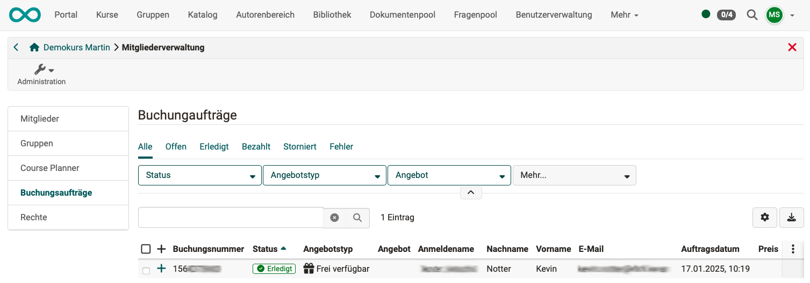

# Members management {: #members_management}

In the members management, course owners see all users and groups of a course and can organize them comprehensively, e.g. assign certain course-
related rights, contact participants and organize course groups. Rights management and the administration of consents to course-related terms of use or privacy policy also take place here.

{ class="shadow lightbox" }

## Members {: #section_members}

When you open member management, you will find yourself in the “Members” area. There you will see a tabular overview of all persons who have access to the course or learning resource. Using various tabs, you can display all or selected course members, for example, only supervisors or only participants. It is also possible to filter by course role or account type.

You can edit the role assignments of the individuals, remove them from the course, or send them an email. You can also export the member data as an Excel spreadsheet.

{ class="shadow lightbox" }

The "Search" element in the Members management can be used to search for members of a course, which is helpful for many participants.

Select the columns that are relevant for you via the cogwheel menu and sort the list according to your wishes.

### Edit user information

When you select a person from the list, you will receive further information about that person, e.g., you can see the number of course views and assign additional roles to that person.

{ class="shadow lightbox" }

There are three specific course roles:

  *  **Owner**  
Owners have all rights within a course and can access all menus of the [course administration](Using_Course_Tools.md). They create the course structure and usually create the OpenOlat course. The person who creates a course is automatically the course owner. Course owners can also add other owners to the course.

  *  **Coaches**  
Coaches typically play a role in course _delivery_, but are not involved in course creation. 
Course coaches have access to the assessment tool, to-do lists, data collection previews, and statistics. If a document folder has been activated for coaches, they will also see "Coach files"" in the administration area. 

Coaches can also carry out assessments during the course run. Depending on the configuration in the course editor, they may also have access to additional options and functions for certain course elements.

  *  **Participants**  
Participants are usually the learners or people who participate in an online course. Participants can only act within the scope of the options provided by the owner. By default, participants do not have access to the course administration and the menus it contains. In a [learning path course](../learningresources/Learning_path_course.md) only the participants see the visualized percentage display in the top right corner of the [toolbar](../learningresources/Toolbar.md).

A course member can have multiple roles in the course at the same time. In this case these persons will see the possibility to change roles in the course toolbar and thus to view the course from different course roles.

{ class="shadow lightbox" }

If the user has additional [system roles](../basic_concepts/Roles_Rights.md), such as learning resource manager or administrator, these are also displayed as selection elements for the corresponding perspective.

### Adding members

Users can be added to a course in several ways:

* By manual entry by the course owner
* By learners booking orders (see [Access configuration](../learningresources/Access_configuration.md))
* By adding an OpenOlat group. All group members are automatically added to the course.  
* via the Course Planner as part of a higher-level curriculum (CPL membership)

#### Manual entry by course owners:

Use the “Add member” link to search for specific individuals with an OpenOlat account or use the bulk search function. A wizard will guide you through the steps for adding new course members.

The mass search is useful if you know the login name, the email address used by the user, or the institution number. This way, you can add many people to the course at once.

Alternatively, you can use the “Invite external members” option. This allows you to add people without an OpenOlat account to the learning resource for a maximum period of 180 days.

{ class="shadow lightbox" }

!!! hint "Hint"

    In the last step of the wizard, you can formulate an e-mail. You can also use variables in the email text. 
    ($courseDescription, $courseName, $courseRef, $courseUrl, $courseLocation, $email, $firstName, $lastName, $userName)

[To the top of the page ^](#members_management)

---

## Groups {: #section_groups}

Here you can see the groups for the course and quickly get an overview of certain aspects such as the number of participants, waiting list, or access. You can add existing OpenOlat groups to the course or create new groups. Existing groups can also be removed from the course.

Clicking on a group name or on "Modify" opens the group itself in a new OpenOlat tab and takes you as a group coach to the group administration. 

Groups can have different functions in an OpenOlat course. Typical examples
are:

  * Bundling of individuals for selective releases
  * Groups for group work (joint actions)
  * Groups for the organization of the course-related rights management

Furthermore, certain course elements can automatically create groups, e.g., the [topic assignment](../learningresources/Course_Element_Topic_Assignment.md).  

How to create and configure groups and how to manage group members is covered in the chapter "[Groups](../groups/index.md)".

[To the top of the page ^](#members_management)

---

## Course Planner {: #section_course_planner}
If a course is linked to the [Course Planner](../area_modules/Course_Planner.md), the relevant information will also appear in the members management section. 

[To the top of the page ^](#members_management)

---

## Booking Orders {: #section_booking_orders}

If an [offer](../learningresources/Access_configuration.md) has been set up for a course, all booking orders for this course are displayed under “Booking orders” sorted by status.  

A booking order displayed here means that the course is independent and bookable and therefore contains an offer – for example, via an access code.

{ class="shadow lightbox" }

[To the top of the page ^](#members_management)

---

## Invitations {: #section_invitations}
Available in :octicons-tag-24: 17.0.

All persons added to the course via the "Invite external members" option (see above) are displayed here. 

[To the top of the page ^](#members_management)

---

##  Rights  {: #section_rights}

There is often a desire to grant individual users additional rights without transferring full ownership rights to them or assigning them another course-specific role. You can do this in the **Rights** section of the members management.

In the "Rights" area, all course-specific groups appear, divided into group coaches and group participants and the rights groups assigned to the respective group.

Please keep in mind that here no individual rights are granted but rights for certain _course tool groups_, e.g. access to the course editor with all its integrated options or to the complete assessment tool. 

All persons who are registered in
are entered in the respective group in the corresponding role will then then automatically receive the authorization to use the respective tool with all options in the entire course. Course rights of a group are always bound to a single course.

Often, the specific assignment of certain rights, instead of the entry as owner, is already useful or necessary for data protection reasons. However, it is best to assign these extended rights to the _participants_ of a group not to the coach, as this involves additional permissions. 

!!! Warning "Attention"

    Group coaches basically also get access to the [assessment tool](Assessment_tool_overview.md) and can also assess all members of the group. Furthermore, they are allowed to make changes to the coached groups and have access to all things shared for coaches in the course run!

### Assignment of additional rights

The following course rights can be assigned to individual user groups:

**Group management**

In addition to the activated person search, the menu of the course "administration"  appears. Additionally, all actions of the area "Groups" of the members management, e.g. create groups, add to or remove from course, send mails to groups, as well as actions from the area "Consents".
  
**Member management**

The "Administration" menu also appears. All actions of the areas "Members", "Groups" and "Booking orders" and "Consents" of the member administration are available but not "rights management" or the "Course Planner" area.  
  
**Course editor**

The "Administration" menu also appears.

Even non-authors can use the course editor with all its functionalities. In addition there are further menus such as storage folder, lessons and absences, learning area, etc.  In addition, other menus such as the storage folder, lessons and absences, learning area, etc. are provided.
  
**Archive tool**

For the activated group, the Course Administration menu with the "Archiving & Reporting" submenu also appears. Members have access to all areas of [Archiving](../learningresources/Course_Archiving.md) and thus to all course data. They can archive course content such as forum posts or test results for all participants.  

The granting of this authorization should be carefully considered for data protection reasons.  
  
**Assessment tool**

In addition, the "Administration" menu appears with the [Assessment tool](Assessment_tool_overview.md).

Even without being registered as a coach for the course, members can evaluate and comment on all of the course participants' achievements. 

!!! info "info"

    However, there is no access to the assessment in the course run.  
  
**Glossary tool**

This right allows members to edit the glossary, which of course only makes sense if a [glossary](../learningresources/Glossary.md)  is assigned to the course. Access is directly via the "Glossary" tool in the toolbar.
  
**Statistics**

The "Administration" menu also appears for the activated group of people.

Members with this right get access to all statistics areas available for this course, i.e. course statistics, questionnaire statistics and test statistics. The data can be displayed and downloaded.  
  
**Assessment mode**

For the activated user group, the “Administration” menu with the "assessment management" also appears.

The "Administration" menu also appears for the activated group of people.

Members are allowed to set up the configuration for the [assessment](../learningresources/Assessment_mode.md) mode to run this course or individual course elements in a safe mode. 

  
**Course database**

The "Administration" menu also appears for the activated group of people.

Members have access to the course database and can create, reset, delete or export it.  
  
[To the top of the page ^](#members_management)

---

##  Consents {: #section_consent}

If course-related terms of use or the course-related privacy policy are [activated](../learningresources/Course_Settings.md), the stored consent of the individual users is listed here. Selected consents can be revoked or deleted at this point. When revoking, the consent is reset, but the entry is retained. If a user is deleted in OpenOlat, all course-related consents of the user are also removed.

[To the top of the page ^](#members_management)

