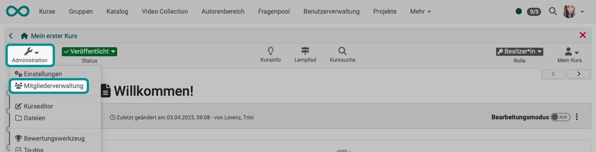
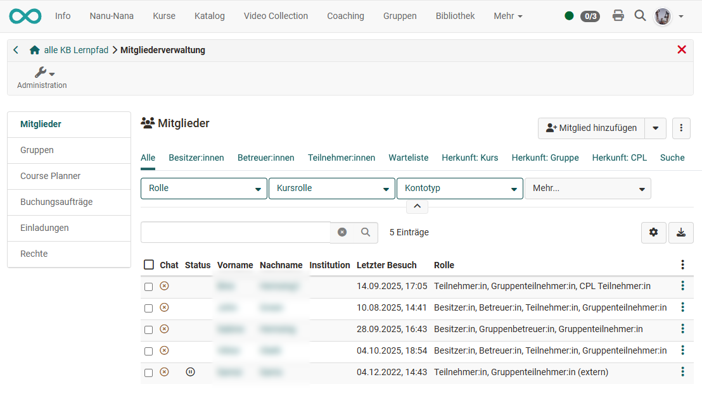
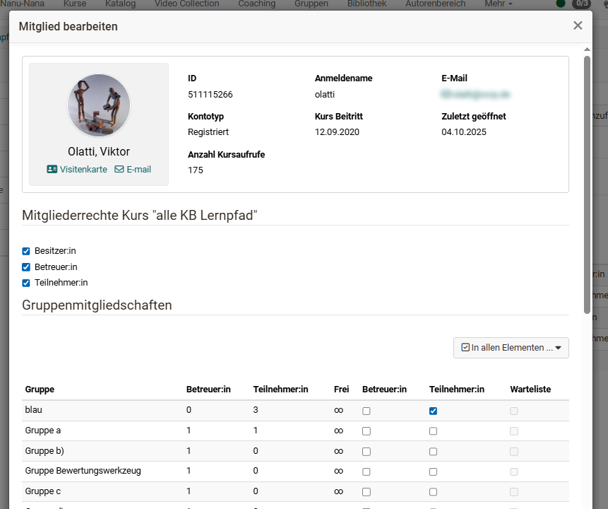
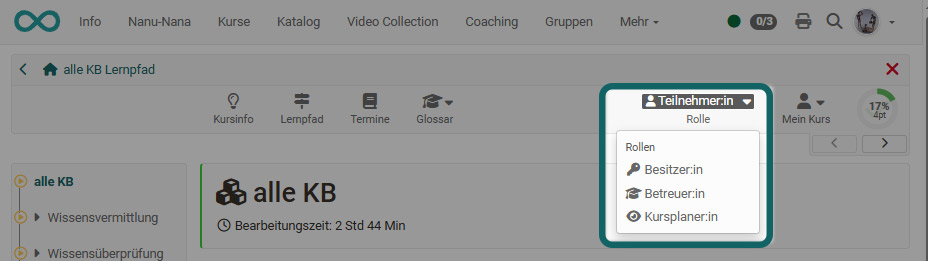
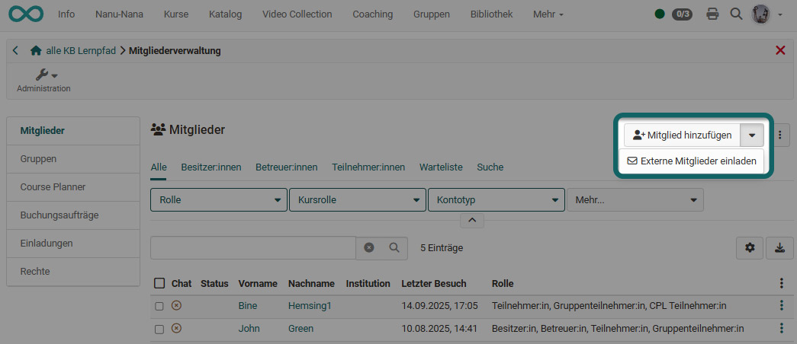
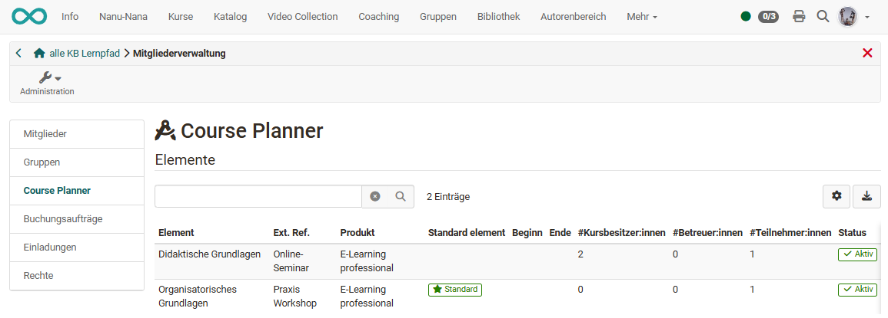
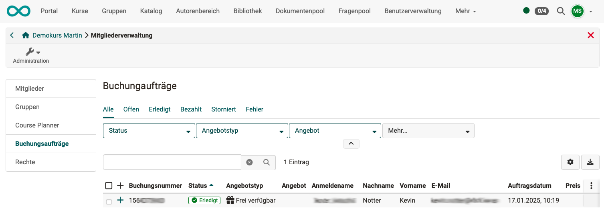

# Members management {: #members_management}

In the members management, course owners see all users and groups of a course and can organize them comprehensively, e.g. assign certain course-related rights, contact participants, and organize course groups. Rights management and the administration of consents to course-related terms of use or the privacy policy also take place here.

{ class="shadow lightbox" }

## Members {: #section_members}

When you open the members management, you find yourself in the "Members" area. There you see a tabular overview of all persons who have access to the course or learning resource. Using various tabs, you can display all or selected course members, for example only coaches or only participants. It is also possible to filter by course role or account type.

You can edit the role assignments of the persons, remove them from the course, or send them an email. You can also export the member data as an Excel spreadsheet.

{ class="shadow lightbox" }

The search field can be used to search for members of a course, which is helpful when there are many participants.

Select the columns that are relevant for you via the cogwheel menu and sort the list according to your wishes.

### Preset filters [:octicons-tag-16:{ title="from Release 20.3 (OO-8514)" }](https://track.frentix.com/issue/OO-8514){:target="_blank"} {: #origin_filters}

The tabs above the table provide the following preset filters:

* **All**
* **Owners**
* **Coaches**
* **Participants**
* **Waiting list**
* **Origin: Course**
* **Origin: Group**
* **Origin: CPL** (only visible if the course is linked to the Course Planner)
* **Search**

In the extended filter panel (arrow icon), the selection can also be modified by:

* **Role**: Owner, Coach, Participant
* **Account type**: Registered users, External users
* **Origin**: Course, Group, Course Planner
* **Group**: selection from the groups used in the course
* **CPL element**: selection from the Course Planner elements used in the course

The cogwheel menu can also be used to show the **Origin** column. It shows the way a person became a member of the course (course, group, or Course Planner). The **Joined** and **Last visit** columns can also be added here.

**Detail view:** Click on a row to open the detail view of a person. It shows a user info card (account type, join date, last visit if applicable) with the **Edit** action and, where applicable, up to three origin sections:

* **Origin: Course**: columns Role, Created
* **Origin: Group**: columns Role, Group, Created
* **Origin: Course Planner**: columns Role, Element, Reference, Product, Created

!!! info "Important"
    Each section only appears if the person concerned actually has a corresponding origin.

#### Excel export of the origin [:octicons-tag-16:{ title="from Release 20.3.1 (OO-9435)" }](https://track.frentix.com/issue/OO-9435){:target="_blank"}

In the Excel export of the member list, the "Origin" column lists all associated groups and Course Planner elements in full by name (comma-separated).

### Edit user information {: #edit_user_info}

When you select a person from the list, you receive further information about that person, e.g. you see the number of course views and can assign additional roles to the person.

{ class="shadow lightbox" }

There are three specific course roles:

  *  **Owner** 
Owners have all rights within a course and can access all menus of the [course administration](../learningresources/Administration.md). They create the course structure and usually create the OpenOlat course. The person who creates a course automatically becomes the course owner. Course owners can also add other owners to the course.

  *  **Coach** 
Coaches typically play a role in _course delivery_, but are not involved in course creation. Course coaches have access to the assessment tool, the to-dos, the data collection preview, and the statistics. If a document folder has been activated for coaches, they also see it in the administration. Coaches can also carry out assessments in the course run. Depending on the configuration in the course editor, they may also have access to further options and functions of certain course elements.

  *  **Participant** 
Participants are usually the learners, or the persons who take part in an online course. Participants can only act within the possibilities provided by the owners. By default, participants do not have access to the course administration and the menus it contains.
In [learning path courses](../learningresources/Learning_path_course.md), only the participants see the visualized percentage display in the top right corner of the [toolbar](../learningresources/Toolbar.md).

A course member can hold multiple roles in a course at the same time. In this case, the option to switch roles and view the course from the perspective of the respective course role appears in the course toolbar for the person concerned.

{ class="shadow lightbox" }

If the user has additional [system roles](../basic_concepts/Roles_Rights.md), such as learning resource manager or administrator, these are also displayed as selection elements for the corresponding perspective.

### Adding members {: #add_members}

People can be added to a course in several ways:

* by manual entry by the course owners 
* by booking orders from learners (see [access configuration](../learningresources/Access_configuration.md)) 
* by adding an OpenOlat group. All group members are then automatically added to the course. 
* via the Course Planner as part of a higher-level education product (CPL membership)

#### Manual entry by course owners {: #add_members_manually}

Using the "Add member" link, you can search for specific people with an OpenOlat account, or use the bulk search. A wizard guides you through the steps for adding new course members.

The bulk search is useful if the login name, the email address used by the person, or the institution number is known. This way, many people can also be added to the course at once.

Alternatively, the "Invite external members" option can be used. This way, people without an OpenOlat account can also be added to the learning resource for a maximum of 180 days.

{ class="shadow lightbox" }

!!! tip "Tip"

    In the last step of the wizard, you can compose an email. There, you can also use variables in the email text.
    ($courseDescription, $courseName, $courseRef, $courseUrl, $courseLocation, $email, $firstName, $lastName, $userName)

For administrators: [System-wide configuration of the invitation (email, accept membership) >](../../manual_admin/administration/Modules_Groups.md#data_privacy)

[To the top of the page ^](#members_management)

---

## Groups {: #section_groups}

Here you see the groups of the course and can quickly get an overview of certain aspects such as number of participants, waiting list, or access. You can add existing OpenOlat groups to the course or create new groups. Existing groups can also be removed from the course again.

Clicking on a group name or on "Modify" opens the respective group. This takes you, as a group coach, directly to the group administration, where you can make changes.

Groups can have different functions in an OpenOlat course.
Typical examples are:

  * bundling individual persons for selective releases
  * groups for group work (collaborative actions)
  * groups for organizing course-related rights management

Furthermore, certain course elements can automatically create groups, e.g. the [topic assignment](../learningresources/Course_Element_Topic_Assignment.md).

How groups are generally created and configured, and how group members are managed, is covered in the chapter "[Groups](../groups/index.md)".

[To the top of the page ^](#members_management)

---

## Course Planner {: #section_course_planner}

If a course is linked to the [Course Planner](../area_modules/Course_Planner.md), the relevant information also appears in the members management.

{ class="shadow lightbox" }

[To the top of the page ^](#members_management)

---

## Booking Orders {: #section_booking_orders}

If [offers](../learningresources/Access_configuration.md) have been set up for a course, all booking orders for this course are displayed under "Booking orders", sorted by status.

A booking order displayed here means that the course is self-contained and bookable, and therefore contains an offer, for example via an access code.

{ class="shadow lightbox" }

[To the top of the page ^](#members_management)

---

## Invitations {: #section_invitations}

All persons who were added to the course via the "Invite external members" option (see above) are displayed here.

[To the top of the page ^](#members_management)

---

##  Rights  {: #section_rights}

There is often a wish to grant individual users additional rights without transferring full ownership rights to them or assigning them another course-specific role. You can do this in the **Rights** area of the members management.

There, all course-specific groups are displayed, divided into group coaches and group participants, together with the rights groups assigned to each.

Note that this does not grant individual rights, but rights for certain _course tool groups_, such as access to the course editor with all its integrated options, or the complete assessment tool.

All persons entered in the respective group in the corresponding role then automatically receive the authorization to use the respective tool with all its options throughout the entire course. The course rights of a group are always bound to a single course and never apply generally.

Often, the targeted assignment of certain rights, instead of entering someone as an owner, is already useful or necessary for data protection reasons.
However, it is best to assign these extended rights to the _participants_ of a group, not to the coaches, since this involves further permissions.

!!! warning "Attention"

    Group coaches basically also get access to the [assessment tool](Assessment_tool_overview.md) and can also assess all members of the group. Furthermore, they are allowed to make changes to the coached groups and have access to everything shared for coaches in the course run!

### Assignment of additional rights {: #additional_rights}

The following course rights can be assigned to groups:

**Group management**

For the activated group of people, the "Administration" menu of the course also appears, and all actions from the "Groups" area of the members management are additionally available, e.g. create groups, add to or remove from the course, send emails to groups, as well as the actions from the "Consents" area.

**Member management**

For the activated group of people, the "Administration" menu of the course also appears.
All actions of the Members, Groups, Booking Orders, and Consents areas of the members management are available, but not rights management or the Course Planner area.

**Course editor**

For the activated group of people, the "Administration" menu of the course also appears.

When this rights group is activated, even non-authors can use the course editor with all its associated functionalities. In addition, the group also has access to further menus such as "Files", "Reminder", "Assessment management", "Learning area", and others.

**Archiving**

For the activated group, the course administration menu with the "Archiving & Reports" submenu also appears. Members have access to all areas of [Archiving](../learningresources/Course_Archiving.md) and thus to all course data. They can archive course content such as forum posts or test results of all participants.

The granting of this permission should be carefully weighed for data protection reasons.

**Assessment tool**

The "Administration" menu with the [assessment tool](Assessment_tool_overview.md) also appears.

Even without being entered as a coach in the course, members can assess and comment on all achievements of the participants this way.

!!! info "Important"

    However, this does not include access to the assessment in the course run.

**Glossary tool**

This right allows members to edit the glossary of the course, which of course only makes sense if a [glossary](../learningresources/Glossary.md) is assigned to the course. Access is directly via the "Glossary" tool in the toolbar.

**Statistics**

For the activated group of people, the "Administration" menu of the course also appears.

Members with this right get access to all statistics areas available for this course, i.e. course statistics, questionnaire statistics, and test statistics. The data can be displayed and downloaded.

**Assessment mode**

For the activated group of people, the "Administration" menu of the course also appears, with assessment management.

Members may set up, edit, and delete new [assessment configurations](../learningresources/Assessment_mode.md).

**Course database**

For the activated group of people, the "Administration" menu of the course also appears.

Members can create, reset, delete, and export course databases here.

[To the top of the page ^](#members_management)

---

##  Consents  {: #section_consent}

If course-related terms of use or the course-related privacy policy are [activated](../learningresources/Course_Settings.md), the stored consents of the individual users are listed here. Selected consents can be revoked or deleted at this point. When revoked, the consent is reset, but the entry is retained. If a user is deleted in OpenOlat, all course-related consents are also removed.

[To the top of the page ^](#members_management)

---

## Further information {: #further_information}

**Mentioned on this page** 
[Course Administration: Overview >](../learningresources/Administration.md) 
[Learning path course - Overview >](../learningresources/Learning_path_course.md) 
[Toolbar: Overview >](../learningresources/Toolbar.md) 
[Roles and Rights: Overview >](../basic_concepts/Roles_Rights.md) 
[Access configuration >](../learningresources/Access_configuration.md) 
[Module Groups >](../../manual_admin/administration/Modules_Groups.md) 
[Course Element "Topic Assignment" >](../learningresources/Course_Element_Topic_Assignment.md) 
[Groups >](../groups/index.md) 
[Course Planner: Overview >](../area_modules/Course_Planner.md) 
[Assessment tool - overview >](Assessment_tool_overview.md) 
[Course administration - Archiving & Reports >](../learningresources/Course_Archiving.md) 
[Glossary >](../learningresources/Glossary.md) 
[Assessment management: Assessment mode >](../learningresources/Assessment_mode.md) 
[Course Settings >](../learningresources/Course_Settings.md)

**Further reading** 
[Roles and Rights: Assign roles >](../basic_concepts/Assign_Roles.md) 
[Course Settings - Tab Options >](../learningresources/Course_Settings_Options.md)

[To the top of the page ^](#members_management)
