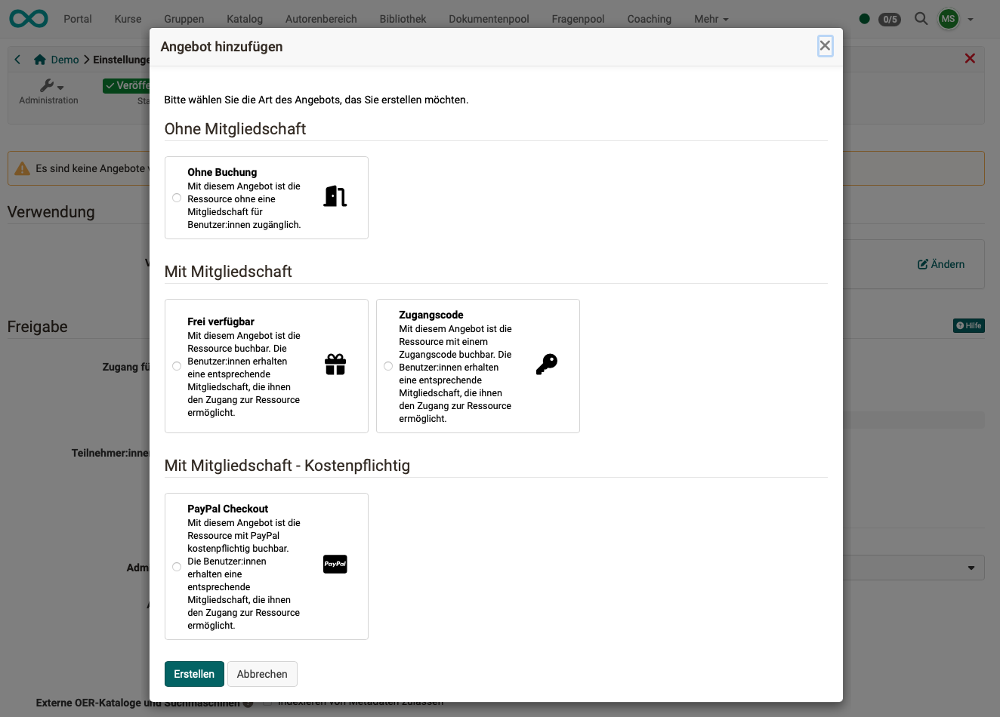

# Angebotsarten {: #offer_types}

Um einen Kurs oder eine andere Lernressource im Katalog anzubieten, benötigt es jeweils ein Angebot.
Angebote können erstellt werden unter: 
**Administration > Einstellungen > Freigabe > Bereich "Angebote"**

Sind Angebote erstellt worden, können sie auch in der **(Kurs-)Administration unter "Angebotsarten"** nachgesehen werden. 

## Die Angebotsarten/-typen

Es können die folgenden Angebotsarten/-typen erstellt werden:

|                       | Mitgliedstatus  |                                 | verfügbar in |
| --------------------- | --------------- |-------------------------------- | --- |
| <b>Ohne Buchung</b>    | ohne  |Mit diesem Angebot ist die Ressource ohne eine Mitgliedschaft für Benutzer:innen zugänglich. | Einzelkurs |
| <b>Frei verfügbar</b>  | Mitgliedschaft | Mit diesem Angebot ist die Ressource buchbar. Die Benutzer:innen erhalten eine entsprechende Mitgliedschaft, die ihnen den Zugang zur Ressource ermöglicht. | Einzelkurs und Durchführung |
| <b>Zugangscode</b> | Mitgliedschaft | Mit diesem Angebot ist die Ressource mit einem Zugangscode buchbar. Die Benutzer:innen erhalten eine entsprechende Mitgliedschaft, die ihnen den Zugang zur Ressource ermöglicht. | Einzelkurs und Durchführung |
| <b>PayPal Checkout</b> | Mitgliedschaft | Mit diesem Angebot ist die Ressource mit PayPal kostenpflichtig buchbar. Die Benutzer:innen erhalten eine entsprechende Mitgliedschaft, die ihnen den Zugang zur Ressource ermöglicht. | Einzelkurs und Durchführung |
| <b>Rechnung</b> | Mitgliedschaft | Mit diesem Angebot ist die Ressource per Rechnung kostenpflichtig buchbar. Die Benutzer:innen erhalten eine entsprechende Mitgliedschaft, die ihnen den Zugang zur Ressource ermöglicht. | Durchführung |

[zum Seitenanfang ^](#offer_types)

---

## Angebotsarten für einzelne Kurse

{ class="shadow lightbox" }

{ class="shadow lightbox" }

[zum Seitenanfang ^](#offer_types)

---

## Angebotsarten für Durchführungen (im Course Planner)

{ class="shadow lightbox" }

{ class="shadow lightbox" }

[zum Seitenanfang ^](#offer_types)

---

## Weiterführende Informationen {: #further_information}

[Zum Katalog >](../../manual_user/area_modules/catalog2.0.de.md) 
[Zu Angeboten >](../../manual_user/area_modules/catalog2.0_angebote.de.md) 
[Anbieten von Durchführungen im Katalog >](../../manual_user/area_modules/Course_Planner_Implementations.de.md#tab_catalog)

[zum Seitenanfang ^](#offer_types)
