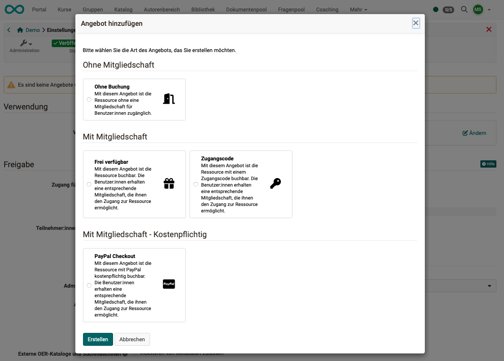

# Offer types {: #offer_types}

In order to offer a course or other learning resource in the catalog, an offer is required.
Offers can be created under: 
`Course > Administration > Settings > Tab "Share" > "Offer" area`

If offers have been created, they can also be viewed under `Course > Administration > Offer types`.

## The Offer types

The following Offer types can be created:

|                       | Member status  |                                 | available in |
| --------------------- | --------------- |-------------------------------- | --- |
| <b>Without booking</b>    | without  | With this offer, the resource is accessible to users without a membership. | Single course |
| <b>Freely available</b>  | Membership | The resource can be booked with this offer. Users receive a corresponding membership that gives them access to the resource. | Single course and implementation |
| <b>Access code</b> | Membership | With this offer, the resource is available with an access code. Users receive a corresponding membership that gives them access to the resource. | Single course and implementation |
| <b>PayPal Checkout</b> | Membership | With this offer, the resource can be booked with PayPal for a fee. The users receive a corresponding membership that gives them access to the resource. | Single course and implementation |
| <b>Invoice</b> | Membership | With this offer, the resource can be booked by invoice. The users receive a corresponding membership that gives them access to the resource. | Implementation |

[To the top of the page ^](#offer_types)

---

## Offer types for single courses

{ class="shadow lightbox" }

{ class="shadow lightbox" }

[To the top of the page ^](#offer_types)

---

## Offer types for implementations (in the Course Planner)

{ class="shadow lightbox" }

{ class="shadow lightbox" }

[To the top of the page ^](#offer_types)

---

## Further information {: #further_information}

[See the catalog >](../../manual_user/area_modules/catalog2.0.md) 
[See the offers >](../../manual_user/area_modules/catalog2.0_angebote.md) 
[Offer implementations in the catalog >](../../manual_user/area_modules/Course_Planner_Implementations.md)

[To the top of the page ^](#offer_types)
