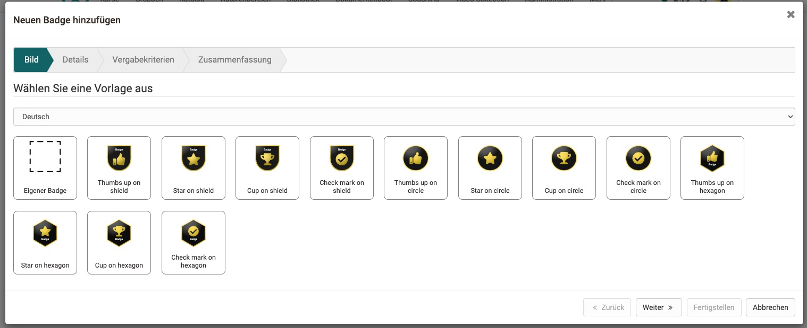
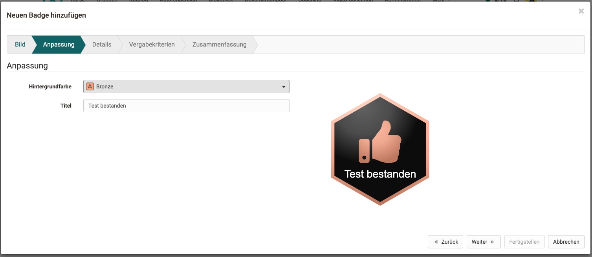
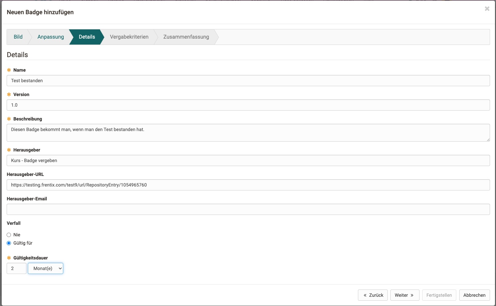
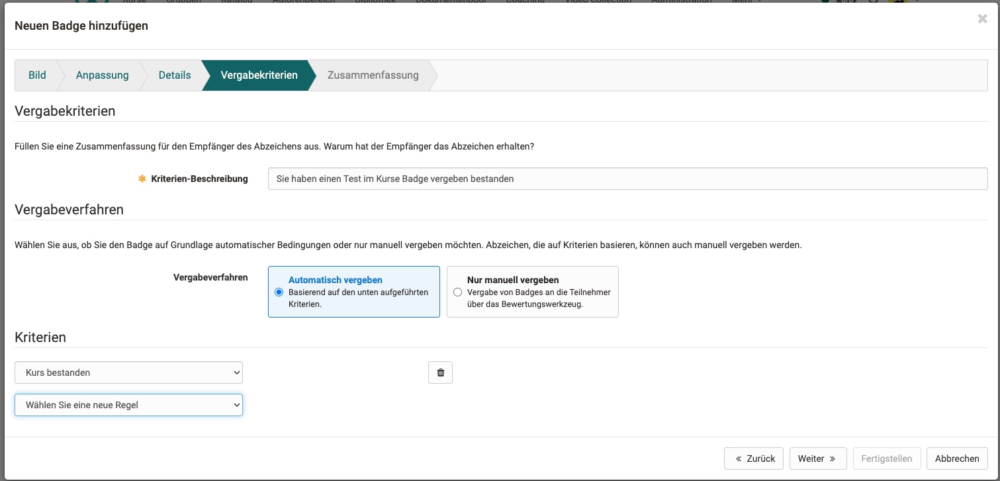
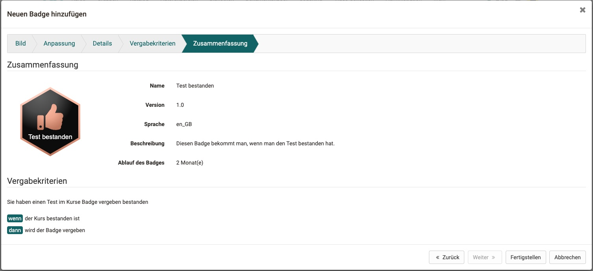

# Badges {: #badges}

## Was ist ein Badge? {: #what_is_a_badge}

Open Badges ist ein System digitaler Zertifikate oder **Lernabzeichen**, mit dem Sie individuelle Fortschritte auszeichnen können. 
Ein Badge ist ein Online-Beweis für ein erreichtes Ziel. Er besteht aus

* einem Bild (svg oder png)
* (evtl. mit einem editierbaren Schlüsselbegriff auf dem Bild)
* Metainformation (Beschreibung des erreichten Ziels, Gültigkeitsdauer des Badges, Aussteller des Badges, Datum der Ausstellung, usw.)
* einem Link

Der Unterschied zwischen einem Papier-Zertifikat und einem Online-Badge besteht darin, dass der Badge online über Links geteilt werden kann. So kann er z.B. in Lebenslauf, Portfolio mitgegeben werden.
Ein Badge-Erwerber kann z.B. auch auf seinem LinkedIn-Profil die Badges einbinden.

Im Unterschied zu einem formalen Zertifikat, ist die Idee des Badges eher spielerisch (Gamifikation, zur Auflockerung und Motivation, die Lerner:innen gewinnen etwas).

---

## Wo können Badges erworben werden? {: #badge_categories}

Es können grundsätzlich 3 Kategorien von Badges erworben werden:

* **Badges für einen Kurs**  (für das Bestehen des Kurses, bzw. das Erfüllen der dort gestellten Bedingungen)
* **Badges für einen bestimmten Kursbaustein**  (wie Kursbadges, mit einer Bedingung für einen bestimmten Kursbaustein, [siehe Liste der Kursbausteine mit Badges](#create_for_course_elements))
* und **globale Badges**  (kursübergreifend, können nur von Administrator:innen erstellt werden) 

Globale Badges sind unabhängig von Kursen. Andere Badges beziehen sich auf einen spezifischen Kursbaustein oder Kurs. Der gleiche Badge kann nicht an unterschiedlichen Stellen, z.B. für unterschiedliche Kursbausteine vergeben werden.

[Zum Seitenanfang ^](#badges)

---

## Wie werden Kurs-Badges vergeben? [:octicons-tag-16:{ title="ab Release 18.0 (OO-7003)" }](https://track.frentix.com/issue/OO-7003) {: #award_a_course-badge}

Kurs-Badges können manuell oder automatisch anhand definierter Regeln vergeben werden.

### Kurs-Badges manuell vergeben

In jedem Kurs kann unter 
`Kurs > Administration > Einstellungen > Tab "Bewertung" > Abschnitt "Badges"` 
eine manuelle Vergabe durch Kursbesitzer:innen und Betreuer:innen ermöglicht werden.

### Kurs-Badges im Bewertungswerkzeug vergeben

Badges können im Bewertungswerkzeug manuell auch über eine Massenaktion vergeben werden.

### Kurs-Badges automatisch vergeben [:octicons-tag-16:{ title="ab Release 19.0 (OO-7073)" }](https://track.frentix.com/issue/OO-7073) {: #award_criteria}

Während der Erstellung eines Badges mit dem Wizard können im Schritt "Vergabekriterien" Regeln für die automatische Vergabe eines Badges festgelegt werden. Mehrere Regeln werden mit "Und" verknüpft. Der Badge wird vergeben, sobald alle Bedingungen erfüllt sind.

Folgende Kriterien stehen für Kurs-Badges zur Auswahl:

* **Kurs bestanden**: Der Kurs ist bestanden.
* **Kurs-Score**: Die Punktzahl des Kurses erreicht einen definierten Vergleichswert.
* **Kursbaustein bestanden**: Der gewählte bewertbare Kursbaustein ist bestanden.
* **Kursbaustein-Score**: Die Punktzahl eines bewertbaren Kursbausteins erreicht einen definierten Vergleichswert.
* **Ein anderer Badge wurde bereits erworben**: Ein weiterer Badge dieses Kurses wurde bereits erworben.

In Lernpfad-Kursen stehen zusätzlich zur Auswahl:

* **Kursbaustein-Erledigungskriterium erfüllt** [:octicons-tag-16:{ title="ab Release 19.1 (OO-8046)" }](https://track.frentix.com/issue/OO-8046): Das Erledigungskriterium des gewählten Kursbausteins ist erfüllt.
* **Lernpfad-Fortschritt**: Der Kursfortschritt erreicht einen definierten Prozentwert.

Die Auswahl für "Kursbaustein bestanden" und "Kursbaustein-Score" enthält die bewertbaren Kursbausteine des Kurses, z.B. Test, Aufgabe oder Checkliste. Strukturbausteine sind nicht wählbar. Für einen Badge nach Abschluss eines Kursabschnitts wählen Sie deshalb die bewertbaren Kursbausteine innerhalb dieses Abschnitts als Bedingungen.

[Zum Seitenanfang ^](#badges)

---

## Wie werden globale Badges vergeben? [:octicons-tag-16:{ title="ab Release 18.0 (OO-6999)" }](https://track.frentix.com/issue/OO-6999) {: #award_a_global-badge}

Auch globale Badges können manuell oder automatisch anhand definierter Regeln vergeben werden.
Sowohl manuelle Vergabe, wie auch die Definition der Regeln für eine automatische Vergabe globaler Badges können jedoch nur durch [Administrator:innen](../../manual_admin/administration/e-Assessment_openBadges.de.md) erfolgen.

### Globale Badges manuell vergeben

Globale Badges können durch Administrator:innen in der System-Administration manuell vergeben werden unter 
`Administration > e-Assessment > OpenBadges > Tab "Globale Badges" > Button "Manuell vergeben"`

### Globale Badges automatisch vergeben

Administrator:innen können die Regeln für eine automatische Vergabe in der System-Administration einrichten unter 
`Administration > e-Assessment > OpenBadges > Tab "Globale Badges"` 
Wenn dort das Badge-Tool zur Erstellung eines globalen Badges aufgerufen wird, können im Wizard die Regeln angegeben werden.

Folgende Kriterien stehen für globale Badges zur Auswahl:

* **Kurse bestanden**: Die gewählten veröffentlichten Kurse sind bestanden.
* **Badges erworben**: Die gewählten anderen globalen Badges wurden bereits erworben.

[Zum Seitenanfang ^](#badges)

---

## Erstellen und Bearbeiten eines Badges {: #create}

Badges können innerhalb eines Kurses grundsätzlich nur durch Kursbesitzer:innen erstellt werden.

### Wo können Badges für _Kursbausteine_ erstellt werden? {: #create_for_course_elements}

**Im Kurseditor:**  
Kursbausteine, die ein "Bestanden" ausgeben können, haben einen zusätzlichen Tab "Badges". Dort finden Sie einen Button "Neuen Badge erstellen".
Er ist vorhanden bei den Kursbausteinen:

* Test
* SCORM-Lerninhalt
* Aufgabe
* Gruppenaufgabe
* Bewertung
* Checkliste
* LTI-Seite
* Teilnehmer:innenordner
* Portfolioaufgabe
* Struktur

[Zum Seitenanfang ^](#badges)

### Wo können Badges für den _Kurs_ erstellt werden?

**Im Kurseditor:** 
Auch bei Klick auf dem obersten "Knoten", den Kurstitel im Kursmenü, erscheint rechts ein Tab "Badges". Sie erstellen dort wie bei den Kursbausteinen einen Badge durch Klick auf den Button "Neuen Badge erstellen". Hier bezieht sich der Badge jedoch auf den Kurs als Ganzes. 

**In der Kursadministration:** 
Unter `Kurs > Administration > Badges` erscheint eine Liste aller Badges, die in diesem Kurs erworben werden können. Mit dem Button "Neuen Badge erstellen" können weitere Badges für den Kurs und/oder einzelne Kursbausteine erstellt werden.

Eine Schritt-für-Schritt-Anleitung für **Kurs-Badges** finden Sie [hier](../../manual_how-to/badges/badges.de.md).

[Zum Seitenanfang ^](#badges)

### Wo können _globale_ Badges erstellt werden?

Die Möglichkeit zur Erstellung von **globalen Badges** finden Sie [hier](../../manual_admin/administration/e-Assessment_openBadges.de.md) beschrieben.

[Zum Seitenanfang ^](#badges)

### Das Badge-Tool {: #badge_tool}

Badges werden im Badge-Tool erstellt. Ein Wizard führt durch die Erstellung.  Das Tool wird (mit kleinen Unterschieden) sowohl für die **Kurs-Badges** als auch für die **globalen Badges** verwendet.

[Zum Seitenanfang ^](#badges)

### Der Wizard

Sobald Sie sich zum Erstellen eines neuen Badges entschlossen haben (Klick auf den Button "Neuen Badge erstellen"), führt Sie ein Wizard in Schritten durch den Erstellungsprozess.

1. **Bild**: Der erste Schritt ist die Auswahl einer Vorlage oder das Hochladen eines eigenen Bildes. Derzeit wird SVG und PNG unterstützt.
{ class="shadow lightbox" }

2. **Anpassung**: Wenn die Vorlage mit Variablen erstellt wurde, können Sie z.B. Hintergrundfarbe und Titel der Vorlage ändern. Dieser Schritt erscheint nur bei anpassbaren Vorlagen.
{ class="shadow lightbox" }

3. **Details**: Obligatorische Angaben sind Name, Version und Beschreibung des Badges sowie der Herausgeber. Sie können zusätzlich eine Herausgeber-URL und eine Herausgeber-Email hinzufügen. Der Verfall kann auf "Nie" stehen oder mit einer Gültigkeitsdauer, z.B. 12 Monate, festgelegt werden.
{ class="shadow lightbox" }

4. **Vergabekriterien**: Geben Sie die Kriterien-Beschreibung an und wählen Sie das Vergabeverfahren: automatische Vergabe anhand der gewählten Kriterien oder nur manuelle Vergabe über das Bewertungswerkzeug. Die verfügbaren Kriterien sind unter [Kurs-Badges automatisch vergeben](#award_criteria) beschrieben.
{ class="shadow lightbox" }

5. **Zusammenfassung**: Bildschirm mit einer Zusammenfassung aller Details.
{ class="shadow lightbox" }

6. **Empfänger**: Zeigt in einer Vorschau, welche Teilnehmer:innen den Badge aufgrund der Kriterien unmittelbar nach "Fertigstellen" erhalten. Bei manueller Vergabe wählen Sie die Empfänger hier aus.

!!! note "Hinweis"

    Werden ganze Kurse kopiert, wird die Möglichkeit zum Erwerb von Badges auch in die Kopie übernommen.

[Zum Seitenanfang ^](#badges)

### Wo können Badges bearbeitet werden?

Solange ein Badge noch von niemandem erworben wurde, steht die Option "Bearbeiten" zur Verfügung.

Wurde der Badge bereits erworben, ersetzt die Aktion "Neue Version erstellen" das Bearbeiten. Dabei können das Bild und die Beschreibung angepasst werden. Die Vergabekriterien und die Gültigkeitsdauer bleiben unverändert, und bereits vergebene Badges behalten ihre bisherige Version. Die Badge-Tabelle zeigt die Version in einer eigenen Spalte. [:octicons-tag-16:{ title="ab Release 20.1 (OO-8287)" }](https://track.frentix.com/issue/OO-8287)

**In der Kursadministration:** 
`Kurs > Administration > Badges` > Klick auf die 3 Punkte am Ende einer Zeile > Option "Bearbeiten"

Wurde Betreuer:innen unter `Kurs > Administration > Einstellungen > Tab "Bewertung" > Abschnitt "Badges"` auch das Recht zum manuellen Vergeben von Badges erteilt, dann ist auch für Betreuer:innen im Menü "Administration" eine Übersicht unter "Badges" abrufbar. Allerdings können Betreuer:innen keine Badges neu erstellen, sondern lediglich manuell vergeben.

**Im Kursmenü (als Kursbesitzer:in):**  
Wählen Sie einen Kursbaustein, dem ein Badge hinzugefügt werden kann. [(Siehe Liste der Kursbausteine mit Badges)](#create_for_course_elements). Klicken Sie anschliessend auf den Tab "Badges". Wurde für diesen Kursbaustein eine Badge-Vergabe eingerichtet, können Sie auch hier auf die 3 Punkte am Ende einer Zeile klicken und Sie finden dort die Option "Bearbeiten". 

[Zum Seitenanfang ^](#badges)

---

## Ansicht vergebener Kurs-Badges {: #assigned_badges}

Die Vergabe von **Kurs-Badges** wird durch Kursbesitzer:innen in jedem Kurs unter 
`Kurs > Administration > Einstellungen > Tab "Bewertung" > Abschnitt "Badges"` 
ermöglicht. Das Recht zur manuellen Vergabe kann hier auch Betreuer:innen gegeben werden.

Wurden Badges aktiviert, ist nach dem nächsten Login in der **Kursadministration** die Option **Badges** vorhanden. Hier können die Vergaberegeln der Badges für den Kurs eingerichtet werden.

Wurden durch Teilnehmer:innen Badges erworben, sind sie ersichtlich in der **Leistungsübersicht** des betreffenden Teilnehmers / der Teilnehmerin.

### Ansicht vergebener Badges in LinkedIn und anderen Websites {: #assigned_badges_LinkedIn}

Die Anzeige von OpenOlat-Badges auf anderen Websites kann manuell durch Export und Import gemacht werden.

LinkedIn ermöglicht es Ihnen, Zertifikate und Badges in Ihrem persönlichen Profil anzuzeigen. Auf der Detailseite eines erworbenen Badges steht dafür der Button "Zu LinkedIn hinzufügen" zur Verfügung. OpenOlat übergibt Name, Aussteller, Ausstellungsdatum, Gültigkeitsdauer und die URL der öffentlichen Badge-Seite vorausgefüllt an LinkedIn. Der Badge wird dort mit einer hostbasierten Verifizierung überprüft. [:octicons-tag-16:{ title="ab Release 19.0 (OO-7741)" }](https://track.frentix.com/issue/OO-7741)

[Zum Seitenanfang ^](#badges)

---

## Echtheit eines Badges überprüfen {: #verification}

Administrator:innen können eine Badge-Datei hochladen und OpenOlat prüft dann, ob es sich um einen rechtmässig ausgestellten Badge handelt.

Siehe [Badges verifizieren >](../../manual_admin/administration/e-Assessment_openBadges.de.md#verification) 

[Zum Seitenanfang ^](#badges)

---

## Weiterführende Informationen  {: #further_information}

[Wie vergebe ich in meinem Kurs Badges? >](../../manual_how-to/badges/badges.de.md) 
[Globale Badges >](../../manual_admin/administration/e-Assessment_openBadges.de.md#global_badges) 
[OpenBadges Administration >](../../manual_admin/administration/e-Assessment_openBadges.de.md) 
[Der OpenBadges-Standard >](https://www.imsglobal.org/activity/openbadges) 
[Badges verifizieren >](../../manual_admin/administration/e-Assessment_openBadges.de.md#verification) 

[Zum Seitenanfang ^](#badges)

