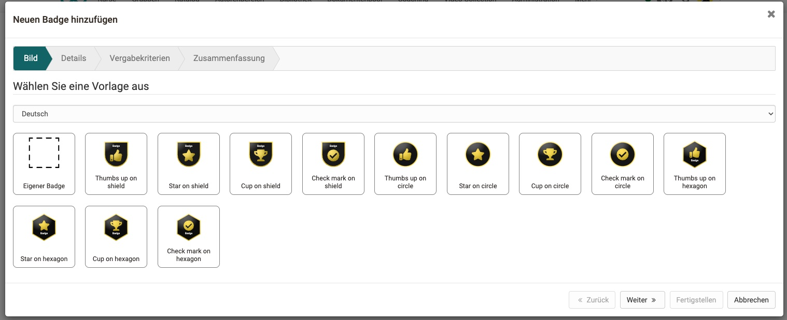
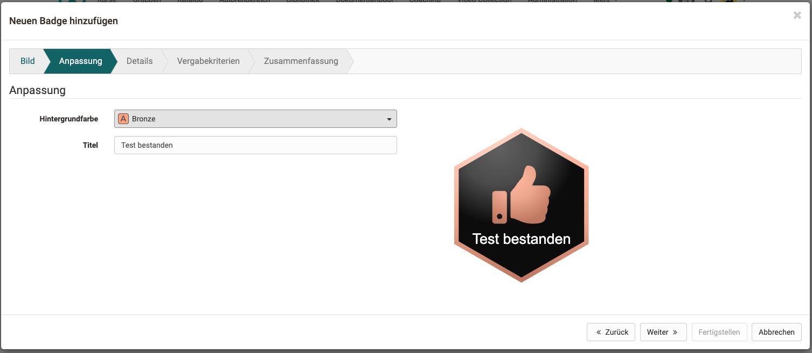
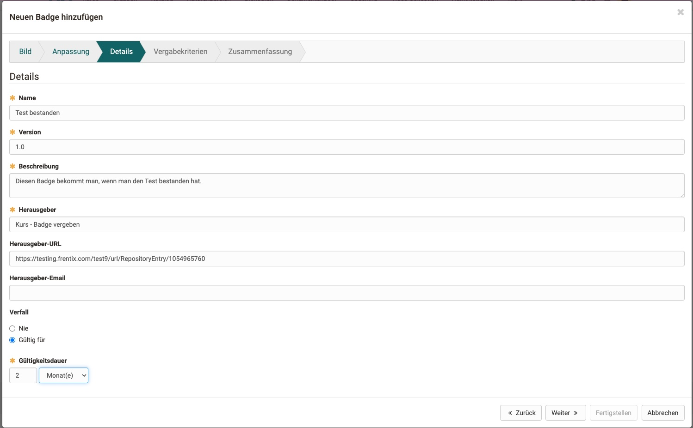
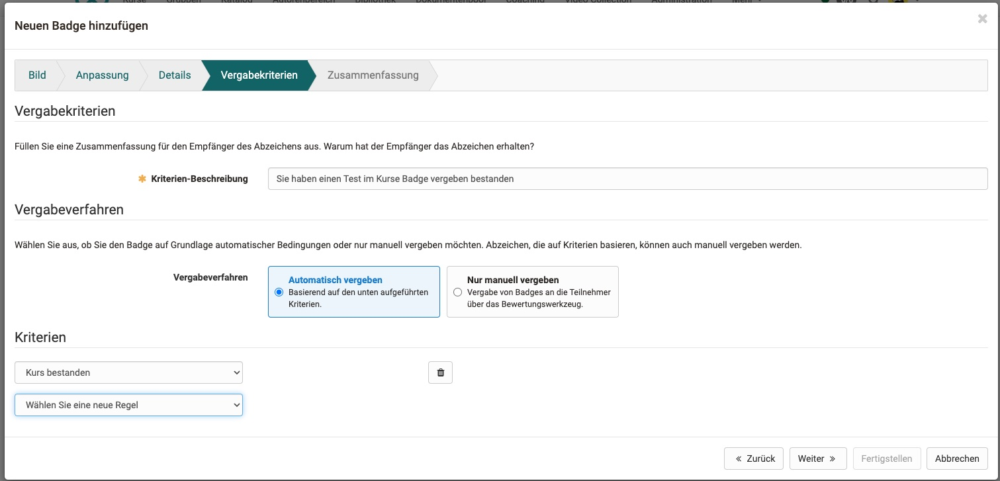
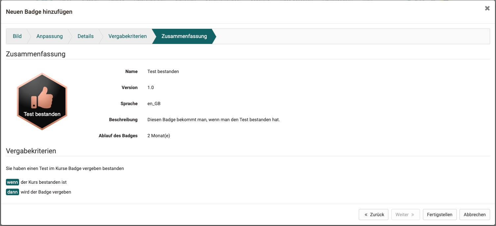

# Badges

Open Badges is a system of digital certificates or learning badges that they can use to award individual progress.

## Badge tool

Create Badges in the badge tool as rule based release or for manual release. 

## Creating & editing a badge

1. **Template**: First step is to select a template or upload your own image. Currently supported is SVG.

   
2. **Customization**: If the template was created with variables in mind, you can change colors and text in a template.

3. **Details & Validation period**: Mandatory details are the Name, Version and Description of the badge, as well as the Issuer. You can additionally add an URL and Contact to the Issuer Details. The Duration of validity can also be specified to never expire or have an timespan of e.g 12 months.

   
4. **Criteria**: Fill out the criteria and the explanation behind the rules you choose.

   
5. **Summary**: Summary screen of all the details.

   
6. **Earners**: Displays the Earners in a table to see, which participant already qualifies for the criteria you choose.

## Assess Badges in Assessment tool

Badges can be manually awarded in the assessment tool via Bulk action.

