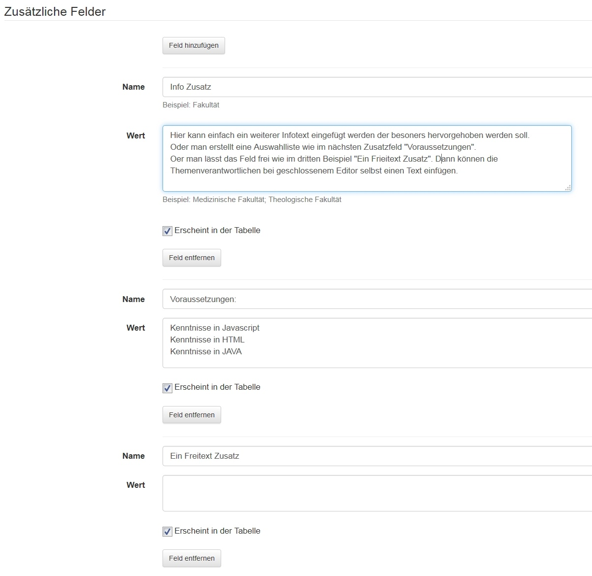
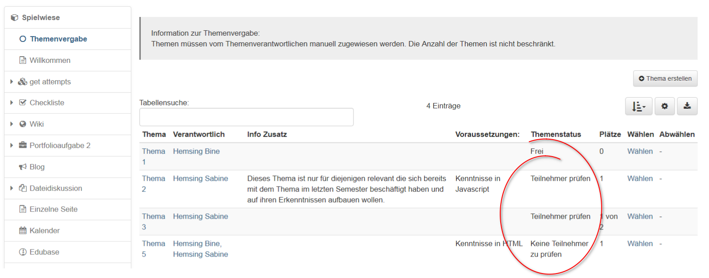
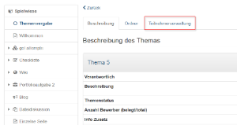

# Andere

## Kursbaustein „LTI-Seite“ {: #lti}

Mit Hilfe des Kursbausteins „LTI-Seite“ können Sie externe Lernapplikationen
in Ihren Kurs integrieren und den Inhalt im OpenOlat-Fenster anzeigen lassen.
LTI steht für „Learning Tool Interoperability“ und ist ein IMS Standard zur
Einbindung von externen Lernapplikationen wie zum Beispiel einem Chat, einem
Mediawiki, einem Testeditor oder einem virtuellen Labor.

Weitere Informationen zu LTI finden Sie auf der LTI Projekthomepage: [__
http://www.imsglobal.org/lti/](http://www.imsglobal.org/lti/)

Geben Sie im Tab „Seiteninhalt“ die zu referenzierende URL sowie den Schlüssel
und das zugehörige Passwort an. Wenn ein Benutzer in der Kursnavigation die
LTI-Seite anwählt, muss er aus Datenschutzgründen zuerst der Datenübertragung
zustimmen, bevor im Hintergrund die Benutzerdaten und Kursinformationen sowie
der Schlüssel geschützt an die eingebundene Lernapplikation übermittelt
werden. Die Lernapplikation überprüft die Zugangsrechte und erlaubt bei
gültigem Schlüssel den Zugriff. Eine erneute Abfrage zur Datenübermittlung
erfolgt später nur wieder, wenn sich die Konfiguration des Bausteins in Bezug
auf übermittelte Daten ändert.

Wenn der Benutzer die LTI-Seite in der Navigation auswählt, erscheint die
eingebundene Lernapplikation im OLAT-Kurs.

  

### LTI konfigurieren

Die folgenden Parameter können konfiguriert werden:

 **URL:** In diesem Eingabefeld geben Sie die Adresse der externen
Lernapplikation im Format "https://tools.vcrp.de/lti_quiz/lti_quizwand.php"
ein. Weitere Infos zu diesem Beispiel finden Sie
[hier](https://olat.vcrp.de/url/RepositoryEntry/1502282140/CourseNode/94291000213998)

 **Schlüssel:** Hier geben Sie den Schlüssel ein, den Sie vom Anbieter der
externen Lernapplikation erhalten haben ("lti_quiz" im obigen Beispiel).

 **Passwort:** Hier geben Sie das zum Schlüssel passende Passwort ein, das Sie
ebenfalls vom Anbieter der externen Lernapplikation erhalten haben ("weeHoo1w"
im obigen Beispiel).

 **Inhalt automatisch starten:** Ist diese Option aktiviert wird die
verbundene Applikation direkt, ohne Zwischenseite "LTI-Lerninhalt anzeigen"
dargestellt. Der Administrator kann diese Option abschalten.

* * *

 **Vorname/Name übertragen:** Wenn Sie diese Checkbox ankreuzen, wird der Vor-
und Nachname des Benutzers an die externe Lernapplikation weitergegeben.
Ansonsten kann der Benutzer die externe Lernapplikation anonym nutzen.

 **E-Mailadresse übertragen:** Markieren Sie die Checkbox, wird die
E-Mailadresse des Benutzers an die externe Lernapplikation weitergegeben.

 **Zusätzliche Attribute:** In dieses Eingabefeld können Sie weitere
Parameter eingeben, die an die Lernapplikation übermittelt werden sollen. So
kann der Lernapplikation beispielsweise mitgeteilt werden, dass die Anfrage
von der Lernplattform OLAT übermittelt wird. (Die externe Lernapplikation muss
die weitergegebenen Informationen verarbeiten können, weshalb eine Absprache
mit dem Anbieter nötig ist). Sie haben die Wahl von statischen Text-Attributen
(Für alle Benutzer ist Wert identisch) oder zusätzlichen dynamischen
Benutzerattributen (pro Benutzer unterschiedlich). Sie können beliebig viele
Zusatzattribute definieren, die LTI Ressource muss allerdings wissen, dass es
diese Attribute gibt da diese nicht im Standard definiert sind.

* * *

 **OpenOlat Rollen:** In diesem Bereich können Sie definieren welche Rolle
die einzelnen Benutzer einnehmen wenn Sie die LTI Ressource starten. Es werden
dabei die drei OpenOlat Besitzer, Betreuer und Teilnehmer unterstützt. Für
jede Rolle kann genau definiert werden, welche Rollen dafür auf Seiten der LTI
Ressource angewendet werden soll. Die folgenden LTI Rollen können konfiguriert
werden: Lerner, Instruktur, Administrator, Assistent Lehrperson,
Inhaltersteller und Mentor. 

**Punkte übertragen:** Wählen Sie diese Checkbox, wenn die LTI Ressource
Punkte erzeugen und mit dem LTI 1.1 Standard an OpenOlat übermitteln soll.
Dies ist optional. Übermittelte Punkte erscheinen beim Benutzer auf der
Startseite des LTI Bausteins sowie auf dem Leistungsnachweis. Bitte beachten
Sie, dass LTI gemäss Standard nur einen Wert zwischen 0 und 1 liefern kann.

!!! info ""

  Wird die Option „Punkte übertragen“ aktiviert, kann die LTI-Seite als bewertbares Kurselement zum Kurs hinzugefügt werden, und erscheint dann im Bewertungswerkzeug. Zusätzlich erscheinen die übermittelten Punkte beim Benutzer auf der Startseite des LTI-Bausteins.

 **Skalierungsfaktor:** Mit dem Skalierungsfaktor können Sie die LTI
Resultate, die gemäss Standard einen Wert zwischen 0 und 1 einnehmen müssen,
auf einen im OpenOlat Kurs praktischeren Wert Skalieren. Möchten Sie
beispielsweise in OpenOlat maximal 10 Punkte für eine LTI Aufgabe vergeben, so
müssen Sie als Skalierungsfaktor den Wert "10" eintragen. Möchten Sie die
Punkte unverändert übernehmen wählen Sie den Wert "1".

 **Notwendige Punktzahl für 'bestanden':** Geben Sie hier den optionalen
Schwellenwert, ab wann das LTI Element als bestanden gilt, an. Dieser
Schwellenwert bezieht sich auf das skalierte Endresultat und nicht auf die von
LTI übermittelten Rohdaten! Im obigen Beispiel wäre ein Schwellwert von "5"
gleichbedeutend mit "50%".

* * *

 **Anzeige:** Wählen Sie die Option "Eingebettet in Kurs (iFrame)" um die LTI
Ressource eingebetten im Kurslayout anzuzeigen. Mit der Option "Neues Fenster
öffnen" wird die LTI Ressource hingegen in einem neuen Fenster geöffnet. Dies
ist sinnvoll, wenn die Ressource viel Platz braucht oder parallel mit anderen
Kurselementen verwendet werden soll.

 **Höhe Anzeigefläche:** Wählen Sie "automatisch" oder eine explizite Grösse
aus wenn die automatische Funktion ungenügend ist.

 **Breite Anzeigefläche:** Wählen Sie "automatisch" oder eine explizite
Grösse aus wenn die automatische Funktion ungenügend ist.

* * *

 **Alle beim Start gesendete Information anzeigen (Debug):** Wenn Sie diese
Checkbox ankreuzen, werden den Benutzern die gesendeten Informationen
angezeigt. Diese Informationen beinhalten Parameter wie zum Beispiel die
Benutzeridentifikation, den Kursnamen, den Kursbaustein etc.Wenn Sie die in
der Kursansicht auf die Schaltfläche "Launch Endpoint with BasicLTI Data"
oberhalb der Anzeige der gesendeten Daten drücken, gelangen Sie zur Startseite
der Lernapplikation.

## Kursbaustein „Themenvergabe“  {: #topic_assignment}

Der Kursbaustein „Themenvergabe“ eignet sich dazu, wenn Sie in Ihrem Kurs
Themen wie beispielsweise Semesterarbeiten ausschreiben und betreuen lassen
wollen. Als Besitzer des Kurses bestimmen Sie die detaillierte Konfiguration
der Themenvergabe. Dazu gehört unter anderem, wer Themen ausschreiben und
betreuen darf, wie die Themen beschrieben werden müssen oder wie viele Themen
ein Kursteilnehmer wählen kann. Speziell am Kursbaustein „Themenvergabe“ ist,
dass nicht Sie als Kursbesitzer, sondern Themenverantwortliche Themen
ausschreiben und betreuen.

### Editoransicht

####  **Themenvergabe konfigurieren**

Im Tab „Konfiguration“ bestimmen Sie zuerst, wie viele Themen ein Teilnehmer
wählen kann und ob seine Wahl gleich gilt oder zuerst vom
Themenverantwortlichen akzeptiert werden muss. Weiter können Sie zusätzliche
Felder hinzufügen, welche die Themen beschreiben und in der Tabelle mit allen
ausgeschriebenen Themen aufgeführt werden. Hier können Sie auch konfigurieren,
ob die Themeneinschreibung und -abgabe nur innerhalb einer bestimmten Frist
möglich sein soll. Im Tab „Teilbausteine“ wählen Sie aus, ob es in Ihrer
Themenvergabe einen Abgabeordner und einen Rückgabeordner geben soll.
Kursteilnehmer laden ihre Dateien in den Abgabeorder und Themenverantwortliche
können Dateien über den Rückgabeorder zurückgeben.

**Konfiguration**

* **Anzahl Themen pro Teilnehmer limitieren?:** 
 
  Wenn Sie diese Option
auswählen, erscheint ein Feld, in welchem Sie die Anzahl der Themen eingeben
können, die ein Teilnehmer maximal pro Kursbaustein Themenvergabe auswählen
darf.  
  
* **Themenverantwortliche müssen Teilnehmer akzeptieren:** 

    Wenn Sie diese Option
auswählen, können sich Teilnehmer nur provisorisch für ein Thema einschreiben.
Die Themenverantwortlichen müssen dann die definitiven Teilnehmer aus den
möglichen Kandidaten auswählen und akzeptieren.  
Wenn Sie diese Option nicht auswählen, werden automatisch alle Teilnehmer
akzeptiert, die sich für das Thema eingeschrieben haben. Die
Themenverantwortlichen haben aber vorgängig die Möglichkeit, die maximale
Teilnehmerzahl zu definieren.  
  
* **Nur ein Thema erlaubt (Akzeptierte Teilnehmer werden automatisch aus allen anderen Themen ausgetragen):** 

    Diese Option bedeutet, dass vom
Themenverantwortlichen akzeptierte Teilnehmer automatisch aus allen anderen
gewählten Themen ausgetragen werden. Teilnehmende sind also höchstens für ein
Thema definitiv eingeschrieben.

* **Zusätzliche Felder hinzufügen:**

  Über "Feld hinzufügen" können Sie maximal fünf Ihren Bedürfnissen angepasste
Felder für die genauere Beschreibung der Themen hinzufügen.

  Im Feld "Name" geben Sie den gewünschten Feldnamen ein.

  Sie können den Themenverantwortlichen eine Auswahl an vordefinierten Werten
bzw. Texten anbieten, die in einem Pulldownmenu angezeigt werden. Hierzu geben
Sie die entsprechenden Auswahlmöglichkeiten getrennt durch Strichpunkte oder
Zeilenumbrüche im Feld "Wert" ein. Falls es sich um ein Freitextfeld handelt,
können Sie das Feld "Wert" leer lassen. Die Themenverantwortlichen können dann
einen beliebigen Wert eingeben.

  Wenn Sie "**Erscheint in der Tabelle**" wählen, wird das gewünschte Feld in der
Themenübersicht angezeigt. Ansonsten erscheint die Information erst bei der
detaillierten Themenbeschreibung.

  Über "**Feld entfernen**" können Sie zusätzliche Felder wieder löschen.

  
* **Einschreibetermin:** 

  Der Themenverantwortliche kann eine Einschreibefrist
für ein Thema festlegen. Nach Ablauf dieser Frist können die Teilnhemer das
Thema weder aus- noch abwählen. Der Themenverantwortliche kann nachträglich
Teilnehmer ein- und austragen.  
  
* **Abgabetermin:** 

  Ist der Abgabetermin abgelaufen, wird der Abgabeordner
geschlossen und die Teilnehmer können keine Dokumente mehr in den Abgabeordner
hochladen.  
  
  Wenn Sie "**Erscheint in der Tabelle**" wählen, wird der Termin in der Themenübersicht angezeigt.

----

#### **Weitere Einstellungen der Themenvergabe**

* **Themenverantwortliche ernennen - Tab "Verantwortliche"**

  Im Tab „Verantwortliche“ fügen Sie diejenigen OpenOlat-Benutzer hinzu, welche
Themen ausschreiben und betreuen dürfen. Diese Personen müssen nicht zwingend
Autorenrechte haben.

  Falls Sie einen Themenverantwortlichen entfernen, der bereits Themen
ausgeschrieben hat, kann er diese weiterhin betreuen, aber keine neuen Themen
ausschreiben.

* **Rolle des Themenverantwortlichen**

  Wenn Sie vom Besitzer als Themenverantwortlichen eingesetzt werden, können Sie
selber Themen ausschreiben und betreuen. Öffnen Sie die Kursansicht und
navigieren Sie zur Themenvergabe. Als Themenverantwortlicher haben Sie Zugriff
auf die zugehörigen Ordner. Ferner können Sie das Thema editieren, die
Teilnehmer des Themas verwalten sowie weitere Themenverantwortliche
hinzufügen.

* **Ordner - Tab "Teilbausteine"**

  Im Abgabeordner können Teilnehmer Dateien hochladen, die dann für die
Themenverantwortlichen zugänglich sind. Die Themenverantwortlichen können
Dateien in den Rückgabeordner legen.Voraussetzung ist, dass die Ordner in der
Konfiguration im Kurseditor aktiviert sind.

* ***Bestätigung der Abgabe - Tab "Abgabe"**

  Sie können optional einen Text eingeben, der dem Benutzer nach erfolgreicher
Abgabe der Datei in einem Fenster präsentiert wird. Wenn Sie keinen Text
eingeben, so wird sinngemäss folgender Text ausgegeben: Hiermit wird
bestätigt, dass Meier Hubert (hmeier) die Datei "test.html" am 21.09.04 um
00:14:42 hochgeladen hat.

  Wenn Sie die Option  _Text zusätzlich als E-Mail verschicken_ auswählen, so
wird dem Benutzer nach erfolgreicher Abgabe seiner Datei ein E-Mail mit dem
obigen Bestätigungstext geschickt.

###  Kursansicht {: #topic_assignment_runtime}

#### **Neues Thema erstellen**

Als Kursbesitzer oder Themenverantwortlicher können Sie neue Themen
einrichten. Übergibt man den Lernenden das Recht des Themenverantwortlichen
können sie selbst Themen(vorschläge) innerhalb eines Kurses einstellen und so
z.B. die weitere Gestaltung eines Kurses mitbestimmen oder selbst Vorschläge
für potenzielle Hausarbeiten oder Referate einreichen.

Klicken Sie auf „**Neues Thema erstellen**“ und geben Sie Thementitel und
Beschreibung ein. Je nach Konfiguration der Themenvergabe können Sie das Thema
mit weiteren Angaben beschreiben, die Einschreibe- und Abgabefrist festlegen,
bestimmen, wie viele Kursteilnehmer Ihr Thema wählen dürfen und bei Bedarf
zusätzliche Dateien als Anhang hochladen. Des weiteren legen Sie fest ob
Teilnehmer Themen wieder abwählen dürfen, und ob die Themenverantwortlichen
bei Themenaus-/abwahl per E-Mail benachrichtigt werden soll.

!!! tip "Tipp" 

    Wenn Sie zu einem späteren Zeitpunkt die Konfiguration ändern wollen, klicken Sie auf den Titel des Themas. Nun können Sie das Thema editieren, den Themenstatus von „frei“ auf „belegt“ oder umgekehrt ändern oder das Thema löschen.

#### **Thema erstellen und bearbeiten im Detail**

* **Thema:** 

  Unter Titel ist der Titel des Themas aufgeführt, und kann vom
Themenverantwortlichen geändert werden.  
  
* **Verantwortlich:** 

  Hier sind die Themenverantwortlichen aufgelistet. Wenn
User auf den Namen des Themenverantwortliches klicken, gelangen Sie zu seiner
Visitenkarte und können ihn kontaktieren.

!!! info "Info"

    Wenn Sie ein Thema anlegen, werden Sie automatisch als Themenverantwortlicher aufgeführt. Sie können diese Rolle im Tab Teilnehmerverwaltung einer anderen Person übertragen oder auch weitere Benutzer zu Themenverantwortlichen ernennen.  
  
* **Beschreibung:** 

  Im Feld Beschreibung können Detailinformationen zum Thema
eingetragen werden.

* **Themenstatus:** 

  In diesem Feld wird automatisch der Themenstatus angezeigt.

  Sind Sie Themenverantwortlicher oder Kursbesitzer und es haben sich noch keine
Teilnehmer für Ihr Thema eingeschrieben, ist der Themenstatus auf "Keine
Teilnehmer zu prüfen" gesetzt. Haben sich Teilnehmer bereits eingetragen, ist
der Status auf "Teilnehmer prüfen" gesetzt. Haben Sie bereits aus den
möglichen Kandidaten Teilnehmer gewählt, wird der Status "Teilnehmer
akzeptiert" angezeigt.

* **Anzahl Bewerber limitieren:** 

  Die Themenverantwortlichen können die
verfügbare Anzahl Plätze begrenzen.

* **Abmelden vom Thema erlauben:** 
  
  Sofern aktiviert dürfen sich die Teilnehmer
auch wieder aus einem Thema austragen.

* **Zusätzliche Felder:** 

  Sofern vom Kursbesitzer im Kurseditor eingerichtet
(siehe oben) stehen den Themenverantwortlichen weitere Zusatzfelder zur
Verfügung. Je nach Umsetzung stehen hier ein oder mehrere Auswahlelement in
einer Drop-Downliste zur Verfügung oder die Themenveranwortlichen können
selbst Text einfügen.

* **Einschreibetermin:** 

  Sofern im Editor eingerichtet, können
Themenverantwortliche hier eine Einschreibefrist definieren, wodurch nur in
der entsprechenden Zeitspanne ein Thema aus- bzw. abgewählt werden kann. Vor
und nach dieser Frist werden die Links "Wählen" und "Abwählen" deaktiviert und
Benutzer können sich nicht in Ihr Thema ein- und austragen. Vor und nach
Ablauf der Einschreibefrist können Teilnehmer aber vom Themenverantwortlichen
manuell ein- oder ausgetragen werden.  
  
* **Abgabetermin:** 

  Sofern im Editor eingerichtet, können Themenverantwortliche
eine Abgabefrist definieren. Nur in der entsprechenden Zeitspanne können dann
Dokumente in den Abgabeordner hochgeladen werden.  
  
* **Anhang:**  

  Im Feld Anhang können die Themenverantwortlichen eine Datei
hochladen. Das macht dann Sinn wenn man noch umfangreiche Dokuemnte zu einem
Thema ergänzen möchte. Mehrere Dateien können als ZIP-Datei hochgeladen
werden.  
  
* **E-Mail-Benachrichtigung bei Themen Auswahl/Abwahl:** 

  Wenn Sie diese Option
wählen, werden Sie per E-Mail benachrichtigt, wenn Kursteilnehmer Ihr Thema
aus- oder abwählen.

Über "**Thema editieren**" gelangen Sie in den Bearbeitungsmodus und können die
aufgeführten Felder ändern.

Klicken Sie auf "**Thema löschen**", wenn Sie Ihr Thema aus der Themenvergabe
entfernen möchten.

Wählen Sie "**Themenstatus auf "Belegt" setzen**", wenn keine weiteren Teilnehmer
ein Thema wählen können sollen. 

Über "**Themenstatus auf "Frei" setzen**" können
Sie ein Thema erneut zur Wahl öffnen, auch wenn sich bereits Teilnehmer
eingeschrieben und Sie diese akzeptiert haben. 

!!! warning "Achtung"

    Bitte beachten Sie, dass die zwei letzteren Schaltflächen nur ersichtlich sind, wenn der Besitzer die Themenvergabe so konfiguriert hat, dass die Teilnhemer manuell akzeptiert werden müssen.

### Tabs "Ordner" und "Teilnehmerverwaltung"

####  **Teilnehmer verwalten**

Wenn die Konfiguration der Themenvergabe vorsieht, dass die Wahl der
Kursteilnehmer vom Themenverantwortlichen akzeptiert werden muss, sehen Sie
auf der Startseite der Themenvergabe in der Tabelle den Vermerk „**Teilnehmer prüfen**“, sobald sich jemand für Ihr Thema eingeschrieben hat.

Öffnen Sie den Tab "**Teilnehmerverwaltung**" und akzeptieren Sie den/die
Kandidaten.

Über "**Als Teilnehmer übernehmen**" wählen Sie, wem Sie das Thema vergeben
möchten. Die akzeptierten Teilnehmer werden zur Liste "Akzeptierte Teilnehmer"
hinzugefügt und werden auf Ihren Wunsch per E-Mail benachrichtigt. Markieren
Sie die Kandidaten, die Sie nicht akzeptieren, und klicken Sie auf
"Entfernen". Auf Ihren Wunsch werden die abgelehnten Kandidaten ebenfalls per
E-Mail benachrichtigt.

Wenn Sie die Anzahl der Plätze nicht limitiert haben, können Sie den Vorgang
mehrmals wiederholen. Denken Sie daran, im Tab "Beschreibung" "Themenstatus
auf "Belegt" setzen" zu wählen, damit sich keine weiteren Kursteilnehmer für
Ihr Thema bewerben.

In diesem Tab können Sie auch manuell Teilnehmer sowie weitere
Themenverantwortliche hinzufügen oder entfernen. Teilnehmer haben kein Recht,
das Thema zu editieren.

#### **Dateien herunterladen und zurückgeben**

Im Tab „Ordner“ finden Sie im Abschnitt „Abgabeordner“ alle Dateien, die
Kursteilnehmer abgegeben haben. Im Abschnitt „Rückgabeordner“ können Sie
korrigierte Dateien zurückgeben. Für jeden Kursteilnehmer steht dazu ein
Unterordner bereit.

  

***Aus der Nutzerperspektive:***

Falls der Themenstatus auf "Frei" ist, können sich Benutzer für ein Thema
einschreiben, sofern sie die maximal mögliche Themenauswahl nicht
überschritten haben. Steht der Themenstatus auf "Belegt" können sich keine
weiteren Benutzer einschreiben. Wenn Sie bereits ein Thema gewählt haben,
steht der Themenstatus entweder auf "Provisorisch zugewiesen", wenn der
Themenverantwortliche Sie als Teilnehmer akzeptieren muss, oder auf
"Zugewiesen", wenn die Einschreibung automatisch verläuft. Sobald Sie der
Themenverantwortliche als Teilnehmer akzeptiert, wird der Themenstatus auf
"Definitiv zugewiesen" gesetzt.

## Kursbaustein „Linkliste“ {: #linklist}

Der Kursbaustein "Linkliste" erlaubt es schnell und einfach eine Linksammlung
für einen Kurs anzulegen. Keinerlei HTML-Kenntnisse werden dazu benötigt. In
der Editoransicht des Kursbausteins muss im Tab "Konfiguration" lediglich die
URL der Zielseite eingetragen, oder eine Zieldatei über das Lupen-Icon
ausgewählt werden. Im neu sich öffnenden modalen Fenster können Dateien auch
hochgeladen werden. Wählen Sie aus ob der Link in einem neuen oder im
bestehenden Fenster geöffnet wird, und geben Sie dann den gewünschten Titel
des Links an. Im Kommentarfeld unterhalb der Adresszeile kann bei Bedarf eine
Beschreibung zum Link hinzugefügt werden. Mit einem Klick auf die Müll- oder +
Schaltfläche werden bestehende Links gelöscht oder neue hinzugefügt.

Beispiel:

