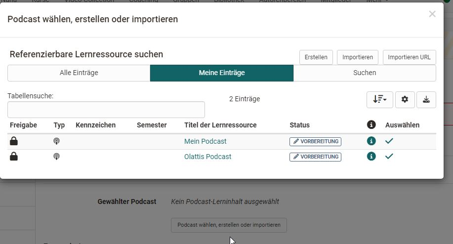
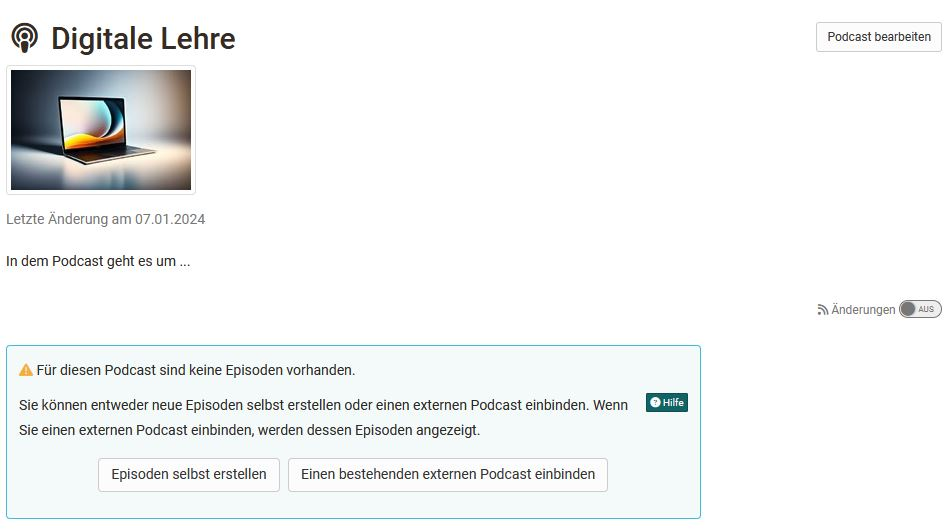
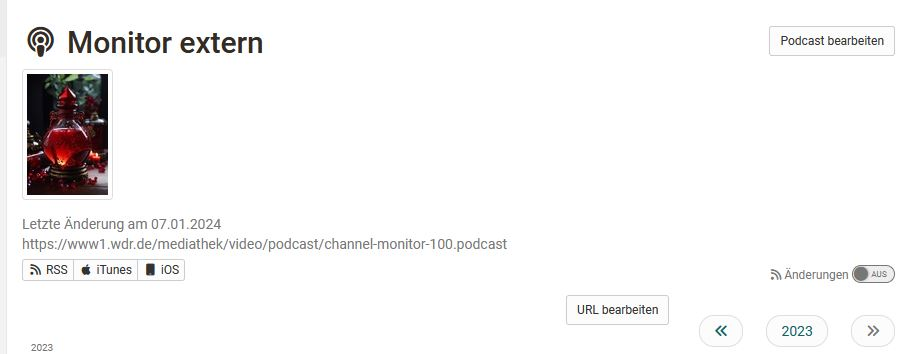
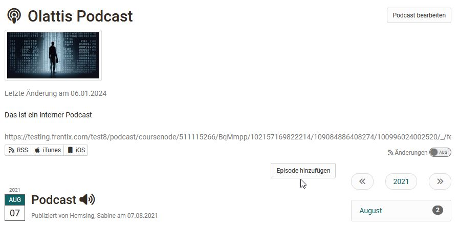

# Podcast konfigurieren {: #config}

Die folgenden Ausführungen zur Konfiguration beziehen sich auf Podcasts in Kursen.

## Tab "Podcast-Lerninhalt"

Die Basis-Einstellungen werden im Kurseditor im Tab "Podcast-Lerninhalt" vorgenommen. 

Wenn Sie einen neuen Kursbaustein Podcast Ihrem Kurs hinzugefügt haben, können Sie als erstes

* eine bereits erstellte Lernressource Podcast aus der angezeigten Liste auswählen oder
* einen neuen Podcast und damit eine neue Lernressource Podcast erstellen oder
* eine vorliegende Podcast Datei aus einem Backup oder einer anderen Instanz "importieren" oder
* einen externen Podcast aus dem Internet importieren (Importieren URL)

Generelle Infos zur Erstellung von Podcasts finden Sie in der [How to Podcast Anleitung](../../manual_how-to/podcast/podcast.de.md).

Wird die Option "Erstellen" gewählt [(vergl. Schritt 2 der How to Anleitung)](../../manual_how-to/podcast/podcast.de.md) bezieht sich das lediglich auf das Anlegen der Lernressource. Im nächsten Schritt muss immer noch definiert werden ob die Episoden selbst erstellt werden sollen oder ob ein bestehender Podcast eingebunden werden soll [(vergl. Schritt 4)](../../manual_how-to/podcast/podcast.de.md). Wählt man hier die externe Variante entspricht das der Wahl "Importieren URL" aus dem vorherigen Erstellungsmenü. 

Eine angelegte Verknüpfung kann jederzeit wieder ausgewechselt oder editiert werden. Über "Podcast auswechseln" kann auch wieder zwischen einem internen und einem externen Podcast gewechselt werden. 
"Editieren" entspricht den Bearbeitungsmöglichkeiten bei geschlossenem Editor. Beachten Sie, dass die Bearbeitungsmöglichkeiten bei externen Podcasts eingeschränkt sind und in diesem Fall keine eigenen Dateien dem Podcast hinzugefügt werden können. 

### Externen Podcast einbinden und anzeigen

Möchten Sie einen externen Podcast aus dem Internet einbinden benötigen Sie den Link zum konkreten Podcast bzw. den RSS-Feed des Pod- oder Vodcasts. In der Regel ist dies eine URL mit der Erweiterung .xml. Achtung: Der Link ist nicht identisch mit einem Video- oder Audio-Link!

Um einen externen Podcast in den Kurs einzubinden wählen Sie im Kurseditor im Tab "Podcast-Inhalt" "Importieren URL" bzw. bei einem neu angelegten Podcast bei geschlossenem Kurseditor "Einen bestehenden externen Podcast einbinden".
Im Feld "URL" geben Sie den Feed-Link des externen Podcast ein.  

Externe Podcast enthalten in der Regel bereits konkrete Inhalte (Episoden). Im Kursbaustein werden dann bei geschlossenem Kurseditor die entsprechenden Episoden angezeigt.

### Benutzerberechtigungen

Im Tab "Podcast-Lerninhalt können sie auch definieren wer einen Podcast moderieren und wer Beiträge erstellen darf. Auf diesen Weg können auch Teilnehmende das Recht erhalten Audio- und Video-Podcasts in OpenOlat hochzuladen. Besitzer verfügen standardmässig über diese Rechte. 

Das Moderationsrecht beinhaltet, dass die Personen den Podcast bearbeiten und alle Episoden und Kommentare löschen dürfen. Zudem können Moderatoren auch den Titel und die Beschreibung des ganzen Feeds anpassen. 

Das Recht Beiträge zu erstellen bedeutet, dass die definierten Rollen bzw. Personen Audios und Videos in den Kursbaustein hochladen und mit Beschreibungen versehen  dürfen. 

Mit Hilfe der erweiterten Konfiguration der Berechtigungen können die Einstellungen noch differenzierter vorgenommen werden und beispielsweise bestimmten Rollen, Gruppen oder auch einzelnen Personen die Berechtigung zum erstellen der Podcasts oder das Moderationsrecht erteilt werden. 

## Konfiguration im Kursrun (bei geschlossenem Kurseditor)

Wurde der Kursbaustein mit einer Lernressource Podcast verbunden bzw. ein externer Podcast gewählt können nun im Kursrun je nach Berechtigung folgende Aktionen vorgenommen werden:

### Kursbesitzer, Betreuer mit Moderationsrechten 

* Können entscheiden ob Episoden selbst erstellt oder ein bestehender Podcast eingebunden werden soll, sofern nicht bereits ein externer Podcast gewählt wurde.

!!! info "Wichtig"

    Solange die Entscheidung noch nicht getroffen und keine erste initiale Episode vorliegt können auch Personen mit der Berechtigung Episoden zu erstellen noch nichts hochladen!  

* Unter "Podcast bearbeiten" kann ein Titel, eine Beschreibung und ein Bild für den Podcast festgelegt werden. Bei externen Podcasts wird automatisch ein Bild übertragen, das jedoch geändert werden kann. 

* URL bearbeiten: Bei externen Podcasts kann die URL und damit der gewählte Podcast ausgewechselt werden.

* Bei internen Podcasts können Episoden erstellt werden. Das bedeutet, es können Audio- und Videodateien für eine Episode hochgeladen und mit einer Beschreibung versehen werden. 

!!! warning "Achtung"

    Beachten Sie auch die vom OpenOlat Administrator definierten Upload- und Speichergrenzen und versuchen Sie eher kleine Dateien hochzuladen.

### Kursteilnehmende

... und generell alle Personen mit Zugriff auf den Podcast können: 

* Audio Episoden anhören bzw. Video-Dateien ansehen und durch die chronologischen Episoden navigieren
* Kommentare und Sternchenbewertungen zu jeder Mediendatei hinterlassen. Kommentare können auch wieder gelöscht werden
* Sich über Änderungen von OpenOlat informieren lassen (Änderungen einschalten) und zusätzlich  Podcast Episoden per RSS-Feed abonnieren. 

Mit dem Recht "Beiträge erstellen" können auch Teilnehmende Episoden erstellen und somit Audios und Videos hochladen. 

!!! info "Wichtig"

    Damit die Lernenden eigene Audio oder Video-Episoden hinzufügen können, muss ein erstes Video vorhanden sein. Zum Beispiel könnte die Lehrperson ein erstes Audio/Video hochladen und hier kurz erläutern, was die Lernenden im Podcast machen sollen oder in das Thema mit spannenden Reflexionsfragen einführen.

[zum Seitenanfang ^](#config)

## Weitere Informationen

[Podcasts in Kursen erstellt >](../../manual_how-to/podcast/podcast.de.md) 
[Podcasts anhören und ansehen >](../learningresources/Podcast_listen_and_watch.de.md) 

