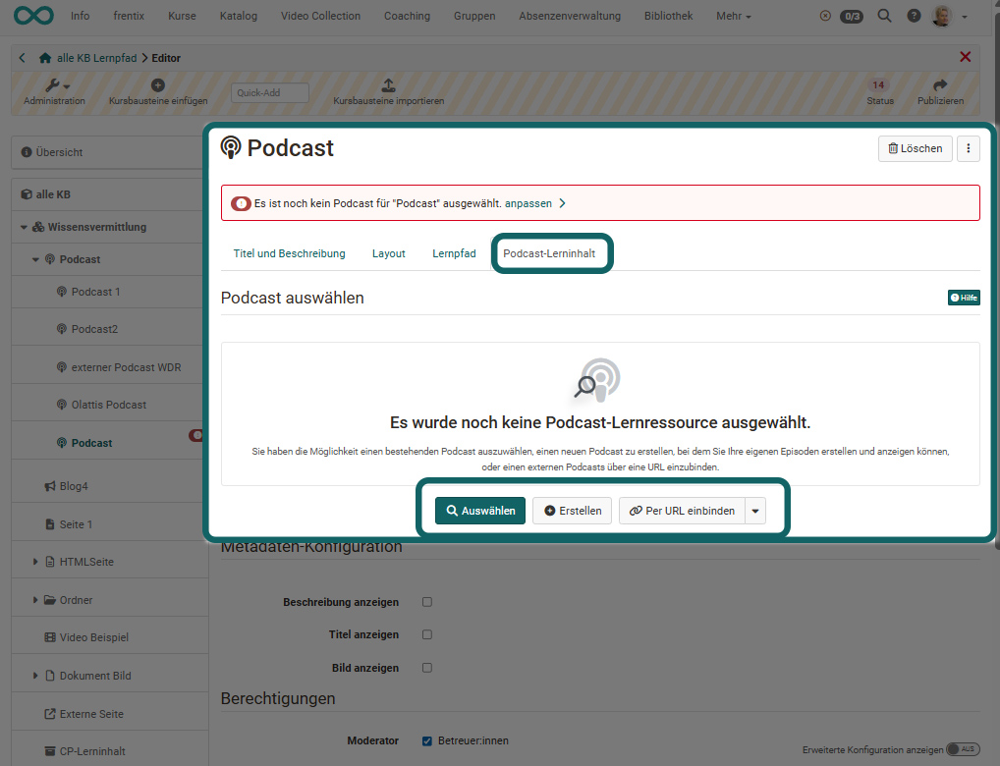
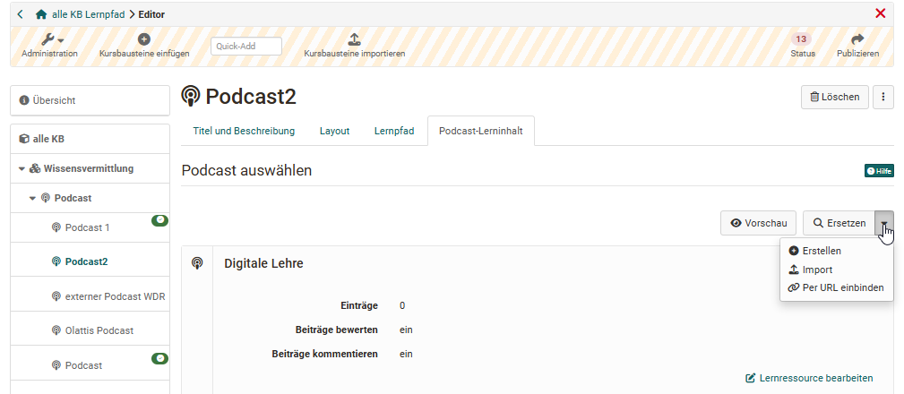
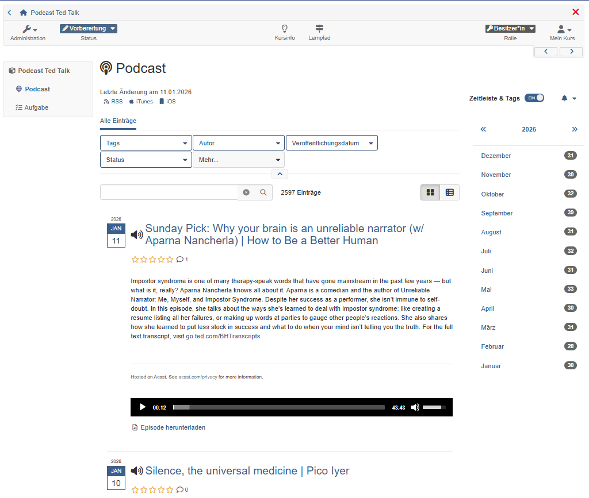

# Podcast konfigurieren {: #config}

Die folgenden Ausführungen zur Konfiguration beziehen sich auf Podcasts in Kursen.

## Tab "Podcast-Lerninhalt"

Die Basis-Einstellungen werden im Kurseditor im Tab "Podcast-Lerninhalt" vorgenommen. 

Wenn Sie einen neuen Kursbaustein Podcast Ihrem Kurs hinzugefügt haben, müssen Sie als erstes eine bereits erstellte Lernressource Podcast auswählen, eine neue Podcast Lernressource erstellen oder einen im Internet existierenden Podcast in eine neue Lernressource einbinden. 

Über den Button "Auswählen" stehen Ihnen alle Optionen zur Verfügung. Sie können: 

a) Eine neue Lernressource Podcast **erstellen** 

b) Eine existierende Lernressource Podcast hochladen und **importieren**

c) einen im Internet vorliegenden Podcast **per URL einbinden**. 

Alternativ können Sie die Optionen auch direkt über die Links "Erstellen" (vergl. a), "Per URL einbinden" (vergl. c) bzw. "Import" (vergl. b) aufrufen.

Die Optionen "Erstellen" oder "Importieren" beziehen sich immer auf OpenOlat interne Podcasts, die mit eigenen Audio- oder Video-Inhalten befüllt werden. 

Soll ein externer Podcast aus dem Internet über den Kursbaustein für den Kurs bereitgestellt werden muss dieser per URL eingebunden werden (Option c). Dabei wird für ihn ebenfalls eine Lernressource Podcast angelegt. 

!!! warning "Hinweis"

    Beachten Sie, dass in externe Podcasts keine eigenen Audio- oder Video-Episoden dem Podcast hinzugefügt werden können. 

Eine im Kursbaustein angelegte Podcast-Verknüpfung kann jederzeit wieder ausgewechselt oder editiert werden. 

### Externen Podcast einbinden 

Möchten Sie einen externen Podcast aus dem Internet in Ihren Kurs einbinden, benötigen Sie den RSS-Feed des Podcasts oder Vodcasts. Dieser Feed-Link endet häufig auf .xml. Beachten Sie: Der Link zum Podcast-Feed unterscheidet sich vom direkten Audio- oder Video-Link!

Um einen externen Podcast in den Kurs einzufügen, wählen Sie im Kurseditor unter dem Tab „Podcast-Inhalt“ die Option „Per URL einbinden. Im daraufhin erscheinenden Feld „URL“ geben Sie den RSS-Feed-Link des externen Podcast ein.

Externe Podcast-Feeds enden häufig auf .xml oder .rss und enthalten meist die Begriffe „feed“, „rss“ oder „podcast“ in der URL (nicht immer, aber oft). Sobald der Podcast eingebunden ist, werden im Kursbaustein die entsprechenden Episoden angezeigt.

### Metadaten anzeigen 

Im Tab Podcast-Lerninhalt kann unter "Metadaten-Konfiguration" zusätzlich noch definiert werden ob auch weitere Infos wie Beschreibung, Titel oder Bild zum Podcast angezeigt werden sollen. Diese werden in der jeweiligen Podcast Lernressource hinterlegt bzw. werden bei externen Podcasts automatisch ausgelesen, können aber auch geändert werden.

### Berechtigungen definieren

Für OpenOlat-interne Podcasts wird im Tab „Podcast-Lerninhalt“ festgelegt, wer Episoden (Beiträge) erstellen und wer den gesamten Podcast moderieren darf.

Das **Moderationsrecht** erlaubt es, den Podcast zu bearbeiten, alle Episoden und Kommentare zu löschen sowie Titel und Beschreibung des Feeds anzupassen. Standardmässig besitzen Kursbesitzer:innen diese Rechte.

Das **Recht zum Erstellen von Beiträgen** gilt nur für interne OpenOlat Podcasts. Es ermöglicht es den zugewiesenen Rollen oder Personen, Audio- und Videoepisoden hochzuladen und mit Beschreibungen zu versehen. So können auch Teilnehmende Episoden einstellen, ohne Moderationsrechte für den gesamten Podcast zu erhalten.

Über die erweiterte Berechtigungskonfiguration lassen sich die Einstellungen weiter differenzieren, etwa indem bestimmten Rollen, Gruppen oder einzelnen Personen das Erstellen von Episoden oder das Moderationsrecht zugewiesen wird.

!!! warning "Achtung"
Beachten Sie die von den OpenOlat Administrator:innen festgelegten Upload- und Speichergrenzen und laden Sie möglichst kleine Dateien hoch.

Ist der Kurseditor geschlossen, werden die bereitgestellten Podcast-Episoden sowie – sofern im Kurseditor aktiviert – die in der Lernressource hinterlegten Informationen (Titel, Beschreibung, Bild) angezeigt.

### Rechte für Kursteilnehmende

Teilnehmende können: 

* Audio Episoden anhören bzw. Video-Dateien ansehen und durch die chronologischen Episoden navigieren
* Kommentare und Sternchenbewertungen zu jeder Mediendatei hinterlassen. Eigene Kommentare können auch wieder gelöscht werden
* Sich über Änderungen von OpenOlat informieren lassen (Abonnements einschalten) 

Mit dem Recht "Beiträge erstellen" können auch Teilnehmende Episoden erstellen und somit Audios und Videos hochladen. 

[zum Seitenanfang ^](#config)

## Weitere Informationen

[Podcasts in Kursen erstellen >](../../manual_how-to/podcast/podcast.de.md) 
[Podcasts anhören und ansehen >](../learningresources/Podcast_listen_and_watch.de.md) 
[How to Anleitung:"Wie erstelle ich einen Podcast"](../../manual_how-to/podcast/podcast.de.md)