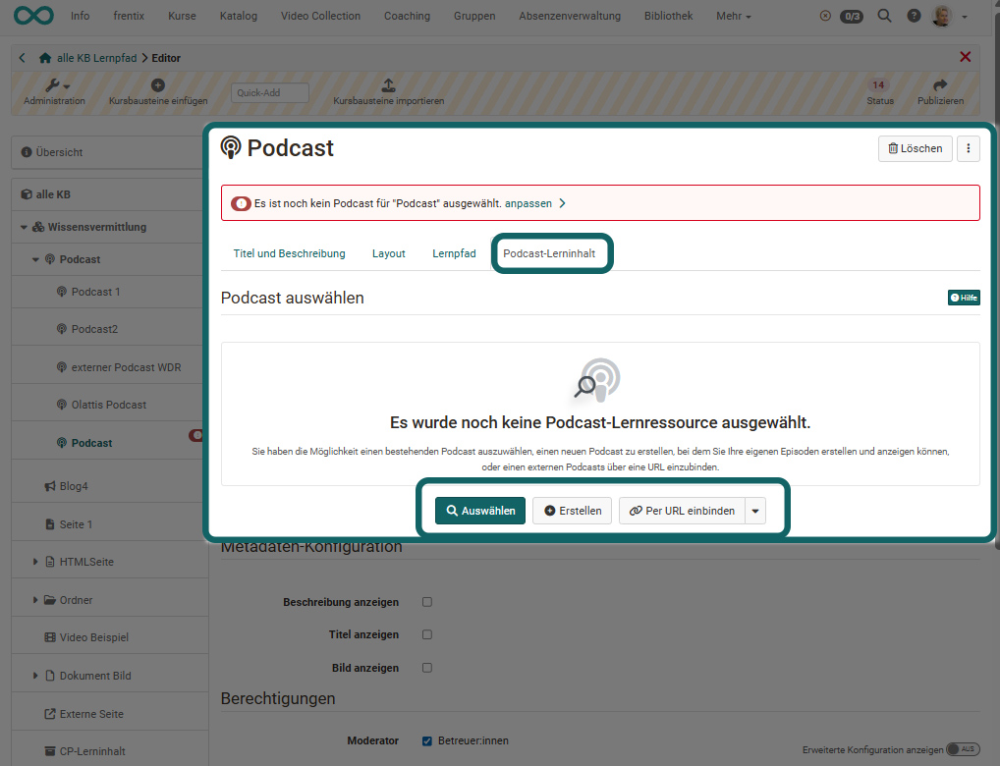
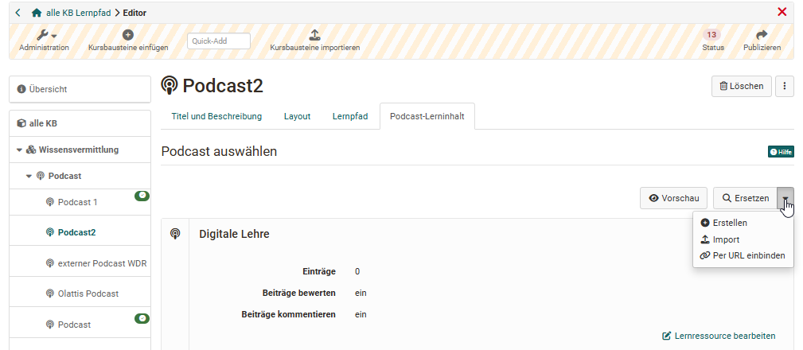
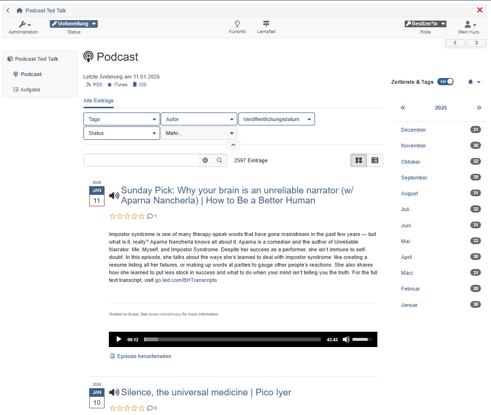

# Podcast - Configurations {: #config}

The following information on configuration relates to podcasts in courses.

## Tab: Podcast learning content

The basic settings are made in the course editor in the "Podcast learning content" tab. 

{ class="shadow lightbox" }

Once you have added a new podcast course element to your course, you must first select an existing podcast learning resource, create a new podcast learning resource, or integrate an existing podcast from the internet into a new learning resource. 

The "Select" button gives you access to all options. You can: 

a) **Create** a new learning resource podcast 

b) Upload and **import** an existing learning resource podcast

c) **Embed** a podcast available on the Internet **via URL**. 

Alternatively, you can also access the options directly via the links "Create" (see a), "Embed via URL" (see c), or "Import" (see b).

The options "Create" or "Import" always refer to OpenOlat internal podcasts that are filled with your own audio or video content. 

If an external podcast from the Internet is to be made available for the course via the course module, it must be integrated via URL (option c). A podcast learning resource is also created for it. 

!!! warning "Note"

    Please note that you cannot add your own audio or video episodes to external podcasts. 

A podcast link created in the course module can be replaced or edited at any time. 

{ class="shadow lightbox" }

### Include external podcast

If you would like to integrate an external podcast from the Internet, you need the link to the specific podcast or the RSS feed of the podcast or vodcast. This is usually a URL with the extension .xml. Attention: The link is not identical to a video or audio link!

To add an external podcast to the course, select the "Embed via URL" option in the course editor under the "Podcast learning content" tab. Enter the RSS feed link of the external podcast in the "URL" field that appears.

External podcast feeds often end in .xml or .rss and usually contain the words "feed", "rss", or "podcast" in the URL (not always, but often). Once the podcast is embedded, the course element displays the corresponding episodes.

{ class="shadow lightbox" }

### Show metadata

In the Podcast Learning Content tab, under "Metadata Configuration," you can also define whether additional information such as a description, title, or image for the podcast should be displayed. This information is stored in the respective podcast learning resource or is automatically read from external podcasts, but it can also be changed.

### Define User rights

For OpenOlat internal podcasts, the "Podcast learning content" tab is used to specify who is allowed to create episodes (contributions) and who is allowed to moderate the entire podcast.

The **moderation right** allows you to edit the podcast, delete all episodes and comments, and customize the title and description of the feed. By default, course owners have these rights.

The **right to create posts** only applies to internal OpenOlat podcasts. It allows assigned roles or individuals to upload audio and video episodes and add descriptions. This means that participants can also post episodes without being granted moderation rights for the entire podcast.

The advanced permission configuration allows you to further differentiate the settings, for example by assigning the right to create episodes or moderate to specific roles, groups, or individuals.

!!! warning "Attention"

        Please observe the upload and storage limits set by the OpenOlat administrators and upload files that are as small as possible.

When the course editor is closed, the podcast episodes provided and, if activated in the course editor, the information stored in the learning resource (title, description, image) are displayed.

### Rights for participants

Participants can...

* ... listen to audio episodes or watch video files and navigate through the chronological episodes
* ... leave comments and star ratings for each media file. Comments can also be deleted again
* ... be informed about changes to OpenOlat (switch on subscriptions)

With the "Create contributions" right, participants can also create episodes and thus upload audio and videos. 

## Further information {: #further_information}

**Further** 
[How do I create a podcast? >](../../manual_how-to/podcast/podcast.md) 
[Listen and watch to podcasts >](../learningresources/Podcast_listen_and_watch.md)

[To the top of the page ^](#config)

