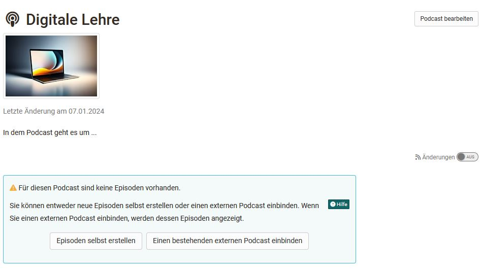

# Podcast - Configurations {: #config}

The following information on configuration relates to podcasts in courses.

## Tab: Podcast learning content

The basic settings are made in the course editor in the "Podcast learning content" tab. 

When you have added a new course element Podcast to your course, you can first

  * select an already created learning resource podcast,
  * create a new podcast and thus a new learning resource podcast or
  * "import" an existing podcast file from a backup or another instance or
  * Import an external podcast from the Internet (Import URL)

You can find general information on creating podcasts in the [How to Podcast guide](../../manual_how-to/podcast/podcast.md).

If the "Create" option is selected [(see step 2 of the How to guide)](../../manual_how-to/podcast/podcast.md), this only refers to the creation of the learning resource. In the next step, you still need to define whether you want to create the episodes yourself or whether you want to integrate an existing podcast [(see step 4)](../../manual_how-to/podcast/podcast.md). If you select the external variant here, this corresponds to the "Import URL" selection from the previous creation menu. 

A created link can be changed or edited at any time. You can also switch between an internal and an external podcast via "Change podcast". 
"Edit" corresponds to the editing options when the editor is closed. Please note that the editing options for external podcasts are limited and in this case you cannot add your own files to the podcast. 

### Include external podcast

If you would like to integrate an external podcast from the Internet, you need the link to the specific podcast or the RSS feed of the podcast or vodcast. This is usually a URL with the extension .xml. Attention: The link is not identical to a video or audio link!

To integrate an external podcast into the course, select "Import URL" in the "Podcast content" tab in the course editor or "Integrate an existing external podcast" for a newly created podcast when the course editor is closed.
Enter the feed link of the external podcast in the "URL" field.

External podcasts usually already contain specific content (episodes). The corresponding episodes are then displayed in the course element when the course editor is closed.

### User rights

In the tab "Podcast learning content" you can also define the user rights and set who can moderate a podcast and who can create contributions. This way, participants can also be given the rights to upload podcasts to OpenOlat. Owners have these rights by default. 

The moderation right means that people can edit the podcast and delete all episodes and comments. Moderators can also adjust the title and description of the entire feed. 

The right to create contributions means that the defined roles or persons can upload audios and videos to the course element and add descriptions.

With the help of the extended configuration of the authorizations, the settings can be made even more differentiated and, for example, certain roles, groups or even individual persons can be granted authorization to create podcasts or moderation rights. 

## Configuration in the Course run (with closed course editor)

If the course element has been linked to a podcast learning resource or an external podcast has been selected, the following actions can now be carried out in the course run depending on the authorization:

### Course owner, coach with moderator rights

* Can decide whether to create episodes themselves or integrate an existing podcast if an external podcast has not already been selected.

!!! info "Important"

    As long as the decision has not yet been made and there is no first initial episode, even people with the authorization to create episodes cannot upload anything!

* Under "Edit podcast", a title, a description and an image can be defined for the podcast. An image is automatically transferred for external podcasts, but this can be changed. 

* Edit URL: For external podcasts, the URL and thus the selected podcast can be changed.

* Episodes can be created for internal podcasts. This means that audio and video files can be uploaded for an episode and provided with a description. 

!!! warning "Attention"

    Please also note the upload and storage limits defined by the OpenOlat administrator and try to upload small files.

### Course participants

... and generally anyone with access to the podcast:

* Listen to audio episodes or watch video files and navigate through the chronological episodes
* Leave comments and star ratings for each media file. Comments can also be deleted again
* Be informed about changes to OpenOlat (switch on changes) and also subscribe to podcast episodes via RSS feed.

With the "Create contributions" right, participants can also create episodes and thus upload audio and videos. 

!!! info "Important"

    An initial video must be available so that learners can add their own audio or video episodes. For example, the teacher could upload an initial audio/video and briefly explain what the learners should do in the podcast or introduce the topic with exciting reflection questions.

[To the top of the page ^](#config)

## Further information

[Create podcasts in courses >](../../manual_how-to/podcast/podcast.md) 
[Listen to and view podcasts >](../learningresources/Podcast_listen_and_watch.md) 

