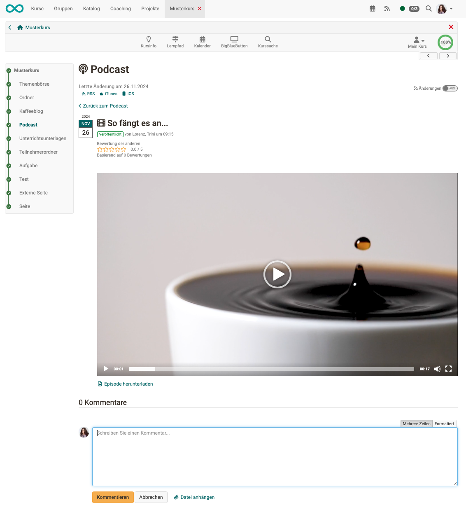
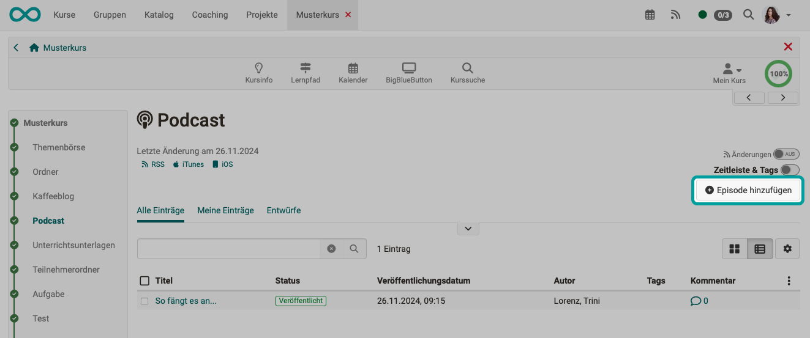
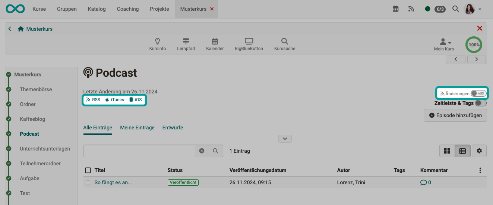

# Podcasts anhören und ansehen {: #listen_and_watch}

Kursteilnehmende - und generell alle Personen mit Zugriff auf den Podcast - können: 

* Audio-Episoden anhören bzw. Video-Dateien ansehen und durch die chronologischen Episoden navigieren
* Kommentare und Sternchenbewertungen zu jeder Mediendatei hinterlassen
* Kommentare auch wieder löschen
* sich über Änderungen von OpenOlat informieren lassen (Änderungen einschalten)
* und zusätzlich Podcast-Episoden per RSS-Feed oder Podcast-App abonnieren 

---

## Episoden kommentieren {: #comment}

Alle, die sich den Video-Podcast ansehen, bzw. einen Audio-Podcast anhören, können unter einer Episode einen Kommentar abgeben. Seit Release 19.1 ist es auch möglich, dass den Kommentaren eine Datei angehängt werden kann.

{ class="shadow lightbox" }

---

## Episoden erstellen {: #_create_episode}

Mit dem Recht "Beiträge erstellen" können auch Teilnehmende Episoden erstellen und somit Audios und Videos hochladen.

!!! info "Wichtig"

    Damit die Lernenden eigene Audio- oder Video-Episoden hinzufügen können, muss ein erstes Video vorhanden sein. Zum Beispiel könnte die Lehrperson ein erstes Audio/Video hochladen und hier kurz erläutern, was die Lernenden im Podcast machen sollen oder in das Thema mit spannenden Reflexionsfragen einführen.

{ class="shadow lightbox" }

---

## Podcasts abonnieren {: #abo}

Für einen Podcast-Kursbaustein kann einerseits ein OpenOlat-Abonnement eingerichtet werden, wie für etliche andere Kursbausteine auch. 
Zusätzlich stehen im Podcast-Kursbaustein die kleinen Buttons zum Aufruf eines Feed-Readers oder einer Podcast-App zur Verfügung.

{ class="shadow lightbox" }

[zum Seitenanfang ^](#listen_and_watch)

---

## Weitere Informationen

[Podcasts in Kursen erstellt >](../../manual_how-to/podcast/podcast.de.md) 
[Podcast konfigurieren (als Kursbesitzer:in/Autor:in) >](../learningresources/Podcast_Configuration.de.md) 

