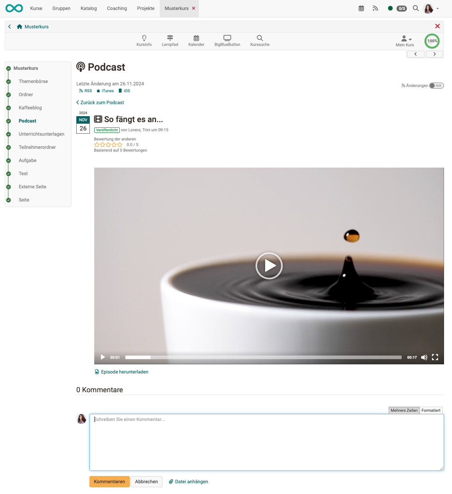
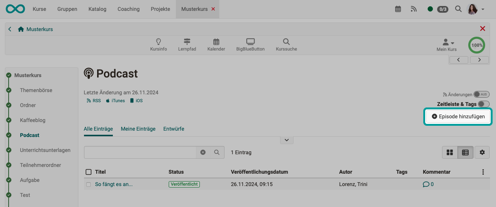
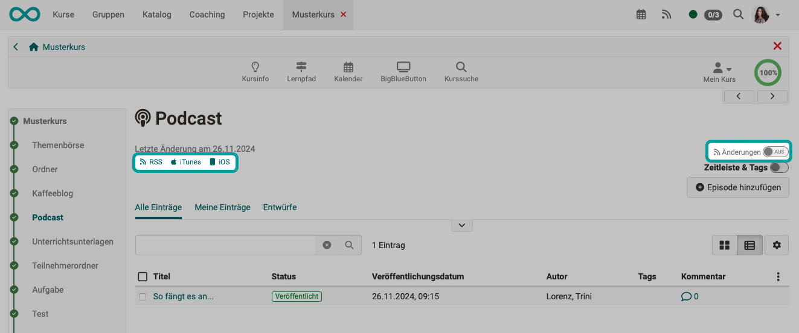

# Listen and watch to podcasts {: #listen_and_watch}

Course participants - and generally anyone with access to the podcast - can: 

* Listen to audio episodes or watch video files and navigate through the chronological episodes
* Leave comments and star ratings for each media file
* Delete comments again
* be informed about changes to OpenOlat (activate changes)
* and additionally subscribe to podcast episodes via RSS feed or podcast app 

---

## Comment on episodes {: #comment}

Anyone who watches the video podcast or listens to an audio podcast can leave a comment under an episode. Since release 19.1, it is also possible to attach a file to the comments.

{ class="shadow lightbox" }

---

## Create episodes {: #_create_episode}

With the "Create contributions" right, participants can also create episodes and thus upload audio and videos.

!!! info "Important"

    An initial video must be available so that learners can add their own audio or video episodes. For example, the teacher could upload an initial audio/video and briefly explain what the learners should do in the podcast or introduce the topic with exciting reflection questions.

{ class="shadow lightbox" }

---

## Subscribe to podcasts {: #abo}

An OpenOlat subscription can be set up for a podcast course element, as for many other course elements. 
In addition, the small buttons for calling up a feed reader or a podcast app are available in the podcast course element.

{ class="shadow lightbox" }

[To the top of the page ^](#listen_and_watch)

---

## Further information

[Create podcasts in courses >](../../manual_how-to/podcast/podcast.md) 
[Configure podcast (as course owner/author) >](../learningresources/Podcast_Configuration.md) 
