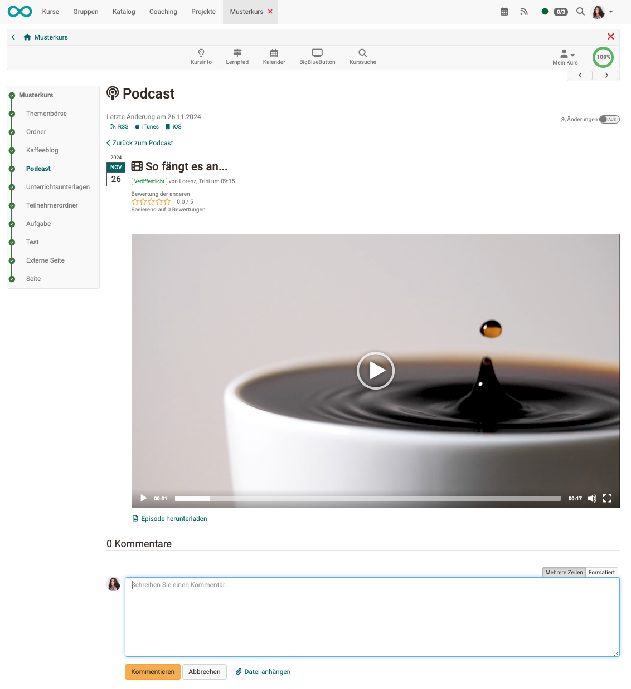
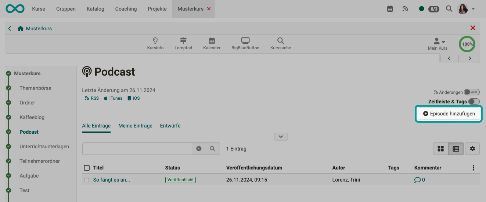
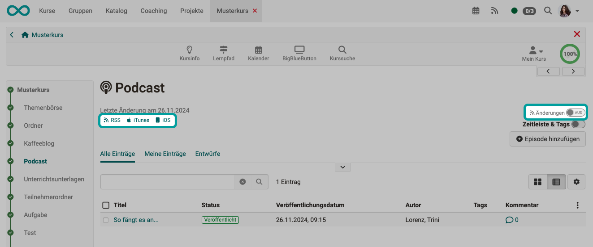

# Listen and watch to podcasts {: #listen_and_watch}

Course participants - and generally anyone with access to the podcast - can: 

* Listen to audio episodes or watch video files and navigate through the chronological episodes
* Leave comments and star ratings for each media file
* Delete comments again
* be informed about changes to OpenOlat (activate changes)
* and additionally subscribe to podcast episodes via RSS feed or podcast app 

Filters are available above the list of episodes to limit the displayed episodes (e.g. "All entries", "My entries", "Drafts").

!!! info "Important"

    If you only have read access to the podcast (e.g. as a coach without write permission or as a course participant who is not allowed to create their own episodes), only the filter "All entries" is available to you [:octicons-tag-16:{ title="from Release 20.3.0 (OO-9220)" }](https://track.frentix.com/issue/OO-9220){:target="_blank"}.

---

## Filter episodes by tags [:octicons-tag-16:{ title="from Release 19.0.0 (OO-7729)" }](https://track.frentix.com/issue/OO-7729){:target="_blank"} {: #tags}

Episodes can be tagged. A tag cloud is available in the sidebar, which can be used to filter the displayed episodes by one or more tags.

---

## Comment on episodes [:octicons-tag-16:{ title="from Release 19.0.4 (OO-7759)" }](https://track.frentix.com/issue/OO-7759){:target="_blank"} {: #comment}

Anyone who watches the video podcast or listens to an audio podcast can leave a comment under an episode. A file can also be attached to comments.

You can also set up a separate subscription for new comments for each episode, independent of the subscription for the entire episode list [:octicons-tag-16:{ title="from Release 20.1.0 (OO-7731)" }](https://track.frentix.com/issue/OO-7731){:target="_blank"}.

{ class="shadow lightbox" }

---

## Create episodes {: #_create_episode}

With the "Create contributions" right, participants can also create episodes and thus upload audio and videos.

!!! tip "Tip"

    An initial video must be available so that learners can add their own audio or video episodes. For example, the teacher could upload an initial audio/video and briefly explain what the learners should do in the podcast or introduce the topic with exciting reflection questions.

{ class="shadow lightbox" }

---

## Link directly to episodes [:octicons-tag-16:{ title="from Release 19.0.2 (OO-7538)" }](https://track.frentix.com/issue/OO-7538){:target="_blank"} {: #direct_link}

Each episode can be accessed directly via its own address. This link can be used to share an individual episode directly, without first having to navigate through the entire list of episodes.

---

## Subscribe to podcasts {: #abo}

An OpenOlat subscription can be set up for a podcast course element, as for many other course elements. 
In addition, the small buttons for calling up a feed reader or a podcast app are available in the podcast course element.

{ class="shadow lightbox" }

[To the top of the page ^](#listen_and_watch)

---

## Further information

[Create podcasts in courses >](../../manual_how-to/podcast/podcast.md) 
[Configure podcast (as course owner/author) >](../learningresources/Podcast_Configuration.md) 
