#  Portfolioaufgabe: kommentieren und bewerten {: #portfolio_comment_grading}

Haben Lernende eine Portfolioaufgabe bearbeitet und zumindest Teile publiziert, können die Mappen bzw. Einträge von anderen Personen kommentiert und je nach Einstellung auch bewertet werden. Im Folgenden wird das entsprechende Vorgehen beschrieben.

## Portfolioaufgabe kommentieren {: #comment}

Ob die Möglichkeit zum Kommentieren und Bewerten eines Portfolios besteht, bestimmt der Ersteller der Portfoliomappe oder des Eintrags. Nur wenn die Mappe oder der Eintrag freigegeben wurde, können andere darauf zugreifen. 

### 1. Portfolio öffnen {: #comment_open}

Öffnen Sie das persönliche Menü und dort Ihr Portfolio. 

{ class="shadow lightbox" }

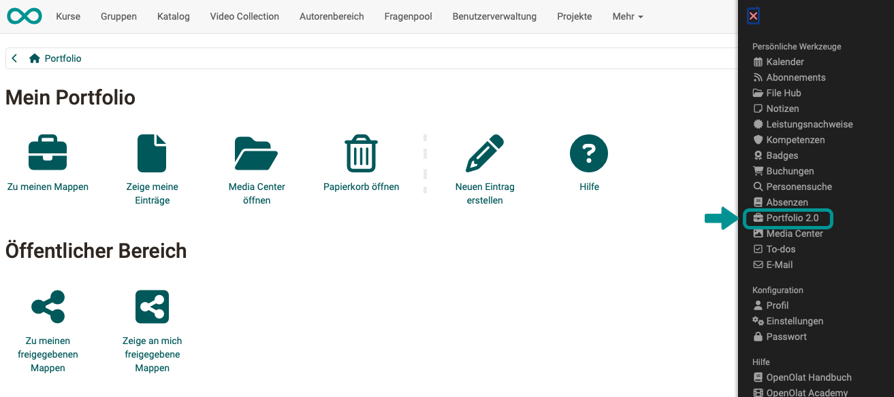{ class="shadow lightbox" }

  
### 2. "Zeige an mich freigegebene Mappen" wählen {: #comment_open_shared_binders}

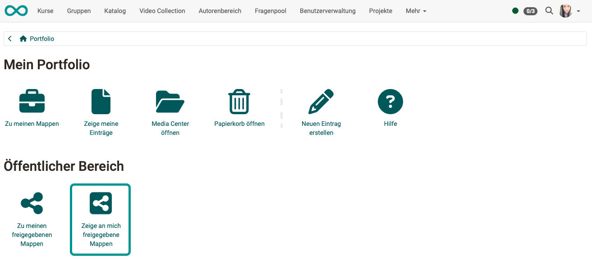{ class="shadow lightbox" }

### 3. Eintrag wählen {: #comment_choose_entry}

Wählen Sie im Tab "Einträge/To do" einen der Einträge aus.

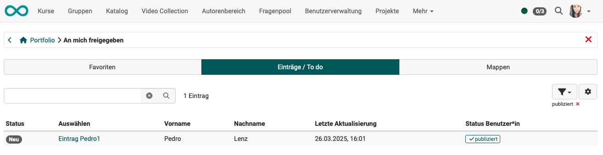{ class="shadow lightbox" }

### 4. Portfolioeintrag/Bearbeitung ansehen {: #comment_view_entry}

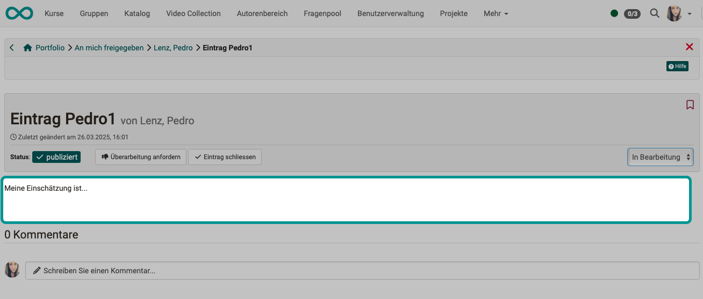{ class="shadow lightbox" }

### 5. Kommentartext einfügen {: #comment_add}

Fügen Sie Ihren Kommentar im vorgesehenen Feld hinzu. (Bei einem längeren Portfolioeintrag müssen Sie eventuell nach unten scrollen, um das Kommentarfeld zu sehen.) 

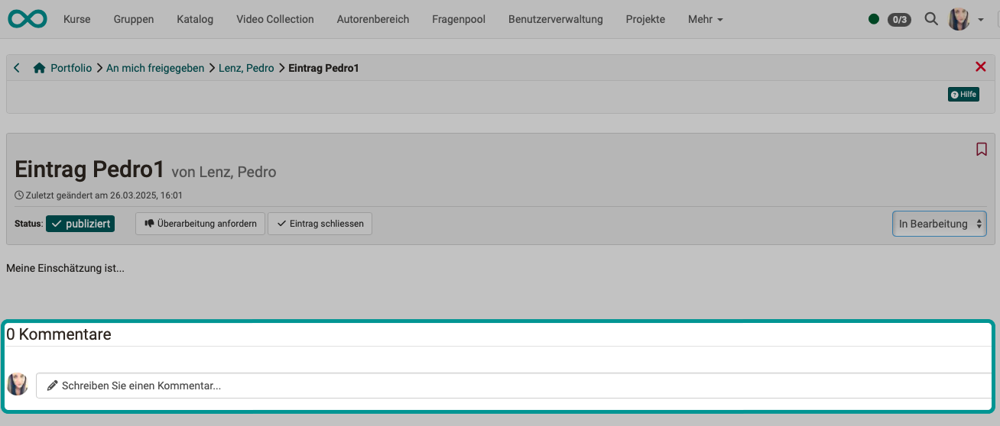{ class="shadow lightbox" }

### 6. Kommentar speichern {: #comment_save}

Die Ergänzung eines Kommentars wird automatisch gespeichert.

### 7. Eintrag schliessen {: #comment_close_entry}

Als **Betreuer:in** haben Sie zusätzlich den Button "Eintrag schliessen".
Schliessen Betreuer:innen einen Portfolioeintrag, wird er auch für andere Benutzer:innen, die den Eintrag kommentieren können, als geschlossen angezeigt und kann nicht mehr von ihnen kommentiert werden.

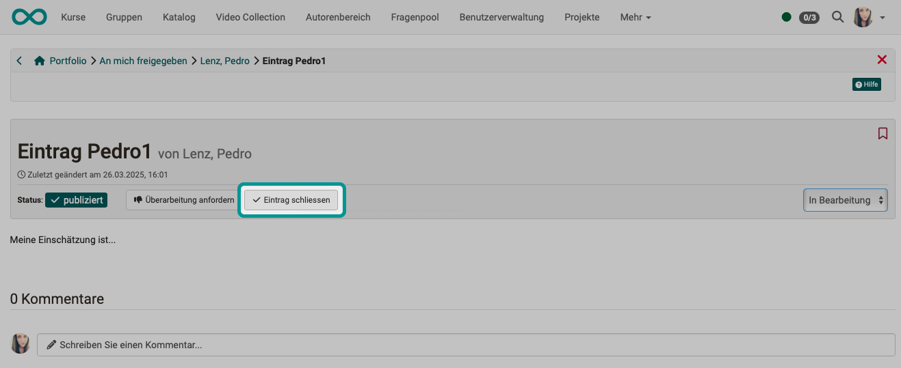{ class="shadow lightbox" }

### 8. Geschlossenen Eintrag wieder öffnen {: #comment_reopen}

Einen geschlossenen Eintrag (nicht mehr kommentierbar) können Sie als **Betreuer:in** mit dem Button "Neu eröffnen" wieder für die Ergänzung von Kommentaren frei geben.

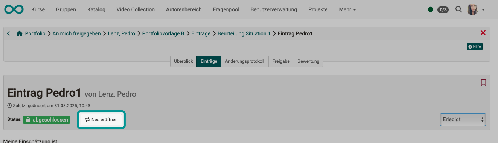{ class="shadow lightbox" }

### 9. Status der Begutachtung eines Eintrags {: #comment_status}

Für Betreuer:innen steht am rechten Rand ein Auswahlbutton zur Verfügung.
Dort können sie einen Status für die eigene Begutachtung setzen.
Als Status der Begutachtung kann gesetzt werden:

- Neu (muss noch begutachtet/kommentiert werden)
- in Bearbeitung
- Erledigt (Begutachtung/Kommentierung wurde gemacht)

Der **Status der Begutachtung**, der mit dem Auswahlbutton am rechten Rand eingestellt wird, hat nichts mit dem **Bearbeitungsstatus** zu tun, der links ersichtlich ist (Entwurf, publiziert, in Überarbeitung). 

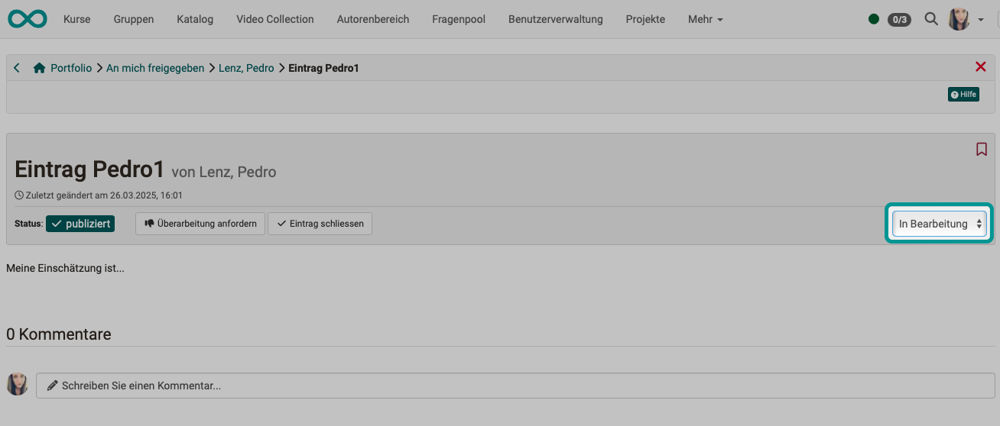{ class="shadow lightbox" }

Der **Status der Begutachtung/Kommentierung** durch einen/eine Betreuer:in wird im Tab Überblick grau hinterlegt angezeigt, zusätzlich zum **Status der Bearbeitung** durch den/die Erstellerin. 

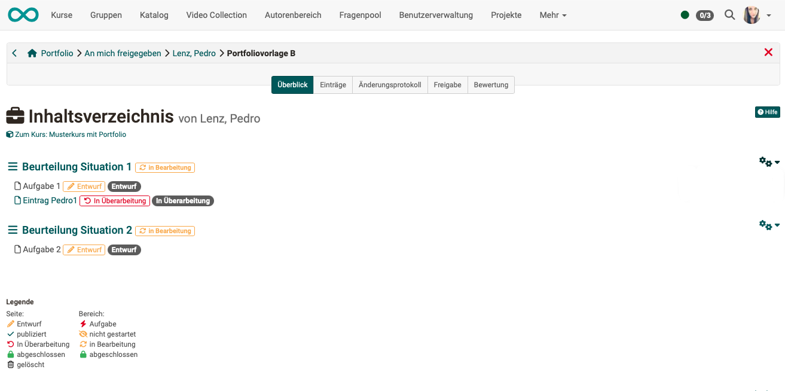{ class="shadow lightbox" }

[Zum Seitenanfang ^](#portfolio_comment_grading)

---

## Portfolioaufgabe überarbeiten lassen  {: #rework} 
 
### 1. Portfolio öffnen {: #rework_open} 

Öffnen Sie das persönliche Menü und dort Ihr Portfolio. 
[Siehe oben ^](#comment_open)

### 2. "Zeige an mich freigegebene Mappen" wählen {: #rework_open_shared_binders} 

[Siehe oben ^](#comment_open_shared_binders)

### 3. Eintrag wählen {: #rework_choose_entry} 

Wählen Sie im Tab "Einträge/To do" einen der Einträge aus. 
[Siehe oben ^](#comment_choose_entry)

### 4. Portfolioeintrag/Bearbeitung ansehen {: #rework_view_entry} 

[Siehe oben ^](#comment_view_entry)

### 5. "Überarbeitung anfordern" anklicken {: #rework_request_rework} 

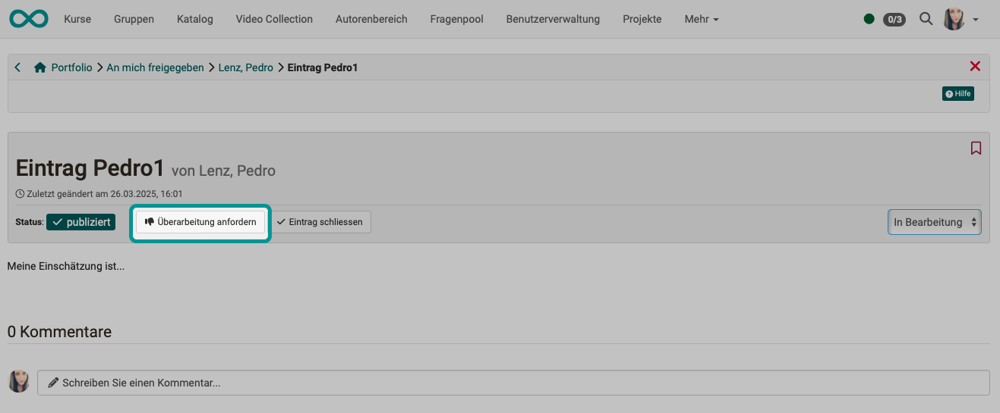{ class="shadow lightbox" }

Sowohl der Person, die den Kommentar abgegeben hat, wie auch dem/der Ersteller:in wird nun der Status "In Überarbeitung" angezeigt.  

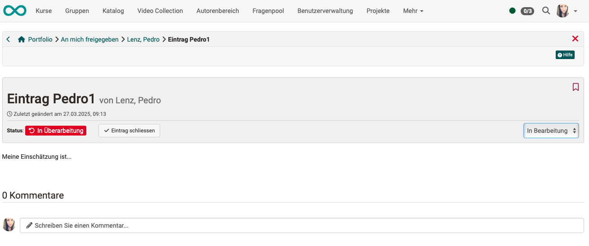{ class="shadow lightbox" }

[Zum Seitenanfang ^](#portfolio_comment_grading)

---

## Portfolioaufgabe bewerten  {: #grading} 

!!! info "Hinweis"

    Unterscheiden Sie das Kommentieren und Begutachten eines Portfolioeintrags von der Bewertung durch Betreuer:innen. 

!!! info "Hinweis"

    Eine Bewertung geben Sie jeweils für eine Mappe ab, nicht für einzelne Einträge in dieser Mappe.

### 1. Portfolio öffnen {: #grading_open} 

Öffnen Sie das persönliche Menü und dort Ihr Portfolio. 
[Siehe oben ^](#comment_open)

  
### 2. "Zeige an mich freigegebene Mappen" wählen {: #grading_open_shared_binders} 

[Siehe oben ^](#comment_open_shared_binders)

### 3. Mappe auswählen {: #grading_choose_binder} 

Klicken Sie auf den Tab "Mappen" und wählen Sie die gewünschte Mappe zur Bewertung aus.  

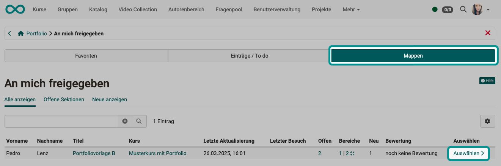{ class="shadow lightbox" }

### 4. Tab "Bewertung" wählen {: #grading_tab_grading} 

Wählen Sie den Tab "Bewertung".

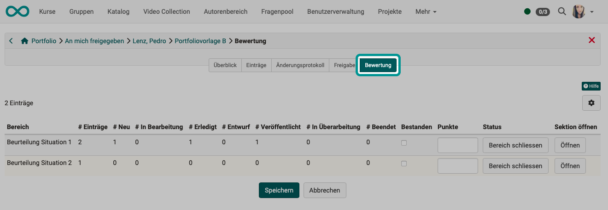{ class="shadow lightbox" }

### 5. Begutachtung der Bereiche prüfen {: #grading_check_sections} 

Überprüfen Sie, ob für Ihre Beurteilung alle Einträge in den Bereichen der Mappe kommentiert, erledigt und veröffentlicht sind. 

Bei Bedarf können Sie mit dem kleinen Zahnrad rechts oben über der Tabelle Spalten ein- oder ausblenden.

Mit Klick auf "Öffnen" in der Spalte "Sektion öffnen" können Sie direkt zum Tab "Überblick" springen.

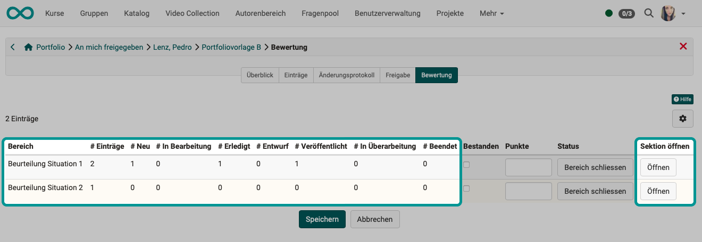{ class="shadow lightbox" }

### 6. Punkte vergeben und "Bestanden" {: #grading_give_points} 

Tragen Sie Punkte für die Bereiche in der gewählten Mappe ein und setzen Sie ggf. den Haken bei "Bestanden".

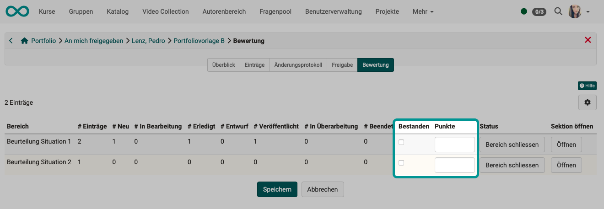{ class="shadow lightbox" }

### 7. Bewertung abschliessen {: #grading_close} 

Mit "Bereich schliessen" schliessen Sie die Bewertung komplett ab. Vergessen Sie nicht, zum Schluss noch zu speichern.

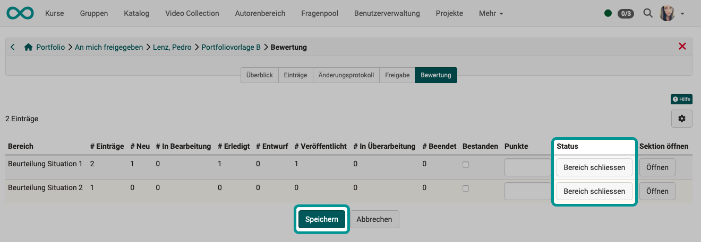{ class="shadow lightbox" }

Dem User wird nun der Status "Bestanden" oder "Nicht bestanden" und die eingetragene
Punktzahl angezeigt.  

!!! Tip "Hinweis"

    Wird die Portfoliomappe aus einem Kursbaustein aufgerufen, beachten Sie bitte, dass die konkreten Bewertungsmöglichkeiten von den Einstellungen im Kurseditor abhängig sind. Je nach Voreinstellungen im Tab "Bewertung" des Kursbausteins Portfolioaufgabe können Punkte vergeben und/oder "Bestanden" angekreuzt werden oder nicht. 

!!! Tip "Hinweis"

    Wenn ein Bereich in der Bewertung geschlossen wird, kann der gesamte Bereich von Benutzer:innen nicht mehr bearbeitet werden.

[Zum Seitenanfang ^](#portfolio_comment_grading)

