# Portfolio assignment: Grading

If learners have edited a portfolio task and published at least parts of it, the binders or the published parts are available for other persons for commenting and (if settings allows it) grading. In the following the process is described:

## Comment a portfolio task  {: #comment}

The creator of the portfolio folder or entry determines whether it is possible to comment on and rate a portfolio. Only when the folder or entry has been approved can others access it. 

### 1. Open portfolio {: #comment_open}

Open the personal menu and then your portfolio. 

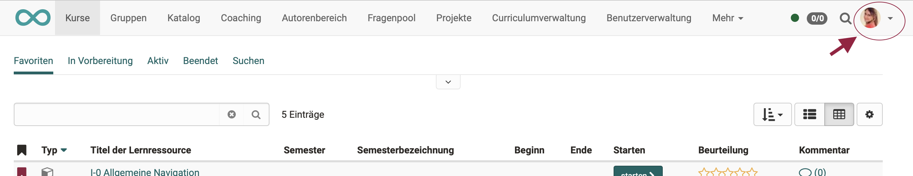{ class="shadow lightbox" }

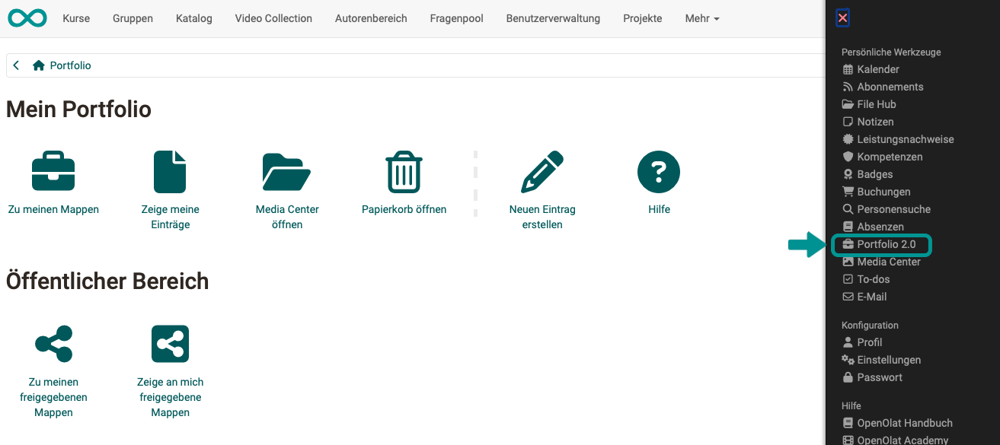{ class="shadow lightbox" }

### 2. Choose "Go to shared binders" {: #comment_open_shared_binders}

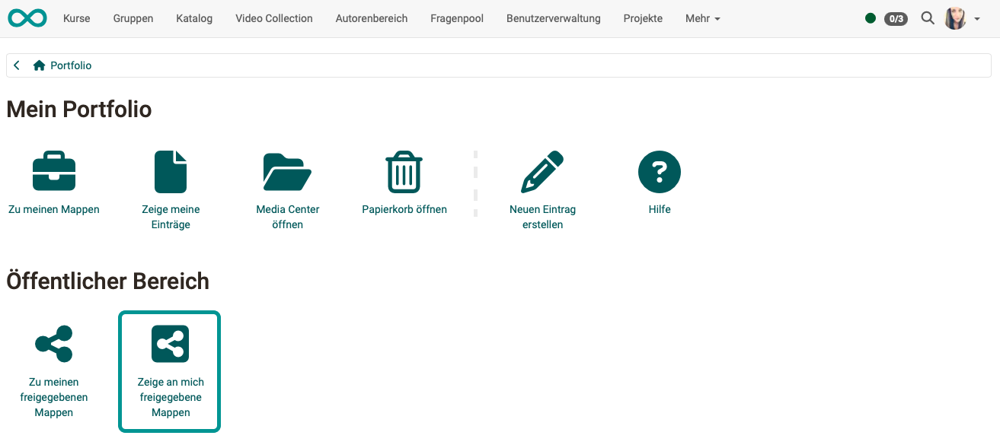{ class="shadow lightbox" }

### 3. Choose entry

In "Entries / To do" open the desired assignment.  

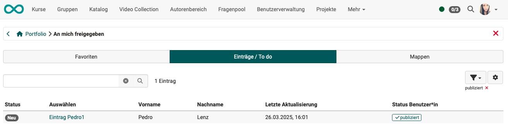{ class="shadow lightbox" }

### 4. View the entries in the edited binder {: #comment_view_entry}

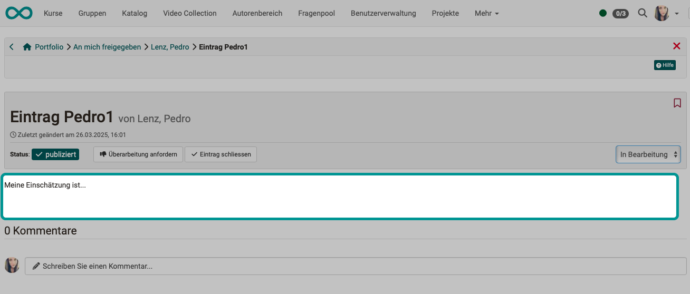{ class="shadow lightbox" }

### 5. Add a comment {: #comment_add}
 
Add your comment in the field provided. (For longer portfolio entries, you may need to scroll down to see the comment field.) 

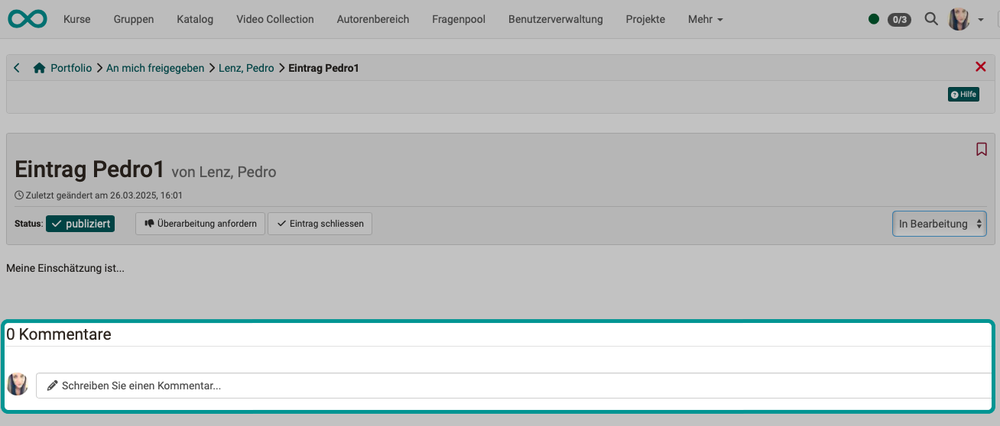{ class="shadow lightbox" }

### 6. Save comment {: #comment_save}

Any additions to a comment are saved automatically.

### 7. Close entry {: #comment_close_entry}

As an **administrator**, you also have the option to select the "Close entry" button.
When coaches close a portfolio entry, it is also displayed as closed to other users who can comment on the entry, and they can no longer comment on it.

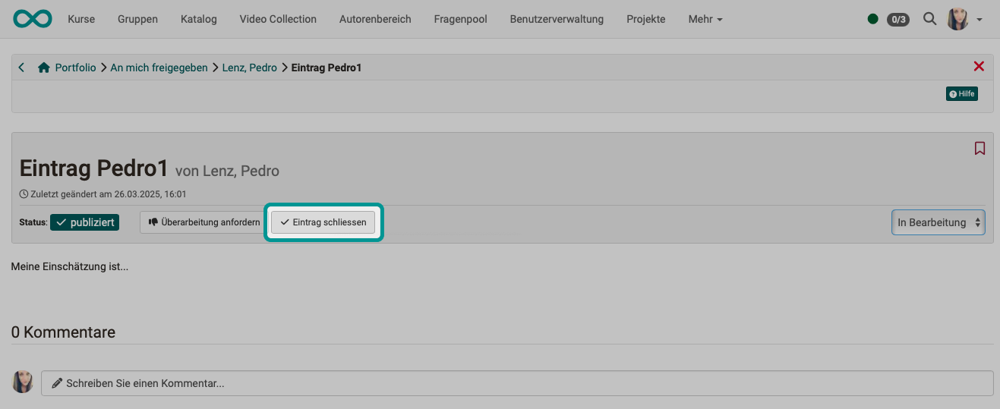{ class="shadow lightbox" }

### 8. Reopen entries {: #comment_reopen}

As an **administrator**, you can reopen a closed entry (no longer open for comments) for the addition of comments by clicking the "Reopen" button.

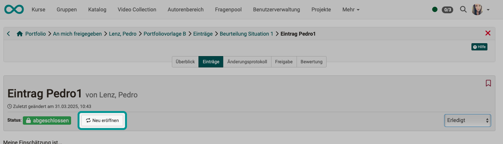{ class="shadow lightbox" }

### 9. Status of the review of an entry {: #comment_status}

For coaches, there is a selection button on the right-hand side.
There, they can set a status for their own assessment.
The following statuses can be set for the assessment:

- New (still needs to be reviewed/commented on)
- In progress
- Completed (review/commentary has been made)

The **review status**, which is set using the selection button on the right-hand side, has nothing to do with the **processing status**, which is visible on the left-hand side (draft, published, under revision). 

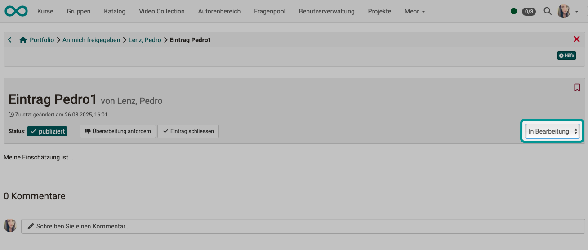{ class="shadow lightbox" }

The **status of the review/commentary** by a coach is displayed in gray in the Overview tab, in addition to the **status of processing** by the creator. 

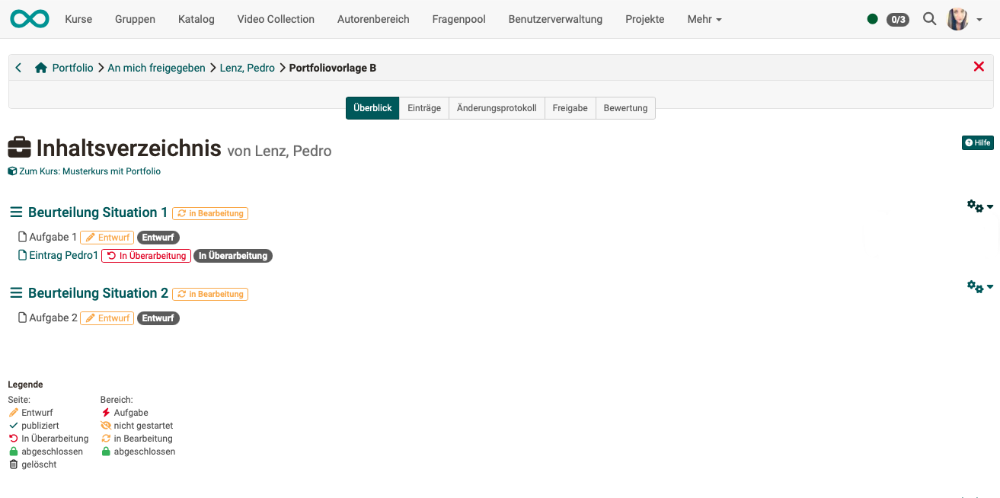{ class="shadow lightbox" }

[To the top of the page ^](#portfolio_comment_grading)

---

## Rework portfolio task  {: #rework} 

### 1. Open portfolio {: #rework_open} 

Open the personal menu and then your portfolio. 
[See above ^](#comment_open)

### 2. Select "Show folders shared with me" {: #rework_open_shared_binders} 
[See above ^](#comment_open_shared_binders)

### 3. Choose entry {: #rework_choose_entry} 
Select one of the entries in the "Entries/To do" tab.
[See above ^](#comment_choose_entry)

### 4. View entry/edit {: #rework_view_entry} 
[See above ^](#comment_view_entry)

### 5. Click on "Request rework" {: #rework_request_rework} 

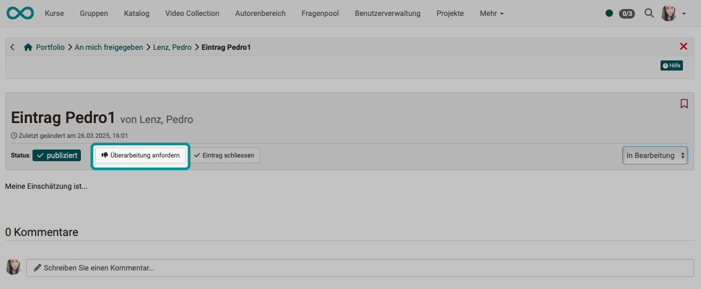{ class="shadow lightbox" }

Both the person who posted the comment and the creator will now see the status "In review." 

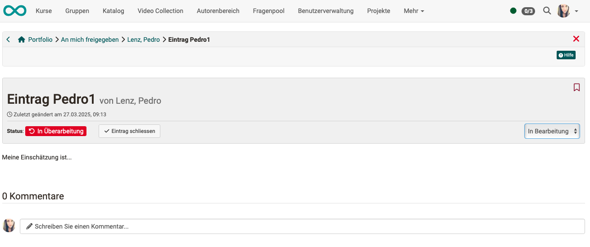{ class="shadow lightbox" }

[To the top of the page ^](#portfolio_comment_grading)

---

## Assess portfolio task  {: #grading} 

!!! info "Note"

    Distinguish between commenting on and reviewing a portfolio entry and the assessment by coaches. 

!!! info "Note"

    You submit one assessment for each portfolio, not for individual entries in that portfolio.

### 1. Open portfolio {: #grading_open} 

Open the personal menu and select your portfolio. 
[See above ^](#comment_open)

### 2. Select "Show folders shared with me" {: #grading_open_shared_binders} 
[See above ^](#comment_open_shared_binders)

### 3. Choose binder {: #grading_choose_binder} 

Click on the "Folders" tab and select the folder you want to assess.

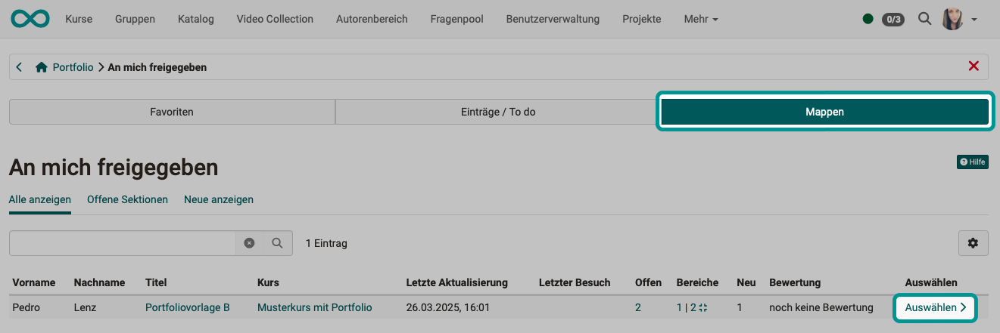{ class="shadow lightbox" }

### 4. Tab Select "Assessment"  {: #grading_tab_grading} 

Select the tab "Assessment".

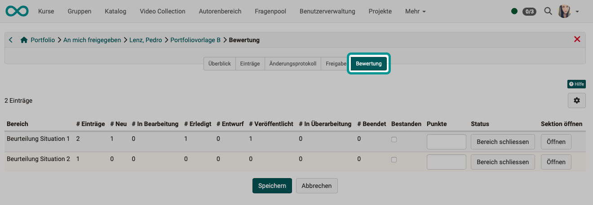{ class="shadow lightbox" }

### 5. Review assessment of areas {: #grading_check_sections} 

Check that all entries in the sections of the folder have been commented on, completed, and published for your assessment. 

If necessary, you can show or hide columns using the small gear icon at the top right above the table.

By clicking on "Open" in the "Open section" column, you can jump directly to the "Overview" tab.

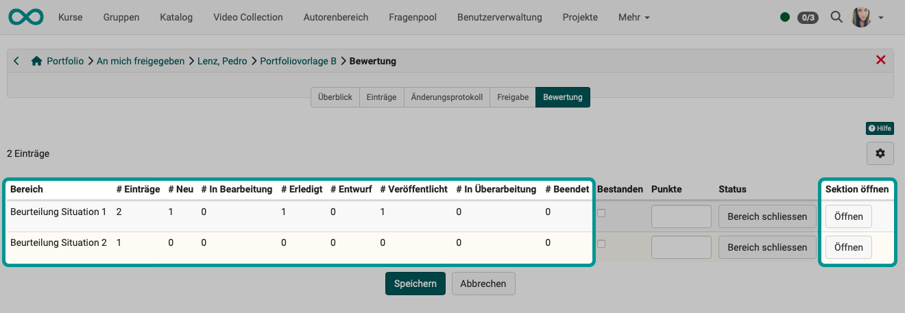{ class="shadow lightbox" }

### 6. Give out points and "Passed" {: #grading_give_points} 

Enter points for the areas in the selected folder and, if applicable, check the box next to "Passed."

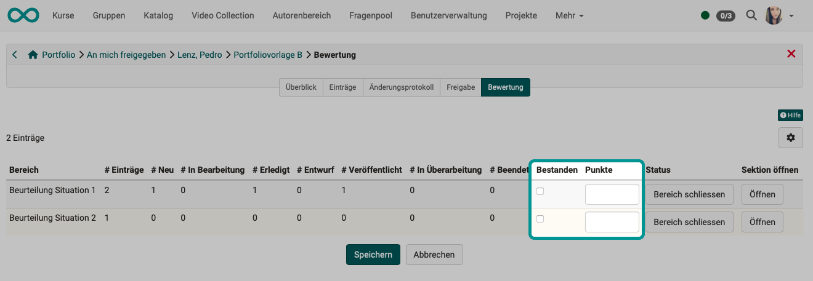{ class="shadow lightbox" }

### 7. Close assessment {: #grading_close} 

Click "Close area" to complete the evaluation. Don't forget to save your changes when you're done.

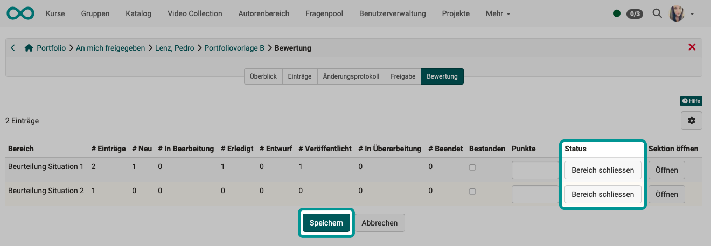{ class="shadow lightbox" }

The user is now shown the status "Passed" or "Failed" and the score entered.  

!!! Tip "Note"

    If the portfolio folder is accessed from a course element, please note that the specific assessment options depend on the settings in the course editor. Depending on the default settings in the "Assessment" tab of the Portfolio assignment course element, points can be awarded and/or "Passed" can be checked or not. 

!!! Tip "Note"

    When an area in the assessment is closed, the entire area can no longer be edited by users.

[To the top of the page ^](#portfolio_comment_grading)
