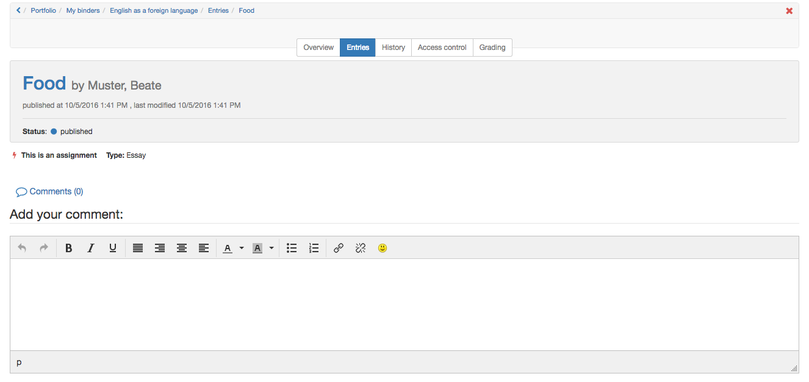
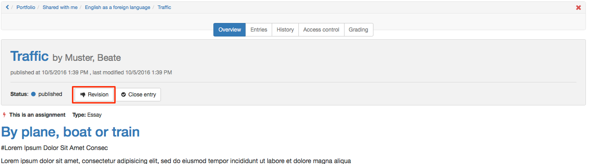
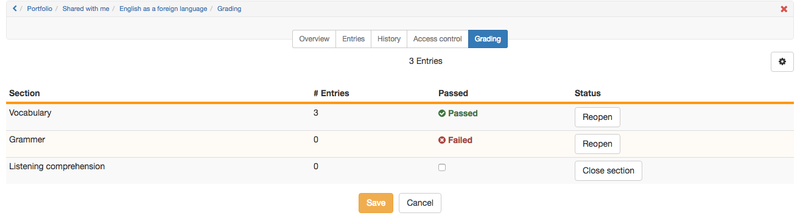

# Portfolio assignment: Grading

If learners have edited a portfolio task and published at least parts of it, the binders or the published parts are available for other persons for commenting and (if settings allows it) grading. In the following the process is described:

## Comment a portfolio task  

### 1. Open portfolio 2.0.

  
  
### 2. Choose "Go to shared items"  
### 3. Choose entry
In "Entries / To do" open the desired assignment.  
### 4. View the entries in the edited binder 
### 5. Add a comment at the end of the entry
 

## Request a revision of a portfolio assignment  

### 1. Open portfolio 2.0.

  
  
### 2. Choose "Go to shared items".  
### 3. Choose entry
In "Entries / To do" select one of the entries.  
### 4. View the edited entry  
  
### 5. Click "Revision"

The user now sees the status "In revision".  
  

## Asses portfolio assignment  
  
### 1. Open your portfolio 2.0.
 

  
  
### 2. Choose "Go to shared items"  
  
### 3. Selct binder
In "Binders" select the desired binder.  
  
### 4. Tab "Grading" 
Select the "Grading" tab and enter the appropriate points and check "Pass" if appropriate.

### 5. "Close section" and "Save"  
Click "Close area" to close the evaluation completely.

The user is now able to see the status "Passed" or "Failed" and/or the scores.  
  
Depending on the pre-settings in the assessment tab of the course element portfolio score is granted and/or "Passed" is ticked.
  
!!! Hint "Hint"

    If a section is closed in the grading tab, the user cannot edit this whole section anymore.

