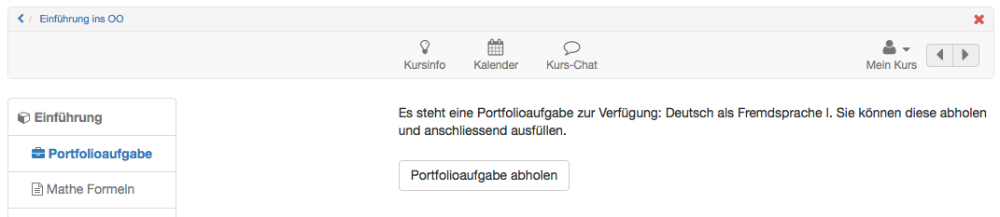
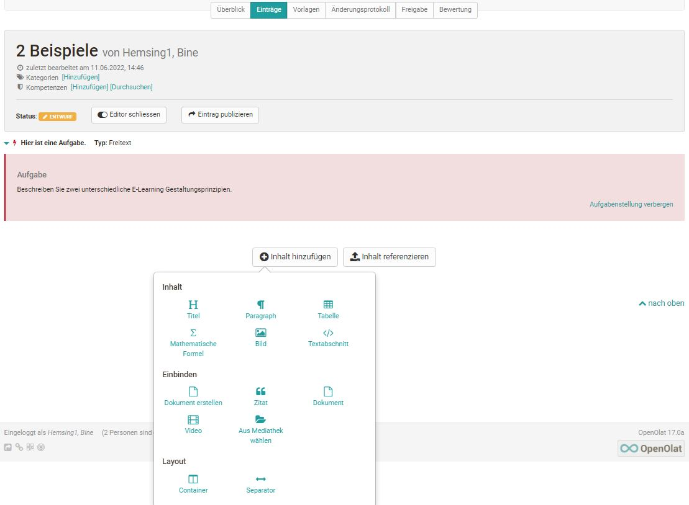
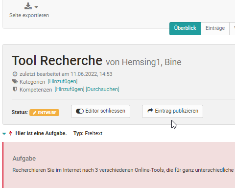

# Portfolioaufgabe: abholen und bearbeiten

Im Folgenden wird beschrieben wie Lernende eine im Kurs bereitgestellte
Portfolioaufgabe (auf einer Portfoliovorlage basierende Portfoliomappe mit
Aufgaben) abholen und bearbeiten können.

Dafür muss zunächst der Kurs indem sich die Portfolioaufgabe befindet aufgerufen und der entsprechende Kursbaustein ausgewählt werden.

## Portfolioaufgabe abholen  

Klicken Sie einfach auf den Button "Portfolioaufgabe abholen".

  
  
## Portfolioaufgabe finden

Die Portfolioaufgabe ist nun abgeholt und im [persönlichen "Portfolio 2.0"](../personal_menu/Personal_Tools.de.md/#portfolio-20) unter "[Zu meinen
Mappen](../area_modules/My_portfolio_binders.de.md)" gespeichert.  
  
Beim nächsten Zugriff kann die Portfolioaufgabe entweder über den Link im Kurs oder auch direkt im persönlichen Portfolio geöffnet werden.   
 
Im persönlichen Portfolio sind alle aus einem Kurs abgeholten Portfolioaufgaben mit einem roten Strich am linken Rand gekennzeichnet und enhalten den Hinweis auf den zugehörigen Kurs.

## Portfolioaufgabe bearbeiten  

Öffnen Sie die Mappe der Portfolioaufgabe. Je nachdem wie der Lehrende die Portfolioaufgabe vorstrukturiert hat stehen Ihnen unterschiedliche Bereiche mit Portfolioaufgaben zur Verfügung. 

Klicken Sie entweder im Tab „Überblick“ oder „Einträge“ auf einen Mappen Bereich und "Wählen Sie eine Aufgabe zur Bearbeitung". Anschliessend sind die zugehörige Aufgabenstellung sowie der Bearbeitungseditor sichtbar.

  
  

Nun können die Aufgaben mit dem Portfolio Editor bearbeitet und passende Inhalte (Texte, Bilder, Videos usw.) und Artefakte über den Portfolio
Editor hinzugefügt werden. 

  
  
Enthält die Portfolioaufgabe Formulare können diese ebenfalls ausgefüllt werden. Sofern in den Einstellungen der Portfolio Vorlage konfiguriert, dürfen die User auch neue Einträge ergänzen oder die gesamte abgeholte Mappe löschen.

  
  
## Bearbeitungsstatus

Der Bearbeitungsstatus einer Portfolio Aufgabe wird durch die farbliche und symbolhafte Kennzeichnung erkennbar. Die Details werden in der unteren Legende in der Mappe erläutert. So symbolisiert z.B.  ein roter Blitz im Tab "Überblick", dass eine Aufgabe noch nicht ausgewählt wurde oder ein grüner Haken, dass die Aufgabe bereits publiziert wurde. 

In dem Tab "Einträge" werden alle noch nicht ausgewählte Aufgaben des jeweiligen Bereichs in einem Dropdown Menü gebündelt, während abgeholte Aufgaben unterhalb des Dropdown Menüs erscheinen. 

## Portfolio publizieren   {: #publish}
  
Während der Bearbeitung steht der Status des Eintrags auf Entwurf.

  
  

Sobald der Eintrag respektive die Aufgabe abgeschlossen ist, "Eintrag publizieren" wählen. So wird die Bearbeitung für andere Personen, die Zugang zum Portfolio haben, sichtbar und Feedbacks bzw. Kommentierungen sind möglich.  
 
  
!!! Info "Hinweis"

    Sobald ein Eintrag publiziert ist kann er nicht mehr verändert, nur noch kommentiert werden. Deshalb sollten Lernende darauf achten einen Eintrag oder eine bearbeitete Aufgabe erst dann zu publizieren, wenn sie komplett fertig ist!

## Portfolio freigeben

Damit eine Aufgabe von anderen Personen bewertet oder kommentiert werden kann muss der Mappen Besitzer diese zunächst für die jeweilige Person(en) freigeben.

Sie können Portfolio Mappen sowohl an andere OpenOlat User (Lehrende, Lernende) als auch an externe Personen freigeben.

!!! info "Hinweis"

    Auch Mappen aus Kursen sind nicht automatisch für die Kursbesitzer oder Kursbetreuer sichtbar.

** Gehen Sie für die Freigabe wie folgt vor:** 
  
a) Öffnen Sie den Tab Freigabe.  

b) Klicken Sie rechts oben auf den Link "Zugangsrecht hinzufügen".    
  

  
c) Wählen Sie die gewünschte Option z.B. "Kursbetreuer auswählen", um die entsprechende Personengruppe oder Einzelperson hinzuzufügen. Für die Freigabe an externe Personen, auch ohne OpenOlat Account, wählen Sie "Einladung hinzufügen". Es werden dann Einladungen per
E-Mail verschickt.  
  
d) Im erscheinenden Dialog definieren Sie welche Bereiche Sie der bzw. den gewählten Personen bereitstellen wollen und ob die Personen Bewertungen und oder Kommentierungen vornehmen dürfen. Externe Personen können nur kommentieren aber
nicht bewerten.

  
  
Es kann auch eine E-Mail Benachrichtigung mit Link zur entsprechenden Mappe
verschickt werden.  
  
e) Zum Schluss speichern (für Externe) bzw. fertigstellen (für OpenOlat User)
auswählen um die Aktion zu finalisieren.  
  
!!! info "Hinweis"

    Wenn der User die Freigabe für die Kursbetreuer schon zu Beginn seiner Bearbeitung einrichtet, können die Betreuer die Entwicklung des Portfolios
    bereits sehen und den laufenden Prozess begleiten, sofern der User einzelne Zwischenschritte publiziert. Eine Bearbeitung der Lösung ist dann aber nicht mehr möglich.

