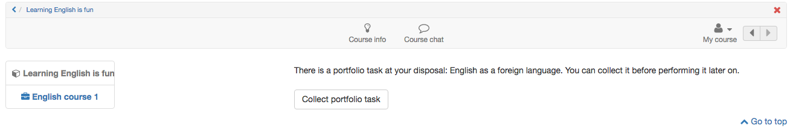
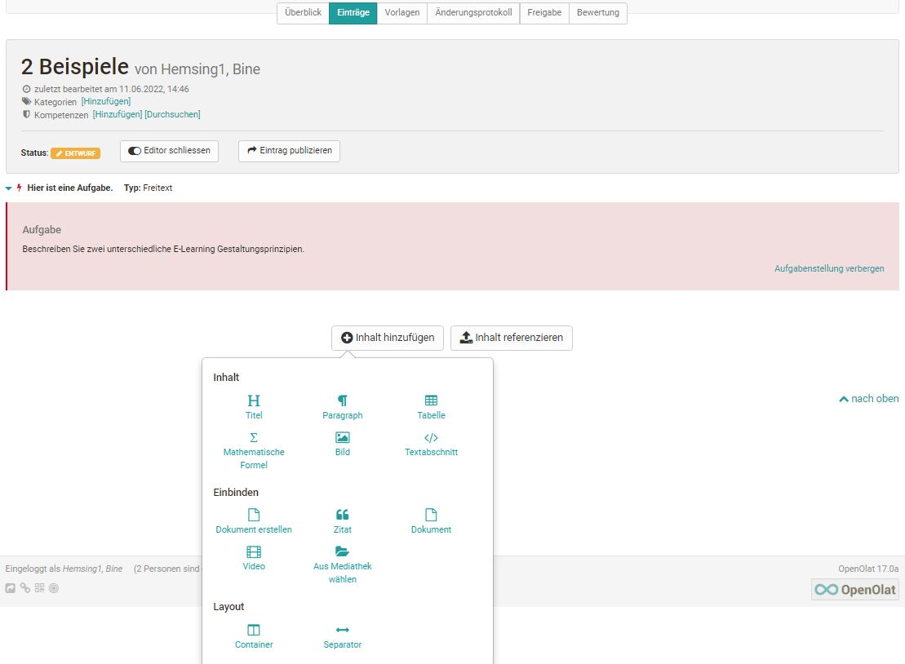
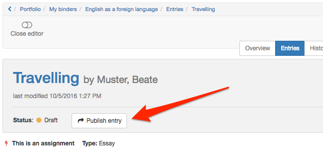

# Portfolio task: collecting and editing

The following section describes how learners can collect and edit a portfolio task provided in a course (a portfolio binder based on a portfolio template, with assignments).

To do this, you first have to call up the course in which the portfolio task is located and select the corresponding course element.

## Collect portfolio task

Click the "Collect portfolio task" button.

{ class="shadow lightbox" }

## Find portfolio task

The portfolio task is now collected and saved in the ["Portfolio 2.0"](../personal_menu/Personal_Tools.md#portfolio) under "[My
portfolio binders](../area_modules/My_portfolio_binders.md)".

The next time the portfolio task is accessed, it can be opened either via the link in the course or directly in the personal portfolio.

In the personal portfolio, all portfolio tasks collected from a course are marked with a red stripe on the left edge and contain a reference to the associated course.

## Edit portfolio task

Open the binder of the portfolio task. Depending on how the instructor has pre-structured the portfolio task, different sections with portfolio tasks are available to you.

Click on a section in either the "Overview" or "Entries" tab and "Select a task for editing". The associated assignment and the editing editor are then visible.

You can now edit the tasks with the Portfolio Editor and add suitable content (texts, images, videos, etc.) and artifacts via the Portfolio
Editor.

{ class="shadow lightbox" }

If the portfolio task contains forms, these can also be filled in. If configured in the settings of the portfolio template, users may also add new entries or delete the entire collected binder.

## Processing status

The processing status of a portfolio task can be identified by its color and symbol. The details are explained in the legend at the bottom of the binder. For example, a red lightning bolt in the "Overview" tab symbolizes that a task has not yet been selected, or a green check mark that the task has already been published.

In the "Entries" tab, all not yet selected tasks of the respective section are grouped in a drop-down menu, while collected tasks appear below the drop-down menu.

## Publish portfolio {: #publish}

While editing, the status of the entry is "Draft".

{ class="shadow lightbox" }

As soon as the entry or the task is complete, select "Publish entry". This makes the work visible to other people who have access to the portfolio, and feedback or comments become possible.

!!! info "Note"

    Once an entry is published, it can no longer be changed, only commented on. Learners should therefore make sure to publish an entry or an edited task only when it is completely finished!

## Share portfolio

For a task to be assessed or commented on by other people, the owner of the binder must first share it with the relevant person(s).

You can share portfolio binders with other OpenOlat users (teachers, learners) as well as with external persons.

!!! info "Note"

    Binders from courses are also not automatically visible to course owners or course coaches.

**Proceed as follows to share:**

a) Open the "Sharing" tab.

b) Click the link "Add access rights" at the top right.

c) Select the desired option, e.g. "Select course coach", to add the corresponding group of people or an individual. To share with external persons, even without an OpenOlat account, select "Add invitation". Invitations are then sent by
e-mail.

d) In the dialog that appears, define which sections you want to provide to the selected person(s) and whether they may assess and/or comment. External persons can only comment, but
not assess.

An e-mail notification with a link to the corresponding binder
can also be sent.

e) Finally, select save (for external persons) or finish (for OpenOlat users)
to complete the action.

!!! info "Note"

    If the owner sets up sharing with the course coaches already at the start of their work, the coaches can already see the development of the portfolio
    and follow the ongoing process, provided the owner publishes individual intermediate steps. Editing the solution is then no longer possible.

## Further information {: #further_information}

**Mentioned on this page** 
[Personal tools >](../personal_menu/Personal_Tools.md) 
[My portfolio binders >](../area_modules/My_portfolio_binders.md)

[To the top of the page ^](#portfolio-task-collecting-and-editing)
